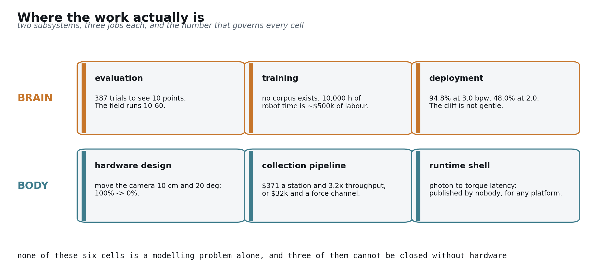
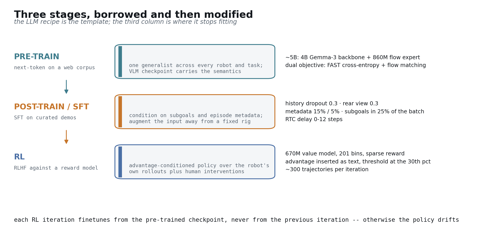
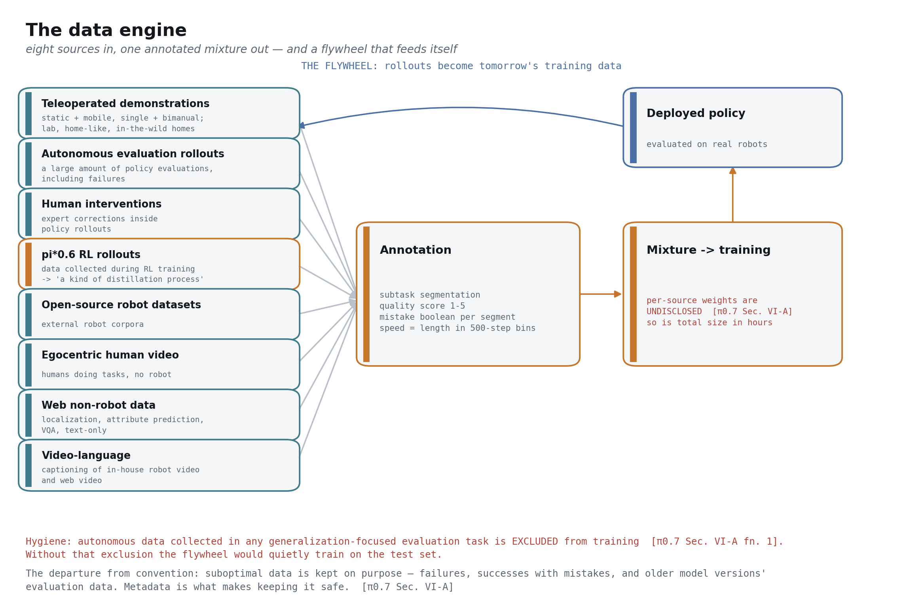
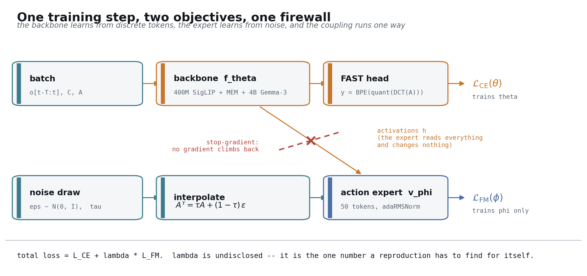

## The question this post answers

> How would you actually build a robot foundation model, and what stops you?

The answer runs in one chain. Define the object by what it must do and where it must run. Decompose it into a brain and a body. Take the machine that produced large language models, state its three pillars precisely, and test each against robotics — robotics has one of them, plus a constraint text never faced. Five blockers fall out. Each blocker costs real engineering in a specific subsystem. That cost, ordered, is a build order.

The conclusion is stated up front so you can argue with it: the compute belongs on the robot, most of the hard parts are measurement and mechanism rather than modelling, and the first thing to build is not a model.

## How to read this

Language-model background — transformers, pretraining, scaling laws, arithmetic intensity — is taught in Part 3 and nowhere else. Skip it if you already know it; nothing before Part 3 depends on it [[arXiv:2001.08361]](https://arxiv.org/abs/2001.08361).

Three conventions run throughout, and they are load-bearing.

**Every claim is typed.** *Disclosed* means a primary source states it. *Inferred* means we derived it from disclosed facts and say so. *Undisclosed* means nobody outside the lab knows, and it goes to the gap ledger rather than getting papered over. *Marketing* means a company blog or press release with no paper and no independent reproduction — labelled inline every time, because in this field the distance between a press release and a result is unusually wide [[blog: NVIDIA GEAR GR00T N1.5]](https://research.nvidia.com/labs/gear/gr00t-n1_5/).

**Every number carries its reference**, and is checked mechanically against a fact ledger. A build script fails if any number in the prose is absent from that ledger, or if any paragraph lacks a citation [[arXiv:2604.15483 §V-E]](https://arxiv.org/abs/2604.15483).

**Where the evidence runs out, the post says so** rather than reaching for a plausible sentence. Part 6 is explicitly speculative and marked as such [[arXiv:2604.15483]](https://arxiv.org/abs/2604.15483).

---

# Part 0 — Two numbers

A bimanual UR5e that had never seen a single laundry demonstration folded a shirt at **85.6% task progress and 80% success** [[arXiv:2604.15483 §IX]](https://arxiv.org/abs/2604.15483). The model driving it had been trained on other robots doing other things.

The same task was given to ten expert human teleoperators, each with roughly 375 hours of experience, drawn from the top 2 percentile of operators. On their first attempt with that arm they scored **90.9% progress and 80.6% success** [[arXiv:2604.15483 §IX]](https://arxiv.org/abs/2604.15483). A generalist model with no task-specific data landed within a fraction of a point of expert humans meeting the hardware for the first time.

That is the first number. Here is the second: that model runs on an H100 [[arXiv:2604.15483 App. D]](https://arxiv.org/abs/2604.15483), and a policy trained to 100% success on one camera pose drops to **0%** when the camera is moved 10 cm and rotated 20 degrees [[arXiv:2409.03403]](https://arxiv.org/abs/2409.03403).

Generality is real. Its fragility is mechanical.

---

# Part 1 — What a robot foundation model is


## Four axes, not one

**The shape of the thing, in one line:** up to 4 camera images, the current joint configuration, and one sentence of English go in; a block of 50 future joint targets comes out, and your servo loop executes them [[arXiv:2604.15483 §IV]](https://arxiv.org/abs/2604.15483).

**The one property to carry into the rest of this part:** the sentence is the only thing you change to get a new behaviour [[arXiv:2604.15483 §V]](https://arxiv.org/abs/2604.15483). The exact signature, and why the output is a block rather than a step, are in Part 2.

The term is used loosely enough to be worth pinning down. A robot foundation model is a system that satisfies four requirements at once, and the interesting thing is how unevenly the field satisfies them [[arXiv:2108.07258]](https://arxiv.org/abs/2108.07258).

- **Task generalization** — you prompt it into a new task, through the channel just described. Evaluated across 14 scenarios with 3 to 6 open-ended instructions each, in unseen kitchens and bedrooms [[arXiv:2604.15483 §IX-B]](https://arxiv.org/abs/2604.15483).
- **Embodiment generalization** — you prompt it onto a new body. The same weights drive robots with different kinematics. Across 22 embodiments and 60 datasets, a cross-embodiment model beat per-dataset specialist methods by **50%** on average [[arXiv:2310.08864]](https://arxiv.org/abs/2310.08864).
- **Human-grade interaction** — it takes open-ended instruction and exposes what it intends to do. The π-series emits a human-readable subtask string refreshed every 4 seconds [[arXiv:2604.15483 §VI]](https://arxiv.org/abs/2604.15483), and explicit intermediate reasoning lifts task progress from **0.55 to 0.67** [[arXiv:2510.03342]](https://arxiv.org/abs/2510.03342).
- **Continual evolution** — it improves from its own experience, adapts as the mechanism wears, and absorbs newly assigned work. This is the weakest axis by a wide margin: one published loop demonstrates self-improvement from autonomous rollouts [[arXiv:2511.14759]](https://arxiv.org/abs/2511.14759), and adaptation to mechanical wear is published by nobody [[arXiv:2104.08212]](https://arxiv.org/abs/2104.08212).

The fourth axis is the one that turns a model into a product, and it is the one nobody has shipped. Hold onto it; Part 6 comes back to it.

## The ablation that separates a foundation model from a big policy

"Trained on a lot of data" and "foundation model" are different claims, and one experiment separates them cleanly. Strip web pretraining out of a cross-embodiment model and it scores **0%** on emergent skills and **1%** on generalization; keep it, and the same architecture scores **48.7%** and **47%** [[arXiv:2310.08864 Table II]](https://arxiv.org/abs/2310.08864).

The semantics are inherited, not learned from robot data. Everything downstream in this post follows from that fact, because it is the only reason a robot model gets to start from something the internet already paid for [[arXiv:2307.15818]](https://arxiv.org/abs/2307.15818).

## Which axes are actually demonstrated

"Generalizes" does a lot of unearned work in robotics writing. The evidence is uneven across axes, and it is worth being specific.

- **New objects.** Demonstrated across labs — roughly double the prior generation on unseen objects and backgrounds, across 280 tasks and 6 thousand evaluations [[arXiv:2307.15818]](https://arxiv.org/abs/2307.15818).
- **New scenes.** The strongest single result in the field. Training on data from 3, then 12, 22, 53, 82, and finally 104 locations improved performance monotonically, and the 104-location model roughly matched a control model trained directly on the test homes [[arXiv:2504.16054]](https://arxiv.org/abs/2504.16054).
- **Cross-embodiment.** Demonstrated with a documented ceiling: **75.8%** against **27.3%** on emergent skills [[arXiv:2310.08864]](https://arxiv.org/abs/2310.08864).
- **Long-horizon composition.** Demonstrated at roughly 10 to 15 minute horizons, such as multi-stage room cleaning [[arXiv:2504.16054]](https://arxiv.org/abs/2504.16054).
- **Novel physical conditions** — friction, payload, inertia, compliance, stiffness. **This is the weakest axis, and no lab publishes a sweep of it** [[arXiv:2604.15483]](https://arxiv.org/abs/2604.15483). Lighting and clutter get measured; the mechanical variables do not.

Two things should temper all of it, and you should hear them here rather than find them later. Independent work finds that state-of-the-art models exhibit lexical-kinematic shortcuts and semantic feature collapse, with static benchmarks masking the degradation [[arXiv:2604.18000]](https://arxiv.org/abs/2604.18000), and documents cases where vision simply overrides the language instruction [[arXiv:2602.17659]](https://arxiv.org/abs/2602.17659). And the field's leading lab concedes that at its data scale it is "practically difficult to definitively determine which tasks are truly seen or unseen," and that the model "may well be achieving generalization primarily by remixing" skills from other situations [[arXiv:2604.15483]](https://arxiv.org/abs/2604.15483).

## Where should the compute live?


This is a product decision, and it is usually deferred. It should not be, because it determines what you are allowed to build. Two options: a central service that robots query over a network, or a model that ships on the machine.

**Latency.** Off-board inference costs about 13 ms of Wi-Fi on top of 73 ms of model time, for 86 ms total [[arXiv:2410.24164]](https://arxiv.org/abs/2410.24164). That is survivable — but only because of an algorithm built to survive it. Real-time chunking tolerates 100 ms and 200 ms of injected delay with no measurable degradation, and fails beyond 300 ms [[arXiv:2506.07339]](https://arxiv.org/abs/2506.07339). Meanwhile a current-generation model with four cameras already sits at 300 ms on a single H100 [[arXiv:2511.14759]](https://arxiv.org/abs/2511.14759). The network budget is being spent before the network is added.

**Power.** An H100 draws 700 W [[spec: NVIDIA H100 SXM]](https://www.nvidia.com/en-us/data-center/h100/). A Jetson Thor draws 40 to 130 W [[spec: NVIDIA Jetson AGX Thor]](https://www.nvidia.com/en-us/autonomous-machines/embedded-systems/). For scale: a humanoid with an 842 Wh battery and a 4 hour runtime averages about 210 W for the *entire machine* [[spec: 1X NEO]](https://www.1x.tech/neo), which puts an edge module at **19% to 62% of the whole power budget** [computed: 40 to 130 W against 210 W]. An H100 on the robot is not a power question. It is an impossibility.

**Cost per unit.** An edge module is \$3,499 [[spec: NVIDIA Jetson AGX Thor]](https://www.nvidia.com/en-us/autonomous-machines/embedded-systems/) against a datacentre GPU, *per robot*, forever [[spec: NVIDIA H100 SXM]](https://www.nvidia.com/en-us/data-center/h100/).

**Failure mode.** A robot whose policy lives on a server stops being a robot when the link drops. This one is reasoning rather than a measured result, and it is stated as such — but it is the argument a buyer makes, not a researcher [[arXiv:2506.07339]](https://arxiv.org/abs/2506.07339).

**The verdict is on-device**, with an honest qualifier: today's frontier models do not fit. The same model under the same runtime achieves 35.9 Hz on an H100, 10.7 Hz on a Jetson Thor, and 4.6 Hz on an AGX Orin [[repo: Isaac-GR00T hardware_recommendation.md]](https://github.com/NVIDIA/Isaac-GR00T/blob/main/getting_started/hardware_recommendation.md). That gap is exactly why the compression work in Part 5 is load-bearing rather than optional.

---

# Part 2 — Two subsystems: brain and body


## The brain, and its contract


Strip away the vocabulary and the brain is one function, called twenty to fifty times a second.

**In:** up to 4 camera images at 448×448, up to 6 frames of recent history, the current joint configuration, and one sentence of English [[arXiv:2604.15483 §IV]](https://arxiv.org/abs/2604.15483).

**Out:** an *action chunk* — a block of H = 50 future joint targets, of which only the first 15 or 25 are executed before the model is called again [[arXiv:2604.15483 §VI-B]](https://arxiv.org/abs/2604.15483). The loop runs at 50 Hz on most platforms and 20 Hz on the UR5e [[arXiv:2604.15483 §VII]](https://arxiv.org/abs/2604.15483).

That is the whole interface, and note where its edges fall: this is the brain's boundary, not the machine's. The model is a setpoint generator — it does not replace your servo loop, it feeds it [[arXiv:2604.15483 §VII]](https://arxiv.org/abs/2604.15483). It predicts about a second of motion and commits to only a third of it, which is what buys the time to think [[arXiv:2506.07339]](https://arxiv.org/abs/2506.07339).

Chunking is not an implementation detail, and the ablation behind it is stark. Predicting a single step at a time yields **1%** success on a fine bimanual task; predicting **100** steps at a time yields **44%** [[arXiv:2304.13705]](https://arxiv.org/abs/2304.13705). The mechanism is compounding error: a small deviation moves the robot to a state slightly outside the training distribution, where the next prediction is slightly worse. Committing to a block of motion divides the number of opportunities for that loop to diverge [[arXiv:2304.13705]](https://arxiv.org/abs/2304.13705).

Read that input list again, because what it does *not* contain is the argument of the next two sections. What the brain must carry:

- **Vision, language, and proprioception.** The three channels above, present in every shipped system [[arXiv:2604.15483 §IV]](https://arxiv.org/abs/2604.15483). A representative platform exposes a 14-dimensional state [[repo: openpi aloha_policy.py]](https://github.com/Physical-Intelligence/openpi/blob/main/src/openpi/policies/aloha_policy.py).
- **Reasoning.** Not a slogan: an explicit intermediate representation that the rest of the system consumes. Refreshed every 4 seconds in the π-series [[arXiv:2604.15483 §VI]](https://arxiv.org/abs/2604.15483), worth **0.55 to 0.67** in task progress where it has been ablated [[arXiv:2510.03342]](https://arxiv.org/abs/2510.03342).
- **Force and touch.** Measured by research systems and absent from every frontier model. Adding a force channel is worth **23.2%** on average and takes plug insertion from about **10%** to about **80%** — from only 244 training trajectories [[arXiv:2505.22159]](https://arxiv.org/abs/2505.22159). Tactile sensing takes USB insertion from **5% to 35%**, charger insertion from **40% to 90%**, and out-of-distribution wiping from **0% to 80%** [[arXiv:2507.09160]](https://arxiv.org/abs/2507.09160).
- **Audio.** No frontier robot foundation model publishes an audio input path. Named here as a gap rather than developed [[arXiv:2604.15483]](https://arxiv.org/abs/2604.15483).
- **Action generation.** The representation choice, which Part 3 argues is the central axis [[arXiv:2501.09747]](https://arxiv.org/abs/2501.09747).

## The body

The requirements read like a hardware specification, because they are one.

- **Dexterity and fine control.** A research-grade arm accepts commands at 1 kHz [[spec: Franka Research 3]](https://franka.de/products/franka-research-3); the policy above it produces setpoints at 50 Hz [[arXiv:2604.15483 §VII]](https://arxiv.org/abs/2604.15483). Contact physics lives in a band the model cannot reach, which is why the harness exists at all.
- **Precision.** Repeatability spans under 0.1 mm on a research arm [[spec: Franka Research 3]](https://franka.de/products/franka-research-3) to 1 mm on the low-cost arms much of the field actually trains on [[spec: Trossen ViperX 300]](https://www.trossenrobotics.com/viperx-300) — about a **10x** spread across the platforms that share a dataset [computed: 1 mm against 0.1 mm].
- **Robustness and safety.** A humanoid designed for human environments reports 95% backdrivability at 30 kg and a head-injury criterion under 250 [[spec: 1X NEO]](https://www.1x.tech/neo). The standards are explicit: reduced speed is capped at 250 mm/s at PL d and SIL 2 [std: ISO 10218:2025], and contact-force limits run from 65 N at the face to 220 N at the thighs [std: ISO/TS 15066:2016].
- **Maintenance cost.** The field's largest publication hole. Mean time between failures is undisclosed in every fleet-scale paper [[arXiv:2104.08212]](https://arxiv.org/abs/2104.08212), and cross-unit manufacturing variance is named and never quantified [[arXiv:2506.18123]](https://arxiv.org/abs/2506.18123).

## The harness between them


Nobody runs a 5B-parameter transformer inside a servo loop, so every serious system splits into halves that run at different rates: semantics at 1 to 10 Hz, setpoints at 20 to 50 Hz, servo at 200 to 1000 Hz [[arXiv:2503.14734]](https://arxiv.org/abs/2503.14734). One published humanoid stack runs its three tiers at 7 to 9 Hz, 200 Hz, and 1 kHz [[blog: Figure Helix]](https://www.figure.ai/news/helix) — marketing, with no paper behind it. A whole-body control stack runs its policy at 2.5 Hz against a 50 Hz controller [[repo: Isaac-GR00T hardware_recommendation.md]](https://github.com/NVIDIA/Isaac-GR00T/blob/main/getting_started/hardware_recommendation.md).

Where the labs genuinely disagree is the *width* of the seam. One system passes a single continuous latent vector between halves [[blog: Figure Helix]](https://www.figure.ai/news/helix); another cross-attends to a full sequence of intermediate features [[arXiv:2503.14734]](https://arxiv.org/abs/2503.14734); the π-series passes a human-readable subtask string plus a generated image [[arXiv:2604.15483 §VI]](https://arxiv.org/abs/2604.15483). That last choice costs bandwidth and buys debuggability: when the robot does the wrong thing, you can read what it thought it was doing.

And the whole path — photon to torque — has never been published end to end, for any platform, by any lab [[repo: openpi websocket_policy_server.py]](https://github.com/Physical-Intelligence/openpi/blob/main/src/openpi/serving/websocket_policy_server.py).

---

# Part 3 — The machine that worked, and where it does not transfer

To understand why robotics is hard, it helps to understand precisely why language modelling turned out to be *easy* — not easy in engineering effort, but easy in the specific sense that spending resources on it reliably worked.

## The philosophy

Compress intelligence out of a dataset into weights, and buy progress with compute rather than with hand-designed features. The reason this is a strategy rather than a hope is that the returns are predictable. Loss falls as a power law in data, parameters, and compute, with exponents of **0.095**, **0.076**, and **0.050**, fitted across **7** orders of magnitude [[arXiv:2001.08361]](https://arxiv.org/abs/2001.08361). Ten times the data multiplies loss by **0.80**; ten times the parameters, by **0.84** [[arXiv:2001.08361]](https://arxiv.org/abs/2001.08361).

That predictability is a budget instrument. It told one lab that a **70B** model on **1.4T** tokens would beat a **280B** model on **300B** tokens at equal compute, at roughly **20** tokens per parameter [[arXiv:2203.15556]](https://arxiv.org/abs/2203.15556). Scaling laws are how you decide what to buy — which is why a field without one is a field that cannot plan.

Three pillars made that machine run.

## Pillar one — the data organization paradigm

Everything is a token. One representation covers translation, summarization, code, and dialogue, which is what makes a single universal law findable rather than a per-task curve [[arXiv:2001.08361]](https://arxiv.org/abs/2001.08361).

And the corpus already exists. One open pipeline distils **96** Common Crawl snapshots into **15T** tokens and **44 TB** of text for **1,536** GPU-hours [[arXiv:2406.17557]](https://arxiv.org/abs/2406.17557) — roughly **\$10k** of compute [computed: 1,536 GPU-hours at commodity rates]. Nobody paid a person to produce that text. It was a by-product of the internet existing.

Evaluation is nearly free on top of it: held-out perplexity, plus task outcomes that a machine can verify directly. The test cycle is minutes, and it scales with infrastructure rather than with people [[arXiv:2001.08361]](https://arxiv.org/abs/2001.08361). And on-policy data is cheap because the sandbox is an API call.

## Pillar two — the compute paradigm


Here is the part most often stated wrongly. A "big model" is not one with many parameters. It is one with high **arithmetic intensity** — floating-point operations performed per byte moved from memory.

Every accelerator has a *ridge point*: peak throughput divided by memory bandwidth. Below it, the chip is waiting on memory and its headline throughput is fiction; above it, the chip is actually computing. The numbers below are derived from vendor datasheets.

| device | peak | bandwidth | ridge point |
|---|---|---|---|
| H100 SXM | 3,958 TFLOPS FP8 | 3.35 TB/s | about 1,181 FLOP/byte |
| Jetson AGX Thor | 1,035 TFLOPS dense FP4 | 273 GB/s | about 3,791 FLOP/byte |
| AGX Orin | 275 TOPS sparse INT8 | 204.8 GB/s | about 1,343 OP/byte |

The precisions differ across those rows, so this is not a like-for-like throughput comparison and should not be read as one [[spec: NVIDIA H100 SXM]](https://www.nvidia.com/en-us/data-center/h100/). What *is* comparable is the ratio each device demands of a workload. Thor's ridge point sits about **3.2x** further right than the H100's [computed: 3,791 over 1,181], which means an edge part punishes a memory-bound workload considerably harder than its TOPS number suggests [[spec: NVIDIA Jetson AGX Thor]](https://www.nvidia.com/en-us/autonomous-machines/embedded-systems/).

The measured consequence is visible in published timings: the same action expert costs **26.20 ms** on Thor against **7.25 ms** on a consumer GPU, a **3.6x** penalty [[arXiv:2602.18397]](https://arxiv.org/abs/2602.18397). Read the GB/s line, not the TOPS line.


Transformers won because sequence modelling is general *and* the architecture is compute-dense enough to convert hardware into capability [[arXiv:2001.08361]](https://arxiv.org/abs/2001.08361). Both halves of that sentence are necessary.

## Pillar three — infrastructure

Training at this scale is an engineering artifact in its own right: one 540B-parameter run sustained **46.2%** model FLOPs utilisation across its hardware [[arXiv:2204.02311]](https://arxiv.org/abs/2204.02311), which requires thousands of accelerators and enough fault tolerance to survive weeks of them failing. Inference is the mirror image — low latency at high concurrency, plus test-time scaling and a harness that keeps long multi-turn calls correct [[arXiv:2001.08361]](https://arxiv.org/abs/2001.08361).

## The scorecard


Robotics satisfies pillar two. It does not satisfy pillars one and three in the forms that made them powerful, and it faces a fourth constraint that text never did: physics does not wait [[arXiv:2604.15483 §VII]](https://arxiv.org/abs/2604.15483).

## Five blockers


This is the hinge of the argument. Each blocker is stated as a principle with the number that settles it, and Part 4 works out what each one costs.

**One: there is no uniform action vocabulary.** Text has one alphabet; robots do not. Action spaces are zero-padded to 18 or 19 dimensions merely to be concatenated into one training mixture [[arXiv:2410.24164]](https://arxiv.org/abs/2410.24164). Control rates span 3 Hz to 50 Hz across the standard corpora [[arXiv:2310.08864]](https://arxiv.org/abs/2310.08864), so an identical 50-step chunk means 1 second of motion on one robot and 2.5 seconds on another [computed: 50 steps at 50 Hz and 20 Hz]. Even the tokenizer's efficiency depends on the body: the same compression scheme yields **1.75x** at 5 Hz and 7 degrees of freedom, and **13.2x** at 50 Hz and 14 [[arXiv:2501.09747]](https://arxiv.org/abs/2501.09747). And the one replicated robotics scaling law is over *diversity*, not volume — normalized score improves as **0.88** times pairs to the power **−0.30**, while demonstrations per pair saturate around **800** total [[arXiv:2410.18647]](https://arxiv.org/abs/2410.18647).

**Two: there is no unsupervised corpus.** The closest analogue to web text is egocentric human video, and the two largest public corpora total **4,956** hours [computed: 3,670 h plus 1,286 h] against web text's 15T tokens [[arXiv:2110.07058]](https://arxiv.org/abs/2110.07058). Robot data is *manufactured*: one pretraining mixture represents about **10,000** hours and **903M** timesteps [[arXiv:2410.24164]](https://arxiv.org/abs/2410.24164), roughly **\$500k** of human labour at a fully-loaded **\$50** per hour [computed: 10,000 h at \$50 per hour]. Another required **100** robots in a **4,000** m² facility to produce **1,001,552** episodes and **2,976.4** hours [[arXiv:2503.06669]](https://arxiv.org/abs/2503.06669). A third took **18** rigs, **50** collectors, and **12** months for **76k** trajectories [[arXiv:2403.12945]](https://arxiv.org/abs/2403.12945).

**Three: the compute paradigm transfers, but the extra compute buys nothing on the axis that matters.** Loading a vision-language checkpoint and attaching an action head is a genuine transfer, and the web-pretraining ablation in Part 1 proves it. But holding the backbone fixed and varying only the action head, diffusion at 50 denoising steps yields **10.1 Hz** at **95.4%** success, where continuous regression yields **109.7 Hz** at **95.3%** [[arXiv:2502.19645]](https://arxiv.org/abs/2502.19645) — about **11x** the throughput for a tenth of a point [computed: 109.7 Hz against 10.1 Hz]. Spending an order of magnitude more compute to gain nothing measurable is the opposite of a scaling law.


**Four: training infrastructure is not the bottleneck; on-device adaptation might be.** No robotics result is compute-bound at language-model scale. The largest published compute spend in the field is *data generation* — **240k** samples over **54** hours on **1,500** GPUs [[arXiv:2505.12705]](https://arxiv.org/abs/2505.12705). The open question sits at the other end: adaptation on the machine, where an on-device model has been fine-tuned to new tasks from **50 to 100** demonstrations [[arXiv:2503.20020]](https://arxiv.org/abs/2503.20020).

**Five: inference means a real robot.** A language harness that stalls costs a slow answer. A policy that stalls commands a stale trajectory into a world that has moved. That is why real-time chunking exists, why its 100–200 ms tolerance and 300 ms ceiling are load-bearing numbers [[arXiv:2506.07339]](https://arxiv.org/abs/2506.07339), and why photon-to-torque latency going unpublished by every lab is a measurement failure rather than an oversight [[repo: openpi websocket_policy_server.py]](https://github.com/Physical-Intelligence/openpi/blob/main/src/openpi/serving/websocket_policy_server.py).

One of those five is a modelling problem. The other four are measurement, mechanism, and data-engine problems.

---

# Part 4 — What that costs you, subsystem by subsystem



Six cells. Each one is the local, engineering-level form of a blocker from Part 3.

## Brain / evaluation — from blocker one

Build the instrument before the thing it measures, because right now the instrument does not exist.

Start with the arithmetic nobody runs. Separating a 50% policy from a 60% policy at conventional significance and power requires **387** trials per policy; separating 50% from 55% requires **1,565**; even separating 80% from 90% requires **199** [computed: two-proportion test, alpha 0.05, 80% power]. The field runs **10** to **60** [[arXiv:2506.18123]](https://arxiv.org/abs/2506.18123) — one influential paper reports **10** trials per task per policy [[arXiv:2504.16054]](https://arxiv.org/abs/2504.16054), another about **125** real rollouts in total [[arXiv:2503.14734]](https://arxiv.org/abs/2503.14734). A policy measured at 60% over 20 trials has a 95% interval of **0.39 to 0.78** [computed: Wilson score interval]. That is not a measurement.

The consequence is quantified. Across a large audit, only **19.8%** of LIBERO claims and **19.7%** of SimplerEnv claims were statistically significant [[arXiv:2606.04233]](https://arxiv.org/abs/2606.04233). The same work found a **90M**-parameter language-free probe reaching **99.0, 100, 98.8 and 92.4%** across the four LIBERO suites — a benchmark that a model can pass without reading the instruction is not measuring instruction following [[arXiv:2606.04233]](https://arxiv.org/abs/2606.04233).

And the benchmarks are sensitive to precisely the variables a hardware team controls. Under a change of robot initial state, one model drops **87.6** points and another **59.9**; under a camera viewpoint change, **78.4** and **37.4** [[arXiv:2510.13626]](https://arxiv.org/abs/2510.13626). Under position perturbation, models scoring **98%** and **92%** on standard LIBERO collapse to **0.0%** [[arXiv:2510.03827]](https://arxiv.org/abs/2510.03827). On a real-robot benchmark, the same task scored anywhere from **0% to 100%** depending on the operator [[arXiv:2510.17950]](https://arxiv.org/abs/2510.17950).

What exists is worth using. Real-to-sim correlation reaches Pearson **0.924** on a curated suite [[arXiv:2405.05941]](https://arxiv.org/abs/2405.05941); distributed evaluation across **7** institutions and **4,284** episodes converges after about **100** pairwise comparisons [[arXiv:2506.18123]](https://arxiv.org/abs/2506.18123); adaptive trial allocation cuts trials by up to **70%** [[arXiv:2603.13616]](https://arxiv.org/abs/2603.13616); and a world-model evaluator reports **0.989** rank correlation with real evaluation for **100** H100-hours of replication cost [[arXiv:2607.01060]](https://arxiv.org/abs/2607.01060).

## Brain / training — from blockers two and three


The data does not exist and cannot be scraped, so it has to be engineered. The good news is that the one replicated law tells you what to buy.


Buy diversity, not volume. The verified recipe is **32** environment-object pairs at **50** demonstrations each, which reached **85% to 92.5%** in unseen environments and was collected by **4** people in a single afternoon [[arXiv:2410.18647]](https://arxiv.org/abs/2410.18647). The same study, spanning over **40,000** demonstrations and **15,000** real rollouts, found demonstrations per pair saturating around **800** total [[arXiv:2410.18647]](https://arxiv.org/abs/2410.18647).

Mixture weights matter more than they look: learned mixture weights beat uniform weighting by **38%** and human-chosen weights by **32%** [[arXiv:2408.14037]](https://arxiv.org/abs/2408.14037), and a curation method matched full-data performance on under **33%** of the data [[arXiv:2506.19121]](https://arxiv.org/abs/2506.19121). Heterogeneity is the tax you pay for a shared corpus — **27%** wrist-camera and **56%** language coverage across a standard open mixture [[arXiv:2405.12213]](https://arxiv.org/abs/2405.12213), plus the padding and rate spreads from blocker one. One approach compresses every embodiment to **16** fixed tokens across **52** datasets and about **200k** trajectories, for a **20%** gain [[arXiv:2409.20537]](https://arxiv.org/abs/2409.20537).

Against a meta-analysis of **327** papers, robotics fits data, model, and compute exponents of **0.276**, **0.246**, and **0.141** [[arXiv:2405.14005]](https://arxiv.org/abs/2405.14005) — steeper than the language-model exponents, but fitted over about three orders of magnitude rather than seven.

## Brain / deployment — from blockers three and five

Compression has a cliff, and it is not gentle. One method holds **94.8%** at 3.0 bits per weight and falls to **48.0%** at 2.0 [[arXiv:2605.24011]](https://arxiv.org/abs/2605.24011). Robotics-specific quantization is not optional: a W4A8 scheme reaches **97.6%** against FP16's **97.1%** while cutting the model from **4.27 GB to 1.28 GB** [[arXiv:2602.20309]](https://arxiv.org/abs/2602.20309), where generic language-model post-training quantization applied to the same policy lands at **76.3%** — a **21**-point drop [[arXiv:2602.20309]](https://arxiv.org/abs/2602.20309).

Algorithm-and-runtime co-design is where the leverage is. Compilation buys **1.5 to 2.9x** and an optimised inference pipeline **1.5 to 3.3x** [[repo: Isaac-GR00T hardware_recommendation.md]](https://github.com/NVIDIA/Isaac-GR00T/blob/main/getting_started/hardware_recommendation.md). A single-step flow variant takes one policy from **274 ms to 83 ms** while improving success from **97.75%** to **98.75%** [[arXiv:2604.05656]](https://arxiv.org/abs/2604.05656). Chunking plus continuous actions took one system from **4.2 Hz to 109.7 Hz** and **76.5%** to **97.1%** — a **26x** speedup [[arXiv:2502.19645]](https://arxiv.org/abs/2502.19645).

Treat the published record with suspicion. Latency figures for the same model on the same edge part span **46 ms to 246 ms** across sources, a **5x** spread [[arXiv:2602.18397]](https://arxiv.org/abs/2602.18397).

## Body / hardware design — from blockers one and five

Calibration is a first-order accuracy term, not a maintenance chore. One public dataset shipped improved camera calibrations for **36,000** of its episodes after release [[spec: DROID dataset site]](https://droid-dataset.github.io/). A policy at 100% success collapses to **0%** under a 10 cm and 20 degree camera shift [[arXiv:2409.03403]](https://arxiv.org/abs/2409.03403). Mounting rigidity and repeatability set a floor the model cannot rise above [[spec: Franka Research 3]](https://franka.de/products/franka-research-3).

Sensing is the other half. Tactile skins that survive replacement matter more than tactile skins that are precise: one design costs **13%** in cross-instance performance where a baseline costs **43%**, with normalized cross-instance variation of **0.12** against **0.54**, and swaps in **12 seconds** against **236 ± 64** [[arXiv:2409.08276]](https://arxiv.org/abs/2409.08276). A tactile pretraining corpus of **460k** images exists [[arXiv:2410.24090]](https://arxiv.org/abs/2410.24090). None of it is wired into a frontier model.

## Body / collection pipeline — from blocker two

The rig ladder is the clearest cost-benefit table in the field. A handheld station costs **\$371** — **\$73** of gripper and **\$298** of camera — and produces **111** demonstrations per hour against teleoperation's **35**, a **3.2x** throughput multiple, reaching **71.7%** in novel environments and transferring to a research arm at **90%** [[arXiv:2402.10329]](https://arxiv.org/abs/2402.10329). A low-cost teleoperation interface costs under **\$300** [[arXiv:2309.13037]](https://arxiv.org/abs/2309.13037); an exoskeleton rig costs **\$0.6k** against the roughly **\$60k** platform it replaces [[arXiv:2503.03081]](https://arxiv.org/abs/2503.03081); a bimanual station costs under **\$20k** [[arXiv:2304.13705]](https://arxiv.org/abs/2304.13705) and its mobile version **\$32k** [[arXiv:2401.02117]](https://arxiv.org/abs/2401.02117).

Operator economics decide the rest. Disclosed rates run **\$25.25 to \$48.00** per hour at one Western firm [[blog: Tesla job posting via Fortune]](https://fortune.com/2024/08/19/tesla-robot-hiring-workers-optimus-training-ai/), against about **\$3** per hour reported at Chinese collection centres [[blog: Rest of World]](https://restofworld.org/2026/china-robots-training-centers-workers/) — both marketing-grade sources, labelled as such.

Human video is the cheapest source per unit of learning: **1** hour of human video is worth about **1,400** demonstrations where **1** hour of robot time is worth **135** [[arXiv:2410.24221]](https://arxiv.org/abs/2410.24221). And it works — laundry success of **88%** against **55%**, and **85%** against **25%** on unseen cloth colours [[arXiv:2410.24221]](https://arxiv.org/abs/2410.24221), with a related method adding **44** points absolute [[arXiv:2509.19626]](https://arxiv.org/abs/2509.19626). Simulation and generative augmentation sit above it: real plus sim reached **24.4%** and **9.3%** where real-only reached **13.6%** and **2.6%** [[arXiv:2406.02523]](https://arxiv.org/abs/2406.02523); one pipeline amplified under **200** demonstrations into over **50,000** [[arXiv:2310.17596]](https://arxiv.org/abs/2310.17596); a generative pipeline took novel behaviours in novel environments from **0.0%** to **28.5%** [[arXiv:2505.12705]](https://arxiv.org/abs/2505.12705).

## Body / runtime shell — from blocker five


The model's own time is the *measured* third of the problem: **14 ms** of image encoders, **32 ms** of prefix pass, **27 ms** of flow steps [[arXiv:2410.24164]](https://arxiv.org/abs/2410.24164). Exposure, transport, preprocessing, transforms, and actuator response are unmeasured by the entire field [[repo: openpi websocket_policy_server.py]](https://github.com/Physical-Intelligence/openpi/blob/main/src/openpi/serving/websocket_policy_server.py). A published budget tolerates **0 to 12** timesteps of delay, which at 50 Hz is a **240 ms** window [computed: 12 timesteps at 50 Hz].

Safety is architectural rather than learned. No neural policy will carry a Performance Level rating, so the filter sits outside the policy: a reachability-based safety filter runs at **100 Hz** and has been validated over **66** hardware trajectories [[arXiv:2410.11157]](https://arxiv.org/abs/2410.11157). The standards moved in **2025** for the first time since **2011** [std: ISO 10218:2025], and a dynamically stable mobile robot standard is still only a Working Draft [std: ISO 25785-1].

---

# Part 5 — The build order


Everything so far has been diagnosis. This part is the answer, and it is the part to argue with, because it is the only one that commits to anything.

Each earlier section left a hook. Here is where each one gets picked up:

| what was left open | where it is answered |
|---|---|
| the fourth axis — continual evolution — has one published loop | M3 |
| the on-device verdict, with today's models not fitting | M4 |
| force and touch measured by the body, consumed by no model | M1, recorded from day one |
| blocker 1: no uniform action vocabulary | M2, the action-token interface |
| blocker 2: no unsupervised corpus | M1, the data engine |
| blocker 3: the extra compute buys nothing | M2, the action-head choice |
| blocker 4: on-device adaptation, not training scale | M3 and M4 |
| blocker 5: inference means a real robot | M0's latency budget, M4's runtime |
| all six cells of the difficulty grid | M0 through M5, one cell each |

Six milestones, each with a gate expressed as a number so it can fail. The ordering principle is that you build the instrument before the thing it measures [[arXiv:2506.18123]](https://arxiv.org/abs/2506.18123).

Where a milestone has been executed publicly at frontier scale, this part describes what was actually built rather than what would be nice — the π-series is the only fully documented instance, and the figures below are carried over from a line-by-line read of it [[arXiv:2604.15483]](https://arxiv.org/abs/2604.15483).

## Borrowing the recipe, stated once



The language-model machine has three stages, and all three transfer in form. What changes is the third, and the reason is blocker two: there is no cheap verifier, so the reward has to come from the robot's own experience [[arXiv:2511.14759]](https://arxiv.org/abs/2511.14759).

| stage | in language | in robotics | what breaks |
|---|---|---|---|
| pretrain | next token on a web corpus | one generalist across every robot and task, from a VLM checkpoint | the corpus does not exist and must be manufactured [[arXiv:2410.24164]](https://arxiv.org/abs/2410.24164) |
| post-train | instruction tuning on curated data | condition on subgoals and episode metadata; augment away from the rig | supervision is a demonstration, not a preference [[arXiv:2604.15483 §V-E]](https://arxiv.org/abs/2604.15483) |
| RL | preference optimization against a reward model | advantage-conditioned policy over the robot's own rollouts | no verifier; the reward is sparse and rollouts cost robot-hours [[arXiv:2511.14759]](https://arxiv.org/abs/2511.14759) |

## M0 — build the instrument

You cannot post-train against a measurement you do not trust, and the field's own audit says four comparisons in five are not significant [[arXiv:2606.04233]](https://arxiv.org/abs/2606.04233).

**What to build.** A harness that resolves a 10-point difference in fewer than **387** trials [computed: two-proportion test, alpha 0.05, 80% power], combining three things that already exist: sequential testing, a real-to-sim proxy validated at Pearson **0.924** [[arXiv:2405.05941]](https://arxiv.org/abs/2405.05941), and adaptive trial allocation worth up to **70%** of the trials [[arXiv:2603.13616]](https://arxiv.org/abs/2603.13616). Distributed pairwise comparison converges after about **100** comparisons if you have partners [[arXiv:2506.18123]](https://arxiv.org/abs/2506.18123).

**What to publish.** A photon-to-torque budget for your own platform, because no lab has published one for any platform [[repo: openpi websocket_policy_server.py]](https://github.com/Physical-Intelligence/openpi/blob/main/src/openpi/serving/websocket_policy_server.py). You need it in M4 anyway, and measuring it now is the difference between an engineering target and a hope.

**Gate.** The harness separates two policies you already know to differ, at the trial count above [computed: two-proportion test, alpha 0.05, 80% power]. *Closes brain/evaluation.*

## M1 — build the data engine



### It is a flywheel, not a dataset

The frontier system draws on **8** sources feeding one annotated mixture [[arXiv:2604.15483 §VI-A]](https://arxiv.org/abs/2604.15483). Three of them are worth naming because they are the ones a team building a static dataset never thinks to collect: **autonomous evaluation rollouts including failures**, **human interventions** taken inside those rollouts, and data collected during RL training, which the lab describes as a kind of distillation [[arXiv:2511.14759]](https://arxiv.org/abs/2511.14759). The deployed policy's rollouts become tomorrow's training data. Build the loop, not the corpus.

Two disciplines make the loop safe rather than degenerate.

**Keep the bad data — on purpose.** Failures, successes containing mistakes, and older model versions' evaluation data are retained deliberately [[arXiv:2604.15483 §VI-A]](https://arxiv.org/abs/2604.15483). This inverts the usual instinct to filter, and it only works because of the next section: metadata is what makes keeping it safe.

**Exclude evaluation data from training.** Autonomous data collected in any generalization-focused evaluation task is excluded from the mixture [[arXiv:2604.15483 §VI-A]](https://arxiv.org/abs/2604.15483). Without that exclusion the flywheel quietly trains on the test set, and every number M0 produces becomes fiction.

### What one recorded episode has to contain


Every episode is stored as a *conditioned* example rather than a raw trajectory, and the conditioning is plain text in the prompt [[arXiv:2604.15483 §V-E]](https://arxiv.org/abs/2604.15483):

```
<multi-view observation><multi-view subgoals>
Task: peel vegetables. Subtask: pick up the peeler.
Speed: 8000. Quality: 5. Mistake: false. Control Mode: joint.
<proprioception>
```

**Speed** is episode length in timesteps, binned at **500**-step intervals [[arXiv:2604.15483 §V-C]](https://arxiv.org/abs/2604.15483). **Quality** is a human integer from **1 to 5** [[arXiv:2604.15483 §V-C]](https://arxiv.org/abs/2604.15483). **Mistake** is a coarse per-segment boolean [[arXiv:2604.15483 §V-C]](https://arxiv.org/abs/2604.15483). **Control mode** distinguishes joint-space from end-effector commands, and is the one field never dropped [[arXiv:2604.15483 §V-D]](https://arxiv.org/abs/2604.15483).

This is the whole idea in one string: condition on *how* the episode was produced, not only *what* was done. Because the model trains conditioned on these fields, they become knobs at inference — prompt **quality 5** and **mistake false** and the policy imitates the good half of your data [[arXiv:2604.15483 §VII]](https://arxiv.org/abs/2604.15483). Mediocre demonstrations stop being contamination and start being contrast, which is exactly what makes "keep the bad data" a strategy rather than negligence.


**Record the wrench channel and the metadata from day one.** Retrofitting either means recollecting the corpus, and force is worth **23.2%** on average where it has been added [[arXiv:2505.22159]](https://arxiv.org/abs/2505.22159).

### Where the episodes come from

Start at the recipe with a replicated law behind it: **32** environment-object pairs at **50** demonstrations each, which reached **85% to 92.5%** in unseen environments and was collected by **4** people in an afternoon [[arXiv:2410.18647]](https://arxiv.org/abs/2410.18647). Four handheld stations at **\$371** each is **\$1,484** of capital [computed: 4 stations at \$371]. Layer human video in immediately — an hour of it is worth about **1,400** demonstrations against a robot-hour's **135** [[arXiv:2410.24221]](https://arxiv.org/abs/2410.24221). Add simulation last, where real plus sim reached **24.4%** and **9.3%** against real-only's **13.6%** and **2.6%** [[arXiv:2406.02523]](https://arxiv.org/abs/2406.02523).

**Gate.** Diversity, not volume: the count that matters is pairs, and demonstrations per pair saturate around **800** total [[arXiv:2410.18647]](https://arxiv.org/abs/2410.18647). *Closes body/collection and half of brain/training.*

## M2 — the model, parameterized


### The stack, and where each part sits

About **5B** parameters on the control path: camera views enter a **400M** SigLIP-class vision encoder, pass through a history encoder that applies temporal and spatial compression, and reach a **4B** Gemma-3 backbone; an **860M** flow-matching action expert reads the backbone's activations and emits the chunk [[arXiv:2604.15483 §IV]](https://arxiv.org/abs/2604.15483). Proprioception is a linear projection, one token per history state [[arXiv:2604.15483 §VI-B]](https://arxiv.org/abs/2604.15483). A separate **14B** world model — **7B** understanding plus **7B** generation — runs *beside* the control path rather than inside it, producing up to **3** subgoal images [[arXiv:2604.15483 App. C]](https://arxiv.org/abs/2604.15483).

The lineage matters as much as the snapshot, because it shows which changes actually paid:


### The firewall, which is the part to copy


A FAST-token cross-entropy head trains on the backbone while flow matching trains the expert, and the two are coupled by a stop-gradient: **gradients from the action expert do not flow back into the backbone** [[arXiv:2604.15483 §III]](https://arxiv.org/abs/2604.15483). The discrete head shapes the backbone's representation without the continuous head dragging it around. This is knowledge insulation, and it is the mechanism that lets a model absorb web semantics and motor skill at once without one erasing the other.

The attention pattern enforces the same separation. Exactly **50** action tokens, bidirectional among themselves, attending backbone activations; block-causal elsewhere; and FAST tokens and flow actions never attend to each other [[arXiv:2604.15483 App. B]](https://arxiv.org/abs/2604.15483). FAST tokens exist only at training time — at inference the discrete branch is simply gone [[arXiv:2604.15483 App. B]](https://arxiv.org/abs/2604.15483).

This is also the answer to blocker three. The action head is where teams reach for diffusion because it is fashionable; the measured trade is **10.1 Hz** at **95.4%** against **109.7 Hz** at **95.3%** [[arXiv:2502.19645]](https://arxiv.org/abs/2502.19645). Spend the compute on the backbone, not on denoising steps.

### Memory, for free

History is six observations at a **1** second stride [[arXiv:2603.03596]](https://arxiv.org/abs/2603.03596). The encoder that consumes them adds **zero** new learnable parameters over a single-image ViT and passes on the same token count as a memoryless VLA — the memory comes from the attention pattern, not from capacity [[arXiv:2603.03596]](https://arxiv.org/abs/2603.03596). Post-training it expands to **18** frames and **54** seconds [[arXiv:2603.03596]](https://arxiv.org/abs/2603.03596).

**Gate.** Budget the **70 GB** VRAM floor for a full fine-tune [[repo: openpi README]](https://github.com/Physical-Intelligence/openpi/blob/main/README.md), and beat the incumbent at significance on the M0 harness. *Closes brain/training.*

## M3 — pretrain, post-train, then RL

This is the milestone a hardware team hands to a learning team, so it is written as an algorithm rather than as a plan: what the objects are, what is being maximized, what one training step does line by line, and what happens at inference [[arXiv:2604.15483 §III]](https://arxiv.org/abs/2604.15483).

### Notation, fixed once

| symbol | what it is | instantiated as |
|---|---|---|
| $o_t$ | observation at time $t$ | up to 4 images at 448×448 plus the joint configuration [[arXiv:2604.15483 §IV]](https://arxiv.org/abs/2604.15483) |
| $o_{t-T:t}$ | observation history | 6 frames at a 1 s stride [[arXiv:2603.03596]](https://arxiv.org/abs/2603.03596) |
| $C_t$ | context | subtask string, speed, quality, mistake, control mode, optional subgoal images [[arXiv:2604.15483 §V-C]](https://arxiv.org/abs/2604.15483) |
| $A_t = a_{t:t+H}$ | action chunk | $H = 50$ future joint targets [[arXiv:2604.15483 §IV]](https://arxiv.org/abs/2604.15483) |
| $\tilde{H}$ | executed prefix | 15 or 25 of the 50 before re-planning [[arXiv:2604.15483 §VII]](https://arxiv.org/abs/2604.15483) |
| $\theta$ | backbone parameters | 400M vision encoder inside a 4B Gemma-3 [[arXiv:2604.15483 §IV]](https://arxiv.org/abs/2604.15483) |
| $\phi$ | action-expert parameters | 860M flow-matching transformer [[arXiv:2604.15483 §IV]](https://arxiv.org/abs/2604.15483) |
| $\omega$ | value-model parameters | 670M, and only during RL [[arXiv:2511.14759]](https://arxiv.org/abs/2511.14759) |

The whole pipeline maximizes one quantity, and every stage below is a different way of getting at it [[arXiv:2604.15483 §III]](https://arxiv.org/abs/2604.15483):

$$\max_{\theta,\,\phi}\ \ \mathbb{E}_{(o,\,C,\,A)\sim\mathcal{D}}\Big[\log \pi_{\theta,\phi}\big(A_t \mid o_{t-T:t},\ C_t\big)\Big]$$

One caveat to carry through the rest of this part, because it is what breaks the LLM analogy at stage three: the flow-matching expert optimizes an approximate bound on that log-likelihood rather than the quantity itself, so there is no tractable likelihood to differentiate later [[arXiv:2604.15483 §III]](https://arxiv.org/abs/2604.15483).

### Two objectives, one firewall



> **Primer — flow matching.** A flow-matching model learns a velocity field that transports a noise sample to a data sample along a path indexed by a flow time. Training regresses that velocity at random points on the path; sampling integrates it. It is the continuous-action analogue of diffusion, with a straighter path and therefore fewer integration steps.

**The discrete branch trains $\theta$.** FAST compresses the chunk with a discrete cosine transform, quantizes it, and byte-pair-encodes the result into tokens the language model already has, so the action objective speaks the backbone's native language [[arXiv:2501.09747]](https://arxiv.org/abs/2501.09747):

$$y = \mathrm{BPE}\big(\mathrm{quant}(\mathrm{DCT}(A_t))\big),\qquad \mathcal{L}_{\mathrm{CE}}(\theta) \;=\; -\sum_{k}\log p_{\theta}\big(y_k \mid y_{\lt k},\ h_{\theta}(o_{t-T:t}, C_t)\big)$$

That is ordinary next-token cross-entropy against the loss the backbone was pretrained on, which is the entire reason it does not forget what a colander is [[arXiv:2604.15483 §III]](https://arxiv.org/abs/2604.15483).

**The continuous branch trains $\phi$.** Draw noise $\epsilon \sim \mathcal{N}(0, I)$ and a flow time $\tau$ weighted toward the noisy end of the path, interpolate, and regress the velocity that carries noise to actions [[arXiv:2410.24164]](https://arxiv.org/abs/2410.24164):

$$A^{\tau} = \tau A_t + (1-\tau)\,\epsilon, \qquad \mathcal{L}_{\mathrm{FM}}(\phi) \;=\; \mathbb{E}_{\tau,\,\epsilon}\Big\|\,v_{\phi}\big(A^{\tau},\ \tau,\ \mathrm{sg}[\,h_{\theta}\,]\big) \;-\; (A_t - \epsilon)\,\Big\|^{2}$$

Signs here follow the convention where $\tau = 0$ is noise and $\tau = 1$ is the action chunk; the published statement uses the opposite orientation and is otherwise identical [[arXiv:2410.24164]](https://arxiv.org/abs/2410.24164).

**The coupling is one operator.** $\mathrm{sg}[\cdot]$ is the stop-gradient, and it is the whole firewall: the expert reads every backbone activation and modifies none of them [[arXiv:2604.15483 §III]](https://arxiv.org/abs/2604.15483). The total loss is $\mathcal{L}_{\mathrm{CE}} + \lambda\,\mathcal{L}_{\mathrm{FM}}$, and $\lambda$ is the one number in this section nobody has published — it goes in the gap ledger rather than into a confident sentence [[arXiv:2604.15483 §III]](https://arxiv.org/abs/2604.15483).

### One training step, line by line

```python
for o, C, A in mixture:                      # M1's flywheel, resampled every batch
    C = drop_fields(C)                       # rates in stage two; makes every field optional
    h = backbone(o, C)                       # theta: 400M SigLIP + MEM history + 4B Gemma-3

    # discrete branch -- trains theta, in the language the backbone already speaks
    y = fast_tokenize(A)                     # DCT -> quantize -> BPE
    loss_ce = cross_entropy(fast_head(h), y)

    # continuous branch -- trains phi, and only phi
    tau = sample_flow_time()                 # weighted toward the noisy end
    eps = randn_like(A)
    A_tau = tau * A + (1 - tau) * eps
    v = action_expert(A_tau, tau, stop_gradient(h))     # <-- the firewall, one call
    loss_fm = mse(v, A - eps)

    (loss_ce + lam * loss_fm).backward()
    opt.step()
```

Two lines carry the design. `stop_gradient(h)` is knowledge insulation, and deleting it is the single most expensive one-character change available to you — the high-variance regression gradient reaches the backbone and erases the web semantics you attached it for [[arXiv:2604.15483 §III]](https://arxiv.org/abs/2604.15483). And `fast_head(h)` *without* a stop-gradient is what keeps the backbone learning about actions at all; remove that instead and you have a frozen VLM with a policy bolted on [[arXiv:2501.09747]](https://arxiv.org/abs/2501.09747).

The attention mask is the third control, and it is a correctness requirement rather than an optimization: the FAST tokens *are* the quantized answer, so an expert able to attend to them would learn to copy rather than to look, and would collapse at deployment where they do not exist [[arXiv:2604.15483 App. B]](https://arxiv.org/abs/2604.15483).

### Inference, line by line

```python
h  = backbone(o, C_runtime)         # quality=5, mistake=false, speed=15th percentile
kv = cache(h)                       # actions attend the prefix; the prefix never attends back

A = randn(50, action_dim)           # tau = 0: pure noise
for i in range(5):                  # delta = 1/5, forward Euler
    A = A + (1 / 5) * action_expert(A, i / 5, kv)

execute(A[:25])                     # or A[:15]; then re-observe and repeat
```

The prefix is encoded once and reused across all 5 denoising steps, which is a direct dividend of the mask: because the prefix does not attend to the action tokens, nothing in it changes as they are refined [[arXiv:2604.15483 §VII]](https://arxiv.org/abs/2604.15483). One masking decision buys both correctness and roughly the cost of the pass.

The metadata fields are now knobs rather than annotations, and guidance sharpens them [[arXiv:2604.15483 §VII]](https://arxiv.org/abs/2604.15483):

$$v \;=\; v_{\phi}(\,\cdot \mid \varnothing\,) \;+\; w\,\big(v_{\phi}(\,\cdot \mid C\,) - v_{\phi}(\,\cdot \mid \varnothing\,)\big),\qquad w \in \{1.3,\ 1.7,\ 2.2\}$$

Naively that is two forward passes. It is implemented as one, by packing the conditioned and unconditioned branches into the same sequence as an attention tree whose branches do not attend to each other [[arXiv:2604.15483 App. B]](https://arxiv.org/abs/2604.15483).

### Stage one — pretraining

One generalist over every robot and every task in the mixture, initialized from the vision-language checkpoint and trained with both objectives above [[arXiv:2604.15483 §III]](https://arxiv.org/abs/2604.15483). Nothing here is task-specific and nothing is embodiment-specific: the action space is padded to a common width so that heterogeneous robots share one head, which is blocker one showing up as an implementation detail [[arXiv:2410.24164]](https://arxiv.org/abs/2410.24164).

The point of the stage is the shared representation that makes M5's second embodiment cheap, and the ablation from Part 1 is what justifies paying for it at all — strip web pretraining and generalization goes to 1% [[arXiv:2310.08864 Table II]](https://arxiv.org/abs/2310.08864).

### Stage two — post-training

This stage is where the model is taught that its own context is unreliable [[arXiv:2604.15483 §V-E]](https://arxiv.org/abs/2604.15483). Formally, the context is corrupted before every forward pass,

$$\tilde{C} = D_{\rho}(C), \qquad \Pr[\,\text{field } j \text{ survives}\,] = 1 - \rho_j$$

and the rates are disclosed in full, which is unusual enough to be worth copying verbatim [[arXiv:2604.15483 §V-E, §VI-B]](https://arxiv.org/abs/2604.15483):

| what is dropped | rate | source |
|---|---|---|
| the entire observation history | $p = 0.3$ | [[arXiv:2604.15483 §VI-B]](https://arxiv.org/abs/2604.15483) |
| the rear camera view | $p = 0.3$ | [[arXiv:2604.15483 §VI-B]](https://arxiv.org/abs/2604.15483) |
| all episode metadata at once | 15% | [[arXiv:2604.15483 §V-E]](https://arxiv.org/abs/2604.15483) |
| each metadata field, additionally | 5% | [[arXiv:2604.15483 §V-E]](https://arxiv.org/abs/2604.15483) |
| the subtask string, inside subgoal examples | 30% | [[arXiv:2604.15483 §V-E]](https://arxiv.org/abs/2604.15483) |
| subgoal images present at all | in 25% of the batch | [[arXiv:2604.15483 §V-E]](https://arxiv.org/abs/2604.15483) |

Real subgoals are sampled as $p = 0.25$ end-of-segment and $p = 0.75$ uniform up to 4 seconds ahead [[arXiv:2604.15483 §VI-C]](https://arxiv.org/abs/2604.15483). Training also simulates inference delay of 0 to 12 timesteps, a 240 ms budget at 50 Hz, which costs nothing at inference because it was paid for in training [computed: 12 timesteps at 50 Hz].

Dropout here is not regularization in the usual sense, and reading it that way is how teams talk themselves out of it. It is what makes every field *optional* at test time — omit the subtask string, or the metadata, or the history, and you still get a policy [[arXiv:2604.15483 §V-E]](https://arxiv.org/abs/2604.15483). It is also what stops the policy binding to a fixed camera rig, the failure Part 4 quantified at 100% to 0% [[arXiv:2409.03403]](https://arxiv.org/abs/2409.03403).

Two rates deserve their own explanation. The subgoal share is capped at a quarter because with a subgoal image present the objective degenerates toward inverse dynamics and trains much faster — left uncapped, the model learns to read the subgoal instead of the scene [[arXiv:2604.15483 §V-E]](https://arxiv.org/abs/2604.15483). And control mode is the one field never dropped, because a joint-space command and an end-effector command are different instructions wearing the same numbers [[arXiv:2604.15483 §V-D]](https://arxiv.org/abs/2604.15483).

### Stage three — RL, which is where the recipe stops fitting

Two things break at once. There is no cheap verifier — "is the shirt folded?" has no assertion to call — and the flow-matching policy has no tractable log-likelihood, so a policy gradient has nothing to differentiate [[arXiv:2511.14759]](https://arxiv.org/abs/2511.14759). The published comparison is blunt about where that leads: PPO and AWR both underperformed the method below, with PPO struggling in the off-policy regime that real-robot data forces on you [[arXiv:2511.14759]](https://arxiv.org/abs/2511.14759).

**Definition — the reward.** Deliberately trivial, so that it ports to any task without a per-task verifier [[arXiv:2511.14759]](https://arxiv.org/abs/2511.14759):

$$r_t = \begin{cases} 0 & \text{terminal step, success} \\ -c & \text{terminal step, failure} \\ -1 & \text{otherwise} \end{cases} \qquad\quad G_t = \sum_{k \ge t} r_k$$

Values are then normalized per task by maximum episode length into the interval $(-1, 0)$, which makes the value function readable as "how much of this episode is still left, negated" [[arXiv:2511.14759]](https://arxiv.org/abs/2511.14759). The failure constant $c$ is described only as large, and goes in the gap ledger [[arXiv:2511.14759]](https://arxiv.org/abs/2511.14759).

**Definition — the critic.** A distributional value model with the same architecture as the policy on a smaller 670M backbone, trained by cross-entropy over 201 bins of discretized Monte-Carlo return [[arXiv:2511.14759]](https://arxiv.org/abs/2511.14759):

$$\mathcal{L}_{V}(\omega) \;=\; -\,\mathbb{E}\Big[\log p_{\omega}\big(\mathrm{bin}(G_t)\ \big|\ o_t,\ \ell\big)\Big]$$

Distributional rather than scalar because the return distribution over a real fleet is wide and multi-modal, and a mean would sit in a part of it that never happens [[arXiv:2511.14759]](https://arxiv.org/abs/2511.14759).

**Definition — the advantage, and its binarization.** The estimator is the one-step difference of the critic, and the threshold is set from the critic's own predictions rather than from zero [[arXiv:2511.14759]](https://arxiv.org/abs/2511.14759):

$$\hat{A}_t \;=\; V_{\omega}(o_{t+1}) - V_{\omega}(o_t), \qquad z_t \;=\; \mathbf{1}\{\hat{A}_t > \varepsilon_{\ell}\}, \qquad \varepsilon_{\ell} = \text{30th percentile for task } \ell$$

**Then the move that makes it work.** Rather than updating the policy toward high advantage, $z_t$ is rendered as plain text — `Advantage: positive` — and inserted after the language input and before the actions, so that only action log-likelihoods are affected [[arXiv:2511.14759]](https://arxiv.org/abs/2511.14759). Training then proceeds as ordinary supervised learning over the entire dataset, failures included. Reinforcement learning has been converted back into conditional imitation, which is precisely the trick that made "keep the bad data" safe in M1, applied one level up [[arXiv:2604.15483 §V-C]](https://arxiv.org/abs/2604.15483).


The method has three subroutines — collection with optional corrective interventions, value-function training, and advantage-conditioned policy training — and the loop below is those three in sequence [[arXiv:2511.14759 §IV-C, Alg. 1]](https://arxiv.org/abs/2511.14759):

```python
D = seed_demonstrations                                          # scope undisclosed; see below
for k in range(K):
    rollouts = run(pi_k, task, allow_human_intervention=True)    # about 300 trajectories
    label_terminal_outcome(rollouts)                             # success / failure, nothing finer
    D += rollouts                                                # failures kept, on purpose

    omega = fit_value(D_every_task)                              # multi-task: 670M, 201 bins, MC returns
    eps = percentile([V(o) for o in D if o.task == task], 30)    # eps_ell, stated per task
    for (o, o_next) in D:
        z[o] = "positive" if V(o_next) - V(o) > eps else "negative"
    for seg in human_interventions(D):
        z[seg] = "positive"                                      # an expert correction is a good action
    z = randomly_omit(z)                                         # leaves guidance available at inference

    pi_next = finetune(pi_pretrained, D, condition=z)            # NOT from pi_k
```

Two scopes run at different widths here, and conflating them is the fastest way to misread the algorithm. Because that distinction is also where the source stops being explicit, it is worth separating what is stated from what this post is reading into it.

**Stated, and per task.** The improvement threshold $\varepsilon_{\ell}$ is the 30th percentile of the values the critic predicts *for task* $\ell$ [[arXiv:2511.14759 §V-D]](https://arxiv.org/abs/2511.14759). Values are normalized per task by maximum episode length [[arXiv:2511.14759 §V-C]](https://arxiv.org/abs/2511.14759). Specialists exist as a category and are finetuned from the pre-trained model, while the final generalist is trained from scratch [[arXiv:2511.14759 §IV-C]](https://arxiv.org/abs/2511.14759). And the collection budgets are quoted per task: about 300 trajectories per iteration for laundry, 600 autonomous plus 360 intervention trials for box assembly [[arXiv:2511.14759]](https://arxiv.org/abs/2511.14759).

**Stated, and global.** The critic is a single multi-task value function over everything collected so far [[arXiv:2511.14759 §V-C]](https://arxiv.org/abs/2511.14759). The demonstration corpus behind the pre-trained checkpoint is tens of thousands of hours across numerous tasks and many robots — a corpus, not a per-task seed set [[arXiv:2511.14759 §IV-C]](https://arxiv.org/abs/2511.14759).

**Not stated.** Which slice of that corpus a specialist's finetune actually sees. The paper gives the loop and the per-task threshold; it does not give the dataset scope, which is why the first line above is `seed_demonstrations` rather than something that looks like an API. This post reads it narrowly — one task's data — because the per-task budgets and the per-task threshold both point that way, and that reading is in the gap ledger rather than presented as the recipe [[arXiv:2511.14759]](https://arxiv.org/abs/2511.14759).

So what makes the output a specialist is not a filtering step inside the algorithm; there is none. It is the scope of `D` and of the collection, decided before the loop starts. The critic can afford to be global because its job is to score states; the policy update is local because its job is to get *this* task working [[arXiv:2511.14759 §IV-C]](https://arxiv.org/abs/2511.14759).

### What `finetune` actually is, and why there is no importance sampling

The single most load-bearing fact about that last line: it is **not a reinforcement-learning update**. It is the same supervised training step from stage two — FAST cross-entropy on the backbone, flow matching on the expert, coupled by the stop-gradient — run on `D`, with one extra string in the prompt [[arXiv:2511.14759 §V-B]](https://arxiv.org/abs/2511.14759). The objective is

$$\max_{\theta,\,\phi}\ \ \mathbb{E}_{(o,\,C,\,A,\,z)\sim\mathcal{D}}\Big[\log \pi_{\theta,\phi}\big(A \mid o,\ C,\ z\big)\Big]$$

which is the objective from the top of this part with $z$ appended to the context. Nothing else changes: no ratio, no clipping, no trust region, no KL penalty, no off-policy correction [[arXiv:2511.14759 §V-B]](https://arxiv.org/abs/2511.14759).

**Why importance sampling is not needed.** Importance weights exist to estimate an expectation under $\pi_{\theta}$ from samples drawn by some other policy $\pi_{\beta}$ — the mismatch is the problem, and $w = \pi_{\theta}/\pi_{\beta}$ is the patch. RECAP never forms that expectation. It fits a *conditional density on the data distribution as it actually is*, and $z$ carries the information that would otherwise have to be corrected for: every sample is on-distribution for the conditional model, because the label says which part of the distribution it came from [[arXiv:2511.14759 §V-B]](https://arxiv.org/abs/2511.14759). A failure is not a mislabelled success needing a small weight; it is a correctly labelled sample of `Advantage: negative`.

**Why importance sampling is not even available.** The ratio requires $\pi_{\theta}(a \mid s)$ in closed form, and a flow-matching policy does not offer one — the same fact that opened this stage [[arXiv:2604.15483 §III]](https://arxiv.org/abs/2604.15483). So the reason they do not need the correction and the reason they could not apply it are the same architectural fact. This is also why the published comparison lands where it does: AWR, which is exactly the reweighting cousin of this idea, underperformed conditioning, and PPO struggled in the off-policy regime [[arXiv:2511.14759]](https://arxiv.org/abs/2511.14759).

**What you give up.** Conditional density estimation cannot leave the support of its data. The policy will imitate the best behavior in `D` that carries a positive label, and it will not invent behavior better than that. Improvement has to come from *collecting* better data — which is what the deployed specialist and the human interventions are for — rather than from squeezing harder on the data you have [[arXiv:2511.14759]](https://arxiv.org/abs/2511.14759). The one place the model is pushed past the data is at inference, where the indicator is randomly omitted during training so that guidance can be run above one [[arXiv:2511.14759]](https://arxiv.org/abs/2511.14759).

Two disciplines make it converge rather than drift. The threshold is a percentile of the critic's own predictions for that task, so it tracks a moving policy instead of a fixed bar [[arXiv:2511.14759]](https://arxiv.org/abs/2511.14759). And **the policy of each iteration is finetuned from the pre-trained checkpoint, never from the previous iteration's policy** — the line in the algorithm above that looks like a typo and is not [[arXiv:2511.14759]](https://arxiv.org/abs/2511.14759). Round five's weights start where round one's did; what accumulates across rounds is the dataset and its labels, not the parameters. That is the reversible arrangement: a bad round can be dropped from the mixture and retrained, where a bad fine-tune of a fine-tune cannot be undone [[arXiv:2511.14759]](https://arxiv.org/abs/2511.14759).

The critic is the opposite case, and the two lines in the algorithm are easy to read as inconsistent until you see they answer different questions. It is refit every round on everything collected so far, because the MDP itself moves — gripper wear and calibration drift mean a value function fitted on round one's fleet is scoring a robot that no longer exists [[arXiv:2511.14759]](https://arxiv.org/abs/2511.14759). Whether that refit warm-starts from the previous critic or from its own initialization is undisclosed [[arXiv:2511.14759]](https://arxiv.org/abs/2511.14759). Budget about 300 trajectories per iteration [[arXiv:2511.14759]](https://arxiv.org/abs/2511.14759).

### What the loop produces, and which model you actually ship

The question the algorithm above does not answer on its own: `pi_next` is *not* the thing you deploy to customers. The loop runs **per task**, and what it produces each round is a **specialist** — one hard task, finetuned from the pre-trained checkpoint, conditioned on the advantage indicator [[arXiv:2511.14759]](https://arxiv.org/abs/2511.14759).

That specialist has exactly two jobs, which is why the arrow in the figure returns to step one rather than exiting [[arXiv:2511.14759]](https://arxiv.org/abs/2511.14759):

- it goes back onto the fleet as the collector for the next round, so round $k+1$'s data is better than round $k$'s [[arXiv:2511.14759]](https://arxiv.org/abs/2511.14759);
- its rollouts join the dataset permanently, carrying the advantage labels they were scored with [[arXiv:2511.14759]](https://arxiv.org/abs/2511.14759).

**The shipped model is the generalist, and it is trained from scratch.** Specialists are finetuned from the pre-trained model, while the final generalist is trained from scratch on the accumulated mixture rather than being finetuned from any specialist [[arXiv:2511.14759]](https://arxiv.org/abs/2511.14759). Read the division of labour plainly: the specialists are *instruments for manufacturing data better than your teleoperators can produce*, and the generalist is the product [[arXiv:2604.15483 §VI-A]](https://arxiv.org/abs/2604.15483).

The evidence that this actually works is the part worth staring at. The generalist **exceeds** the RL-trained specialists on throughput for diverse laundry folding and box building — beating them on the specialists' own axis, having never run a policy gradient itself [[arXiv:2604.15483 Fig. 6]](https://arxiv.org/abs/2604.15483).

**So the exit most teams should take.** You may not have to run this loop on your generalist at all, and the frontier generation did not: one model runs RL and produces rollouts, and the *next* model absorbs them as ordinary conditioned training examples, which the lab describes as a kind of distillation [[arXiv:2604.15483 §VI-A]](https://arxiv.org/abs/2604.15483). Run RL narrowly where it pays, and let M1's flywheel carry the result into the generalist without a policy gradient ever touching it [[arXiv:2511.14759]](https://arxiv.org/abs/2511.14759).

**Gate.** Throughput at least **2x** and failure rate at least halved against M2 [[arXiv:2511.14759]](https://arxiv.org/abs/2511.14759). Reference platform: two **6**-DoF arms, parallel-jaw grippers, **3** cameras, tasks of **5 to 15** minutes [[arXiv:2511.14759]](https://arxiv.org/abs/2511.14759).

This milestone is the fourth capability axis from Part 1, and the one most likely to slip. It is also the only published route to a robot that improves after you ship it [[arXiv:2511.14759]](https://arxiv.org/abs/2511.14759). *Closes the training half of brain/deployment.*

## M4 — move the compute


### First, stop making the robot wait

Before compressing anything, fix the schedule. The serving runtime runs three threads and nothing waits for anything: the high-level policy emits subtasks, the world model generates a subgoal in **1.25** seconds, and the VLA keeps executing against whatever context is latest [[arXiv:2604.15483 §VII]](https://arxiv.org/abs/2604.15483). Subgoals refresh every **4** seconds or on a semantic-intent change [[arXiv:2604.15483 §VII]](https://arxiv.org/abs/2604.15483). One inference runs per executed prefix, at **5** denoising steps and **38** to **127** ms [[arXiv:2604.15483 App. D]](https://arxiv.org/abs/2604.15483).

Asynchrony is the load-bearing idea, and it is free: a **1.25** second world-model call would be fatal in a synchronous loop and is invisible in this one [[arXiv:2604.15483 App. D]](https://arxiv.org/abs/2604.15483).

### Then compress

Distil and quantize to the **130 W** ceiling [[spec: NVIDIA Jetson AGX Thor]](https://www.nvidia.com/en-us/autonomous-machines/embedded-systems/) at no more than **1** point of success loss [computed: this plan]. In the order it pays: robotics-specific quantization first, because W4A8 holds **97.6%** while cutting **4.27 GB to 1.28 GB** where generic language-model quantization lands at **76.3%** [[arXiv:2602.20309]](https://arxiv.org/abs/2602.20309). Then step reduction — single-step flow takes one policy from **274 ms to 83 ms** while improving success [[arXiv:2604.05656]](https://arxiv.org/abs/2604.05656). Then compilation, worth **1.5 to 3.3x** [[repo: Isaac-GR00T hardware_recommendation.md]](https://github.com/NVIDIA/Isaac-GR00T/blob/main/getting_started/hardware_recommendation.md). Respect the cliff: **94.8%** at 3.0 bits per weight becomes **48.0%** at 2.0 [[arXiv:2605.24011]](https://arxiv.org/abs/2605.24011).

Note what the frontier does with the part that cannot be shrunk: the world model is served on **4** H100s with **8**-bit matrix multiplications and a modified attention kernel [[arXiv:2604.15483 App. D]](https://arxiv.org/abs/2604.15483). Off-board is a legitimate answer for a component that is not in the control loop.

**Gate.** Per-robot compute becomes **\$3,499** against a datacentre GPU, at **40 to 130 W** against **700 W** [computed: EDGE-19 against EDGE-25]. *Closes brain/deployment, and delivers the Part 1 product thesis.*

## M5 — run a fleet

Publish the mean time between failures and the recalibration cadence — the two numbers no lab discloses [[arXiv:2104.08212]](https://arxiv.org/abs/2104.08212). **Gate.** A second embodiment and a second site with no new pretraining run [[arXiv:2408.11812]](https://arxiv.org/abs/2408.11812). *Closes body/hardware and body/runtime.*

## What to expect from scaling

Plan against diversity rather than volume, and against a three-order-of-magnitude fit rather than a seven-order one [[arXiv:2405.14005]](https://arxiv.org/abs/2405.14005). The diversity law saturates [[arXiv:2410.18647]](https://arxiv.org/abs/2410.18647). Assume the published numbers are optimistic until your own instrument reproduces them, because the field's own audit says only about a fifth of its comparisons are significant [[arXiv:2606.04233]](https://arxiv.org/abs/2606.04233).


---

# Part 6 — Three open bets

*This part is speculative and marked as such. Where the fact ledger has nothing, it says so rather than reaching for a plausible sentence.*

## A haptic-native model, and first-person data

What exists: force channels worth **23.2%** on average [[arXiv:2505.22159]](https://arxiv.org/abs/2505.22159), tactile sensing worth **5% to 35%** on USB insertion [[arXiv:2507.09160]](https://arxiv.org/abs/2507.09160), replaceable skins that hold cross-instance degradation to **13%** [[arXiv:2409.08276]](https://arxiv.org/abs/2409.08276), a **460k**-image tactile pretraining corpus [[arXiv:2410.24090]](https://arxiv.org/abs/2410.24090), and egocentric human data with a demonstrated **44**-point transfer [[arXiv:2509.19626]](https://arxiv.org/abs/2509.19626).

What is missing: no frontier robot foundation model ingests force as a first-class modality, and no tactile representation transfers across sensor instances at foundation-model scale [[arXiv:2410.24090]](https://arxiv.org/abs/2410.24090). The bet is that the first team to close the dashed line in the Part 2 diagram gets contact-rich manipulation that nobody else has.

## Hardware and policy, optimised together

This is the thinnest section in the post, and the reason is worth stating plainly: the fact ledger behind this work contains nothing on joint morphology-and-policy optimisation, so what follows is a question rather than a claim [[arXiv:2604.15483]](https://arxiv.org/abs/2604.15483).

The motivation is grounded, though. Repeatability varies about **10x** across the platforms that share a training corpus [computed: 1 mm against 0.1 mm]. No lab publishes a sweep over friction, payload, or stiffness [[arXiv:2604.15483]](https://arxiv.org/abs/2604.15483). Cross-unit manufacturing variance is named and never quantified [[arXiv:2506.18123]](https://arxiv.org/abs/2506.18123). Every one of those is a case where the body is a free variable that nobody is optimising against the objective that matters, which is the policy's success rate. Putting the morphology inside the optimisation loop — in simulation, jointly with the policy — is the obvious move, and the honest statement is that no published work does it at this scale.

## Continual learning, and adaptation at test time

The closest published loop trains a value model on autonomous and intervention data and reports throughput at least **2x** with failure rates at least halved, sustaining **13** hours of continuous service [[arXiv:2511.14759]](https://arxiv.org/abs/2511.14759). The closest on-device adaptation fine-tunes from **50 to 100** demonstrations [[arXiv:2503.20020]](https://arxiv.org/abs/2503.20020). Human-in-the-loop reinforcement learning reaches **100%** on **12** of **12** real tasks in **1 to 2.5** hours per task from **20 to 30** seed demonstrations [[arXiv:2410.21845]](https://arxiv.org/abs/2410.21845).

What nobody publishes: adaptation to mechanical wear, and mean time between failures [[arXiv:2104.08212]](https://arxiv.org/abs/2104.08212). This closes the loop back to Part 1's fourth axis. A model that cannot notice its own gripper degrading is not evolving from experience — it is a snapshot with good marketing.

---

## The gap ledger

The things nobody outside a lab knows, collected in one place. Each is a contribution available to anyone in a position to measure it.

| gap | status |
|---|---|
| total pretraining dataset size, per-source mixture weights, optimizer and total compute | undisclosed [[arXiv:2604.15483]](https://arxiv.org/abs/2604.15483) |
| fleet size behind any frontier model | undisclosed [[arXiv:2604.15483]](https://arxiv.org/abs/2604.15483) |
| cost per demonstration, at every lab | undisclosed [[arXiv:2506.18123]](https://arxiv.org/abs/2506.18123) |
| mean time between failures, across all fleet-scale papers | undisclosed [[arXiv:2104.08212]](https://arxiv.org/abs/2104.08212) |
| cross-unit manufacturing variance | named, never quantified [[arXiv:2506.18123]](https://arxiv.org/abs/2506.18123) |
| photon-to-torque latency, any platform | undisclosed [[repo: openpi websocket_policy_server.py]](https://github.com/Physical-Intelligence/openpi/blob/main/src/openpi/serving/websocket_policy_server.py) |
| generalization sweeps over friction, payload and stiffness | published by no lab [[arXiv:2604.15483]](https://arxiv.org/abs/2604.15483) |
| the weight between the cross-entropy and flow-matching losses | undisclosed [[arXiv:2604.15483 §III]](https://arxiv.org/abs/2604.15483) |
| which slice of the corpus an RL specialist's finetune sees | undisclosed [[arXiv:2511.14759]](https://arxiv.org/abs/2511.14759) |
| onboard compute vendor, watts and TOPS, for commercial humanoids | undisclosed [[blog: Figure Helix]](https://www.figure.ai/news/helix) |

## Where this leaves us

The generality is real, and Part 0's first number is the reason to take the field seriously. The fragility is mechanical, and Part 0's second number is the reason not to believe a demo. Between them sits a machine that worked once, for language, on three pillars — and robotics has one of them plus a constraint that language never faced.

That is not a reason to stop. It is a reason to build in a particular order: the instrument, then the data engine, then the policy, then the loop that improves it, then the compression that puts it on the machine. Four of the five blockers are measurement, mechanism, and data-engine problems, which means most of the work is not modelling work — and that most of the people who can close it do not currently think of themselves as machine-learning researchers.

---

## Bibliography

- [[arXiv:2001.08361]](https://arxiv.org/abs/2001.08361) Scaling Laws for Neural Language Models
- [[arXiv:2108.07258]](https://arxiv.org/abs/2108.07258) On the Opportunities and Risks of Foundation Models
- [[arXiv:2203.15556]](https://arxiv.org/abs/2203.15556) Training Compute-Optimal Large Language Models
- [[arXiv:2204.02311]](https://arxiv.org/abs/2204.02311) PaLM: Scaling Language Modeling with Pathways
- [[arXiv:2406.17557]](https://arxiv.org/abs/2406.17557) The FineWeb Datasets
- [[arXiv:2604.15483]](https://arxiv.org/abs/2604.15483) π0.7: a generalist robot policy
- [[arXiv:2504.16054]](https://arxiv.org/abs/2504.16054) π0.5: open-world generalization
- [[arXiv:2410.24164]](https://arxiv.org/abs/2410.24164) π0: a vision-language-action flow model
- [[arXiv:2511.14759]](https://arxiv.org/abs/2511.14759) RECAP: self-improvement from autonomous experience
- [[arXiv:2506.07339]](https://arxiv.org/abs/2506.07339) Real-Time Chunking
- [[arXiv:2310.08864]](https://arxiv.org/abs/2310.08864) Open X-Embodiment
- [[arXiv:2307.15818]](https://arxiv.org/abs/2307.15818) RT-2: vision-language-action models
- [[arXiv:2212.06817]](https://arxiv.org/abs/2212.06817) RT-1: robotics transformer
- [[arXiv:2510.03342]](https://arxiv.org/abs/2510.03342) Gemini Robotics 1.5
- [[arXiv:2503.20020]](https://arxiv.org/abs/2503.20020) Gemini Robotics On-Device
- [[arXiv:2503.14734]](https://arxiv.org/abs/2503.14734) GR00T N1
- [[arXiv:2406.09246]](https://arxiv.org/abs/2406.09246) OpenVLA
- [[arXiv:2502.19645]](https://arxiv.org/abs/2502.19645) OpenVLA-OFT
- [[arXiv:2501.09747]](https://arxiv.org/abs/2501.09747) FAST action tokenization
- [[arXiv:2304.13705]](https://arxiv.org/abs/2304.13705) ALOHA and ACT
- [[arXiv:2401.02117]](https://arxiv.org/abs/2401.02117) Mobile ALOHA
- [[arXiv:2309.13037]](https://arxiv.org/abs/2309.13037) GELLO
- [[arXiv:2503.03081]](https://arxiv.org/abs/2503.03081) AirExo-2
- [[arXiv:2402.10329]](https://arxiv.org/abs/2402.10329) Universal Manipulation Interface
- [[arXiv:2403.12945]](https://arxiv.org/abs/2403.12945) DROID
- [[arXiv:2503.06669]](https://arxiv.org/abs/2503.06669) AgiBot World
- [[arXiv:2410.18647]](https://arxiv.org/abs/2410.18647) Data scaling laws in imitation learning
- [[arXiv:2405.14005]](https://arxiv.org/abs/2405.14005) Scaling laws in robot learning, a meta-analysis
- [[arXiv:2408.14037]](https://arxiv.org/abs/2408.14037) Re-Mix: data mixture optimization
- [[arXiv:2506.19121]](https://arxiv.org/abs/2506.19121) CUPID: data curation
- [[arXiv:2405.12213]](https://arxiv.org/abs/2405.12213) Octo
- [[arXiv:2409.20537]](https://arxiv.org/abs/2409.20537) Heterogeneous Pre-trained Transformers
- [[arXiv:2408.11812]](https://arxiv.org/abs/2408.11812) CrossFormer
- [[arXiv:2410.24221]](https://arxiv.org/abs/2410.24221) EgoMimic
- [[arXiv:2509.19626]](https://arxiv.org/abs/2509.19626) EgoBridge
- [[arXiv:2110.07058]](https://arxiv.org/abs/2110.07058) Ego4D
- [[arXiv:2406.02523]](https://arxiv.org/abs/2406.02523) RoboCasa
- [[arXiv:2310.17596]](https://arxiv.org/abs/2310.17596) MimicGen
- [[arXiv:2505.12705]](https://arxiv.org/abs/2505.12705) DreamGen
- [[arXiv:2606.04233]](https://arxiv.org/abs/2606.04233) Statistical rigour in robot learning benchmarks
- [[arXiv:2510.13626]](https://arxiv.org/abs/2510.13626) Perturbation sensitivity of VLA policies
- [[arXiv:2510.03827]](https://arxiv.org/abs/2510.03827) LIBERO-PRO
- [[arXiv:2510.17950]](https://arxiv.org/abs/2510.17950) RoboChallenge
- [[arXiv:2405.05941]](https://arxiv.org/abs/2405.05941) SimplerEnv
- [[arXiv:2506.18123]](https://arxiv.org/abs/2506.18123) RoboArena
- [[arXiv:2603.13616]](https://arxiv.org/abs/2603.13616) N-SCORE
- [[arXiv:2607.01060]](https://arxiv.org/abs/2607.01060) RoboWorld evaluation
- [[arXiv:2602.20309]](https://arxiv.org/abs/2602.20309) QuantVLA
- [[arXiv:2605.24011]](https://arxiv.org/abs/2605.24011) ActQuant
- [[arXiv:2604.05656]](https://arxiv.org/abs/2604.05656) SnapFlow
- [[arXiv:2602.18397]](https://arxiv.org/abs/2602.18397) VLA inference on edge accelerators
- [[arXiv:2409.03403]](https://arxiv.org/abs/2409.03403) RoVi-Aug
- [[arXiv:2505.22159]](https://arxiv.org/abs/2505.22159) ForceVLA
- [[arXiv:2507.09160]](https://arxiv.org/abs/2507.09160) Tactile-VLA
- [[arXiv:2409.08276]](https://arxiv.org/abs/2409.08276) AnySkin
- [[arXiv:2410.24090]](https://arxiv.org/abs/2410.24090) Sparsh
- [[arXiv:2410.21845]](https://arxiv.org/abs/2410.21845) HIL-SERL
- [[arXiv:2410.11157]](https://arxiv.org/abs/2410.11157) RPCBF safety filters
- [[arXiv:2104.08212]](https://arxiv.org/abs/2104.08212) Deep RL at Scale
- [[arXiv:2604.18000]](https://arxiv.org/abs/2604.18000) Shortcut learning in VLA models
- [[arXiv:2602.17659]](https://arxiv.org/abs/2602.17659) When vision overrides language
