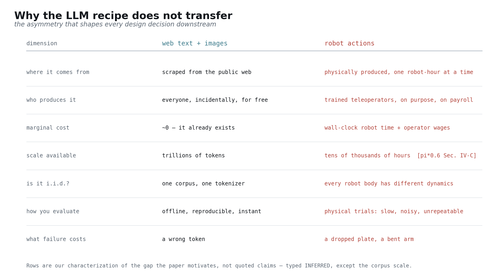
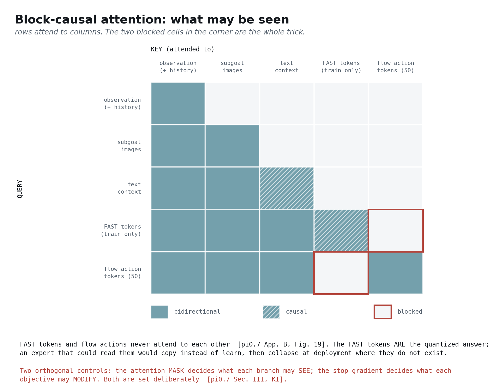
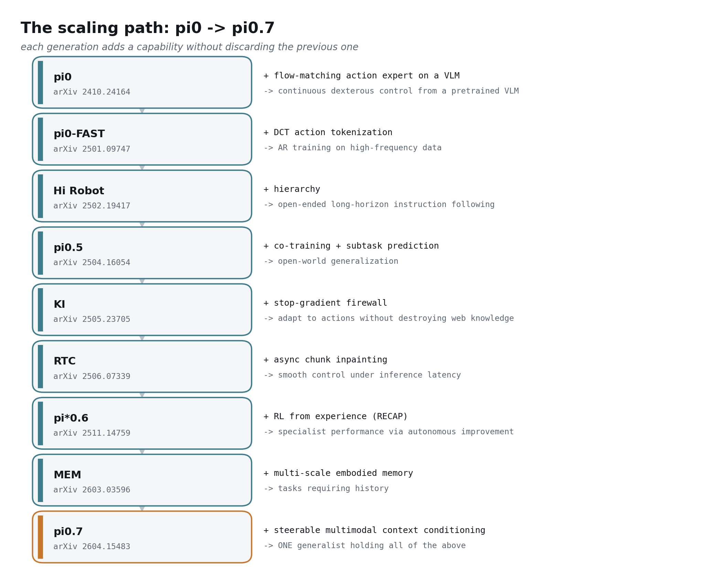
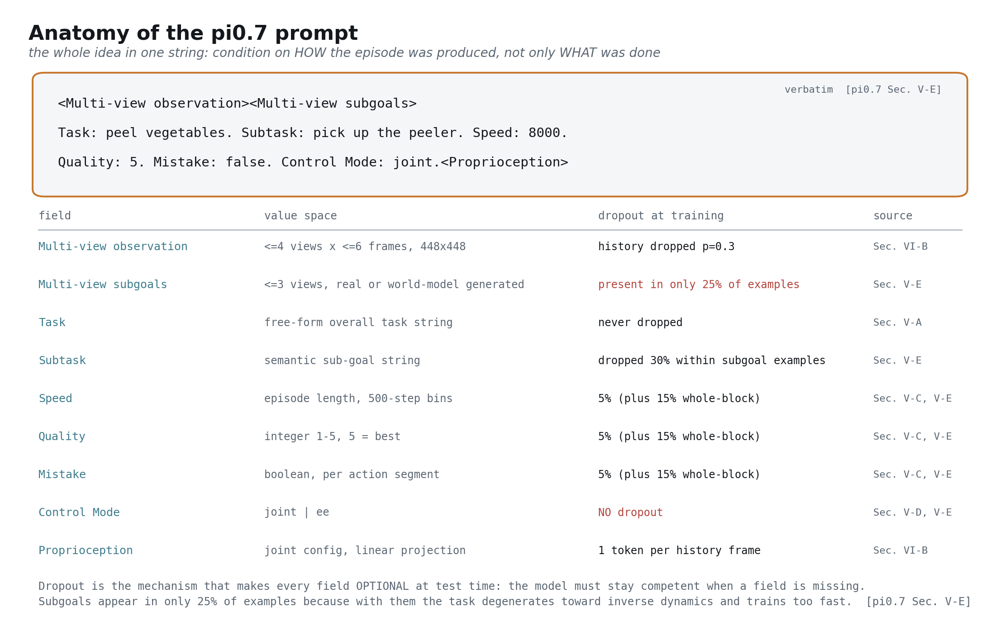
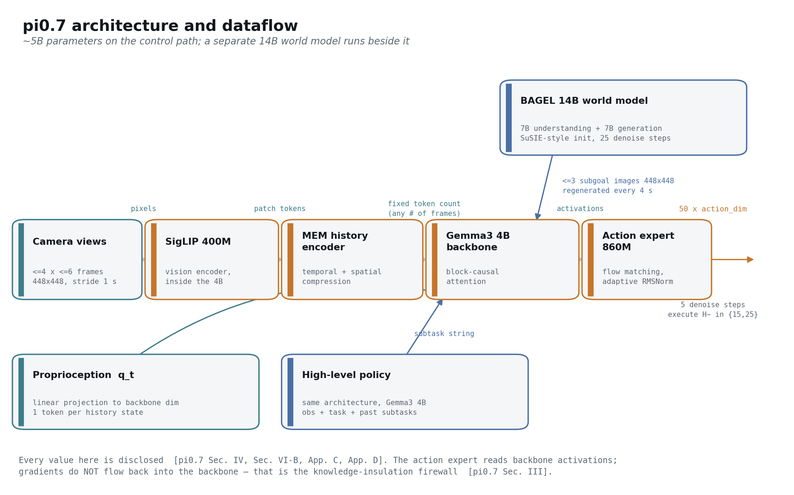
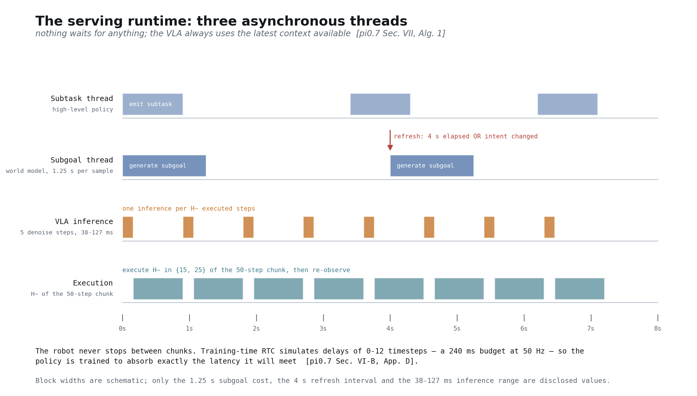
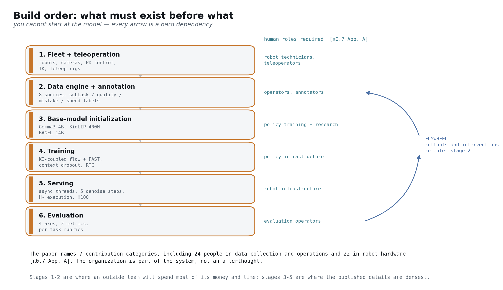
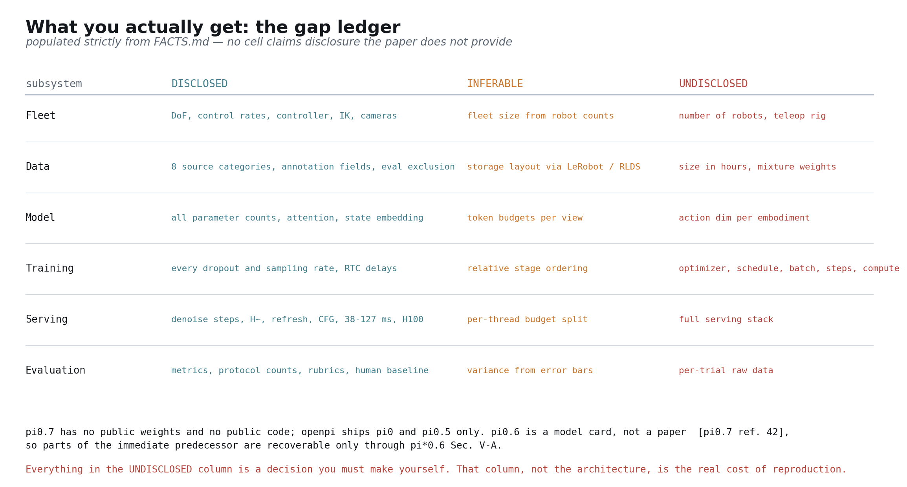

## The claim this post argues

> Generality in physical AI comes from data **diversity** — but diverse data is **mixed-quality**, and naive training averages it into mediocrity. The breakthrough is to condition on **how** each episode was produced, not only **what** was done. Rich context turns data quantity from a liability into a monotone benefit, and turns the trained model into something you can **steer**.

The evidence is a scaling result that runs opposite to intuition: with episode metadata, performance keeps improving as the dataset grows *even though average data quality falls*; without metadata, performance *degrades* as lower-quality data is added [[π0.7 §IX-E, Fig. 18]](https://arxiv.org/abs/2604.15483). The corollary is the hook — π0.7 inherits reinforcement-learning-level capability by distilling π\*0.6's RL rollouts through metadata conditioning, without itself running RL [[π0.7 §VI-A]](https://arxiv.org/abs/2604.15483).

## How to read this

This post assumes you know LLM pretraining and post-training, diffusion and flow matching, and transformers at scale. It assumes you know **nothing** about robotics. Everything robotics-specific is taught inline, and the prerequisites are quarantined into **Primer** boxes you can skip if you already have them. The organizing source throughout is the π0.7 paper itself [[π0.7 §I]](https://arxiv.org/abs/2604.15483).

Three conventions run throughout, and they are load-bearing rather than decorative [[π0.7 §V-E]](https://arxiv.org/abs/2604.15483):

**Every part opens with an I/O contract.** Input → output, with concrete shapes and units wherever the paper discloses them. If you can state what a module consumes and produces, you can reason about it without reading its internals — and you can substitute it [[π0.7 §IV]](https://arxiv.org/abs/2604.15483).

**Every claim is typed.** **Disclosed** means a paper states it. **Inferred** means I reasoned it from disclosed facts and am telling you so. **Undisclosed** means nobody outside Physical Intelligence knows, and it goes into the gap ledger in Part 10 rather than getting papered over [[π0.7 §VI-A]](https://arxiv.org/abs/2604.15483).

**Every number carries its reference.** Values in this post are checked mechanically against a fact ledger; a build script fails if any number in the prose is absent from that ledger or any paragraph lacks a citation. That is the only way I know to keep a document this long honest [[π0.7 §V-E]](https://arxiv.org/abs/2604.15483).

One scoping note. "Reproduce π0.7" here means *understand the whole scaling path, the design philosophy, and every disclosed detail of data collection, organization, training and serving — well enough to rebuild the system as an engineering program*. It does not mean porting code. π0.7 has no public weights and no public code [[π0.7 ref. 42]](https://arxiv.org/abs/2604.15483).

---

# Part 0 — The goal, and why it is hard

**I/O contract of this part:** in — your LLM intuitions; out — a precise definition of "generalist physical AI" and a working understanding of why the recipe you already know does not transfer.

## What "generalist" actually means here

"Generalist" is the most abused word in this field, so start with the operational definition: a generalist is a model that scores well on the four axes π0.7 actually measures [[π0.7 §I]](https://arxiv.org/abs/2604.15483).


**Out-of-the-box dexterity** means performing hard multi-stage manipulation with no task-specific post-training — the same checkpoint, no fine-tuning per task [[π0.7 §I]](https://arxiv.org/abs/2604.15483). **Instruction generalization** means following open-ended language in environments never seen during training; the protocol is 14 scenarios with sequences of 3–6 open-ended instructions each, run in 4 unseen kitchens and 2 unseen bedrooms [[π0.7 §IX-B, Fig. 9]](https://arxiv.org/abs/2604.15483). **Cross-embodiment transfer** means running a skill on a robot body that never demonstrated that skill — folding shirts on a bimanual UR5e when essentially all folding data was collected on a different, lighter robot [[π0.7 §IX-C]](https://arxiv.org/abs/2604.15483). **Compositional generalization** means recombining known skills into task-and-scene pairings that were never trained together, where performance sits at 60–80% against above 90% in-distribution [[π0.7 §X]](https://arxiv.org/abs/2604.15483).

Notice what all four have in common: each is measured by running a physical robot and watching what happens. There is no offline benchmark that substitutes for a trial [[π0.7 §IX-E]](https://arxiv.org/abs/2604.15483).

## Why the LLM recipe does not transfer

You already know how to build a generalist in text: scrape an enormous corpus, pretrain on next-token prediction, post-train for instruction following, evaluate offline, iterate quickly. Almost every step of that loop breaks when the output is a joint command produced by a physical machine [[π0.7 §I]](https://arxiv.org/abs/2604.15483).



The asymmetries in that figure are my characterization of the gap the paper motivates rather than quoted claims, so treat them as **inferred** — with one exception. The scale figure is disclosed: the π-series pre-training corpus is described as tens of thousands of hours of demonstrations across numerous tasks and a variety of robots [[π\*0.6 §IV-C]](https://arxiv.org/abs/2511.14759). That is an enormous robotics dataset and a rounding error against a text corpus.

The consequences compound. Because action data must be physically produced, **data is the binding constraint, not compute**. Because every robot body differs in reach, mass, inertia and gripper geometry, the corpus is not i.i.d. in the way a text corpus is — the UR5e is described as significantly longer, different in morphology, much heavier and higher in joint inertia, requiring a different manipulation strategy and different table positioning [[π0.7 §VIII, App. F]](https://arxiv.org/abs/2604.15483). And because evaluation requires physical trials, the iteration loop that makes LLM research fast is simply not available; the paper is explicit that at this data scale it is practically difficult to definitively determine which tasks are truly "seen" or "unseen" [[π0.7 §IX-E]](https://arxiv.org/abs/2604.15483).

> **Primer — teleoperation.** A human operator drives the robot through a task while the system records synchronized camera frames and joint positions at the control rate. That recording is one "demonstration" or "episode". This is how nearly all high-quality robot action data comes into existence, and it is why robot data has a wage attached to it. The π0.7 human study gives a sense of the skill involved: the 10 operators recruited were in the top 2 percentile of experience, averaging around 375 hours of teleoperation across all robot platforms [[π0.7 App. F, Fig. 21]](https://arxiv.org/abs/2604.15483).

## What data cannot be collected, and what simulators cannot build

The obvious response to expensive data is simulation. It works far less well than outsiders expect, and understanding why explains most of π0.7's design — which is built entirely around real-robot, human-video and web data, with no simulation component [[π0.7 §VI-A]](https://arxiv.org/abs/2604.15483).

The tasks that matter in homes are contact-rich and involve deformable objects: folding laundry, making a sandwich, peeling vegetables, scooping beans, wiping a spill. π0.7's own task list is dominated by exactly these — folding a buttondown shirt from a laundry basket, turning a t-shirt inside out, spreading peanut butter and cutting a sandwich diagonally, slicing a zucchini with a knife on a lanyard [[π0.7 App. G]](https://arxiv.org/abs/2604.15483). Cloth, food and liquid have no tractable rigid-body state; a simulator that gets shirt dynamics right at the fidelity needed for grasp selection is a research project in itself, not a tool you reach for.

The second barrier is the long tail of appliances and environments. π0.7's tasks include opening an air fryer, toasting a bagel in a toaster oven, operating an espresso machine, and driving through a self-closing closet door [[π0.7 App. G]](https://arxiv.org/abs/2604.15483). Each of those is a specific physical object with specific latching behavior. Building faithful models of them is not a scaling problem; it is an unbounded modelling problem, and every home has different ones.

So the field is pushed toward real data. That is a **inferred** reading of why π0.7 invests where it does, but it is strongly implied by where the paper actually spends its effort: on a fleet, on teleoperators, on annotation, and on a data engine [[π0.7 §VI-A, §VIII]](https://arxiv.org/abs/2604.15483).

## The central dilemma

Now the trap that motivates the entire paper [[π0.7 §I]](https://arxiv.org/abs/2604.15483).

Generality demands diversity. To be a generalist you need many tasks, many environments, many robot bodies, many ways of doing the same thing. But diverse data collected at scale is **mixed-quality** data. Some episodes are fast, some are slow. Some are clean, some contain a fumble and a recovery. Some come from expert operators, some from a policy evaluating itself and failing [[π0.7 §VI-A]](https://arxiv.org/abs/2604.15483).

The conventional response is to filter: keep the good episodes, discard the rest. This is what a careful practitioner does, and it is what π0.7 argues against. Filtering throws away the majority of the data you paid for, and the discarded episodes contain exactly the information a robot needs about how things go wrong and how to recover. But keeping them naively is worse — train on the union and the model learns the *average* behavior, which is mediocre, hesitant and error-prone [[π0.7 §I, §IX-E]](https://arxiv.org/abs/2604.15483).

π0.7's answer is the third option: keep everything, and **tell the model what it is looking at**. Label each episode with how fast it was, how good it was, whether it contained a mistake. Then at test time, ask for the behavior you want. A slow, error-containing episode is no longer a contaminant — it is a labelled example of what "slow" and "mistaken" look like, and its presence makes the *conditioning* sharper [[π0.7 §V-C, §VII]](https://arxiv.org/abs/2604.15483).

If that sounds familiar, it should. It is return-conditioned or advantage-conditioned behavior cloning, generalized from a scalar to a multimodal context [[π\*0.6 §V-B]](https://arxiv.org/abs/2511.14759). Part 3 develops that connection properly.

---

# Part 1 — Primer: what a VLA is

**I/O contract of this part:** in — your diffusion and transformer knowledge; out — the vision-language-action model as a black box with a declared contract, plus the four robotics concepts you need for the rest of the post.

## The contract

A vision-language-action model is a policy. It consumes an observation and a context, and produces a chunk of future actions [[π0.7 §III]](https://arxiv.org/abs/2604.15483).


Formally, the observation is $o_t = [I_t^1, \ldots, I_t^n, q_t]$ — $n$ camera images plus the robot's joint configuration — and the model produces an action chunk $a_{t:t+H}$ covering $H$ future timesteps, of which a shorter horizon $\tilde{H} < H$ is actually executed before the model re-observes and re-plans [[π0.7 §III]](https://arxiv.org/abs/2604.15483). The training objective is

$$\max_{\theta}\; \mathbb{E}_{\mathcal{D}}\left[\, \log \pi_{\theta}\!\left( a_{t:t+H} \mid o_{t-T:t},\, C_t \right) \right]$$

where $C_t$ is the context and $o_{t-T:t}$ is a window of past observations [[π0.7 §III, Eq. 1]](https://arxiv.org/abs/2604.15483). One honest caveat for readers who will reach for the likelihood: the flow-matching action expert optimizes an approximate lower bound on this quantity rather than the likelihood in closed form [[π0.7 §III]](https://arxiv.org/abs/2604.15483).

For π0.7 the contract instantiates concretely. Inputs are up to 4 cameras — front, two wrist, and an optional rear view — with up to 6 history frames each, sampled at a stride of 1 second, all resized to 448×448, plus up to 3 subgoal images with the rear view omitted [[π0.7 §VI-B]](https://arxiv.org/abs/2604.15483). The output is exactly 50 action tokens, one 50-step chunk [[π0.7 §VI-B]](https://arxiv.org/abs/2604.15483). At runtime only 15 or 25 of those 50 steps are executed before re-planning [[π0.7 §VII]](https://arxiv.org/abs/2604.15483).

The most instructive thing about this contract is what is **absent** from the input. There is no action history, no reward signal, no map, no explicit state estimate beyond proprioception [[π0.7 §III]](https://arxiv.org/abs/2604.15483). The policy is close to Markovian in its own outputs: the loop closes through the physical world, not through the context. That single design choice is why compounding error behaves so differently for VLAs than for autoregressive world models, a contrast Part 11 returns to.

> **Primer — control frequency.** A robot's low-level controller expects a new target at a fixed rate. π0.7's platforms run at 50 Hz, except the UR5e which runs at 20 Hz [[π0.7 §VIII]](https://arxiv.org/abs/2604.15483). At 50 Hz a 50-step chunk is one second of motion. This is why latency is a first-class constraint rather than a nice-to-have: if inference takes longer than the execution window, the robot stalls mid-motion.

> **Primer — action chunking.** Rather than predicting one action per forward pass, the model predicts $H$ steps jointly and the robot executes the first $\tilde{H}$ of them. Predicting jointly avoids the incoherent, jittery motion you get from independently sampled single steps, and it amortizes inference cost across many control cycles. $H$ is a modelling choice; $\tilde{H}$ is a control choice, and they trade smoothness against reactivity [[π0.7 §VII]](https://arxiv.org/abs/2604.15483).

> **Primer — embodiment.** An "embodiment" is a specific robot body: its kinematics, its degrees of freedom, its gripper, its camera placement. π0.7 spans bimanual mobile manipulators with two 6-DoF arms plus a lift and a holonomic base, a static bimanual platform, a bimanual UR5e with Robotiq grippers, and single-arm systems [[π0.7 §VIII, Fig. 4]](https://arxiv.org/abs/2604.15483). The action space differs across them, which is what makes cross-embodiment transfer a real problem rather than a relabelling exercise.

## How actions get represented

There are two dominant ways to turn continuous robot actions into something a transformer can produce, and π0.7 uses both simultaneously — for different parameters, under different objectives [[π0.7 §III]](https://arxiv.org/abs/2604.15483).

**Flow matching** treats the action chunk as a continuous vector and learns a velocity field that transports noise to data, exactly as you know it from generative modelling [[π0.7 ref. 102]](https://arxiv.org/abs/2604.15483). Inference integrates that field for a small number of steps; π0.7 uses 5 [[π0.7 §VII]](https://arxiv.org/abs/2604.15483). This representation is precise, which is what actuation demands.

**Discrete tokenization** instead compresses the action chunk with a DCT-based scheme and emits it as tokens from the language model's vocabulary, trained with ordinary next-token cross-entropy [[π0-FAST]](https://arxiv.org/abs/2501.09747). This representation is lossy but it lets the action objective speak the backbone's native language.

The reason to want both at once is the problem knowledge insulation solves [[π0.7 §III]](https://arxiv.org/abs/2604.15483).

## Knowledge insulation: the gradient firewall

Here is the failure mode, and it is the one knowledge insulation was introduced to fix [[KI, π0.7 §III]](https://arxiv.org/abs/2505.23705). You take a pretrained vision-language model that knows a great deal about the world, attach a continuous action head, and train it on robot data. The high-variance regression gradients from that head flow back into the backbone and degrade the very web knowledge you attached it for. You end up with a model that can move but has forgotten what a colander is.

Knowledge insulation fixes this with two controls that practitioners routinely conflate [[π0.7 §III]](https://arxiv.org/abs/2604.15483).

The first control is the **objective**: the VLM backbone is supervised with discrete FAST-token cross-entropy — a stable, well-conditioned classification loss of exactly the kind it was pretrained on — while the continuous action expert is trained with flow matching [[π0.7 §III]](https://arxiv.org/abs/2604.15483).

The second control is the **gradient**: the action expert attends to all backbone activations, but its gradients do **not** flow into the backbone [[π0.7 §III]](https://arxiv.org/abs/2604.15483). The expert can read everything and change nothing. π0.6 used exactly this recipe, training end-to-end on continuous actions and FAST-discretized tokens while a stop-gradient prevented the flow-matching expert from impacting the rest of the model [[π\*0.6 §V-A]](https://arxiv.org/abs/2511.14759).

There is a third control, and it is the one most write-ups miss: the **attention mask** [[π0.7 App. B, Fig. 19]](https://arxiv.org/abs/2604.15483).



The FAST tokens are available only at training time, and the FAST tokens and the flow actions do not attend to each other [[π0.7 App. B, Fig. 19]](https://arxiv.org/abs/2604.15483). This is not an optimization detail; it is a correctness requirement. The FAST tokens *are* the quantized ground-truth answer. An action expert able to attend to them would learn to decode the answer from its context rather than from the observation, and would collapse at deployment where those tokens do not exist.

So: the **mask** governs what each branch may *see*; the **stop-gradient** governs what each objective may *modify*. Both are set deliberately, and knowledge insulation works because of the pair, not either alone [[π0.7 §III]](https://arxiv.org/abs/2604.15483).

One consequence worth internalizing, because it recurs in Part 8: because the action tokens attend to the prefix but the prefix does not attend to them, the prefix can be encoded once and cached across all 5 denoising steps [[π0.7 §VII]](https://arxiv.org/abs/2604.15483). One masking decision buys both correctness and inference speed.

## Why latency is a first-class problem

In an LLM, latency is a product concern. In a VLA it is a correctness concern, because the world does not pause while you think — which is why π0.7 trains against a simulated latency budget rather than assuming inference is free [[π0.7 §VI-B]](https://arxiv.org/abs/2604.15483).

π0.7 handles this by training the policy to expect delay rather than by trying to eliminate it. Training uses real-time chunking with simulated delays of 0–12 timesteps, which corresponds to a maximum inference latency of 240 ms on a 50 Hz robot [[π0.7 §VI-B]](https://arxiv.org/abs/2604.15483). The policy is thus trained to absorb exactly the latency it will encounter. In deployment the measured numbers sit comfortably inside that budget: the minimal variant runs at 38 ms with 3 camera inputs and 5 denoising steps, rising to 127 ms in the worst case with the MEM vision encoder enabled and subgoal images in context, all on a single NVIDIA H100 [[π0.7 App. D]](https://arxiv.org/abs/2604.15483).

Keep that ratio in mind. A 240 ms budget against a 38 ms floor is the headroom that buys everything else in the system — history frames, subgoal images, guidance — and the worst case of 127 ms shows how much of that headroom those features actually consume [[π0.7 §VI-B, App. D]](https://arxiv.org/abs/2604.15483).

## Part 1 hyperparameter table

| Parameter | Value | Source |
|---|---|---|
| Cameras | up to 4 (front, two wrist, optional rear) | [[π0.7 §VI-B]](https://arxiv.org/abs/2604.15483) |
| History frames per camera | up to 6, stride 1 second | [[π0.7 §VI-B]](https://arxiv.org/abs/2604.15483) |
| Subgoal images | up to 3 (rear omitted) | [[π0.7 §VI-B]](https://arxiv.org/abs/2604.15483) |
| Image resolution | 448×448 | [[π0.7 §VI-B]](https://arxiv.org/abs/2604.15483) |
| Action chunk length H | 50 steps | [[π0.7 §VI-B]](https://arxiv.org/abs/2604.15483) |
| Executed horizon $\tilde{H}$ | 15 or 25 | [[π0.7 §VII]](https://arxiv.org/abs/2604.15483) |
| Denoising steps | 5 | [[π0.7 §VII]](https://arxiv.org/abs/2604.15483) |
| Control rate | 50 Hz; UR5e 20 Hz | [[π0.7 §VIII]](https://arxiv.org/abs/2604.15483) |
| RTC simulated delay | 0–12 timesteps = 240 ms at 50 Hz | [[π0.7 §VI-B]](https://arxiv.org/abs/2604.15483) |
| Inference latency | 38 ms minimal, 127 ms worst case, single H100 | [[π0.7 App. D]](https://arxiv.org/abs/2604.15483) |

---

# Part 2 — The scaling path: π0 to π0.7

**I/O contract of this part:** in — the VLA contract from Part 1; out — an understanding of which capability each generation added, what it cost, and why π0.7 needed all of them at once.

π0.7 is not a single idea. It is the ninth entry in a line where each generation adds a capability without discarding the previous one, and π0.7's own contribution is the conditioning scheme that lets one model hold them all simultaneously [[π0.7 §I, §VI-A]](https://arxiv.org/abs/2604.15483).



## The generations

**π0** established the template: a flow-matching action expert attached to a pretrained vision-language model, giving continuous dexterous control from web-scale visual knowledge [[π0.7 ref. 10]](https://arxiv.org/abs/2604.15483). This is the architecture everything since has refined rather than replaced.

**π0-FAST** introduced DCT-based action tokenization, which made autoregressive training on high-frequency action data practical [[π0.7 ref. 104]](https://arxiv.org/abs/2604.15483). Its lasting contribution to π0.7 is not the inference path but the *training* path: FAST tokens are what the backbone is supervised with under knowledge insulation [[π0.7 §III]](https://arxiv.org/abs/2604.15483).

**Hi Robot** added hierarchy — a high-level policy emitting semantic subtasks and a low-level policy executing them — which is what makes open-ended, long-horizon instruction following tractable [[π0.7 bibliography]](https://arxiv.org/abs/2604.15483). π0.7 keeps this structure: the high-level policy uses the same architecture as the main model and maps observations, the task specification and past subtasks to the next subtask instruction [[π0.7 §V-A, Fig. 2]](https://arxiv.org/abs/2604.15483).

**π0.5** added co-training on heterogeneous data plus explicit semantic subtask prediction, which is what produced open-world generalization to genuinely unseen homes [[π0.7 ref. 14]](https://arxiv.org/abs/2604.15483).

**Knowledge insulation** contributed the stop-gradient firewall analyzed in Part 1 — the mechanism that lets you adapt a VLM to actions without destroying what it knows [[π0.7 ref. 103]](https://arxiv.org/abs/2604.15483).

**Real-time chunking** solved the seam between consecutive action chunks, letting the robot execute continuously instead of pausing while the next chunk is computed [[π0.7 ref. 107]](https://arxiv.org/abs/2604.15483). π0.7 uses the training-time variant, which unlike test-time RTC incurs no additional inference-time overhead [[π0.7 ref. 108, App. D]](https://arxiv.org/abs/2604.15483).

**MEM** contributed memory, and π0.7 inherits it almost wholesale — worth its own subsection below [[π0.7 ref. 37]](https://arxiv.org/abs/2604.15483).

**π\*0.6** contributed reinforcement learning from real deployment experience, and is the most consequential ancestor for the thesis of this post — also its own subsection [[π0.7 ref. 50]](https://arxiv.org/abs/2604.15483).

## What π\*0.6 actually did

Reduce π\*0.6 to "they used RL" and you miss the mechanism π0.7 depends on [[π\*0.6 §IV]](https://arxiv.org/abs/2511.14759).

The method is **RECAP** — RL with Experience and Corrections via Advantage-conditioned Policies [[π\*0.6 abstract, §IV]](https://arxiv.org/abs/2511.14759). It has three subroutines: collect data by running the policy and labelling episode outcomes, optionally with human corrective interventions; train a value function on everything collected so far; and train the policy conditioned on an optimality indicator derived from that value function [[π\*0.6 §IV-C, Alg. 1]](https://arxiv.org/abs/2511.14759).

The value function is a multi-task **distributional** critic with the same architecture as the policy but a smaller 670M VLM backbone, also initialized from Gemma 3 [[π\*0.6 §V-C, Fig. 3]](https://arxiv.org/abs/2511.14759). It discretizes returns into $B = 201$ bins and trains by cross-entropy over Monte Carlo returns [[π\*0.6 §IV-A]](https://arxiv.org/abs/2511.14759). The reward is deliberately trivial so it applies to any task: 0 at the terminal step on success, a large negative constant on failure, and −1 otherwise, with values normalized per task by maximum episode length into the range $(-1, 0)$ [[π\*0.6 §V-C, Eq. 5]](https://arxiv.org/abs/2511.14759).

Then the move that matters. Rather than a policy-gradient update — awkward for flow-matching policies, which do not offer a tractable log-likelihood — RECAP **conditions** the policy on a binarized advantage indicator inserted as plain text: "Advantage: positive" or "Advantage: negative" [[π\*0.6 §V-B]](https://arxiv.org/abs/2511.14759). The indicator sits after the language input but before the actions, so only the action log-likelihoods are affected [[π\*0.6 §V-B]](https://arxiv.org/abs/2511.14759). The threshold $\varepsilon_{\ell}$ is set at the 30% percentile of values the critic predicts for that task, and human corrections are forced to positive on the assumption that expert interventions are good actions [[π\*0.6 §V-D, §IV-B]](https://arxiv.org/abs/2511.14759). Because the indicator is randomly omitted during training, classifier-free guidance is available at inference [[π\*0.6 §V-B]](https://arxiv.org/abs/2511.14759).

Two engineering details generalize beyond this paper. Each iteration finetunes from the *pre-trained* checkpoint rather than from the previous iteration, which avoids drift across rounds [[π\*0.6 §V-D]](https://arxiv.org/abs/2511.14759). And specialists are finetuned from the pre-trained model while the final generalist is trained from scratch [[π\*0.6 §IV-C]](https://arxiv.org/abs/2511.14759). The payoff: RECAP more than doubles task throughput and roughly halves the failure rate on the hardest tasks, enough to make espresso drinks for 13 hours straight and fold novel laundry in a new home for over 2 hours without interruption [[π\*0.6 abstract, §I]](https://arxiv.org/abs/2511.14759).

Look at what advantage conditioning *is*: conditioning a behavior-cloning policy on a text label describing how good the demonstrated behavior was. π0.7 takes that exact idea and generalizes the label from one binary scalar to a multimodal bundle [[π0.7 §V-C]](https://arxiv.org/abs/2604.15483).

π\*0.6 also incidentally documents its predecessor. π0.6 has no paper — it is a model card [[π0.7 ref. 42]](https://arxiv.org/abs/2604.15483) — but π\*0.6 discloses that it derives from π0.5, uses Gemma 3 4B as its base VLM, increases the action expert to 860M parameters, augments the pre-training set with more robot platforms, and outputs joint angles and gripper commands at 50 Hz [[π\*0.6 §V-A]](https://arxiv.org/abs/2511.14759). That is most of what an outside team needs about π0.6.

## What MEM contributed

MEM is Multi-Scale Embodied Memory, and it exists because conditioning a policy on a long raw observation history is computationally hopeless [[MEM §I]](https://arxiv.org/abs/2603.03596). Naively passing frames into the backbone drives inference time past the real-time barrier — measured at 300 ms for the π0.6 VLA with 4 camera streams on one H100 [[MEM Fig. 3]](https://arxiv.org/abs/2603.03596).

MEM splits memory by timescale [[MEM abstract, §III-A]](https://arxiv.org/abs/2603.03596). **Long-horizon** memory is a *language* summary that the high-level policy maintains, predicting the updated summary from its own previous summary plus the current observation [[MEM §III-B]](https://arxiv.org/abs/2603.03596). Training data for those updates comes from an off-the-shelf LLM that summarizes past subtasks and their success indicators, instructed to remove or compress whenever appropriate [[MEM §III-B]](https://arxiv.org/abs/2603.03596). Compression is the point: naively concatenating all past subtask instructions works significantly worse, because at inference a policy repeatedly retrying a failed subtask produces sequences that never occurred in near-optimal training demonstrations [[MEM §IV-A, Fig. 6]](https://arxiv.org/abs/2603.03596).

**Short-horizon** memory is a video encoder built by modifying a ViT's attention pattern: bidirectional spatial attention within each observation, plus causal temporal attention across observations at every 4th layer [[MEM §III-C, Fig. 4]](https://arxiv.org/abs/2603.03596). That factorization drops the cost from $O(n^2 K^2)$ to $O(Kn^2 + nK^2)$ [[MEM §III-C]](https://arxiv.org/abs/2603.03596). Two properties make it free to adopt: only the current timestep's representation is passed onward, so the encoder emits the same token count as a memoryless single-timestep VLA [[MEM §III-C]](https://arxiv.org/abs/2603.03596); and it introduces no new learnable parameters versus a standard single-image ViT, since memory comes from the attention pattern plus a fixed sinusoidal temporal position encoding [[MEM §III-C]](https://arxiv.org/abs/2603.03596). At $K = 1$ the initialization exactly matches the source VLM because that embedding is $0$ at $t = 0$ [[MEM §III-C]](https://arxiv.org/abs/2603.03596).

MEM pre-trains on 6 observations — 5 past plus the current — at a stride of 1 second, and can be expanded in post-training to 18 frames and 54 seconds [[MEM §III-D]](https://arxiv.org/abs/2603.03596). Compare that to π0.7's input contract: up to 6 history frames at a stride of 1 second [[π0.7 §VI-B]](https://arxiv.org/abs/2604.15483). π0.7 also takes MEM's state handling, projecting each proprioceptive state into the backbone embedding space with a linear projection instead of π0.6's text tokens [[MEM §III-D, π0.7 §VI-B]](https://arxiv.org/abs/2603.03596).

## The philosophy to extract

The pattern across nine generations is worth stating explicitly, because it is the actual lesson for anyone building such a program: **capability accumulates and is not discarded**. FAST tokenization, introduced generations earlier, is still the backbone's training signal [[π0.7 §III]](https://arxiv.org/abs/2604.15483). Hi Robot's hierarchy is still the subtask interface [[π0.7 §V-A]](https://arxiv.org/abs/2604.15483). MEM's encoder is a component, not a replacement [[π0.7 §IV]](https://arxiv.org/abs/2604.15483).

π0.7's own contribution is the conditioning scheme that lets a single generalist hold all of it at once — explicitly including absorbing the behavior of RL-trained specialists, since data collected by π\*0.6 during RL training is used as additional training examples in what the paper calls "a kind of 'distillation' process" [[π0.7 §VI-A]](https://arxiv.org/abs/2604.15483). The generalist inherits specialist capability without running RL itself.

---

# Part 3 — The π0.7 idea: steerable context conditioning

**I/O contract of this part:** in — the lineage; out — the single reframing that defines π0.7, field by field, with every dropout rate.

## Condition on how, not only what

Standard instruction-following conditions the policy on *what* to do: a task string. π0.7's move is to expand the context $C_t$ from a bare instruction into a multimodal bundle that also describes *how* the episode was produced [[π0.7 §III, §IV]](https://arxiv.org/abs/2604.15483).

The entire idea is legible in a single string [[π0.7 §V-E]](https://arxiv.org/abs/2604.15483):

```
<Multi-view observation><Multi-view subgoals>
Task: peel vegetables. Subtask: pick up the peeler. Speed: 8000.
Quality: 5. Mistake: false. Control Mode: joint.<Proprioception>
```



## The fields

**Subtask instruction** $\tilde{\ell}_t$ — an intermediate semantic subtask alongside the overall task $\ell_t$, following π0.5. At inference it comes from a learned high-level policy, from a human coaching the robot, or it is omitted [[π0.7 §V-A]](https://arxiv.org/abs/2604.15483).

**Subgoal images** $g_t$ — multi-view images of a desired near-future state. The base view carries environment and object outcomes; the wrist views carry arm and gripper outcomes [[π0.7 §V-B]](https://arxiv.org/abs/2604.15483). This is a *visual* instruction, and it turns out to be the channel through which cross-embodiment transfer improves most.

**Episode metadata** $m$ — three human-derived labels. *Overall speed* is the episode length in timesteps, binned in 500-step intervals, so an episode of 1750–2250 steps is presented as "2000 steps" [[π0.7 §V-C]](https://arxiv.org/abs/2604.15483). *Overall quality* is an integer from 1 to 5, with 5 best [[π0.7 §V-C]](https://arxiv.org/abs/2604.15483). *Mistake* is a boolean per action segment, coarsely annotated by humans [[π0.7 §V-C]](https://arxiv.org/abs/2604.15483).

**Control mode** $c \in \{\mathrm{joint},\, \mathrm{ee}\}$ — whether the action space is joint positions or end-effector poses [[π0.7 §V-D]](https://arxiv.org/abs/2604.15483).

Metadata is the thesis in concrete form. "Speed: 8000" does not describe the task; it describes the *episode* the actions were drawn from. A slow, clumsy demonstration is no longer noise to be filtered — it is a correctly-labelled example of slow, clumsy behavior, and its presence sharpens the model's notion of what "fast" and "high-quality" mean [[π0.7 §IX-E]](https://arxiv.org/abs/2604.15483).

## Dropout is what makes fields optional

A context this rich creates a deployment problem: at test time you may not have subgoal images, or a subtask string, or reliable metadata. π0.7's answer is that every field is dropped during training at a specific rate, so the model must stay competent without it [[π0.7 §V-E]](https://arxiv.org/abs/2604.15483).

The exact schedule, all from the same section [[π0.7 §V-E]](https://arxiv.org/abs/2604.15483):

- Subgoal images are added to only **25%** of examples per batch [[π0.7 §V-E]](https://arxiv.org/abs/2604.15483)
- Within those subgoal examples, the subtask instruction is dropped **30%** of the time [[π0.7 §V-E]](https://arxiv.org/abs/2604.15483)
- Episode metadata is dropped entirely **15%** of the time [[π0.7 §V-E]](https://arxiv.org/abs/2604.15483)
- Each metadata component — speed, quality, mistake — is additionally dropped at **5%** individually [[π0.7 §V-E]](https://arxiv.org/abs/2604.15483)
- Control mode has **no dropout** at all [[π0.7 §V-E]](https://arxiv.org/abs/2604.15483)

Two of those rates deserve attention, because the paper gives an explicit reason for one and a conspicuous silence for the other [[π0.7 §V-E]](https://arxiv.org/abs/2604.15483).

The **25%** subgoal rate is not a regularization heuristic. With subgoal images present, the task degenerates toward inverse dynamics — the model can read off the intended outcome and interpolate toward it — and consequently trains much faster [[π0.7 §V-E]](https://arxiv.org/abs/2604.15483). Left unchecked, the model would lean on the easy channel and under-train the hard one. Capping subgoals at a quarter of examples keeps the observation-to-action pathway load-bearing. This is a general principle worth stealing: **when one input channel makes the task too easy, ration it.**

Control mode getting **no dropout** is the mirror-image decision [[π0.7 §V-E]](https://arxiv.org/abs/2604.15483). Every other field is advisory — a hint about how to behave. Control mode is a *hard fact about the action space itself*: joint positions and end-effector poses are different output semantics, and a model uncertain about which one it is emitting is not usefully steerable, it is broken. Optional fields get dropout; semantic contracts do not.

## Steering at runtime

Because the model has learned the conditional distribution over behavior modes, deployment becomes a matter of asking for the mode you want [[π0.7 §VII]](https://arxiv.org/abs/2604.15483).

The runtime settings are unapologetic: the speed prompt is set per task to the **15th percentile** of that task's episode length — that is, ask for a run faster than the great majority of training demonstrations; quality is always set to **5**; and mistake is always set to **false** [[π0.7 §VII]](https://arxiv.org/abs/2604.15483). The system is trained on mediocre data and then asked, at inference, to behave like the best of it.

And because dropout produced a model that works both with and without metadata, classifier-free guidance is directly available. π0.7 applies CFG to the episode metadata with weight $\beta \in \{1.3,\, 1.7,\, 2.2\}$ [[π0.7 §VII]](https://arxiv.org/abs/2604.15483). You already know this mechanism from diffusion: extrapolate away from the unconditional prediction to push harder toward the conditioned mode. Here the "condition" is not a text prompt describing content — it is a description of *behavioral quality*. Turning up $\beta$ turns up how emphatically the policy commits to being fast, clean and error-free.

That is the whole idea [[π0.7 §IV]](https://arxiv.org/abs/2604.15483). Everything in the remaining parts is the machinery required to make it work at scale.

## Part 3 hyperparameter table

| Parameter | Value | Source |
|---|---|---|
| Overall speed | episode length in timesteps, 500-step bins (1750–2250 → "2000 steps") | [[π0.7 §V-C]](https://arxiv.org/abs/2604.15483) |
| Overall quality | integer 1–5, 5 best | [[π0.7 §V-C]](https://arxiv.org/abs/2604.15483) |
| Mistake | boolean, per action segment, human-annotated | [[π0.7 §V-C]](https://arxiv.org/abs/2604.15483) |
| Control mode | joint or ee | [[π0.7 §V-D]](https://arxiv.org/abs/2604.15483) |
| Subgoal images present | 25% of examples per batch | [[π0.7 §V-E]](https://arxiv.org/abs/2604.15483) |
| Subtask dropped (within subgoal examples) | 30% | [[π0.7 §V-E]](https://arxiv.org/abs/2604.15483) |
| Metadata dropped entirely | 15% | [[π0.7 §V-E]](https://arxiv.org/abs/2604.15483) |
| Each metadata component additionally dropped | 5% | [[π0.7 §V-E]](https://arxiv.org/abs/2604.15483) |
| Control-mode dropout | none | [[π0.7 §V-E]](https://arxiv.org/abs/2604.15483) |
| Runtime speed prompt | 15th percentile of task episode length | [[π0.7 §VII]](https://arxiv.org/abs/2604.15483) |
| Runtime quality prompt | always 5 | [[π0.7 §VII]](https://arxiv.org/abs/2604.15483) |
| Runtime mistake prompt | always false | [[π0.7 §VII]](https://arxiv.org/abs/2604.15483) |
| CFG weight $\beta$ on metadata | 1.3, 1.7 or 2.2 | [[π0.7 §VII]](https://arxiv.org/abs/2604.15483) |

---

# Part 4 — Subsystem: fleet and teleoperation

**I/O contract:** in — human intent, expressed by an operator driving a robot; out — recorded trajectories of synchronized images and joint positions on physical hardware.

This is where a reproduction actually starts, and where most of the money goes. You cannot train the model before this exists, and the paper devotes a full section to the hardware it runs on [[π0.7 §VIII]](https://arxiv.org/abs/2604.15483).

## The platforms

π0.7 spans four platform families [[π0.7 §VIII, Fig. 4]](https://arxiv.org/abs/2604.15483):

- **Bimanual mobile manipulators** — two 6-DoF arms, a 1–2 DoF lift, and a holonomic base [[π0.7 Fig. 4]](https://arxiv.org/abs/2604.15483)
- **Static bimanual "BiPi"** — two lightweight 6-DoF arms with a 1-DoF gripper [[π0.7 §VIII, Fig. 4]](https://arxiv.org/abs/2604.15483)
- **Bimanual UR5e** — industrial arms with Robotiq grippers [[π0.7 §VIII, Fig. 4]](https://arxiv.org/abs/2604.15483)
- **Single-arm 6-DoF systems** [[π0.7 §VIII, Fig. 4]](https://arxiv.org/abs/2604.15483)

Grippers are parallel-jaw throughout [[π0.7 §VIII]](https://arxiv.org/abs/2604.15483). The uniform 6-DoF arm count across families is not an accident: it is what makes a shared joint-space action representation coherent enough to transfer [[π0.7 §VIII, Fig. 4]](https://arxiv.org/abs/2604.15483).

## Control and sensing

Control rates are 50 Hz for everything except the UR5e, which runs at 20 Hz [[π0.7 §VIII]](https://arxiv.org/abs/2604.15483). Sensing is a front-facing camera plus one wrist camera per arm, with mobile robots adding a rear-facing camera [[π0.7 §VIII]](https://arxiv.org/abs/2604.15483). That is exactly the "up to 4 cameras" of the input contract: front, two wrist, optional rear [[π0.7 §VI-B]](https://arxiv.org/abs/2604.15483).

Actuation is deliberately simple. The model's action output is applied through a **PD controller**, and in end-effector mode a numerical **inverse kinematics** solver converts target end-effector poses into target joint positions [[π0.7 §VIII]](https://arxiv.org/abs/2604.15483). There is no learned low-level controller, no torque-level policy, no model-predictive layer underneath. The learned policy outputs position targets and classical control does the rest.

That is worth pausing on, because it inverts a common expectation. The sophistication is entirely in the high-level policy; the bottom of the stack is textbook [[π0.7 §VIII]](https://arxiv.org/abs/2604.15483). **Inferred:** this keeps the sim-to-real-free pipeline tractable and makes the same policy portable across bodies that share an interface, but the paper does not argue it explicitly.

## Why the UR5e is the hard target

The UR5e is the cross-embodiment stress test, and the paper is specific about why: it is significantly longer, morphologically different, much heavier, and has high joint inertia, so it requires a different manipulation strategy and different table positioning [[π0.7 §VIII, App. F]](https://arxiv.org/abs/2604.15483). The team did not collect laundry-folding data with the bimanual UR5e at all, and found it generally harder to teleoperate and less suitable for very precise grasps [[π0.7 §IX-C]](https://arxiv.org/abs/2604.15483).

That last fact reframes the whole cross-embodiment result. Transfer to the UR5e is not merely a benchmark — it is the way to get data from a platform that is *painful to teleoperate*. A model that transfers to a new embodiment opens the possibility of collecting autonomous data there without human teleoperation at all [[π0.7 App. F]](https://arxiv.org/abs/2604.15483).

The transfer also produced genuinely emergent behavior rather than imitation. On the source robot, operators approach cloth with a tilted end-effector to secure fabric against the table before lifting; on the UR5e, π0.7 instead uses a vertical grasp better suited to that arm's kinematics — a strategy that differs from the training data but fits the target body [[π0.7 Fig. 13]](https://arxiv.org/abs/2604.15483). Using world-model-generated subgoal images improves this further, labelled π0.7 (GC) in the results [[π0.7 §IX-C, Fig. 12]](https://arxiv.org/abs/2604.15483).

## Part 4 hyperparameter table

| Parameter | Value | Source |
|---|---|---|
| Control rate | 50 Hz; UR5e 20 Hz | [[π0.7 §VIII]](https://arxiv.org/abs/2604.15483) |
| Arm DoF | 6 across platforms | [[π0.7 §VIII, Fig. 4]](https://arxiv.org/abs/2604.15483) |
| Mobile manipulator | 2 × 6-DoF arms, 1–2 DoF lift, holonomic base | [[π0.7 Fig. 4]](https://arxiv.org/abs/2604.15483) |
| Static bimanual (BiPi) | 2 × 6-DoF arms, 1-DoF gripper | [[π0.7 §VIII, Fig. 4]](https://arxiv.org/abs/2604.15483) |
| Grippers | parallel-jaw; Robotiq on UR5e | [[π0.7 §VIII, Fig. 4]](https://arxiv.org/abs/2604.15483) |
| Cameras | front + one wrist per arm; rear on mobile | [[π0.7 §VIII]](https://arxiv.org/abs/2604.15483) |
| Low-level controller | PD | [[π0.7 §VIII]](https://arxiv.org/abs/2604.15483) |
| End-effector mode | numerical inverse kinematics → joint targets | [[π0.7 §VIII]](https://arxiv.org/abs/2604.15483) |
| Fleet size | **undisclosed** | [[π0.7 §VIII]](https://arxiv.org/abs/2604.15483) |
| Teleoperation rig | **undisclosed** | [[π0.7 §VIII]](https://arxiv.org/abs/2604.15483) |

---

# Part 5 — Subsystem: the data engine

**I/O contract:** in — the fleet, human annotators, and the public web; out — an annotated, mixture-weighted training corpus in which every episode carries a description of how it was produced.


## The eight sources

π0.7 trains on eight categories of data [[π0.7 §VI-A]](https://arxiv.org/abs/2604.15483):

1. **Demonstrations** across static and mobile, single-arm and bimanual platforms, in lab-like, home-like, and in-the-wild home environments [[π0.7 §VI-A]](https://arxiv.org/abs/2604.15483)
2. **Autonomous data** from a large amount of policy evaluations [[π0.7 §VI-A]](https://arxiv.org/abs/2604.15483)
3. **Human interventions** within policy rollouts [[π0.7 §VI-A]](https://arxiv.org/abs/2604.15483)
4. **π\*0.6 RL-training rollouts**, used as additional examples [[π0.7 §VI-A]](https://arxiv.org/abs/2604.15483)
5. **Open-source robot datasets** [[π0.7 §VI-A]](https://arxiv.org/abs/2604.15483)
6. **Egocentric human video** [[π0.7 §VI-A]](https://arxiv.org/abs/2604.15483)
7. **Auxiliary non-robot web data** — object localization, attribute prediction, VQA, text-only [[π0.7 §VI-A]](https://arxiv.org/abs/2604.15483)
8. **Video-language tasks**, including captioning of in-house robot data and web video [[π0.7 §VI-A]](https://arxiv.org/abs/2604.15483)

Note the shape of that list. Only the first four involve the fleet. The rest is leverage: web and video data keeps the backbone's semantic knowledge alive while robot data teaches actuation [[π0.7 §VI-A]](https://arxiv.org/abs/2604.15483).

## The deliberate departure: keep the bad data

Conventional practice curates. π0.7 does the opposite, making heavy use of **suboptimal** robot data — failure episodes, successful episodes containing substantial mistakes, and data collected by prior model versions during evaluation [[π0.7 §VI-A]](https://arxiv.org/abs/2604.15483).

This is only safe because of metadata. An episode labelled quality 2 with mistake true is not a corrupted training signal; it is a correctly-labelled sample from a region of behavior space the model should be able to represent and then be steered away from [[π0.7 §V-C, §VII]](https://arxiv.org/abs/2604.15483). Filtering and conditioning are alternative treatments of the same problem, and π0.7's scaling result is the argument that conditioning dominates [[π0.7 §IX-E, Fig. 18]](https://arxiv.org/abs/2604.15483).

## The distillation move

The single most consequential line in the data section: data collected by π\*0.6 during RL training is used as additional training examples, which the paper describes as "a kind of 'distillation' process" [[π0.7 §VI-A]](https://arxiv.org/abs/2604.15483).

Trace what that means. π\*0.6 ran real RL on real robots, using a value function and advantage conditioning to push specialist policies past the quality of human demonstration [[π\*0.6 §IV, §I]](https://arxiv.org/abs/2511.14759). Those rollouts — including their improvements over teleoperation — become ordinary conditioned training examples for π0.7. The generalist acquires specialist-level behavior **without running RL itself**, purely through supervised training on RL-generated trajectories carrying metadata about how good they were [[π0.7 §VI-A]](https://arxiv.org/abs/2604.15483).

For a reader from LLM post-training this should land immediately: it is distillation from an RL-tuned teacher into a supervised student, with the twist that the "reward" survives into the student as a *conditioning variable* rather than being baked into the weights [[π\*0.6 §V-B, π0.7 §V-C]](https://arxiv.org/abs/2511.14759).

## Annotation

The context fields must come from somewhere, and mostly they come from people [[π0.7 §V-A, §V-C]](https://arxiv.org/abs/2604.15483).

Subtask segmentation gives the semantic subtask strings [[π0.7 §V-A]](https://arxiv.org/abs/2604.15483). Quality is a 1–5 score [[π0.7 §V-C]](https://arxiv.org/abs/2604.15483). Mistake labels are boolean per action segment, described as "provided by humans coarsely annotating our data" [[π0.7 §V-C]](https://arxiv.org/abs/2604.15483). Speed is the only field derived mechanically, as episode length binned in 500-step intervals [[π0.7 §V-C]](https://arxiv.org/abs/2604.15483).

The word "coarsely" is doing real work there. This is not a high-precision labelling operation — it is a cheap pass over a very large corpus, and the system is designed to tolerate that. **Undisclosed:** annotation guidelines, inter-annotator agreement, cost per episode, and how disagreements are resolved [[π0.7 §V-C]](https://arxiv.org/abs/2604.15483).

Annotation quality does have one documented hard dependency. For world-model training, label quality — especially *temporal segmentation* quality — has a large impact on subgoal quality [[π0.7 App. C]](https://arxiv.org/abs/2604.15483). Segment boundaries determine what counts as the achieved subgoal, so sloppy boundaries produce a world model that generates the wrong target.

## Evaluation hygiene

One footnote carries enormous weight: autonomous data collected in any generalization-focused evaluation task is **excluded** from training [[π0.7 §VI-A fn. 1]](https://arxiv.org/abs/2604.15483).

Without that exclusion the flywheel would quietly train on the test set [[π0.7 §VI-A fn. 1]](https://arxiv.org/abs/2604.15483). The system deploys a policy, records what it does during evaluation, and feeds that back into training — which is exactly how you contaminate a held-out task while believing you measured generalization. This is the kind of discipline that does not show up in a results table and entirely determines whether the results mean anything.

## How the data is organized

**Inferred throughout this subsection.** π0.7 discloses nothing about its internal storage format [[π0.7 §VI-A]](https://arxiv.org/abs/2604.15483). But the schema is legible from the context fields, and the open-source ecosystem provides a concrete instantiation worth teaching.

The open analogue splits by access pattern, mirroring the schema the context fields imply [[π0.7 §V-C]](https://arxiv.org/abs/2604.15483). **LeRobot** stores episodes as Parquet tables plus MP4 video with a `meta/tasks` index, giving map-style random access — the right choice for fine-tuning, where you shuffle over a dataset that fits your storage. **RLDS/TFDS** streams shards with a large shuffle buffer and weighted interleaving across many datasets — the right choice for pretraining on a mixture too large to index. The principle generalizing beyond either: **format follows access pattern follows scale.**

What matters more than the file format is the *record schema*, and that is dictated by the context bundle: per-episode quality, speed and control mode; per-segment subtask text and mistake flags; per-frame images from up to 4 cameras and proprioception [[π0.7 §V-C, §VI-B]](https://arxiv.org/abs/2604.15483). Any reproduction must carry those fields as first-class columns, because they are what training conditions on.

## The scaling payoff

Everything above exists to produce one result [[π0.7 §IX-E, Fig. 18]](https://arxiv.org/abs/2604.15483).


With episode metadata, performance keeps improving as the dataset grows even though average data quality falls; without metadata, performance degrades as lower-quality data is added [[π0.7 §IX-E, Fig. 18]](https://arxiv.org/abs/2604.15483). The sign of the scaling curve flips based on whether you told the model what it was looking at.

A second ablation sharpens what "diversity" means operationally: removing the most task-diverse 20% of robot data hurts substantially more than removing a random 20% [[π0.7 §IX-E, Fig. 18]](https://arxiv.org/abs/2604.15483). Data value is not uniform per hour. The tail of unusual tasks carries disproportionate weight, which is an argument for breadth over depth when allocating a collection budget.

## Part 5 hyperparameter table

| Parameter | Value | Source |
|---|---|---|
| Source categories | 8 | [[π0.7 §VI-A]](https://arxiv.org/abs/2604.15483) |
| Quality annotation | integer 1–5 | [[π0.7 §V-C]](https://arxiv.org/abs/2604.15483) |
| Mistake annotation | boolean per action segment, coarse | [[π0.7 §V-C]](https://arxiv.org/abs/2604.15483) |
| Speed derivation | episode length, 500-step bins | [[π0.7 §V-C]](https://arxiv.org/abs/2604.15483) |
| Eval hygiene | generalization-eval autonomous data excluded | [[π0.7 §VI-A fn. 1]](https://arxiv.org/abs/2604.15483) |
| Diversity ablation | most-diverse 20% removal hurts more than random 20% | [[π0.7 §IX-E, Fig. 18]](https://arxiv.org/abs/2604.15483) |
| Pre-training corpus scale (π-series) | tens of thousands of hours | [[π\*0.6 §IV-C]](https://arxiv.org/abs/2511.14759) |
| Dataset size in hours or episodes | **undisclosed** | [[π0.7 §VI-A]](https://arxiv.org/abs/2604.15483) |
| Per-source mixture weights | **undisclosed** | [[π0.7 §VI-A]](https://arxiv.org/abs/2604.15483) |
| Annotation guidelines and agreement | **undisclosed** | [[π0.7 §V-C]](https://arxiv.org/abs/2604.15483) |
| Storage format | **inferred** from the open-source analogue | [[π0.7 §VI-A]](https://arxiv.org/abs/2604.15483) |

---

# Part 6 — Subsystem: model architecture

**I/O contract:** in — up to 4 camera views × up to 6 history frames at 448×448, up to 3 subgoal images, proprioception with its history, and the text context; out — 50 action tokens forming one action chunk [[π0.7 §VI-B]](https://arxiv.org/abs/2604.15483).



## The parameter budget

π0.7 is **~5B parameters** on the control path [[π0.7 §IV, Fig. 2]](https://arxiv.org/abs/2604.15483). That decomposes into a **4B** VLM backbone initialized from **Gemma3 4B**, which includes a **400M** SigLIP-class vision encoder, plus a **MEM-style video history encoder**, plus an **860M** flow-matching action expert [[π0.7 §IV, §VI-B, Fig. 2]](https://arxiv.org/abs/2604.15483).

Two observations for readers calibrated on LLM scales. First, this is small — 5B total, deployable on a single H100 [[π0.7 App. D]](https://arxiv.org/abs/2604.15483). The constraint is latency, not capability: a larger backbone would not fit the control loop. Second, the action expert at 860M is a substantial fraction of the whole, roughly a fifth. Action generation is not a thin head bolted onto a language model; it is a major subnetwork with its own objective and its own gradient isolation [[π0.7 §III]](https://arxiv.org/abs/2604.15483).

Beside the control path sits the world model, initialized from **BAGEL**, a **14B** mixture-of-transformers, following SuSIE-style initialization [[π0.7 §V-B, App. D]](https://arxiv.org/abs/2604.15483). Internally it routes ViT tokens through a **7B** LLM backbone and VAE tokens through a **7B** generation backbone [[π0.7 App. C]](https://arxiv.org/abs/2604.15483). It is nearly three times the size of the policy it advises, and it does not run in the control loop.

The high-level policy uses the same architecture as the main model, also based on Gemma3 4B, mapping observations plus the task specification plus past subtask instructions to the next subtask [[π0.7 §V-A, App. D]](https://arxiv.org/abs/2604.15483).

## The history encoder

The history encoder is where π0.7's memory comes from, and it is inherited from MEM [[π0.7 §IV]](https://arxiv.org/abs/2604.15483).

It applies temporal *and* spatial compression, and its critical property is that it outputs a **fixed number of tokens for any number of history frames** — history is compressed to the same token count as a single frame [[π0.7 §IV, §VI-B]](https://arxiv.org/abs/2604.15483). That is what makes history affordable: adding 6 frames of memory costs nothing in sequence length at the backbone.

Concretely, per MEM, the mechanism is a modified ViT attention pattern — bidirectional spatial attention within each observation, causal temporal attention across observations at every 4th layer — passing only the current timestep's representation onward, and introducing no new learnable parameters beyond a fixed sinusoidal temporal position encoding [[MEM §III-C]](https://arxiv.org/abs/2603.03596). π0.7's own settings are up to 6 frames per camera at a stride of 1 second, with the entire history dropped at p = 0.3 and the rear view dropped at p = 0.3 [[π0.7 §VI-B]](https://arxiv.org/abs/2604.15483).

## State: a small change with a clear rationale

π0.6 represented the robot's proprioceptive state as *discretized text tokens* [[π\*0.6 §V-A]](https://arxiv.org/abs/2511.14759). π0.7 follows MEM and instead embeds proprioception via a **linear projection** to the backbone dimension, with each history state as its own token, masked out when its frame is dropped [[π0.7 §VI-B]](https://arxiv.org/abs/2604.15483).

The reason is sequence length. With a history of states, text-token representation quickly produces a very large number of state tokens; a linear projection yields exactly one token per state [[MEM §III-D]](https://arxiv.org/abs/2603.03596). This is a clean example of a general rule: **a representation that is fine for one timestep can be untenable for a sequence.** The moment you add memory, per-timestep encoding costs get multiplied, and lossless-but-verbose encodings stop being affordable.

## The action expert

The action expert is an **860M** transformer trained with flow matching, using **adaptive RMSNorm** to inject the flow timestep [[π0.7 §VI-B]](https://arxiv.org/abs/2604.15483). It carries exactly **50** action tokens, which attend bidirectionally among themselves and to the backbone's activations [[π0.7 §VI-B]](https://arxiv.org/abs/2604.15483).

Bidirectional attention among action tokens is the right choice and worth noting [[π0.7 §VI-B]](https://arxiv.org/abs/2604.15483): the chunk is generated jointly, not autoregressively, so there is no reason to impose a causal order on positions within it. Causality is a property of *time in the world*, not of the sampling procedure.

## Attention, precisely

The overall pattern is **block-causal** [[π0.7 §VI-B]](https://arxiv.org/abs/2604.15483). Observation tokens and subgoal-image tokens attend bidirectionally within themselves; goal tokens may additionally attend observations; following text tokens use causal attention [[π0.7 §VI-B]](https://arxiv.org/abs/2604.15483). When image goals are absent, the pattern matches π0.5's, with global bidirectional attention between embeddings for all memory-aware image views; when goals are present they form an additional block-causal bidirectional block after the text prompt [[π0.7 App. B, Fig. 19]](https://arxiv.org/abs/2604.15483).

And the load-bearing constraint from Part 1: FAST tokens are available **only at training time**, and FAST tokens and flow actions do not attend to each other [[π0.7 App. B, Fig. 19]](https://arxiv.org/abs/2604.15483).

One inference-time detail is genuinely clever. For classifier-free guidance, the positive and negative examples are packed into the *same sequence* as an "attention tree" with two branches that do not attend to one another [[π0.7 App. B]](https://arxiv.org/abs/2604.15483). CFG normally means two forward passes; here it is one pass with a mask. The world model uses the same trick with a more complex mask, since it has 3 CFG groups rather than 2 [[π0.7 App. B]](https://arxiv.org/abs/2604.15483).

## The world model

The world model's job is to generate subgoal images: given the current observation and the intended subtask, produce what the near future should look like [[π0.7 §V-B]](https://arxiv.org/abs/2604.15483).

Its objective is conditional flow matching against a ground-truth subgoal [[π0.7 §V-B]](https://arxiv.org/abs/2604.15483):

$$\max_{\psi}\; \mathbb{E}\left[\, \mathcal{L}_{\mathrm{CFM}}\!\left( g^{*}_{t},\; g_{\psi}(o_t,\, \tilde{\ell}_t,\, m) \right) \right]$$

where the ground-truth subgoal $g^{*}_{t} = o_{t_{\mathrm{end}}}$ is taken from segment ends with especially high-quality subtask labels [[π0.7 §V-B]](https://arxiv.org/abs/2604.15483). Each training example consists of a subtask instruction, 3 camera inputs, and 3 target images, where the target timestep is the last of the segment [[π0.7 App. C]](https://arxiv.org/abs/2604.15483).

Following BAGEL, camera inputs are processed by both a ViT for semantic understanding and a VAE for fine-grained image detail [[π0.7 App. C]](https://arxiv.org/abs/2604.15483). The two paths use different resolutions — ViT inputs at 448×336, VAE inputs including targets at 512×384 — because their patch sizes differ, 14 and 16 respectively [[π0.7 App. C]](https://arxiv.org/abs/2604.15483). That is a nice concrete instance of a constraint that only shows up in implementation: **resolution is downstream of patch size**, and mixing two tokenizers means reconciling their grids.

## Part 6 hyperparameter table

| Parameter | Value | Source |
|---|---|---|
| Total parameters (control path) | ~5B | [[π0.7 §IV, Fig. 2]](https://arxiv.org/abs/2604.15483) |
| VLM backbone | 4B, from Gemma3 4B | [[π0.7 §IV, Fig. 2]](https://arxiv.org/abs/2604.15483) |
| Vision encoder | 400M SigLIP-class, inside the 4B | [[π0.7 §IV, §VI-B]](https://arxiv.org/abs/2604.15483) |
| Action expert | 860M, flow matching | [[π0.7 §IV, §VI-B]](https://arxiv.org/abs/2604.15483) |
| Timestep injection | adaptive RMSNorm | [[π0.7 §VI-B]](https://arxiv.org/abs/2604.15483) |
| Action tokens | 50, bidirectional, attend backbone activations | [[π0.7 §VI-B]](https://arxiv.org/abs/2604.15483) |
| History encoder | MEM-style, fixed token count for any frame count | [[π0.7 §IV, §VI-B]](https://arxiv.org/abs/2604.15483) |
| State embedding | linear projection, 1 token per history state | [[π0.7 §VI-B]](https://arxiv.org/abs/2604.15483) |
| Attention | block-causal; FAST ⊥ flow actions | [[π0.7 §VI-B, App. B, Fig. 19]](https://arxiv.org/abs/2604.15483) |
| CFG implementation | attention tree, 2 branches in one sequence | [[π0.7 App. B]](https://arxiv.org/abs/2604.15483) |
| World model | BAGEL 14B, SuSIE-style init | [[π0.7 §V-B, App. D]](https://arxiv.org/abs/2604.15483) |
| World-model sub-backbones | 7B understanding + 7B generation | [[π0.7 App. C]](https://arxiv.org/abs/2604.15483) |
| World-model resolutions | ViT 448×336; VAE 512×384 (patch 14 / 16) | [[π0.7 App. C]](https://arxiv.org/abs/2604.15483) |
| High-level policy | same architecture, Gemma3 4B | [[π0.7 §V-A, App. D]](https://arxiv.org/abs/2604.15483) |
| Action dimension per embodiment | **undisclosed** | [[π0.7 §VI-B]](https://arxiv.org/abs/2604.15483) |

---

# Part 7 — Subsystem: the training pipeline

**I/O contract:** in — the annotated corpus plus initialized weights (Gemma3 4B, SigLIP 400M, BAGEL 14B); out — a trained π0.7, a trained world model, and a trained high-level policy [[π0.7 §V, §VI]](https://arxiv.org/abs/2604.15483).

## The coupled objectives

Training optimizes two objectives on two parameter groups, coupled by one stop-gradient [[π0.7 §III]](https://arxiv.org/abs/2604.15483).

The backbone is supervised with FAST-token cross-entropy. The action expert is supervised with flow matching. The expert attends to backbone activations but its gradients do not reach the backbone [[π0.7 §III]](https://arxiv.org/abs/2604.15483). Everything else in this part is about what goes into the context and how often it is withheld.

## Every dropout and sampling rate

This is the part a reproduction cannot guess, so here it is in full [[π0.7 §V-E, §VI-B, §VI-C]](https://arxiv.org/abs/2604.15483):

**Context dropout** [[π0.7 §V-E]](https://arxiv.org/abs/2604.15483):

- Subgoal images: present in **25%** of examples per batch [[π0.7 §V-E]](https://arxiv.org/abs/2604.15483)
- Subtask instruction: dropped **30%** of the time within subgoal examples [[π0.7 §V-E]](https://arxiv.org/abs/2604.15483)
- Episode metadata: dropped entirely **15%** of the time [[π0.7 §V-E]](https://arxiv.org/abs/2604.15483)
- Each metadata component: additionally dropped at **5%** [[π0.7 §V-E]](https://arxiv.org/abs/2604.15483)
- Control mode: **no dropout** [[π0.7 §V-E]](https://arxiv.org/abs/2604.15483)

**Observation dropout** [[π0.7 §VI-B]](https://arxiv.org/abs/2604.15483):

- Entire history: dropped at p = **0.3** [[π0.7 §VI-B]](https://arxiv.org/abs/2604.15483)
- Rear camera view: dropped at p = **0.3** [[π0.7 §VI-B]](https://arxiv.org/abs/2604.15483)

**Subgoal sampling** [[π0.7 §VI-C]](https://arxiv.org/abs/2604.15483):

- Real subgoals: p = **0.25** taken from the end of the segment, matching the world model's prediction target; p = **0.75** sampled uniformly **0–4 s** ahead [[π0.7 §VI-C]](https://arxiv.org/abs/2604.15483)
- Generated subgoals: a large number are sampled from the world model and used to construct additional training examples, which mitigates the train/test mismatch between real and generated images [[π0.7 §VI-C]](https://arxiv.org/abs/2604.15483)

That last item deserves emphasis [[π0.7 §VI-C]](https://arxiv.org/abs/2604.15483). At deployment, subgoals come from the world model, not from a real future frame — so training only on real frames would create a distribution shift precisely at the moment the feature matters. Generating training subgoals from the same model that will serve them closes the loop. This is the same discipline as RTC: **train under the conditions you will deploy under.**

## Why subgoals appear in only a quarter of examples

Repeating it here because it is the most instructive hyperparameter in the paper: with subgoal images present, the task degenerates toward inverse dynamics and trains much faster [[π0.7 §V-E]](https://arxiv.org/abs/2604.15483).

If you supplied subgoals always, the model would learn to be an inverse dynamics model — read the goal image, interpolate toward it — and would never develop the harder capability of inferring intent from observation and language alone. The 25% cap is a deliberate handicap on the easy path [[π0.7 §V-E]](https://arxiv.org/abs/2604.15483).

## Training for latency

Training-time real-time chunking simulates delays of **0–12 timesteps**, corresponding to a maximum inference latency of **240 ms on a 50 Hz robot** [[π0.7 §VI-B]](https://arxiv.org/abs/2604.15483). Unlike test-time RTC, the training-time variant incurs no additional inference-time overhead [[π0.7 App. D, ref. 108]](https://arxiv.org/abs/2604.15483).

## World-model training

The world model is initialized from BAGEL and largely uses the same training recipe [[π0.7 App. C]](https://arxiv.org/abs/2604.15483).

Its corpus is a subset of the robot data plus egocentric human video with high-quality segmented language labels, mixed with several open-source image-editing datasets and open-source video datasets in order to preserve the model's semantic knowledge [[π0.7 App. C]](https://arxiv.org/abs/2604.15483). That mixing is the same instinct as web co-training for the policy: the generative model must keep general visual competence, not collapse onto the robot distribution.

The documented sensitivity: label quality, especially temporal segmentation quality, has a large impact on subgoal quality [[π0.7 App. C]](https://arxiv.org/abs/2604.15483). Subgoal targets are defined as segment ends, so segment boundaries *are* the supervision signal.

A payoff worth naming: because the world model is trained partly on non-robot data, semantic and physical concepts from the web can transfer into π0.7 indirectly, through generated subgoal images [[π0.7 §V-B]](https://arxiv.org/abs/2604.15483). The subgoal channel is a second route for web knowledge to reach the policy, bypassing the backbone entirely.

## What training does not tell you

Everything above is disclosed. The following is not, and any reproduction must decide it independently [[π0.7 §VI]](https://arxiv.org/abs/2604.15483):

- Total token or step budget, and training compute [[π0.7 §VI]](https://arxiv.org/abs/2604.15483)
- Optimizer, learning-rate schedule, warmup, weight decay [[π0.7 §VI]](https://arxiv.org/abs/2604.15483)
- Batch size and sequence packing strategy [[π0.7 §VI]](https://arxiv.org/abs/2604.15483)
- Hardware and wall-clock time for training [[π0.7 §VI]](https://arxiv.org/abs/2604.15483)
- Dataset size in hours or episodes, and per-source mixture weights [[π0.7 §VI-A]](https://arxiv.org/abs/2604.15483)
- World-model corpus size and composition beyond its qualitative description [[π0.7 App. C]](https://arxiv.org/abs/2604.15483)
- High-level-policy training data and hyperparameters [[π0.7 §V-A]](https://arxiv.org/abs/2604.15483)

That is a substantial list, and it is the honest headline of this part: **the context recipe is fully specified; the optimization recipe is not** [[π0.7 §VI]](https://arxiv.org/abs/2604.15483).

## Part 7 hyperparameter table

| Parameter | Value | Source |
|---|---|---|
| Backbone objective | FAST-token cross-entropy | [[π0.7 §III]](https://arxiv.org/abs/2604.15483) |
| Action-expert objective | flow matching | [[π0.7 §III]](https://arxiv.org/abs/2604.15483) |
| Coupling | stop-gradient; expert reads, does not modify | [[π0.7 §III]](https://arxiv.org/abs/2604.15483) |
| Subgoal images present | 25% of examples | [[π0.7 §V-E]](https://arxiv.org/abs/2604.15483) |
| Subtask dropped within those | 30% | [[π0.7 §V-E]](https://arxiv.org/abs/2604.15483) |
| Metadata dropped entirely | 15% | [[π0.7 §V-E]](https://arxiv.org/abs/2604.15483) |
| Each metadata component | +5% | [[π0.7 §V-E]](https://arxiv.org/abs/2604.15483) |
| Control-mode dropout | none | [[π0.7 §V-E]](https://arxiv.org/abs/2604.15483) |
| History dropped | p = 0.3 | [[π0.7 §VI-B]](https://arxiv.org/abs/2604.15483) |
| Rear view dropped | p = 0.3 | [[π0.7 §VI-B]](https://arxiv.org/abs/2604.15483) |
| Real subgoal sampling | p = 0.25 segment end; p = 0.75 uniform 0–4 s ahead | [[π0.7 §VI-C]](https://arxiv.org/abs/2604.15483) |
| Generated subgoals | large number from the world model | [[π0.7 §VI-C]](https://arxiv.org/abs/2604.15483) |
| RTC simulated delay | 0–12 timesteps = 240 ms at 50 Hz | [[π0.7 §VI-B]](https://arxiv.org/abs/2604.15483) |
| World-model objective | conditional flow matching to segment-end frames | [[π0.7 §V-B]](https://arxiv.org/abs/2604.15483) |
| Optimizer, schedule, batch size | **undisclosed** | [[π0.7 §VI]](https://arxiv.org/abs/2604.15483) |
| Steps, compute, wall-clock | **undisclosed** | [[π0.7 §VI]](https://arxiv.org/abs/2604.15483) |

---

# Part 8 — Subsystem: the serving runtime

**I/O contract:** in — a live observation stream from up to 4 cameras plus proprioception; out — joint commands at 20 or 50 Hz, continuously, without pauses [[π0.7 §VII, §VIII]](https://arxiv.org/abs/2604.15483).



## Algorithm 1, walked

The deployment loop has four moving pieces [[π0.7 §VII, Alg. 1]](https://arxiv.org/abs/2604.15483):

1. **Sample a subgoal** from the world model: $g^{*} \sim p_{\psi}(\cdot \mid o_t,\, \tilde{\ell},\, m)$ [[π0.7 §VII, Alg. 1]](https://arxiv.org/abs/2604.15483)
2. **Assemble the context** $C = \{\ell,\, \tilde{\ell},\, g^{*},\, m,\, c\}$ — overall task, subtask, subgoal images, metadata, control mode [[π0.7 §VII, Alg. 1]](https://arxiv.org/abs/2604.15483)
3. **Sample an action chunk** $a_{t:t+H} \sim \pi_{\theta}(\cdot \mid o_{t-T:t},\, C)$ using 5 denoising steps [[π0.7 §VII, Alg. 1]](https://arxiv.org/abs/2604.15483)
4. **Re-plan**: execute $\tilde{H}$ steps, then re-infer; re-sample subgoals when the subtask $\tilde{\ell}$ changes or a $\Delta$-timer elapses [[π0.7 §VII, Alg. 1]](https://arxiv.org/abs/2604.15483)

The runtime constants: **5** denoising steps; execute **15 or 25** of the 50-step chunk; refresh subgoals on semantic-intent change or every $\Delta = 4$ s, whichever comes first; CFG weight $\beta \in \{1.3,\, 1.7,\, 2.2\}$ on the episode metadata [[π0.7 §VII]](https://arxiv.org/abs/2604.15483). The 4-second interval is chosen to match SuSIE [[π0.7 App. C]](https://arxiv.org/abs/2604.15483).

## Asynchrony is the load-bearing idea

Subgoal generation and subtask generation run in **separate threads**, and VLA inference always uses the latest available output from each [[π0.7 §VII, Alg. 1]](https://arxiv.org/abs/2604.15483).

The reason is arithmetic. Generating a subgoal image takes **1.25 seconds** — 25 denoising steps of a 14B model over a sequence of nearly 10,000 tokens, even with 4-way tensor parallelism across 4×H100 GPUs, 8-bit quantization of all large matrix multiplications, and a modified SageAttention kernel for backbone attention [[π0.7 App. D]](https://arxiv.org/abs/2604.15483). Meanwhile the robot needs a new action every 20 ms at 50 Hz. A synchronous design would stall the robot for over a second every time it wanted a new subgoal.

So π0.7 executes with what the paper calls a naive asynchronous strategy: it keeps acting on the current subgoal while the world model computes the next one [[π0.7 App. D]](https://arxiv.org/abs/2604.15483). Staleness is accepted as the price of continuity — a 4-second-old subgoal is a perfectly serviceable target when subgoals describe intent rather than precise setpoints [[π0.7 §V-B]](https://arxiv.org/abs/2604.15483).

> **Primer — why async matters.** The alternative is a robot that visibly stops between chunks: reach, freeze, reach, freeze. Beyond looking broken, pausing mid-motion changes the physics — a half-completed grasp under gravity is not a stable state you can resume from. Continuous execution is a functional requirement, not polish.

## The latency budget, end to end

The numbers close the loop with Part 7's training assumption [[π0.7 App. D]](https://arxiv.org/abs/2604.15483):

- **38 ms** — the minimal variant, with 3 camera inputs, 5 denoising steps and training-time RTC [[π0.7 App. D]](https://arxiv.org/abs/2604.15483)
- **127 ms** — the worst case, with the MEM vision encoder enabled and subgoal images in context [[π0.7 App. D]](https://arxiv.org/abs/2604.15483)
- **240 ms** — the budget the policy was trained to tolerate, from RTC's simulated 0–12 timestep delays at 50 Hz [[π0.7 §VI-B]](https://arxiv.org/abs/2604.15483)

All on a single NVIDIA H100 for both π0.7 and the high-level policy, both being Gemma3 4B based [[π0.7 App. D]](https://arxiv.org/abs/2604.15483). The world model gets its own 4 GPUs [[π0.7 App. D]](https://arxiv.org/abs/2604.15483).

Read those three numbers together and the engineering discipline is obvious [[π0.7 §VI-B, App. D]](https://arxiv.org/abs/2604.15483): the worst realistic case sits at roughly half the trained tolerance. The optional features — memory, subgoals — are affordable precisely because the floor was driven down first.

## Part 8 hyperparameter table

| Parameter | Value | Source |
|---|---|---|
| Denoising steps | 5 | [[π0.7 §VII]](https://arxiv.org/abs/2604.15483) |
| Executed horizon $\tilde{H}$ | 15 or 25 of 50 | [[π0.7 §VII]](https://arxiv.org/abs/2604.15483) |
| Subgoal refresh $\Delta$ | 4 s, or on intent change | [[π0.7 §VII, App. C]](https://arxiv.org/abs/2604.15483) |
| CFG weight $\beta$ | 1.3, 1.7 or 2.2 on metadata | [[π0.7 §VII]](https://arxiv.org/abs/2604.15483) |
| Speed prompt | 15th percentile of task episode length | [[π0.7 §VII]](https://arxiv.org/abs/2604.15483) |
| Quality prompt | always 5 | [[π0.7 §VII]](https://arxiv.org/abs/2604.15483) |
| Mistake prompt | always false | [[π0.7 §VII]](https://arxiv.org/abs/2604.15483) |
| VLA inference hardware | single NVIDIA H100 | [[π0.7 App. D]](https://arxiv.org/abs/2604.15483) |
| VLA latency | 38 ms minimal / 127 ms worst case | [[π0.7 App. D]](https://arxiv.org/abs/2604.15483) |
| World-model hardware | 4-way tensor parallel on 4×H100 | [[π0.7 App. D]](https://arxiv.org/abs/2604.15483) |
| World-model quantization | 8-bit for all large matmuls | [[π0.7 App. D]](https://arxiv.org/abs/2604.15483) |
| World-model attention | modified SageAttention | [[π0.7 App. D]](https://arxiv.org/abs/2604.15483) |
| Subgoal generation cost | 25 denoising steps in 1.25 s | [[π0.7 App. D]](https://arxiv.org/abs/2604.15483) |
| World-model sequence length | nearly 10,000 tokens | [[π0.7 App. D]](https://arxiv.org/abs/2604.15483) |
| Full serving stack | **undisclosed** | [[π0.7 App. D]](https://arxiv.org/abs/2604.15483) |

---

# Part 9 — Subsystem: the evaluation apparatus

**I/O contract:** in — a trained policy; out — capability claims you can actually trust.

For an LLM researcher this is the most alien part of the system, because there is no held-out split to score — every number below cost robot-hours on physical trials [[π0.7 §IX-E]](https://arxiv.org/abs/2604.15483).

## Three metrics

π0.7 reports success rate, **task progress** as a percentage, and **normalized throughput** in successes per hour [[π0.7 Fig. 6]](https://arxiv.org/abs/2604.15483).

Throughput is the one that will surprise you, and it is a production metric rather than a research one. A policy that succeeds reliably but slowly is worth less than one that succeeds slightly less often but far faster, because the deployed quantity of interest is tasks completed per hour of robot time. Notably, π0.7 *exceeds* RL-trained specialists on throughput for diverse laundry folding and box building [[π0.7 Fig. 6]](https://arxiv.org/abs/2604.15483) — the generalist beating the specialists on the specialists' own axis, which is the strongest evidence for the distillation claim in Part 5.

Task progress requires a rubric, and Appendix G supplies one per task [[π0.7 App. G]](https://arxiv.org/abs/2604.15483). These are hand-designed partial-credit scales: Take Out Trash has a maximum of 12 points, Peel Fruits and Vegetables 9, Make Peanut Butter Sandwich 9, Turn a T-Shirt Inside Out 7, Shirt Folding 6 [[π0.7 App. G]](https://arxiv.org/abs/2604.15483). Shirt Folding awards a point per completed fold with an alignment tolerance, plus a fold-quality score from 0–3, and a full score of 6 counts as success [[π0.7 App. G]](https://arxiv.org/abs/2604.15483).

Two things follow. First, "task progress" is not a learned or automatic measure — it is a human scoring a video against a checklist. Second, the rubrics are *task-specific*, so cross-task progress comparisons are only meaningful after normalization [[π0.7 App. G]](https://arxiv.org/abs/2604.15483).

## The protocols

**Instruction following** is tested across 14 scenarios with sequences of 3–6 open-ended instructions each, in 4 unseen kitchens and 2 unseen bedrooms [[π0.7 §IX-B, Fig. 9]](https://arxiv.org/abs/2604.15483).

**Cross-embodiment transfer** is tested by training on one robot and evaluating on another, with the bimanual UR5e as the hard target [[π0.7 §IX-C]](https://arxiv.org/abs/2604.15483). An appendix comparison found joint-space and end-effector control show no clear advantage for EE across tasks, so the main cross-embodiment experiments use joint space for clarity [[π0.7 App. E, Fig. 20]](https://arxiv.org/abs/2604.15483).

**Ablations** carry the thesis. π0.7 without metadata and π0.7 without evaluation data both lose, most prominently in throughput [[π0.7 Fig. 7]](https://arxiv.org/abs/2604.15483). And the scaling and diversity results of Figure 18 are what license the central claim [[π0.7 §IX-E, Fig. 18]](https://arxiv.org/abs/2604.15483).

## The human baseline

The most interesting evaluation in the paper is the one against people [[π0.7 App. F]](https://arxiv.org/abs/2604.15483).

Ten operators from the top 2 percentile of experience, averaging around 375 hours of teleoperation across all platforms, were asked to fold shirts on the bimanual UR5e [[π0.7 App. F, Fig. 21]](https://arxiv.org/abs/2604.15483). Crucially, none had prior experience performing shirt folding on the UR5e — mirroring the zero-shot setting of the learned policy [[π0.7 App. F]](https://arxiv.org/abs/2604.15483). Each performed 3 trials for 30 total, with no practice or warm-up before the first attempt, under the same initial configuration, time limit and criteria used for policy evaluation [[π0.7 App. F]](https://arxiv.org/abs/2604.15483).

Result: human operators achieved **90.9%** task progress and **80.6%** success; π0.7 achieved **85.6%** task progress and **80%** success [[π0.7 §IX-C, App. F, Fig. 22]](https://arxiv.org/abs/2604.15483).

Read that carefully before drawing conclusions. It is not "robots match humans." It is a specific and narrower claim: on one dexterous task, on a robot body neither the policy nor the operators had used for that task, a generalist policy scores comparably to expert teleoperators attempting it cold [[π0.7 App. F]](https://arxiv.org/abs/2604.15483). The baseline is *zero-shot human*, not *practiced human*. What makes it compelling is the direction of the comparison — the policy is being measured against the mechanism that produced its own training data.

## Why physical evaluation is hard

Every trial costs wall-clock robot time, so sample sizes are small and variance is large. Scenes cannot be reset exactly, so trials are not independent draws from a fixed distribution. And the honest limitation the authors state themselves: at this data scale it is practically difficult to definitively determine which tasks are truly "seen" or "unseen" [[π0.7 §IX-E]](https://arxiv.org/abs/2604.15483).

That last one deserves respect rather than skepticism. With a corpus of tens of thousands of hours spanning many tasks and environments [[π\*0.6 §IV-C]](https://arxiv.org/abs/2511.14759), "unseen" becomes a claim about the whole training distribution that nobody can fully verify. The eval-exclusion footnote from Part 5 is what makes the claim tractable at all [[π0.7 §VI-A fn. 1]](https://arxiv.org/abs/2604.15483).

## Part 9 hyperparameter table

| Item | Value | Source |
|---|---|---|
| Metrics | success rate; task progress %; normalized throughput | [[π0.7 Fig. 6]](https://arxiv.org/abs/2604.15483) |
| Instruction-following protocol | 14 scenarios, 3–6 instructions each | [[π0.7 §IX-B, Fig. 9]](https://arxiv.org/abs/2604.15483) |
| Unseen environments | 4 kitchens, 2 bedrooms | [[π0.7 §IX-B]](https://arxiv.org/abs/2604.15483) |
| Human study | 10 operators, top 2 percentile, ~375 hours experience | [[π0.7 App. F, Fig. 21]](https://arxiv.org/abs/2604.15483) |
| Human study protocol | 3 trials each, 30 total, no warm-up | [[π0.7 App. F]](https://arxiv.org/abs/2604.15483) |
| Human vs π0.7 (UR5e shirt fold) | 90.9% / 80.6% vs 85.6% / 80% | [[π0.7 §IX-C, Fig. 22]](https://arxiv.org/abs/2604.15483) |
| Rubric maxima (examples) | Take Out Trash 12, Peel 9, Sandwich 9, Shirt Folding 6 | [[π0.7 App. G]](https://arxiv.org/abs/2604.15483) |
| Shirt-fold quality score | 0–3, full score of 6 = success | [[π0.7 App. G]](https://arxiv.org/abs/2604.15483) |
| Action-space finding | no clear EE advantage; joint space used | [[π0.7 App. E, Fig. 20]](https://arxiv.org/abs/2604.15483) |
| Diversity ablation | most-diverse 20% > random 20% in impact | [[π0.7 §IX-E, Fig. 18]](https://arxiv.org/abs/2604.15483) |
| Generalization gap | >90% in-distribution; 60–80% unseen | [[π0.7 §X]](https://arxiv.org/abs/2604.15483) |
| Per-trial raw data | **undisclosed** | [[π0.7 §IX]](https://arxiv.org/abs/2604.15483) |

---

# Part 10 — The reproduction blueprint

**I/O contract:** in — everything above; out — a build order, an honest ledger of what you must decide yourself, and a realistic account of what the whole thing costs.



## Build sequencing

The dependencies are strict, and they run in the opposite direction from where most ML teams want to start [[π0.7 §VI, §VIII]](https://arxiv.org/abs/2604.15483).

**Stage 1, fleet and teleoperation.** Robots, cameras, PD control, IK, and the rigs operators use to drive them [[π0.7 §VIII]](https://arxiv.org/abs/2604.15483). Nothing downstream exists without this.

**Stage 2, data engine and annotation.** Collection across environments, plus the annotation pipeline producing subtask segmentation, quality scores, mistake flags and speed bins [[π0.7 §V-A, §V-C, §VI-A]](https://arxiv.org/abs/2604.15483).

**Stage 3, base-model initialization.** Gemma3 4B, SigLIP 400M, BAGEL 14B [[π0.7 §IV, §V-B]](https://arxiv.org/abs/2604.15483). This stage is a download; it is the cheapest in the list.

**Stage 4, training.** The KI-coupled objectives, the full context dropout schedule, RTC delay simulation [[π0.7 §III, §V-E, §VI-B]](https://arxiv.org/abs/2604.15483).

**Stage 5, serving.** Async threads, denoising, chunked execution, GPU provisioning [[π0.7 §VII, App. D]](https://arxiv.org/abs/2604.15483).

**Stage 6, evaluation.** Four axes, three metrics, per-task rubrics, human operators to run trials [[π0.7 §IX, App. G]](https://arxiv.org/abs/2604.15483).

Then the flywheel closes: rollouts and interventions from stage 6 re-enter stage 2 as training data — minus anything from generalization-focused evaluation tasks [[π0.7 §VI-A, §VI-A fn. 1]](https://arxiv.org/abs/2604.15483).

## Component selection

For each module, what π0.7 used and what an outside team would choose. This is component *selection* for a system build, not a code port [[π0.7 §IV, §V-B]](https://arxiv.org/abs/2604.15483):

| Module | π0.7's choice | Availability |
|---|---|---|
| VLM backbone | Gemma3 4B | open weights [[π0.7 ref. 106]](https://arxiv.org/abs/2604.15483) |
| Vision encoder | SigLIP-class 400M, from Gemma3 | open weights [[π0.7 §IV]](https://arxiv.org/abs/2604.15483) |
| History encoder | MEM-style video encoder | published method, no weights [[π0.7 ref. 37]](https://arxiv.org/abs/2604.15483) |
| Action expert | 860M flow-matching transformer | trained from scratch [[π0.7 §VI-B]](https://arxiv.org/abs/2604.15483) |
| Action tokenizer | FAST | published, open [[π0.7 ref. 104]](https://arxiv.org/abs/2604.15483) |
| World model | BAGEL 14B | open weights [[π0.7 ref. 105]](https://arxiv.org/abs/2604.15483) |
| Subgoal initialization | SuSIE-style | published [[π0.7 ref. 93]](https://arxiv.org/abs/2604.15483) |
| Latency handling | training-time RTC | published [[π0.7 ref. 108]](https://arxiv.org/abs/2604.15483) |
| Attention kernel | modified SageAttention | published [[π0.7 ref. 112]](https://arxiv.org/abs/2604.15483) |

The striking thing about that table is how much is available. Every initialization point is a public checkpoint or a published method. **What you cannot obtain is the data and the organization** [[π0.7 §VI-A, App. A]](https://arxiv.org/abs/2604.15483).

## The organizational reality



The paper's own contribution list names 7 categories: data collection and operations; annotation and supplemental data; policy training and research; policy infrastructure; robot hardware; robot infrastructure; and writing and illustration [[π0.7 App. A]](https://arxiv.org/abs/2604.15483). Counting names, 24 people appear under data collection and operations, 22 under robot hardware, and 10 under robot infrastructure [[π0.7 App. A]](https://arxiv.org/abs/2604.15483).

Look at that distribution. The largest single group is *data collection and operations*, and the second largest is *robot hardware*. A reproduction that budgets like an ML project — GPUs and researchers — has mis-budgeted by a wide margin. The organization is a component of the system [[π0.7 App. A]](https://arxiv.org/abs/2604.15483).

## The gap ledger

Everything a reproduction must decide without guidance [[π0.7 §VI, §VI-A, §V-A, §V-C, App. C]](https://arxiv.org/abs/2604.15483):

| Gap | Status | Source |
|---|---|---|
| Dataset size in hours, episodes or trajectories | undisclosed | [[π0.7 §VI-A]](https://arxiv.org/abs/2604.15483) |
| Per-source mixture weights | undisclosed | [[π0.7 §VI-A]](https://arxiv.org/abs/2604.15483) |
| Optimizer, LR schedule, batch size | undisclosed | [[π0.7 §VI]](https://arxiv.org/abs/2604.15483) |
| Total steps, compute, wall-clock | undisclosed | [[π0.7 §VI]](https://arxiv.org/abs/2604.15483) |
| Annotation guidelines, inter-annotator agreement | undisclosed | [[π0.7 §V-C]](https://arxiv.org/abs/2604.15483) |
| World-model corpus size and composition | undisclosed | [[π0.7 App. C]](https://arxiv.org/abs/2604.15483) |
| High-level-policy training data and hyperparameters | undisclosed | [[π0.7 §V-A]](https://arxiv.org/abs/2604.15483) |
| Number of robots in the fleet | undisclosed | [[π0.7 §VIII]](https://arxiv.org/abs/2604.15483) |
| Teleoperation interface and hardware | undisclosed | [[π0.7 §VIII]](https://arxiv.org/abs/2604.15483) |
| Action dimension per embodiment | undisclosed | [[π0.7 §VI-B]](https://arxiv.org/abs/2604.15483) |
| Per-trial raw evaluation data | undisclosed | [[π0.7 §IX]](https://arxiv.org/abs/2604.15483) |
| Full serving stack | undisclosed | [[π0.7 App. D]](https://arxiv.org/abs/2604.15483) |
| Data storage format | inferred from LeRobot / RLDS | [[π0.7 §VI-A]](https://arxiv.org/abs/2604.15483) |
| π0.6 architecture details | partly recoverable | [[π\*0.6 §V-A]](https://arxiv.org/abs/2511.14759) |

Two entries in that table deserve comment [[π0.7 ref. 42]](https://arxiv.org/abs/2604.15483).

**π0.6 is a model card, not a paper** [[π0.7 ref. 42]](https://arxiv.org/abs/2604.15483). Its immediate predecessor therefore has no citable specification — except that π\*0.6 documents it in passing: derived from π0.5, Gemma 3 4B base, 860M action expert, KI training, joint angles and gripper commands at 50 Hz [[π\*0.6 §V-A]](https://arxiv.org/abs/2511.14759). Reading the successor to recover the predecessor is a habit worth developing.

**π0.7 has no public weights and no public code.** The openpi repository ships π0 and π0.5 only [openpi repository]. Anything you build is a reimplementation from the paper, not a fork.

## What this actually costs

Stating it plainly, since the parts above imply it without saying it. The published details are densest exactly where reproduction is cheapest — architecture and hyperparameters, which are a download and a config file [[π0.7 §IV, §VI-B]](https://arxiv.org/abs/2604.15483). They are sparsest exactly where reproduction is most expensive — the corpus, the annotation operation, and the fleet [[π0.7 §VI-A, §VIII]](https://arxiv.org/abs/2604.15483).

That is not a criticism of the paper, which is unusually generous with its numbers. It is the structural condition of the field: **the moat is the data engine, and data engines are not publishable artifacts** [[π0.7 §VI-A]](https://arxiv.org/abs/2604.15483).

---

# Part 11 — Principles and open problems

**I/O contract:** in — the complete system; out — the transferable ideas, and the honest limits.

## Five principles worth stealing

**Condition on provenance instead of filtering.** The default response to mixed-quality data is to discard the bad half. π0.7 keeps it and labels it, and the scaling curve changes sign as a result [[π0.7 §IX-E, Fig. 18]](https://arxiv.org/abs/2604.15483). Generalizes anywhere you have abundant, heterogeneous, unevenly-good data.

**Make quality a variable, not a gate.** Once quality is an input field rather than an admission criterion, low-quality data becomes informative rather than harmful, and quality becomes something you *request* at inference [[π0.7 §V-C, §VII]](https://arxiv.org/abs/2604.15483).

**Let context select the behavior mode at runtime.** Speed, quality and error-freeness are set at deployment — 15th percentile speed, quality 5, mistake false — and can be pushed harder with CFG at β up to 2.2 [[π0.7 §VII]](https://arxiv.org/abs/2604.15483). One trained model, many behavior modes, selected without retraining.

**Distill specialists into the generalist.** Rather than maintaining a fleet of task-specific policies, run RL where it pays and fold the resulting rollouts back into the generalist's training set as conditioned examples [[π0.7 §VI-A, π\*0.6 §IV]](https://arxiv.org/abs/2604.15483). The generalist then beats those specialists on throughput for laundry folding and box building [[π0.7 Fig. 6]](https://arxiv.org/abs/2604.15483).

**Add capability without discarding it.** Nine generations, and FAST tokenization, Hi Robot's hierarchy, KI's firewall, RTC's latency handling and MEM's memory are all still present in the final system [[π0.7 §III, §V-A, §VI-B]](https://arxiv.org/abs/2604.15483).

And one that is really a corollary of the mask-versus-stop-gradient distinction: **separate what a component may see from what it may modify** [[π0.7 §III, App. B]](https://arxiv.org/abs/2604.15483). Two different mechanisms, two different failure modes, and conflating them is how knowledge insulation gets implemented incorrectly.

## The open problems

The paper is candid about where it stands. In-distribution success exceeds **90%**, while unseen tasks or unseen task–robot combinations sit at **60–80%** [[π0.7 §X]](https://arxiv.org/abs/2604.15483). That gap is the frontier.

The proposed direction is to exploit steerability itself for efficient learning on the test task — through detailed language coaching, or through autonomous RL [[π0.7 §X]](https://arxiv.org/abs/2604.15483). Note how neatly that closes the circle: the conditioning scheme built to absorb heterogeneous training data becomes the interface through which a deployed robot is taught something new.

Three harder problems sit underneath. These are mine rather than the paper's — treat them as **inferred**, though each rests on a disclosed fact [[π0.7 §IX-E, §V-C, App. D]](https://arxiv.org/abs/2604.15483):

**Evaluation does not scale with capability.** Every claim costs robot-hours, sample sizes stay small, and the authors themselves cannot fully determine what is truly unseen [[π0.7 §IX-E]](https://arxiv.org/abs/2604.15483). As models improve, distinguishing 85% from 90% requires more trials than anyone wants to run.

**Metadata quality is a hidden dependency.** The entire thesis rests on labels that are, by the paper's own description, coarse [[π0.7 §V-C]](https://arxiv.org/abs/2604.15483). Nobody outside the lab knows how much slack the method has before conditioning degrades, because agreement rates are undisclosed [[π0.7 §V-C]](https://arxiv.org/abs/2604.15483).

**The world model is expensive and off the critical path.** It costs 4 H100s and 1.25 s per subgoal to advise a policy that itself runs in 38 ms on one GPU [[π0.7 App. D]](https://arxiv.org/abs/2604.15483). It earns that cost in cross-embodiment transfer [[π0.7 §IX-C, Fig. 12]](https://arxiv.org/abs/2604.15483), but the ratio invites either a much cheaper subgoal generator or a tighter integration.

## Where this leaves you

If you take one thing from π0.7, take the reframing rather than the architecture. The architecture is a well-executed assembly of published components [[π0.7 §IV]](https://arxiv.org/abs/2604.15483). The reframing — that the description of *how* an episode was produced belongs in the context window, and that doing so converts your worst data from a liability into signal — is the part that changed the scaling curve [[π0.7 §IX-E, Fig. 18]](https://arxiv.org/abs/2604.15483).

---

## Bibliography

**The π series and its dependencies**, all verified against π0.7's own reference list [[π0.7 bibliography]](https://arxiv.org/abs/2604.15483):

| Work | Title | arXiv |
|---|---|---|
| π0 | π0: A Vision-Language-Action Flow Model for General Robot Control | [2410.24164](https://arxiv.org/abs/2410.24164) [[π0.7 ref. 10]](https://arxiv.org/abs/2604.15483) |
| π0-FAST | FAST: Efficient Action Tokenization for Vision-Language-Action Models | [2501.09747](https://arxiv.org/abs/2501.09747) [[π0.7 ref. 104]](https://arxiv.org/abs/2604.15483) |
| Hi Robot | Hi Robot: Open-Ended Instruction Following with Hierarchical VLA Models | [2502.19417](https://arxiv.org/abs/2502.19417) [[π0.7 bibliography]](https://arxiv.org/abs/2604.15483) |
| π0.5 | π0.5: A VLA with Open-World Generalization | [2504.16054](https://arxiv.org/abs/2504.16054) [[π0.7 ref. 14]](https://arxiv.org/abs/2604.15483) |
| KI | Knowledge Insulating Vision-Language-Action Models: Train Fast, Run Fast, Generalize Better | [2505.23705](https://arxiv.org/abs/2505.23705) [[π0.7 ref. 103]](https://arxiv.org/abs/2604.15483) |
| RTC | Real-Time Execution of Action Chunking Flow Policies | [2506.07339](https://arxiv.org/abs/2506.07339) [[π0.7 ref. 107]](https://arxiv.org/abs/2604.15483) |
| π\*0.6 | π\*0.6: a VLA That Learns From Experience | [2511.14759](https://arxiv.org/abs/2511.14759) [[π0.7 ref. 50]](https://arxiv.org/abs/2604.15483) |
| MEM | MEM: Multi-Scale Embodied Memory for Vision Language Action Models | [2603.03596](https://arxiv.org/abs/2603.03596) [[π0.7 ref. 37]](https://arxiv.org/abs/2604.15483) |
| π0.7 | π0.7: a Steerable Generalist Robotic Foundation Model with Emergent Capabilities | [2604.15483](https://arxiv.org/abs/2604.15483) [[π0.7 title page]](https://arxiv.org/abs/2604.15483) |

**External components** [[π0.7 bibliography]](https://arxiv.org/abs/2604.15483):

| Work | Role | arXiv |
|---|---|---|
| Gemma 3 | VLM backbone initialization | technical report [[π0.7 ref. 106]](https://arxiv.org/abs/2604.15483) |
| BAGEL | world-model initialization | [2505.14683](https://arxiv.org/abs/2505.14683) [[π0.7 ref. 105]](https://arxiv.org/abs/2604.15483) |
| SuSIE | subgoal-generation approach | [2310.10639](https://arxiv.org/abs/2310.10639) [[π0.7 ref. 93]](https://arxiv.org/abs/2604.15483) |
| Training-time RTC | latency handling used by π0.7 | [2512.05964](https://arxiv.org/abs/2512.05964) [[π0.7 ref. 108]](https://arxiv.org/abs/2604.15483) |
| SageAttention | 8-bit attention for world-model serving | [2410.02367](https://arxiv.org/abs/2410.02367) [[π0.7 ref. 112]](https://arxiv.org/abs/2604.15483) |
| Flow matching | action-expert objective | [2210.02747](https://arxiv.org/abs/2210.02747) [[π0.7 ref. 102]](https://arxiv.org/abs/2604.15483) |
| Classifier-free guidance | metadata guidance at inference | [2207.12598](https://arxiv.org/abs/2207.12598) [[π0.7 ref. 109]](https://arxiv.org/abs/2604.15483) |

**π0.6** has no arXiv entry — it is a model card [[π0.7 ref. 42]](https://arxiv.org/abs/2604.15483). Its architecture is partly recoverable from π\*0.6 §V-A.

*All values in this post are checked mechanically against a fact ledger; every number appearing in the prose is traceable to a cited source, and everything the papers do not disclose is named as such in Part 10* [[π0.7 §VI]](https://arxiv.org/abs/2604.15483).
