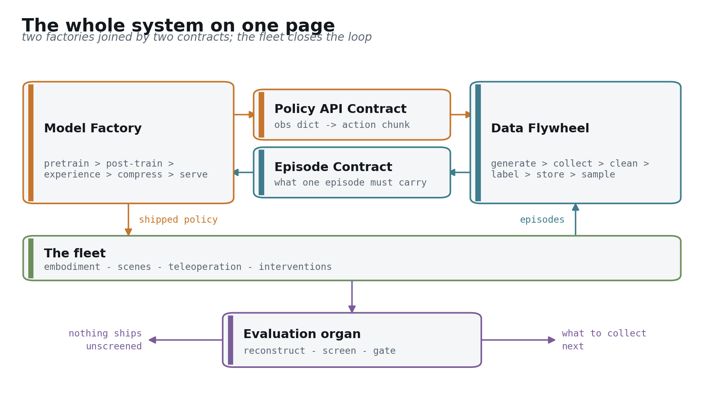
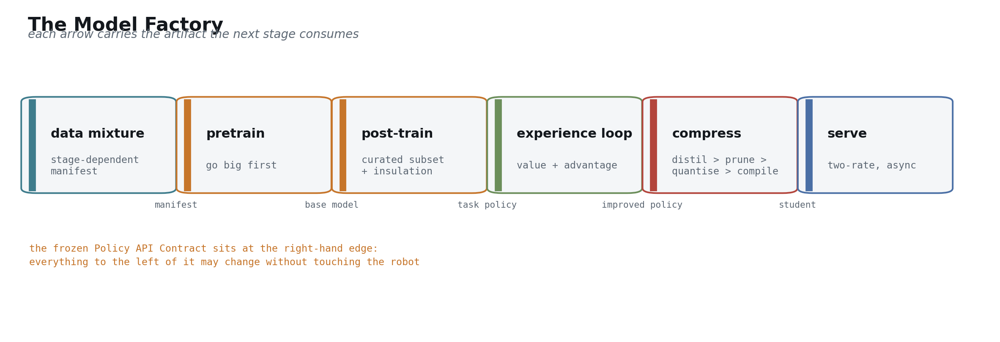
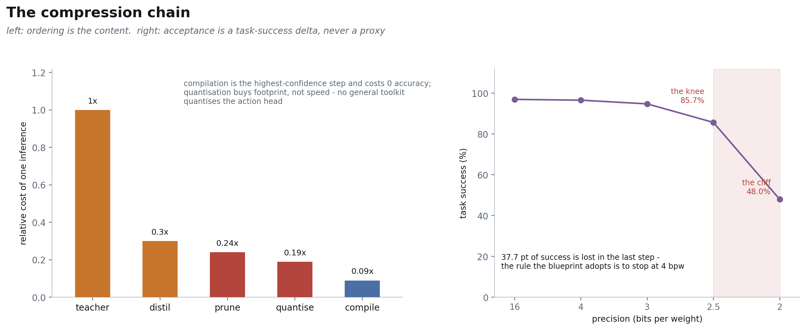
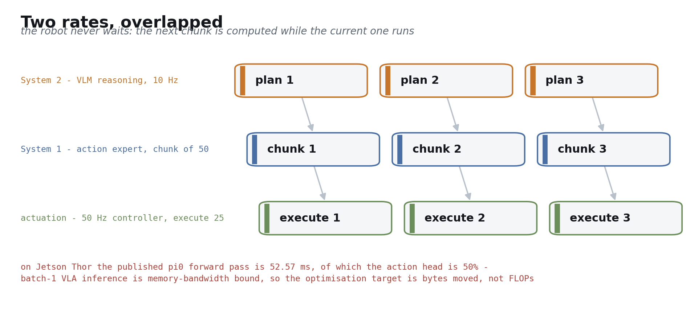
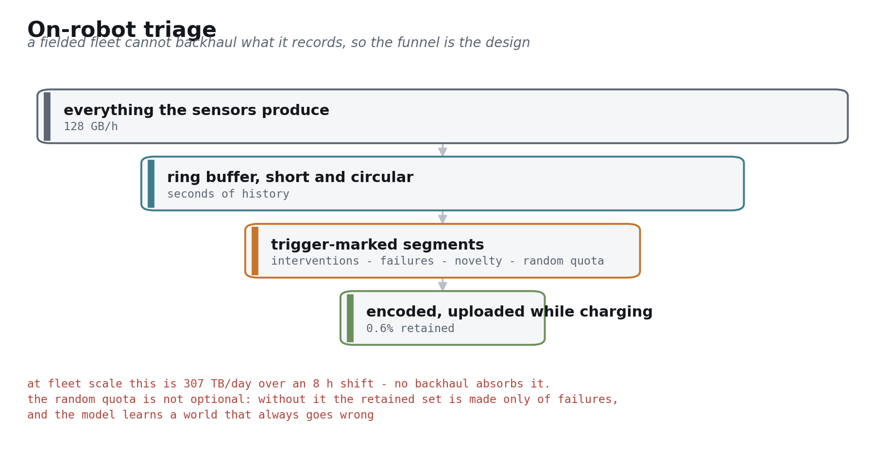
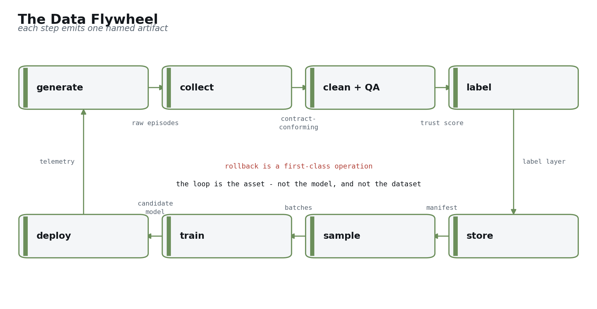
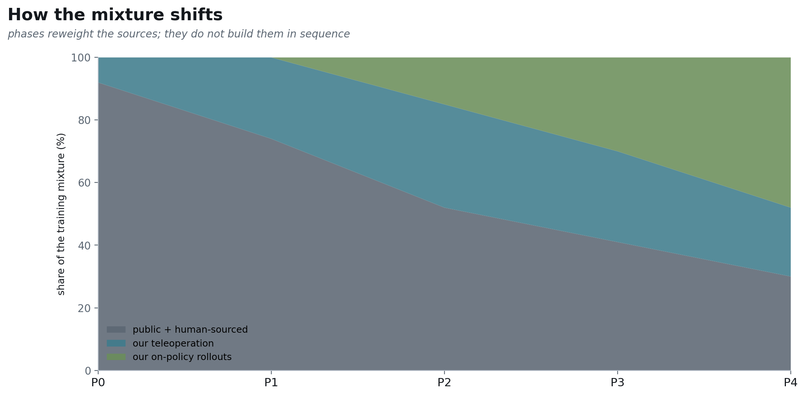

## The question this blueprint answers

Suppose a partner has already built the harder half: the robot is in production, it is deployed in real venues, and it ships with VR teleoperation. The remaining half is a robot foundation model (RFM) and the data system that feeds it. This document answers one question — what exactly that half consists of, in what order it gets built, and what evidence closes each step [[arXiv:2511.19647]](https://arxiv.org/abs/2511.19647).

It is not a survey and not a paper digest. Where a proven recipe exists it gets copied; original work is reserved for the places that cannot be avoided. Every number traces to one row in `FACTS.md` and to that row's source [computed: this document's citation convention].

## How to read this

Part 0 is the whole system on one page. Part 1 is the two contracts. Together those two parts are the complete blueprint, and everything else zooms into them [computed: document structure convention].

Ten minutes gets you those two parts. An engineering assessment continues into Part 2 and Part 3. A read focused on how risk gets retired can jump straight to Part 5

---

# Part 0 — The whole system on one page

The system is two factories. The **Model Factory** turns data into a policy that runs on a robot: pretrain → post-train → experience loop → compress → serve. The **Data Flywheel** turns robot operation into trainable data: generate → collect → clean → label → store → sample [[arXiv:2511.19647]](https://arxiv.org/abs/2511.19647).

Only two channels connect them. The Model Factory delivers a model conforming to the **Policy API Contract**; the Data Flywheel delivers episodes conforming to the **Episode Contract**. Beyond those, neither knows the other's internals — which is precisely what lets two teams advance them independently [[arXiv:2604.15483 §3]](https://arxiv.org/abs/2604.15483).

The fleet closes the loop. Robots take a policy and do work, the work produces episodes, the episodes train a better policy. That loop is the asset, and it matters more than any single delivery inside it [[arXiv:2511.19647]](https://arxiv.org/abs/2511.19647).

The organ in the middle is **evaluation**. It gates in both directions: no unscreened model reaches a robot, and its failure analysis determines what the next collection round targets. It sits between the factories rather than inside one because it belongs to both [[blog: World Labs real-to-sim-to-real]](https://www.worldlabs.ai/blog/real-to-sim-to-real).

Two platform numbers press on every design decision from the start: a 0.7 kWh battery and roughly 2 h of endurance [[blog: carnewschina 2026-04-13]](https://carnewschina.com/2026/04/13/chery-begins-online-sales-of-humanoid-robot-with-a-0-7-kwh-battery-at-41400-usd/). Every additional watt of inference is operating time the robot loses. And a single machine produces 128 GB/h of raw sensor data [computed: 35.665 MB/s × 3600], which no backhaul link can absorb. Both constraints reappear throughout Part 2 and Part 3.

---

---

# Part 1 — The two contracts

These two interfaces come before both factories because every later decision derives from them. A reader who stops after Part 0 and this part already has the blueprint [computed: document structure convention].

## The Episode Contract

A trainable episode must carry: hardware-synchronised multi-camera frames, joint states **and commanded torques**, tactile channels, language annotation, teleoperator intent and takeover flags, the task outcome, and a hardware clock with bounded skew [[arXiv:2604.15483 §3]](https://arxiv.org/abs/2604.15483).

The binding convention: **this contract is enforced on the robot, not at ingest**. All ingest can do is reject, and a rejected episode is already gone for good [[blog: Trossen robotic data pipeline]](https://www.trossenrobotics.com/post/robotic-data-pipeline-sensor-streams-to-training-datasets).

Commanded torque is called out separately because it is the field most often dropped. Joint states alone let you train a policy that reproduces trajectories but not one that understands contact — and contact is the hard part of manipulation [[arXiv:2604.15483 §3]](https://arxiv.org/abs/2604.15483). Takeover flags work the same way: the moment an operator intervenes is itself a free negative label, used repeatedly by the experience loop in Part 2 [[arXiv:2511.19647]](https://arxiv.org/abs/2511.19647).

## The Policy API Contract

Input is an observation dict: several image streams, robot state, a language prompt. Output is an action chunk of shape H × DoF, plus a scalar value estimate [[arXiv:2506.07339]](https://arxiv.org/abs/2506.07339).

The reference values are H = 50 with an execution horizon of 25, which on a 50 Hz controller is a 1.0 s block of actions [[arXiv:2506.07339]](https://arxiv.org/abs/2506.07339). These come from published, measured systems, and this blueprint adopts them rather than reinventing them.

The binding convention: **this contract is frozen**. Once frozen, the model can be replaced wholesale without touching the robot, and the robot can change generation without retraining the backbone — the latter through an embodiment adapter [[arXiv:2602.18397]](https://arxiv.org/abs/2602.18397).

The extra value output deserves a sentence. It does nothing during behaviour cloning, but it is the precondition for the experience loop in Part 2. Writing it into the frozen interface now means that turning on experience learning later requires no change to any robot-side code [[arXiv:2511.19647]](https://arxiv.org/abs/2511.19647).

---

# Part 2 — The Model Factory

This part walks the pipeline once. Each stage states three things only: what it is responsible for, what its interface is, and where its information increment lies [computed: this document's module convention].

## 3.1 Data composition

In: the various corpora. Out: a mixture manifest. The increment is one sentence: **the mixture is a function of training stage, not a dataset** [[arXiv:2511.19647]](https://arxiv.org/abs/2511.19647).

The same corpus carries completely different weight in pretrain, post-train and the experience loop, and the weights drift as the fleet grows [[arXiv:2511.19647]](https://arxiv.org/abs/2511.19647). Freezing it into "our dataset" hard-codes a time-varying object as a constant.

A manifest is a source-by-stage weight table rather than a file list [[arXiv:2511.19647]](https://arxiv.org/abs/2511.19647):

| Source | pretrain | post-train | experience loop |
|---|---|---|---|
| web image-text and human video | primary | unused | unused |
| egocentric wearables | primary | light | unused |
| portable handheld rigs | contributing | contributing | unused |
| public cross-embodiment robot data | primary (after normalisation) | light | unused |
| our teleoperation | light | primary | as anchor |
| our on-policy rollouts | unused | unused | primary |
| reconstructed scenes | unused | contributing | evaluation, failure search |

Part 3's data map explains why the table has this shape; Part 5 gives the numeric weights across the five phases [computed: see f04 and f13].

## 3.2 Architecture and the frozen API

In: the observation dict. Out: an action chunk plus a value [[arXiv:2506.07339]](https://arxiv.org/abs/2506.07339). Internally it is two rates — a slow path for semantics and reasoning, a fast path for action generation.

The reference shape follows GR00T N1.7: an open VLM backbone plus a separately designed DiT action head, disclosed at 538M parameters across 16 layers [[arXiv:2607.15275]](https://arxiv.org/abs/2607.15275). That is also this blueprint's chosen starting point — **adopt an open VLM, build the action stack ourselves**. The reasoning is in section 3.3.

One cheap addition belongs here: **implicit world modeling as an auxiliary objective**. The policy aligns its features with latent embeddings of future observations while generating actions, which costs only a few extra tokens on a standard VLA [[arXiv:2505.15659]](https://arxiv.org/abs/2505.15659). It delivers up to 26% on multitask simulation benchmarks, but its more important property for this blueprint is different: **it lets first-person human video with no action labels participate in co-training** [[arXiv:2505.15659]](https://arxiv.org/abs/2505.15659). Part 3's data map uses that channel directly.

## 3.3 Pretrain — go big first, deliberately

This argument has to hold, because it is counterintuitive for a product whose selling point is the edge: **you do not train the small model you intend to ship** [[arXiv:2606.05737]](https://arxiv.org/abs/2606.05737).

Capability appears at scale and is then preserved through distillation; the same small architecture trained from scratch does not reach the same place [[arXiv:2606.05737]](https://arxiv.org/abs/2606.05737). Models that actually ship on edge products land in the 450M to 690M range [computed: SmolVLA lower bound, RoboTTT upper bound], but their capability comes from a larger teacher rather than from piling data onto that size directly.

That needs a measurable target, or "edge" stays an adjective. This blueprint uses **intelligence density**: task success per parameter per watt [computed: a combination of three disclosed quantities]. It links the work in sections 3.6 and 3.7 to the 700 Wh battery from Part 0 as a single chain of constraint [computed: 0.7 kWh × 1000].

One admission: **no published work gives a teacher/student size pairing for a robot foundation model** [computed: no disclosed pairing found]. That number gets set by P1 itself, and it sits in the Part 6 gap ledger.

Two other starting points were rejected; the reasoning and the conditions that would reverse it belong here [[arXiv:2607.15275]](https://arxiv.org/abs/2607.15275).

**Forking an open VLA and specialising it** is the fastest route to a first demo, at the cost of inheriting someone else's Episode Contract — which, per Part 1, determines hardware specification [[arXiv:2604.15483 §3]](https://arxiv.org/abs/2604.15483). Inheriting it lets another team's sensor assumptions constrain our board revisions in reverse. It remains worth building as a P0 control, but not as the main line.

**Pretraining the VLM from scratch as well** buys the most complete IP narrative and spends early capital on a repeatedly-solved problem [[blog: HuggingFace SmolVLA]](https://huggingface.co/blog/smolvla). The trigger is specific: revisit when an open VLM's licensing terms or semantic capability becomes the bottleneck on edge success rate. Until then the same money returns more in the action stack and the compression chain.

## 3.4 Post-train

In: a curated high-quality subset. Out: a usable task policy. Three things — task conditioning, knowledge insulation so action training does not corrode the VLM's semantics, and sim/real co-training [[arXiv:2505.15659]](https://arxiv.org/abs/2505.15659).

This section is short because it inherits almost everything from sections 3.1 and 3.2. The number worth keeping is the per-task data floor: a well-pretrained model fine-tunes to usable from 50 to 100 demonstrations [[blog: DeepMind on-device]](https://deepmind.google/blog/gemini-robotics-on-device-brings-ai-to-local-robotic-devices/). That lands in the same band as the 50 to 200 demonstrations per task reported on the collection side [[blog: dexset teleoperation guide]](https://dexset.ai/blogs/teleoperation-data-collection-robot-learning-complete-2026/) — two independent evidence chains agreeing, which is what makes the floor credible.

## 3.5 The experience loop

In: fleet episodes carrying takeover flags and outcomes. Out: a better policy [[arXiv:2511.19647]](https://arxiv.org/abs/2511.19647). A value function is learned from heterogeneous experience, then the policy is trained conditioned on advantage.

The increment is where the signal comes from: **the moment an operator takes over is the cheapest available reward signal**. It costs nothing to annotate, requires no reward engineering, and it arrives already on the real distribution [[arXiv:2511.19647]](https://arxiv.org/abs/2511.19647). Writing takeover flags into the Episode Contract back in Part 1 is what lets this channel switch on at P2 without touching hardware.

Its limits deserve the same clarity. The experience loop improves quality inside the envelope the policy already attempts; it does not expand that envelope [[arXiv:2511.19647]](https://arxiv.org/abs/2511.19647). New behaviours, venues and objects still have to come from the human-sourced corpora in Part 3. Getting this backwards is the most common over-promise in roadmaps of this kind.

One unknown: **there is no published curve from takeover rate to measurable improvement** [computed: no disclosed conversion curve found]. It determines how large a fleet P2 needs to close the loop, and it is in Part 6.

## 3.6 The compression chain

In: the large teacher. Out: the shipped student. This section is the ordering, and the ordering is set by measurement rather than by convention [[arXiv:2602.18397]](https://arxiv.org/abs/2602.18397).

Ranked by measured end-to-end gain: compilation (TensorRT / torch.compile) returns 1.5 to 3.34× at exactly 0 accuracy cost [[arXiv:2602.18397]](https://arxiv.org/abs/2602.18397); few-step distillation from 10 steps to 1 returns 3.3× and *improves* accuracy [[arXiv:2606.05737]](https://arxiv.org/abs/2606.05737); a runtime plus async stack returns 8.66× on Jetson Orin [[arXiv:2607.12659]](https://arxiv.org/abs/2607.12659); visual-token pruning returns 1.83× against a ceiling of 2.0× [[arXiv:2607.09520]](https://arxiv.org/abs/2607.09520); PTQ quantisation alone returns 1.47 to 1.52× [[arXiv:2605.24011]](https://arxiv.org/abs/2605.24011).

Two conclusions go straight into the engineering plan. First, **compile the graph in week one**: zero accuracy risk, certain return [[arXiv:2602.18397]](https://arxiv.org/abs/2602.18397). Second, **quantisation buys memory, not speed** — general-purpose toolchains quantise only the language backbone, while the edge bottleneck is the action head [[arXiv:2605.24011]](https://arxiv.org/abs/2605.24011).

Acceptance is a task-success delta, never a proxy metric. The cliff is public: 4 bpw is nearly free at 96.6%, 3 bpw gives 94.8%, 2.5 bpw is the knee at 85.7%, and 2 bpw collapses to 48.0% [[arXiv:2605.24011]](https://arxiv.org/abs/2605.24011). The final step alone costs 37.7 pt [computed: 85.7 − 48.0], so the rule this blueprint adopts is **stop at 4 bpw**.

One piece of real-silicon evidence contradicting the benchmark literature is worth recording separately: a custom SoC ships W8A16 and states explicitly that W8A8 degrades success rate [[arXiv:2606.07383]](https://arxiv.org/abs/2606.07383). Simulation benchmarks and custom silicon disagree here, and the blueprint trusts the silicon.

It should also be said plainly here: this section and section 3.7 rest on a thinner and more vendor-adjacent evidence base than the sections before them [[repo: FlashRT]](https://github.com/flashrt-project/FlashRT). That is not a defect. It is the thing Part 5 builds on — P3 is exactly where this roadmap stops copying.

## 3.7 The serving system

In: the compressed student plus an SoC. Out: a latency and power budget the robot can live inside [[arXiv:2602.18397]](https://arxiv.org/abs/2602.18397).

The real specification is the two-rate structure: the policy runs at 5 to 30 Hz over a 50 Hz to 1 kHz low-level controller, bridged by action chunks [[arXiv:2604.24447]](https://arxiv.org/abs/2604.24447). NVIDIA's own stated principle is that roughly 10 Hz of inference sustains 30 FPS of execution [[spec: NVIDIA Jetson]](https://www.nvidia.com/en-us/autonomous-machines/embedded-systems/).

Latency tolerance is a structural condition rather than a millisecond threshold. As long as inference delay stays under the horizon minus the execution horizon, an action is always available [[arXiv:2506.07339]](https://arxiv.org/abs/2506.07339); π0.7's corresponding disclosed figure is 240 ms on a 50 Hz robot [[arXiv:2604.15483]](https://arxiv.org/abs/2604.15483). Asynchronous execution therefore exists to stop the robot waiting, not to make any single forward pass faster.

The hardware-aware core is one sentence: **batch-1 VLA inference is memory-bandwidth bound, so the optimisation target is bytes moved, not FLOPs** [[arXiv:2602.18397]](https://arxiv.org/abs/2602.18397). One table settles it — the same π0 forward pass on Jetson Thor spends 6.06 ms on vision, 20.30 ms on the VLM and 26.20 ms on the action head, for 52.57 ms end to end. The action head is 50% of edge latency, against 23% of the same pass on an RTX 4090 [[arXiv:2602.18397]](https://arxiv.org/abs/2602.18397). The largest term on edge silicon is precisely the term general-purpose quantisation does not touch.

The best published on-device result comes from hand-written kernels: π0.5 at 44.0 ms and 23 Hz on Jetson AGX Thor, and 39.78 ms for three views under NVFP4 [[repo: FlashRT]](https://github.com/flashrt-project/FlashRT). That exceeds the analytical roofline of 19.0 Hz [[arXiv:2602.18397]](https://arxiv.org/abs/2602.18397), meaning the analytical model is itself conservative. Two teams independently abandoned compilers for hand-written kernels and both won — the strongest available argument that P3 is worth original investment.

Finally, power connects back to the battery. The only citable on-device figure for a comparable stack is 40 W on AGX Orin [[arXiv:2604.24447]](https://arxiv.org/abs/2604.24447); different silicon, so it is an order-of-magnitude reference only. **Our own power target is undisclosed** and gets fixed by P3 measurement [computed: no comparable disclosed figure].

## 3.8 Test-time adaptation and context scaling

The last section covers something easy to get wrong. Intuitively, test-time compute and an edge budget are in conflict: the extra inference compute is paid for out of the battery [[arXiv:2604.24447]](https://arxiv.org/abs/2604.24447).

Measurement contradicts the intuition. Scaling visuomotor context to 8K timesteps — three orders of magnitude beyond current policies — **does not increase inference latency** [[arXiv:2607.15275]](https://arxiv.org/abs/2607.15275). The cost lands on parameters instead: TTT layers of roughly 10M parameters each, across 16 DiT layers, take the action head from 538M to 690M, a 28% increase [computed: (690−538)/538].

For the edge that is exactly the trade you want: parameters are a one-time memory cost, latency is paid every step. The returns are substantial — 87% over a single-step-context baseline, a further 62% for 8K context over 1K pretraining, and completion of a 5 min, 10-stage assembly task that no baseline finishes [[arXiv:2607.15275]](https://arxiv.org/abs/2607.15275).

So this blueprint places context scaling at P4 rather than deferring it indefinitely, and classifies it as a "pay in parameters, save on latency" optimisation [[arXiv:2607.15275]](https://arxiv.org/abs/2607.15275).

---

# Part 3 — The Data Flywheel

## 4.1 The data map: two axes, and operations as vectors across it

First, why this is not a list of sources. Listing teleoperation, human video, simulation and public datasets looks tidy, but it collapses three unrelated things onto one axis: where the data came from, what we did to it, and who produced it when [[arXiv:2511.19647]](https://arxiv.org/abs/2511.19647). What actually determines a corpus's use is the following two properties.

**The first axis is action grounding**: whether the data contains actions in *our* robot's action space. It runs from none, through human hand, gripper proxy and cross-embodiment robot, to our own embodiment [[arXiv:2602.18397]](https://arxiv.org/abs/2602.18397). It determines **which part of the model a corpus can train**.

**The second axis is policy relatedness**: whether the data is human-generated and off-policy, or produced by the current policy itself and on-policy [[arXiv:2511.19647]](https://arxiv.org/abs/2511.19647). It determines **whether the corpus can support value learning** or only behaviour cloning.

Reality — real, reconstructed, simulated, generated — is not a third axis but a marker on each point. It modulates trust rather than eligibility [[blog: World Labs real-to-sim-to-real]](https://www.worldlabs.ai/blog/real-to-sim-to-real).

| Region | Example corpora | Can train | Cannot train |
|---|---|---|---|
| no grounding, off-policy | web image-text, human video | representation, semantics, task structure | anything in the action space |
| human-hand grounding | egocentric wearables | motion priors, affordances | contact force, our kinematics |
| gripper-proxy grounding | portable handheld rigs | action pretraining via adapter | our full DoF, whole body |
| cross-embodiment robot | public robot datasets | action pretraining after normalisation | what is specific to our embodiment |
| our embodiment, off-policy | our teleoperation | post-training, behaviour cloning | value functions, advantage |
| our embodiment, on-policy | our rollouts and takeovers | value learning, the experience loop | behaviour outside the current envelope |

**Operations are vectors on this map.** Each moves data from a cheap region toward an expensive one, at a stated cost and with a stated distortion [[arXiv:2511.19647]](https://arxiv.org/abs/2511.19647):

- **Extracting signal from indirect corpora** — filtering and annotating enormous non-robot corpora down to usable semantics, affordances and task structure. Its distortion: it cannot manufacture the channels it never observed — no torque, no contact, no actions in our action space [[arXiv:2505.15659]](https://arxiv.org/abs/2505.15659). The auxiliary objective in section 3.2 is the mechanism that makes this vector real.
- **Reconstruct-and-resample** — turning a one-time real observation into a generator that can be sampled without limit. Its value is not visual fidelity but **rank fidelity**: whether the ordering it assigns to policies matches the ordering reality assigns [[blog: World Labs real-to-sim-to-real]](https://www.worldlabs.ai/blog/real-to-sim-to-real). This vector carries its own validation obligation, which is what Part 4 is about.
- **Sim co-training and world-model rollout synthesis** — moving mass toward the on-policy side without spending robot time. Distortion: the dynamics gap [[arXiv:2602.15922]](https://arxiv.org/abs/2602.15922).
- **Embodiment adapters and action normalisation** — moving mass up the grounding axis. The cheapest vector on the map, and the entire reason public cross-embodiment data has value at all [[arXiv:2602.18397]](https://arxiv.org/abs/2602.18397).

Everything Part 3 does reduces to one sentence: **move probability mass into the region the current training stage requires, at the lowest cost per unit of useful signal** [[arXiv:2511.19647]](https://arxiv.org/abs/2511.19647).

One boundary is fixed: **action-grounded real data on our own embodiment is a necessity, and no operation on this map manufactures it** [[arXiv:2604.15483 §3]](https://arxiv.org/abs/2604.15483). Every vector eventually needs it as an anchor, and Part 4's rank-fidelity validation is impossible without it.

Projecting those regions onto the Model Factory's pipeline gives this figure, the most practical one in the blueprint. Image-text and human video feed pretrain representation; wearables feed motion priors and scene breadth; handheld rigs feed manipulation priors near the action space; public robot data feeds action pretraining after normalisation; our teleoperation feeds post-train action grounding; our rollouts and takeovers feed the experience loop's on-policy distribution and value; reconstructed scenes feed evaluation [[arXiv:2511.19647]](https://arxiv.org/abs/2511.19647).

## 4.2 Collection

In: a running robot. Out: contract-conforming episodes at the ingest boundary [[arXiv:2604.15483 §3]](https://arxiv.org/abs/2604.15483). This is where the wrong answer is easiest to give, because the intuitive one fails on arithmetic.

A single humanoid produces 35.665 MB/s of unfiltered sensor data, reduced to 0.213 MB/s under online compression, a 99.4% reduction [[blog: Trossen robotic data pipeline]](https://www.trossenrobotics.com/post/robotic-data-pipeline-sensor-streams-to-training-datasets). That is 128 GB/h [computed: 35.665 MB/s × 3600], about 3 TB/day per machine [computed: 128 GB/h × 24 h], and across a 300-robot fleet on an 8 h shift, 307 TB/day [computed: 128 GB/h × 8 h × 300]. No backhaul link absorbs that.

Triage therefore happens on the robot, in four layers: everything lands in a short ring buffer; only trigger-marked segments persist; persisted segments are encoded on-device; upload happens opportunistically while charging [[blog: Trossen robotic data pipeline]](https://www.trossenrobotics.com/post/robotic-data-pipeline-sensor-streams-to-training-datasets). Triggers are of four kinds — takeover, failure, novelty above threshold, and a random quota.

That random quota is not optional. **Without it the retained set consists entirely of failures, and the model learns a world that always goes wrong** [[arXiv:2511.19647]](https://arxiv.org/abs/2511.19647). It is the one counterintuitive element of the triage design, and the one most likely to be cut during implementation.

The Episode Contract is enforced at this layer for the reason given in Part 1: ingest can reject but cannot repair [[arXiv:2604.15483 §3]](https://arxiv.org/abs/2604.15483).

On data rights: a fleet working in retail and showroom venues records bystanders who have nothing to do with the task. On-robot face and audio handling, retention windows, and venue-owner consent are engineering requirements with schedule impact rather than a legal appendix. The reference practice is to treat person filtering, viewpoint characterisation, quality control and privacy review as first-class design goals inside the collection pipeline [computed: published curation practice for large human-video corpora].

## 4.3 Cleaning and QA

In: raw episodes. Out: episodes with a trust score. Validators cover clock skew, dropped frames, out-of-range joints and action/state disagreement, alongside a named failure taxonomy and near-duplicate detection [[blog: Trossen robotic data pipeline]](https://www.trossenrobotics.com/post/robotic-data-pipeline-sensor-streams-to-training-datasets).

There is one rule: **score, never delete**. Deletion is an irreversible decision taken with incomplete information — the segment judged noise today may be next year's only example of a failure mode [[arXiv:2511.19647]](https://arxiv.org/abs/2511.19647). Storage is cheap; re-recording is impossible.

A public ratio worth keeping for calibration: one large real-home humanoid dataset is 500 h, 23000 episodes and 10 TB raw [[blog: Humanoids Daily HIW-500]](https://www.humanoidsdaily.com/news/bitrobot-and-hugging-face-drop-hiw-500-a-massive-10tb-real-home-humanoid-dataset), about 20 GB per recorded hour [computed: 10 TB ÷ 500 h] — the same order as the compressed rate, and two orders below the uncompressed one.

## 4.4 Labeling

In: scored episodes. Out: a label layer — VLM auto-annotation with human spot-checks, subtask segmentation, success and reward labels [[arXiv:2511.19647]](https://arxiv.org/abs/2511.19647).

The increment is structural: **labels are a mutable layer attached to immutable episodes**. Relabeling under a new task taxonomy costs only compute and invalidates no raw data [[arXiv:2511.19647]](https://arxiv.org/abs/2511.19647). Writing labels back into the episodes themselves turns every taxonomy upgrade into a data migration project.

## 4.5 Storage and versioning

In: episodes plus labels. Out: a **manifest** — a list of episode IDs, a label version, and mixture weights [[arXiv:2511.19647]](https://arxiv.org/abs/2511.19647). The episode store is content-addressed and immutable.

Every model version pins a manifest. That is the technical precondition for reproducibility, and it is what makes the accumulated data an auditable asset rather than a directory of files: in engineering terms the asset *is* this manifest scheme plus immutable storage [[arXiv:2511.19647]](https://arxiv.org/abs/2511.19647).

## 4.6 Sampling and loading

In: a manifest. Out: batches fast enough to keep the GPUs fed. The mixture weights from section 3.1 are realised here as a sampler [[arXiv:2511.19647]](https://arxiv.org/abs/2511.19647).

One engineering fact is almost always skipped: **what starves large robot-learning runs is video decode, not compute** [[blog: Trossen robotic data pipeline]](https://www.trossenrobotics.com/post/robotic-data-pipeline-sensor-streams-to-training-datasets). Loader design and latent pre-caching therefore belong in the blueprint rather than a footnote. At roughly 20 GB per recorded hour [computed: 10 TB ÷ 500 h], decode throughput becomes the binding constraint before memory or FLOPs do.

## 4.7 Closing the loop

In: a candidate model. Out: a fielded policy and the telemetry it produces. The chain is evaluation gate → model registry → canary then staged OTA → shadow-mode comparison → telemetry back into section 4.1 [[arXiv:2511.19647]](https://arxiv.org/abs/2511.19647).

**Rollback is a first-class operation**, equal in standing to release. A fleet that cannot withdraw a policy within minutes will not run canaries; without canaries, release decisions rest on offline metrics, and Part 4 explains why offline metrics cannot carry that decision [[blog: World Labs real-to-sim-to-real]](https://www.worldlabs.ai/blog/real-to-sim-to-real).

The telemetry return edge determines what the next round collects. If that edge breaks, the flywheel degrades into a one-way pipeline — data still accumulates, but what accumulates is more of what the model already does [[arXiv:2511.19647]](https://arxiv.org/abs/2511.19647).

---

# Part 4 — Evaluation, the organ between the factories

This part has a single argument, and it governs whether anything else can proceed: **real-robot trials do not have the statistical power to gate anything** [computed: two-proportion test].

Separating a 50% success rate from 60% takes roughly 387 trials by a two-proportion test [computed: two-proportion test]. Published work allocates 100 real trials per checkpoint [[blog: World Labs real-to-sim-to-real]](https://www.worldlabs.ai/blog/real-to-sim-to-real). On real-robot evidence alone you cannot establish even a 10-point improvement, let alone a 3-point one.

Simulation screening therefore stops being an economy and becomes a necessity. The structure is three stages: reconstruct each deployment venue once; run 2000 simulated trials per checkpoint in the reconstruction; spend the 100 real trials only on checkpoints that survive [[blog: World Labs real-to-sim-to-real]](https://www.worldlabs.ai/blog/real-to-sim-to-real). The simulated-to-real trial ratio is 20× [computed: 2000 ÷ 100].

The same source reports three stronger claims: policies trained with no real data at all transferred to 5 platforms; a policy ran autonomously for 1 h without intervention; and simulation **preserved the ordering of policies**, tracked training progress, and matched the spatial pattern of successes and failures [[blog: World Labs real-to-sim-to-real]](https://www.worldlabs.ai/blog/real-to-sim-to-real).

This must be labelled precisely: it is a company blog post, with no paper and no independent reproduction [[blog: World Labs real-to-sim-to-real]](https://www.worldlabs.ai/blog/real-to-sim-to-real). So this blueprint does **not assume** rank preservation. It measures it at P1, on our own venues.

Which gives the organ its own metric: **rank fidelity**, the correlation between the ordering simulation assigns and the ordering hardware assigns. It must be measured continuously rather than assumed [[blog: World Labs real-to-sim-to-real]](https://www.worldlabs.ai/blog/real-to-sim-to-real). This blueprint takes 0.80 as the floor for screening use [computed: Spearman floor for screening use].

The reasoning is direct: a generator that looks beautiful but scrambles the ordering is worse than no generator, because it will promote the wrong checkpoint with high confidence [[blog: World Labs real-to-sim-to-real]](https://www.worldlabs.ai/blog/real-to-sim-to-real). The evaluation organ has to earn trust before it receives any.

If P1 measures a correlation below that floor, the roadmap does not stop — it switches to a more expensive channel. Simulation degrades into a failure-search tool that finds the conditions under which a policy breaks, ordering stays with hardware, and per-checkpoint evaluation time is re-estimated at the 387-trial scale [computed: two-proportion test]. This fallback is written down here because it determines P2's cadence, and planning for it beats discovering it when P1 ends.

---

# Part 5 — The roadmap

Five phases, **ordered rather than scheduled**. Each is defined by the risk it retires and ended by an objective gate [[arXiv:2511.19647]](https://arxiv.org/abs/2511.19647). What that commits to is a sequence and a standard of evidence, rather than a calendar that has to be defended repeatedly.

Two ordering choices are contestable, so they are stated outright

**Evaluation is built before the model.** P0 delivers an instrument and no capability demonstration, which is an uncomfortable way to open a proposal. It is still correct: every later gate is expressed in evaluation's units, and a flywheel that cannot measure whether it is turning is externally indistinguishable from one that is not [[blog: World Labs real-to-sim-to-real]](https://www.worldlabs.ai/blog/real-to-sim-to-real). Putting it first turns the hardest constraint on this path into the first risk retired rather than the last surprise discovered.

**The edge comes after the flywheel closes.** Compressing a model that still changes weekly means redoing the whole compression chain and re-measuring the accuracy delta each time [[arXiv:2605.24011]](https://arxiv.org/abs/2605.24011). P1 and P2 therefore run explicitly on off-board or on-premise compute, and that interim arrangement is stated in the open rather than hidden. The counterargument is commercial — on-board autonomy is the most convincing demonstration — so what is offered here is a trade rather than a verdict: if demonstration value outweighs the engineering rework, P3 can move earlier, at the cost of one or two extra passes through the compression chain.

One more thing belongs up front: **P0 through P2 copy recipes that are already published and reproduced**, where originality buys nothing and costs schedule [[arXiv:2604.15483 §3]](https://arxiv.org/abs/2604.15483). **P3 is where this roadmap stops copying** — its evidence base is thinner and closer to vendor self-report, and for exactly that reason it is the stretch where original work is genuinely unavoidable [[repo: FlashRT]](https://github.com/flashrt-project/FlashRT).

Finally, the question Part 3 left open: if the data map is not a build order, what actually changes between phases? The weights. Public and human-sourced corpora fall from 92 at P0 to 30 at P4; our teleoperation rises from 8 to a peak of 33 at P2 before falling back to 22; on-policy rollouts climb from 0 to 48 [computed: the mix of sources available at each phase].

The third curve is the important one. It starts at zero, appears only when the flywheel closes at P2, and ends as the largest single block — **the only data source on this path whose cost scales with compute and fleet size rather than with the number of operators** [[arXiv:2511.19647]](https://arxiv.org/abs/2511.19647). P4's gate is written as "self-improvement without proportional operator growth" precisely to describe that curve.

Keep the boundary from section 3.5 in view at the same time: on-policy data improves quality inside the existing envelope and cannot expand it [[arXiv:2511.19647]](https://arxiv.org/abs/2511.19647). So the first two curves still account for more than half the mixture at P4. Their role shifts from bulk supply to novelty injection, but they never go to zero.

---

# Part 6 — What we do not know

A roadmap that names its own unknowns and attaches an experiment to each is more credible than one that is confident everywhere. All eight come straight from the gap group in `FACTS.md` [computed: the GAP group of this module's FACTS.md].

- **Teacher size.** No published work gives a teacher/student pairing for a robot foundation model [computed: no disclosed pairing found]. Fixed by P1's distillation ablation.
- **On-board power.** The only citable comparable figure is 40 W on different silicon [[arXiv:2604.24447]](https://arxiv.org/abs/2604.24447). Fixed by P3 measurement.
- **Rank fidelity in retail and showroom venues.** Published results cover tabletop manipulation [[blog: World Labs real-to-sim-to-real]](https://www.worldlabs.ai/blog/real-to-sim-to-real). Measured by P1 on our own venues.
- **Where our own compression cliff sits.** The published cliff belongs to a different model on a different benchmark [[arXiv:2605.24011]](https://arxiv.org/abs/2605.24011). Fixed by P3's precision sweep.
- **The conversion rate from takeovers to measurable improvement.** No published curve exists [computed: no disclosed conversion curve found]. Measured by P2 across versions, and it determines how large a fleet P2 needs.
- **Whether a fleet this size yields sufficient on-policy data.** No public data relates fleet size to improvement [computed: no disclosed relationship found]. A direct output of P2.
- **Policy transfer across venue types.** Unmeasured at fleet scale [computed: no disclosed measurement found]. P4's central question.
- **End-to-end photon-to-torque latency.** Every published latency decomposition omits this segment [[arXiv:2602.18397]](https://arxiv.org/abs/2602.18397). Instrumentation work in P3.

## Open bet: world action models

This blueprint bets on the VLA line. That is a choice, and it should be stated as a bet that can be overturned [[arXiv:2602.15922]](https://arxiv.org/abs/2602.15922).

The alternative is the world action model: learning physical dynamics on a pretrained video-diffusion backbone by predicting future world states and actions. Reported real-robot results show over 2× the generalisation of contemporary VLAs to new tasks and environments [[arXiv:2602.15922]](https://arxiv.org/abs/2602.15922). That number is hard to ignore.

The reason for declining the bet is the edge, not capability: the model is 14B parameters running closed-loop at 7 Hz [[arXiv:2602.15922]](https://arxiv.org/abs/2602.15922). That is an order of magnitude above what a 0.7 kWh humanoid can serve on board [[blog: carnewschina 2026-04-13]](https://carnewschina.com/2026/04/13/chery-begins-online-sales-of-humanoid-robot-with-a-0-7-kwh-battery-at-41400-usd/), and the rate is below what the two-rate architecture needs from its fast path [[arXiv:2604.24447]](https://arxiv.org/abs/2604.24447).

So the trigger is written concretely: **reassess the allocation when a world action model exists whose compressed form fits the on-board latency and power budget** [[arXiv:2602.15922]](https://arxiv.org/abs/2602.15922). That is falsifiable, and it depends on someone else's roadmap — which is what an open bet should look like.

---

## Bibliography

- *RoboTTT: Context Scaling for Robot Policies* — arXiv:2607.15275. https://arxiv.org/abs/2607.15275
- *FLARE: Robot Learning with Implicit World Modeling* — arXiv:2505.15659. https://arxiv.org/abs/2505.15659
- *World Action Models are Zero-shot Policies (DreamZero)* — arXiv:2602.15922. https://arxiv.org/abs/2602.15922
- *Real-Time Chunking (RTC)* — arXiv:2506.07339. https://arxiv.org/abs/2506.07339
- *π0.7 technical report* — arXiv:2604.15483. https://arxiv.org/abs/2604.15483
- *VLA-Perf* — arXiv:2602.18397. https://arxiv.org/abs/2602.18397
- *ActQuant* — arXiv:2605.24011. https://arxiv.org/abs/2605.24011
- *RhinoVLA* — arXiv:2606.07383. https://arxiv.org/abs/2606.07383
- *Jetson-PI* — arXiv:2607.12659. https://arxiv.org/abs/2607.12659
- *Let It Be Simple* — arXiv:2606.05737. https://arxiv.org/abs/2606.05737
- *Characterizing VLA Models across XPUs* — arXiv:2604.24447. https://arxiv.org/abs/2604.24447
- *Energy characterization of VLA inference* — arXiv:2607.09520. https://arxiv.org/abs/2607.09520
- *Robot-Powered Data Flywheels* — arXiv:2511.19647. https://arxiv.org/abs/2511.19647
- *Real-to-Sim-to-Real*, World Labs — https://www.worldlabs.ai/blog/real-to-sim-to-real
- *The Robotic Data Pipeline*, Trossen Robotics — https://www.trossenrobotics.com/post/robotic-data-pipeline-sensor-streams-to-training-datasets
- *Humanoids-in-the-Wild 500*, Humanoids Daily — https://www.humanoidsdaily.com/news/bitrobot-and-hugging-face-drop-hiw-500-a-massive-10tb-real-home-humanoid-dataset
- *Teleoperation Data Collection: 2026 Guide* — https://dexset.ai/blogs/teleoperation-data-collection-robot-learning-complete-2026/
- *Humanoid Robot Data Collection Costs*, DataX Power — https://www.dataxpower.com/blog/humanoid-robot-data-collection-cost
- *Gemini Robotics On-Device*, Google DeepMind — https://deepmind.google/blog/gemini-robotics-on-device-brings-ai-to-local-robotic-devices/
- *SmolVLA*, Hugging Face — https://huggingface.co/blog/smolvla
- *Chery begins online sales of humanoid robot*, CarNewsChina — https://carnewschina.com/2026/04/13/chery-begins-online-sales-of-humanoid-robot-with-a-0-7-kwh-battery-at-41400-usd/
- *FlashRT* — https://github.com/flashrt-project/FlashRT
- *Isaac-GR00T* — https://github.com/NVIDIA/Isaac-GR00T
