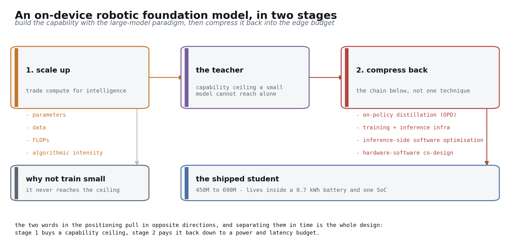
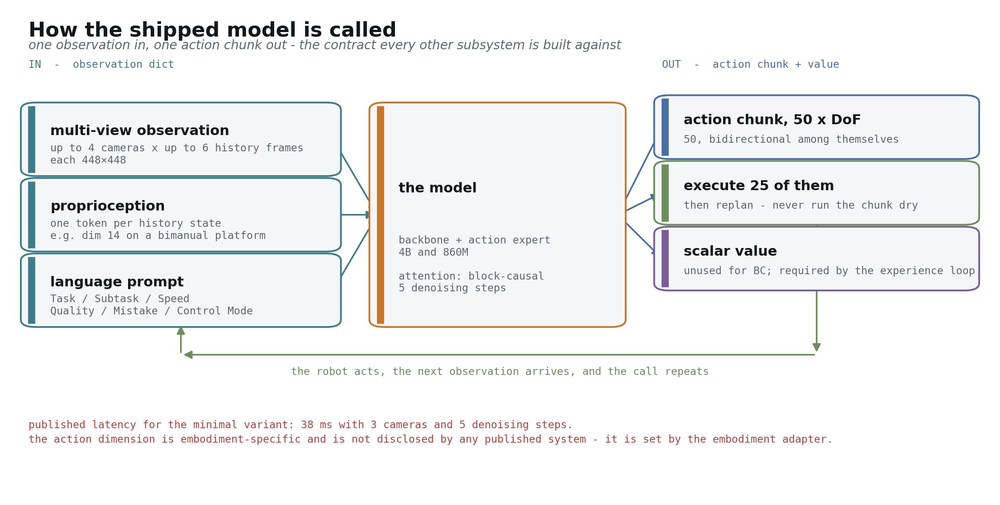
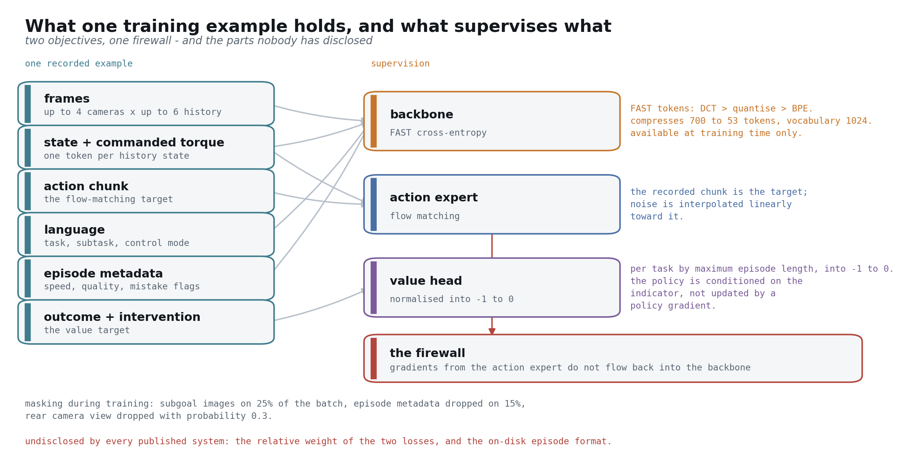
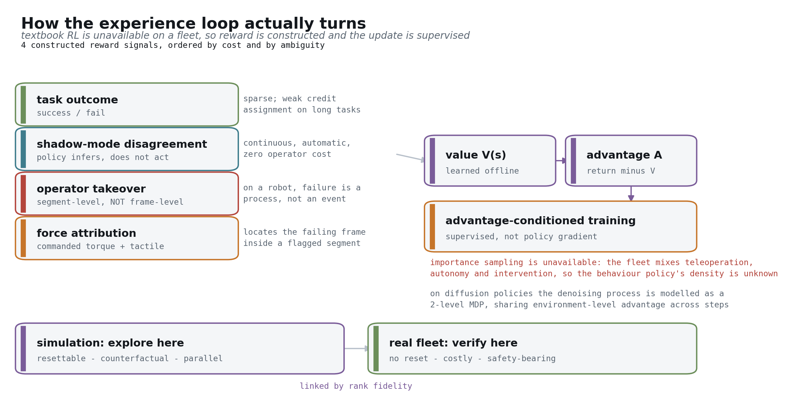

## What we would build together

You have already done the harder half: the robot is in production, deployed in real venues, running with VR teleoperation [[blog: carnewschina 2026-04-13]](https://carnewschina.com/2026/04/13/chery-begins-online-sales-of-humanoid-robot-with-a-0-7-kwh-battery-at-41400-usd/).

The other half is a robot foundation model and the data system that feeds it. What follows is that half — what gets built, in what order, and what evidence closes each step [[arXiv:2511.19647]](https://arxiv.org/abs/2511.19647).

**The positioning is fixed from day one: what we are building is an on-device robotic foundation model.** Both halves of that phrase are meant literally

*Foundation model* means the capability has to come out of the large-model paradigm — scaling parameters, data, FLOPs and algorithmic intensity together, trading compute for intelligence. There is no shortcut: the same small architecture trained directly never reaches where a large model lands after distillation [[arXiv:2606.05737]](https://arxiv.org/abs/2606.05737).

*On-device* means the shipped artifact has to live inside the budget of a 0.7 kWh battery and one SoC [[blog: carnewschina 2026-04-13]](https://carnewschina.com/2026/04/13/chery-begins-online-sales-of-humanoid-robot-with-a-0-7-kwh-battery-at-41400-usd/).

Those two look contradictory, and the resolution is to separate them in time: **build the intelligence with the large-model paradigm first, then compress it back down to the edge.** That second stage is not one technique but a chain — a compression and distillation stack built around on-policy distillation, training and inference infrastructure work, inference-side software optimisation, and hardware-software co-design [[arXiv:2604.00626]](https://arxiv.org/abs/2604.00626). The structure of this document follows that logic: Part 2 covers building it large, sections 2.6 and 2.7 cover compressing it back, and Part 6 covers how those two stages are ordered in time.

One rule runs through all of it: every number traces to a source, or to arithmetic on a source. Where it does not, we say we do not know yet rather than invent one [computed: this document's sourcing rule].

There is a third category worth naming: **working values (tentative)**. Model size bands, the compression success-delta budget, untethered duty cycle — these are given as concrete numbers so the design can be argued with and disagreed with, because engineering cannot start from a blank. They move as measurements arrive, and they are not commitments. Wherever a number is of this kind the text says so, and it should be read as "where we start, expect it to change" [computed: this document's sourcing rule].

---

# Part 0 — The whole system on one page

Start with this diagram. The six parts that follow are all zoom-ins on it

The system is two factories. The **Model Factory** turns data into a policy that runs on a robot: pretrain → post-train → experience loop → compress → serve. The **Data Flywheel** turns robot operation into trainable data: generate → collect → clean → label → store → sample [[arXiv:2511.19647]](https://arxiv.org/abs/2511.19647).

Only two channels connect them. One delivers a model conforming to the **Policy API Contract**, the other delivers episodes conforming to the **Episode Contract**. Beyond those, neither knows the other's internals — which is exactly what lets two teams advance them independently [[arXiv:2604.15483 §3]](https://arxiv.org/abs/2604.15483).

The fleet closes the loop. Robots take a policy and do work, the work produces episodes, the episodes train a better policy. What appreciates is the loop, not any single delivery inside it [[arXiv:2511.19647]](https://arxiv.org/abs/2511.19647).

This loop will not be unfamiliar to you. Fleet collection, cloud auto-labelling, large-scale training, simulation validation, OTA with A/B — the autonomous-driving data loop has already run this once [[arXiv:2511.19647]](https://arxiv.org/abs/2511.19647). So where our design agrees with what you already do, we move quickly. What deserves the time is the three places it does not transfer: data shifts from scale collection to compositional generalization (section 3.1), simulation shifts from looking real to *contacting* real (Part 4), and the failure signal shifts from a discrete event to a continuous process (Part 5).

The organ in the middle is **evaluation**. It gates both directions: nothing unscreened reaches a robot, and its failure analysis decides what the next round collects. We draw it between the factories because it belongs to both [[blog: World Labs real-to-sim-to-real]](https://www.worldlabs.ai/blog/real-to-sim-to-real).

Two numbers press on every design decision from day one: a 0.7 kWh battery and about 2 h of endurance [[blog: carnewschina 2026-04-13]](https://carnewschina.com/2026/04/13/chery-begins-online-sales-of-humanoid-robot-with-a-0-7-kwh-battery-at-41400-usd/). Every extra watt of inference is working time the robot loses. And a third: one machine emits 128 GB/h of raw sensor data, which no backhaul link can absorb [computed: 35.665 MB/s × 3600]. These constraints recur throughout.

---

# Part 1 — The two contracts

We put these two interfaces ahead of both factories because every later decision derives from them [[arXiv:2604.15483 §3]](https://arxiv.org/abs/2604.15483). Read this part and the diagram above, and you have the whole blueprint.

## The Episode Contract

A trainable episode must carry: hardware-synchronised multi-camera frames, joint states **and commanded torques**, tactile channels, language annotation, teleoperator intent and takeover flags, the task outcome, and a hardware clock with bounded skew [[arXiv:2604.15483 §3]](https://arxiv.org/abs/2604.15483).

Note one convention: **this contract is enforced on the robot, not at ingest**. Ingest can only reject, and a rejected episode is already gone for good [[blog: Trossen robotic data pipeline]](https://www.trossenrobotics.com/post/robotic-data-pipeline-sensor-streams-to-training-datasets).

Commanded torque deserves calling out, because it is the field most often dropped. Joint states alone let you train a policy that reproduces trajectories but not one that understands contact — and contact is the hard part of manipulation [[arXiv:2604.15483 §3]](https://arxiv.org/abs/2604.15483). Takeover flags are the same story: the moment an operator intervenes is a free negative label, and the experience loop in Part 2 uses it constantly [[arXiv:2511.19647]](https://arxiv.org/abs/2511.19647).

Worth saying: the 3D LiDAR, depth cameras, ultrasonics and visuo-tactile hands already on your machine cover most of this contract [[blog: carnewschina 2026-04-13]](https://carnewschina.com/2026/04/13/chery-begins-online-sales-of-humanoid-robot-with-a-0-7-kwh-battery-at-41400-usd/). What needs adding is mostly on the recording side, not the sensing side.

## The Policy API Contract

Input is an observation dict: several image streams, robot state, a language prompt. Output is an action chunk of shape H × DoF, plus a scalar value [[arXiv:2506.07339]](https://arxiv.org/abs/2506.07339).

Reference values: H = 50, execution horizon 25, which on a 50 Hz controller is a 1.0 s block of actions [[arXiv:2506.07339]](https://arxiv.org/abs/2506.07339). These come from published, measured systems. We adopt them rather than reinvent them.

The other convention: **this contract is frozen**. Once frozen, the model can be replaced wholesale without touching the robot, and the robot can change generation without retraining the backbone — the latter through an embodiment adapter [[arXiv:2602.18397]](https://arxiv.org/abs/2602.18397).

Reading the numbers off that figure makes the interface concrete: up to 4 cameras, up to 6 history frames each, 448×448 per frame; proprioception enters through a linear projection, one token per history state; the language prompt carries six fields — task, subtask, speed, quality, mistake, control mode [[arXiv:2604.15483 §VI-B]](https://arxiv.org/abs/2604.15483). The reference scale is a backbone plus an action expert at 4B and 860M [[arXiv:2604.15483 §IV]](https://arxiv.org/abs/2604.15483). Output is 50 action tokens attending bidirectionally among themselves, and the published minimal variant runs at 38 ms with 3 cameras and 5 denoising steps [[arXiv:2604.15483 App. D]](https://arxiv.org/abs/2604.15483).

One quantity no published system gives: **the action dimension per embodiment** [[arXiv:2604.15483 §VI-B]](https://arxiv.org/abs/2604.15483). It is set by the embodiment adapter, and it is the one blank in this contract that has to be filled in against your robot.

That extra value output looks useless today, and during behaviour cloning it is. But it is the precondition for the experience loop. Writing it into the frozen interface now means that two years from now, switching on experience learning changes no robot-side code at all [[arXiv:2511.19647]](https://arxiv.org/abs/2511.19647).

---

# Part 2 — The Model Factory

Walking the pipeline once. Each stage gets three things: what it owns, what its interface is, where the information increment sits

Before the individual stages, two training-side questions are worth settling in one place: what a single training example contains, and what supervises each part of the model

An example carries six kinds of content: multi-camera frames, joint state and commanded torque, the action chunk that serves as the regression target, language (task, subtask, control mode), episode metadata (speed, quality, mistake flags), and the outcome with intervention flags [[arXiv:2604.15483 §VI-B]](https://arxiv.org/abs/2604.15483).

Supervision splits three ways, and the three are unalike. **The backbone is supervised by cross-entropy over FAST tokens** — actions pass through a discrete cosine transform, are quantised, then byte-pair encoded into the language vocabulary, compressing 700 tokens to 53 against a vocabulary of 1024. Those tokens exist only during training and are never produced at inference [[arXiv:2501.09747]](https://arxiv.org/abs/2501.09747). **The action expert is supervised by flow matching**, with noise interpolated linearly toward the recorded chunk [[arXiv:2410.24164]](https://arxiv.org/abs/2410.24164). **The value head is supervised by outcome and intervention**, normalised per task by maximum episode length into the interval -1 to 0 [[arXiv:2511.14759]](https://arxiv.org/abs/2511.14759).

The **firewall** between them is what makes the design work: gradients from the action expert do not flow back into the backbone [[arXiv:2604.15483 §III]](https://arxiv.org/abs/2604.15483). Without it, action training erodes the VLM's semantics — this is knowledge insulation from section 2.4, expressed at the level of gradients.

Training also applies deliberate masking: subgoal images on 25% of the batch, episode metadata dropped entirely on 15%, and the rear camera view dropped with probability 0.3 [[arXiv:2604.15483 §V-E]](https://arxiv.org/abs/2604.15483). The point of the masking is to force the model to work with incomplete information, because in deployment these fields are frequently missing anyway.

Two things have to be marked unknown. **The relative weight of the two losses** is disclosed by no published system [[arXiv:2604.15483 §III]](https://arxiv.org/abs/2604.15483), and **the on-disk episode format** has no settled standard — LeRobot and RLDS are both in use [computed: both formats are in use and no standard has settled]. The first affects training stability, the second affects interoperability with outside datasets, and both are ours to decide.

## 2.1 Data composition

In: the various corpora. Out: a mixture manifest. One thing to remember: **the mixture is a function of training stage, not a dataset** [[arXiv:2511.19647]](https://arxiv.org/abs/2511.19647).

The same corpus carries completely different weight in pretrain, post-train and the experience loop, and the weights drift as the fleet grows [[arXiv:2511.19647]](https://arxiv.org/abs/2511.19647). Freezing it into "our dataset" hard-codes a time-varying object as a constant.

A manifest is a source-by-stage weight table, not a file list [[arXiv:2511.19647]](https://arxiv.org/abs/2511.19647):

| Source | pretrain | post-train | experience loop |
|---|---|---|---|
| web image-text and human video | primary | unused | unused |
| egocentric wearables | primary | light | unused |
| portable handheld rigs | contributing | contributing | unused |
| public cross-embodiment robot data | primary (after normalisation) | light | unused |
| our teleoperation | light | primary | as anchor |
| our on-policy rollouts | unused | unused | primary |
| reconstructed scenes | unused | contributing | evaluation, failure search |

Part 3's data map explains why the table looks like this; Part 6 gives the numbers across the five phases [computed: see f04 and f13].

## 2.2 Architecture and the frozen API

In: the observation dict. Out: an action chunk plus a value [[arXiv:2506.07339]](https://arxiv.org/abs/2506.07339). Internally, two rates: a slow path for semantics and reasoning, a fast path for action generation.

The reference shape follows GR00T N1.7: an open VLM backbone plus a separately designed DiT action head, disclosed at 538M parameters across 16 layers [[arXiv:2607.15275]](https://arxiv.org/abs/2607.15275). That is the starting point we choose — **adopt an open VLM, build the action stack ourselves**. Why, in the next section.

One cheap addition here: **implicit world modeling as an auxiliary objective**. The policy aligns its features with latent embeddings of future observations while generating actions, costing only a few extra tokens on a standard VLA [[arXiv:2505.15659]](https://arxiv.org/abs/2505.15659). It delivers up to 26% on multitask simulation benchmarks, but the property that matters more to us is different: **it lets first-person human video with no action labels join co-training** [[arXiv:2505.15659]](https://arxiv.org/abs/2505.15659). Part 3's data map uses that channel directly.

## 2.3 Pretrain — go big first, deliberately

This one is counterintuitive for a product whose selling point is the edge, so let us be explicit: **we do not train the small model we intend to ship** [[arXiv:2606.05737]](https://arxiv.org/abs/2606.05737).

Capability appears at scale and is then preserved through distillation. The same small architecture trained from scratch does not reach the same place [[arXiv:2606.05737]](https://arxiv.org/abs/2606.05737). That is what trading compute for intelligence concretely means: push parameters, data, FLOPs and algorithmic intensity up together during pretraining, and what you buy is a capability ceiling a small model cannot reach on its own. Models that actually ship on edge products land between 450M and 690M [computed: SmolVLA lower bound, RoboTTT upper bound], but their capability comes from a larger teacher, not from piling data onto that size.

We attach a measurable target to "edge", or it stays an adjective: **intelligence density**, task success per parameter per watt [computed: a combination of three disclosed quantities]. It ties the work in sections 2.6 and 2.7 to that 700 Wh battery as one chain of constraint [computed: 0.7 kWh × 1000].

One admission: **no published work gives a teacher/student size pairing for a robot foundation model** [computed: no disclosed pairing found]. We have to establish that number ourselves in P1, and it is listed in Part 7.

Two other starting points we rejected, with the conditions that would reverse each [[arXiv:2607.15275]](https://arxiv.org/abs/2607.15275).

**Forking an open VLA and specialising it** is the fastest route to a first demo, at the cost of inheriting someone else's Episode Contract — and that contract determines hardware specification [[arXiv:2604.15483 §3]](https://arxiv.org/abs/2604.15483). Inheriting it lets another team's sensor assumptions constrain your board revisions in reverse. Still worth building as a P0 control, but not as the main line.

**Pretraining the VLM from scratch too** gives the most complete IP story and spends early capital on a repeatedly-solved problem [[blog: HuggingFace SmolVLA]](https://huggingface.co/blog/smolvla). The reversal condition is specific: revisit when an open VLM's licensing or semantic capability becomes the bottleneck on edge success rate. Until then the same money returns more in the action stack and the compression chain.

## 2.4 Post-train

In: a curated high-quality subset. Out: a usable task policy. Three things: task conditioning, knowledge insulation so action training does not corrode the VLM's semantics, and sim/real co-training [[arXiv:2505.15659]](https://arxiv.org/abs/2505.15659).

Short section, because it inherits almost everything from sections 2.1 and 2.2. The number to keep is the per-task data floor: a well-pretrained model fine-tunes to usable from 50 to 100 demonstrations [[blog: DeepMind on-device]](https://deepmind.google/blog/gemini-robotics-on-device-brings-ai-to-local-robotic-devices/). The collection literature independently reports 50 to 200 per task [[blog: dexset teleoperation guide]](https://dexset.ai/blogs/teleoperation-data-collection-robot-learning-complete-2026/). Two independent chains landing in the same band means the floor is real.

## 2.5 The experience loop

In: fleet episodes. Out: a better policy [[arXiv:2511.19647]](https://arxiv.org/abs/2511.19647). Its position in the pipeline is here, but its mechanism gets a part of its own — because "fleet data becomes a better policy" is the single easiest claim on this path to state vaguely.

The full treatment is Part 5: where reward comes from, why the algorithm is advantage-conditioned supervised training rather than policy gradient, where exploration happens, and how credit is assigned in contact-rich tasks

## 2.6 The compression chain

In: the large teacher. Out: the shipped student. This section is the ordering, and measurement sets the ordering, not convention [[arXiv:2602.18397]](https://arxiv.org/abs/2602.18397).

The distillation step deserves its stack named. The mainstream approach is **on-policy distillation (OPD)**: the student first rolls out its own trajectories, and the teacher supervises **the states the student actually reached** rather than idealised expert prefixes [[arXiv:2604.00626]](https://arxiv.org/abs/2604.00626). It has entered several published large-model post-training pipelines [[arXiv:2604.00626]](https://arxiv.org/abs/2604.00626), and it rests on the same structural judgement as the experience loop in Part 5 — an on-policy distribution is worth more than an off-policy one. We are betting on the same principle in the compression chain and in the experience loop [[arXiv:2604.13016]](https://arxiv.org/abs/2604.13016).

Ranked by measured end-to-end gain: compilation returns 1.5 to 3.34× at exactly 0 accuracy cost [[arXiv:2602.18397]](https://arxiv.org/abs/2602.18397); few-step distillation from 10 steps to 1 returns 3.3× and improves accuracy [[arXiv:2606.05737]](https://arxiv.org/abs/2606.05737); a runtime plus async stack returns 8.66× on Jetson Orin [[arXiv:2607.12659]](https://arxiv.org/abs/2607.12659); visual-token pruning returns 1.83× against a 2.0× ceiling [[arXiv:2607.09520]](https://arxiv.org/abs/2607.09520); PTQ quantisation alone returns 1.47 to 1.52× [[arXiv:2605.24011]](https://arxiv.org/abs/2605.24011).

Two conclusions go straight into the plan. **Compile the graph in week one** — zero accuracy risk, certain return [[arXiv:2602.18397]](https://arxiv.org/abs/2602.18397). **Quantisation buys memory, not speed**, because general toolchains quantise only the language backbone while the edge bottleneck is the action head [[arXiv:2605.24011]](https://arxiv.org/abs/2605.24011).

Acceptance is a task-success delta, never a proxy. The cliff is public: 4 bpw is nearly free at 96.6%, 3 bpw gives 94.8%, 2.5 bpw is the knee at 85.7%, 2 bpw collapses to 48.0% [[arXiv:2605.24011]](https://arxiv.org/abs/2605.24011). That last step alone costs 37.7 pt [computed: 85.7 − 48.0], so our starting rule is **stop at 4 bpw** [[arXiv:2605.24011]](https://arxiv.org/abs/2605.24011).

To be precise about what that buys: the 0.4 pt at 4 bpw is **the cost of the quantisation step alone** [[arXiv:2605.24011]](https://arxiv.org/abs/2605.24011), not the cost of the chain. Distillation, pruning and compilation each carry their own delta, and accuracy losses accumulate — we already said speedups cannot be multiplied together, and we are not going to pretend accuracy deltas do not add [[arXiv:2604.24447]](https://arxiv.org/abs/2604.24447). So 0.4 pt is treated as a **starting budget** for the whole chain, re-allocated once P3 measures what each step actually costs. What the chain's total budget should be cannot be stated now; it is listed in Part 7.

One piece of real-silicon evidence contradicting the benchmarks deserves its own line: a custom SoC ships W8A16 and states explicitly that W8A8 degrades success rate [[arXiv:2606.07383]](https://arxiv.org/abs/2606.07383). Simulation benchmarks and custom silicon disagree here, and we trust the silicon.

Also worth flagging now: this section and section 2.7 rest on a thinner, more vendor-adjacent evidence base than the ones before them [[repo: FlashRT]](https://github.com/flashrt-project/FlashRT). That is not a defect, and Part 6 explains why it is precisely the stretch where original work pays.

## 2.7 The serving system

In: the compressed student plus an SoC. Out: a latency and power budget the robot can live inside [[arXiv:2602.18397]](https://arxiv.org/abs/2602.18397).

The real specification is the two-rate structure: the policy runs at 5 to 30 Hz over a 50 Hz to 1 kHz low-level controller, bridged by action chunks [[arXiv:2604.24447]](https://arxiv.org/abs/2604.24447). NVIDIA's stated principle is that roughly 10 Hz of inference sustains 30 FPS of execution [[spec: NVIDIA Jetson]](https://www.nvidia.com/en-us/autonomous-machines/embedded-systems/).

Latency tolerance is a structural condition, not a millisecond threshold. As long as inference delay stays under H minus the execution horizon, an action is always available [[arXiv:2506.07339]](https://arxiv.org/abs/2506.07339); π0.7's disclosed figure is 240 ms on a 50 Hz robot [[arXiv:2604.15483]](https://arxiv.org/abs/2604.15483). Asynchronous execution exists to stop the robot waiting, not to make a single forward pass faster.

The hardware-aware conclusion is one sentence: **batch-1 VLA inference is memory-bandwidth bound, so the optimisation target is bytes moved, not FLOPs** [[arXiv:2602.18397]](https://arxiv.org/abs/2602.18397). One table settles it — the same π0 forward pass on Jetson Thor spends 6.06 ms on vision, 20.30 ms on the VLM, 26.20 ms on the action head, 52.57 ms end to end. The action head is 50% of edge latency, against 23% of the same pass on an RTX 4090 [[arXiv:2602.18397]](https://arxiv.org/abs/2602.18397). The largest term on edge silicon is exactly the term general-purpose quantisation does not touch.

The best published on-device result comes from hand-written kernels: π0.5 at 44.0 ms and 23 Hz on Jetson AGX Thor, and 39.78 ms for three views under NVFP4 [[repo: FlashRT]](https://github.com/flashrt-project/FlashRT). That exceeds the analytical roofline of 19.0 Hz [[arXiv:2602.18397]](https://arxiv.org/abs/2602.18397), meaning the analytical model is conservative. Two teams independently abandoned compilers for hand-written kernels and both won — our strongest evidence that this stretch is worth original investment.

Finally, power back to the battery. The only citable comparable figure is 40 W on AGX Orin [[arXiv:2604.24447]](https://arxiv.org/abs/2604.24447); different silicon, so an order-of-magnitude reference only. **Our own power target is undisclosed**, fixed by P3 measurement [computed: no comparable disclosed figure].

## 2.8 Test-time adaptation and context scaling

One last thing that is easy to get wrong. Intuitively, test-time compute and an edge budget conflict: the extra inference compute comes out of the battery [[arXiv:2604.24447]](https://arxiv.org/abs/2604.24447).

Measurement says otherwise. Scaling visuomotor context to 8K timesteps — three orders of magnitude beyond current policies — **does not increase inference latency** [[arXiv:2607.15275]](https://arxiv.org/abs/2607.15275). The cost lands on parameters: TTT layers of roughly 10M parameters each across 16 DiT layers take the action head from 538M to 690M, a 28% increase [computed: (690−538)/538].

For the edge that is exactly the trade we want: parameters are a one-time memory cost, latency is paid every step. The returns are large — 87% over a single-step-context baseline, a further 62% for 8K context over 1K pretraining, and completion of a 5 min, 10-stage assembly task no baseline finishes [[arXiv:2607.15275]](https://arxiv.org/abs/2607.15275).

So we put context scaling in P4 rather than deferring it indefinitely [[arXiv:2607.15275]](https://arxiv.org/abs/2607.15275).

---

# Part 3 — The Data Flywheel

## 3.1 The data map: two axes, and operations as vectors across it

First, why we do not list this by "source". Listing teleoperation, human video, simulation and public datasets looks tidy, but it collapses three unrelated things onto one axis: where the data came from, what we did to it, and who produced it when [[arXiv:2511.19647]](https://arxiv.org/abs/2511.19647). What actually determines a corpus's use is the two properties below.

**The first axis is action grounding**: whether the data contains actions in this robot's action space. From none, through human hand, gripper proxy and cross-embodiment robot, to our own embodiment [[arXiv:2602.18397]](https://arxiv.org/abs/2602.18397). It determines **which part of the model a corpus can train**.

**The second axis is policy relatedness**: human-generated off-policy data, or data the current policy produced itself [[arXiv:2511.19647]](https://arxiv.org/abs/2511.19647). It determines **whether the corpus can support value learning**, or only behaviour cloning.

Reality — real, reconstructed, simulated, generated — is not a third axis but a marker on each point: it modulates trust, not eligibility [[blog: World Labs real-to-sim-to-real]](https://www.worldlabs.ai/blog/real-to-sim-to-real).

| Region | Example corpora | Can train | Cannot train |
|---|---|---|---|
| no grounding, off-policy | web image-text, human video | representation, semantics, task structure | anything in the action space |
| human-hand grounding | egocentric wearables | motion priors, affordances | contact force, our kinematics |
| gripper-proxy grounding | portable handheld rigs | action pretraining via adapter | our full DoF, whole body |
| cross-embodiment robot | public robot datasets | action pretraining after normalisation | what is specific to our embodiment |
| our embodiment, off-policy | our teleoperation | post-training, behaviour cloning | value functions, advantage |
| our embodiment, on-policy | our rollouts and takeovers | value learning, the experience loop | behaviour outside the current envelope |

**Operations are vectors on this map.** Each moves data from a cheap region toward an expensive one, at a stated cost and with a stated distortion [[arXiv:2511.19647]](https://arxiv.org/abs/2511.19647):

- **Extracting signal from indirect corpora** — filtering and annotating enormous non-robot corpora into usable semantics, affordances and task structure. Its distortion: it cannot manufacture channels it never observed — no torque, no contact, no actions in our action space [[arXiv:2505.15659]](https://arxiv.org/abs/2505.15659). The auxiliary objective in section 2.2 is the mechanism that makes this vector real.
- **Reconstruct-and-resample** — turning a one-time real observation into a generator you can sample without limit. Its value is not visual fidelity but **rank fidelity**: whether the ordering it assigns to policies matches reality's [[blog: World Labs real-to-sim-to-real]](https://www.worldlabs.ai/blog/real-to-sim-to-real). This vector carries its own validation obligation, which is what Part 4 is about.
- **Sim co-training and world-model rollout synthesis** — moving mass toward the on-policy side without spending robot time. Distortion: the dynamics gap [[arXiv:2602.15922]](https://arxiv.org/abs/2602.15922).
- **Embodiment adapters and action normalisation** — moving mass up the grounding axis. The cheapest vector on the map, and the whole reason public cross-embodiment data has any value [[arXiv:2602.18397]](https://arxiv.org/abs/2602.18397).

What the data system does reduces to one sentence: **move probability mass into the region the current training stage needs, at the lowest cost per unit of useful signal** [[arXiv:2511.19647]](https://arxiv.org/abs/2511.19647).

One intuition carried over from autonomous driving needs correcting here. On a car, the data problem is the long tail: rare scenes occur rarely, so you throw fleet size at them. On a robot the problem changes character: **it is not the long tail, it is compositional generalization**. The task space is spanned by combinations across four axes — action, object, environment, goal [computed: four combining axes]. A policy that handles twenty cups collapses on a transparent one beaded with condensation, because that single swap changes vision, friction and deformation at once. Real-robot benchmarks are now built on exactly this structure: factor tabletop manipulation into atomic skills, train on 30 atomic tasks, then test generalization on 24 held-out compositional ones [[arXiv:2606.16826]](https://arxiv.org/abs/2606.16826).

That distinction changes collection strategy directly. A long tail is addressed by running more; compositional generalization is addressed by running *more variously*. For the same robot-hours, covering more object × environment × goal combinations is worth far more than a hundred more repetitions of one combination [[arXiv:2510.13149]](https://arxiv.org/abs/2510.13149).

One boundary is fixed: **action-grounded real data on our own embodiment is a necessity, and no operation on this map manufactures it** [[arXiv:2604.15483 §3]](https://arxiv.org/abs/2604.15483). Every vector eventually needs it as an anchor, and Part 4's rank-fidelity validation is impossible without it. That is also why the fleet you already have running is the least substitutable piece of this whole undertaking.

Projecting those regions onto the Model Factory's pipeline gives this figure, probably the most practical one here. Image-text and human video feed pretrain representation; wearables feed motion priors and scene breadth; handheld rigs feed manipulation priors near the action space; public robot data feeds action pretraining after normalisation; our teleoperation feeds post-train action grounding; rollouts and takeovers feed the experience loop's on-policy distribution and value; reconstructed scenes feed evaluation [[arXiv:2511.19647]](https://arxiv.org/abs/2511.19647).

## 3.2 Collection

In: a running robot. Out: contract-conforming episodes at the ingest boundary [[arXiv:2604.15483 §3]](https://arxiv.org/abs/2604.15483). This is where the wrong answer is easiest to give, because the intuitive one fails on arithmetic.

One humanoid produces 35.665 MB/s of unfiltered sensor data, reduced to 0.213 MB/s under online compression, a 99.4% reduction [[blog: Trossen robotic data pipeline]](https://www.trossenrobotics.com/post/robotic-data-pipeline-sensor-streams-to-training-datasets). That is 128 GB/h [computed: 35.665 MB/s × 3600], about 3 TB/day per machine [computed: 128 GB/h × 24 h]. Multiply by fleet size for the figure backhaul has to face — how many units are actually in service and how many hours they run per day are yours, and we are not going to assume them for you [computed: fleet size and shift length are the deploying party's to set]. No link absorbs that volume.

So triage happens on the robot, in four layers: everything lands in a short ring buffer; only trigger-marked segments persist; those are encoded on-device; upload happens opportunistically while charging [[blog: Trossen robotic data pipeline]](https://www.trossenrobotics.com/post/robotic-data-pipeline-sensor-streams-to-training-datasets). Four kinds of trigger — takeover, failure, novelty above threshold, and a random quota.

A fifth deserves its own mention, because it transfers directly from the data loop you already run: **shadow mode**. The policy infers in the background as usual but does not drive the motors; comparing its output against what was actually executed — by the teleoperator, or by the previous policy version — makes the disagreement itself a collection trigger [[arXiv:2511.19647]](https://arxiv.org/abs/2511.19647). Its virtue is that the signal is continuous, automatic, and costs the operator no additional action. In Part 5 it returns as a reward signal.

That random quota is not optional. **Without it the retained set consists entirely of failures, and the model learns a world that always goes wrong** [[arXiv:2511.19647]](https://arxiv.org/abs/2511.19647). It is the one counterintuitive element of the design, and the first thing cut during implementation.

The Episode Contract is enforced at this layer for the reason given earlier: ingest can reject but cannot repair [[arXiv:2604.15483 §3]](https://arxiv.org/abs/2604.15483).

Then data rights. A fleet working retail and showroom venues records bystanders with nothing to do with the task. On-robot face and audio handling, retention windows, venue-owner consent — these are engineering requirements with schedule impact, not a legal appendix. The reference practice is to treat person filtering, viewpoint characterisation, quality control and privacy review as first-class design goals inside the collection pipeline [computed: published curation practice for large human-video corpora].

## 3.3 Cleaning and QA

In: raw episodes. Out: episodes with a trust score. Validators for clock skew, dropped frames, out-of-range joints and action/state disagreement, plus a named failure taxonomy and near-duplicate detection [[blog: Trossen robotic data pipeline]](https://www.trossenrobotics.com/post/robotic-data-pipeline-sensor-streams-to-training-datasets).

One rule: **score, never delete**. Deletion is an irreversible decision taken with incomplete information — the segment judged noise today may be next year's only example of a failure mode [[arXiv:2511.19647]](https://arxiv.org/abs/2511.19647). Storage is cheap; re-recording is impossible.

A public ratio for calibration: one large real-home humanoid dataset is 500 h, 23000 episodes, 10 TB raw [[blog: Humanoids Daily HIW-500]](https://www.humanoidsdaily.com/news/bitrobot-and-hugging-face-drop-hiw-500-a-massive-10tb-real-home-humanoid-dataset), about 20 GB per recorded hour [computed: 10 TB ÷ 500 h].

## 3.4 Labeling

In: scored episodes. Out: a label layer — VLM auto-annotation with human spot-checks, subtask segmentation, success and reward labels [[arXiv:2511.19647]](https://arxiv.org/abs/2511.19647).

The increment is structural: **labels are a mutable layer attached to immutable episodes**. Relabeling under a new taxonomy costs only compute and invalidates no raw data [[arXiv:2511.19647]](https://arxiv.org/abs/2511.19647). Writing labels back into the episodes turns every taxonomy upgrade into a data migration project.

## 3.5 Storage and versioning

In: episodes plus labels. Out: a **manifest** — a list of episode IDs, a label version, mixture weights [[arXiv:2511.19647]](https://arxiv.org/abs/2511.19647). The episode store is content-addressed and immutable.

Every model version pins a manifest. That is the precondition for reproducibility, and it is what makes accumulated data an auditable asset rather than a directory of files: in engineering terms the asset *is* this manifest scheme plus immutable storage [[arXiv:2511.19647]](https://arxiv.org/abs/2511.19647).

## 3.6 Sampling and loading

In: a manifest. Out: batches fast enough to keep the GPUs fed. The mixture weights from section 3.1 are realised here as a sampler [[arXiv:2511.19647]](https://arxiv.org/abs/2511.19647).

One engineering fact almost always skipped: **what starves large robot-learning runs is video decode, not compute** [[blog: Trossen robotic data pipeline]](https://www.trossenrobotics.com/post/robotic-data-pipeline-sensor-streams-to-training-datasets). Loader design and latent pre-caching belong in the main text, not a footnote. At roughly 20 GB per recorded hour [computed: 10 TB ÷ 500 h], decode throughput binds before memory or FLOPs do.

## 3.7 Closing the loop

In: a candidate model. Out: a fielded policy and the telemetry it produces. The chain: evaluation gate → model registry → canary then staged OTA → shadow-mode comparison → telemetry back into section 3.1 [[arXiv:2511.19647]](https://arxiv.org/abs/2511.19647).

**Rollback is a first-class operation**, equal in standing to release. A fleet that cannot withdraw a policy within minutes will not run canaries; without canaries, release rests on offline metrics — and the next part explains why offline metrics cannot carry that decision [[blog: World Labs real-to-sim-to-real]](https://www.worldlabs.ai/blog/real-to-sim-to-real).

The telemetry return edge decides what the next round collects. Break it and the flywheel degrades into a one-way pipeline: data still accumulates, but what accumulates is more of what the model already does [[arXiv:2511.19647]](https://arxiv.org/abs/2511.19647).

---

# Part 4 — Evaluation, the organ between the factories

One thing first, because it governs everything else: **real-robot trials do not have the statistical power to gate anything** [computed: two-proportion test].

Separating a 50% success rate from 60% takes roughly 387 trials by a two-proportion test [computed: two-proportion test]. Published work allocates 100 real trials per checkpoint [[blog: World Labs real-to-sim-to-real]](https://www.worldlabs.ai/blog/real-to-sim-to-real). On real-robot evidence alone you cannot establish even a 10-point improvement, let alone 3 points.

So simulation screening stops being an economy and becomes a necessity. Three stages: reconstruct each deployment venue once; run 2000 simulated trials per checkpoint in that reconstruction; spend the 100 real trials only on survivors [[blog: World Labs real-to-sim-to-real]](https://www.worldlabs.ai/blog/real-to-sim-to-real). The simulated-to-real trial ratio is 20× [computed: 2000 ÷ 100].

The same source reports three stronger claims: policies trained with no real data transferred to 5 platforms; a policy ran autonomously for 1 h without intervention; and simulation **preserved the ordering of policies**, tracked training progress, and matched the spatial pattern of successes and failures [[blog: World Labs real-to-sim-to-real]](https://www.worldlabs.ai/blog/real-to-sim-to-real).

Label that precisely: a company blog post, no paper, no independent reproduction [[blog: World Labs real-to-sim-to-real]](https://www.worldlabs.ai/blog/real-to-sim-to-real). So we do **not assume** rank preservation. We measure it at P1, on your venues.

Which gives the organ its own metric: **rank fidelity**, the correlation between simulation's ordering and hardware's. Measured continuously, never assumed [[blog: World Labs real-to-sim-to-real]](https://www.worldlabs.ai/blog/real-to-sim-to-real).

We deliberately do not state a correlation threshold here. **Until P0 measures the eval harness's own variance, any threshold would be invented** — and the threshold should be determined by that variance, not the other way round [computed: the threshold is set by P0's measured variance]. P1's gate is therefore written as an operational criterion: **the sim screen must not eliminate any checkpoint that hardware would have ranked in the top tier**. That needs no assumed number, and it is closer to what we actually care about.

The reasoning is direct: a generator that looks beautiful but scrambles the ordering is worse than none, because it promotes the wrong checkpoint with high confidence [[blog: World Labs real-to-sim-to-real]](https://www.worldlabs.ai/blog/real-to-sim-to-real). This organ has to earn trust before it gets any.

If P1 finds that criterion does not hold, the plan does not stop — it switches to a more expensive channel. Simulation degrades into a failure-search tool, ordering stays with hardware, and per-checkpoint evaluation time is re-estimated at the 387-trial scale [computed: two-proportion test]. We put that fallback on the table now because it sets P2's cadence, and planning for it beats discovering it when P1 ends.

---

# Part 5 — Reinforcement learning: how the experience loop actually turns

We have said several times that fleet data makes the policy better. This part takes that sentence apart, because it is the easiest claim on this path to leave vague

## 5.1 Why the RL textbook cannot simply be moved onto a fleet

Three hard constraints hold on real robots, and each one breaks a standard assumption [[arXiv:2408.03539]](https://arxiv.org/abs/2408.03539).

**No reset.** Textbook RL assumes the environment can be returned to an initial state and the episode replayed. A customer venue has no such operation — a spilled cup is spilled, an opened drawer is open. Resetting takes a person, and people's time is exactly what we are trying to save [[arXiv:2408.03539]](https://arxiv.org/abs/2408.03539).

**No free exploration.** Exploring means deliberately executing actions you are unsure of. In a real venue that means deliberately creating safety risk and hardware wear, in front of a customer [ref. contact-rich RL review, 2026].

**No reward from the environment.** No real venue returns a scalar score. Sparse outcome rewards are weak and delayed; hand-written dense rewards are labour-intensive and do not survive a change of task [[arXiv:2606.22027]](https://arxiv.org/abs/2606.22027).

Together these mean **on-policy policy-gradient methods (the PPO family) are not viable on a fleet** [computed: from the three constraints above]. The goal is not to move RL onto the robots; it is to restate the problem RL solves in terms the fleet can actually supply.

## 5.2 Where reward comes from: four signals, ranked by cost and by ambiguity

Since the environment gives no reward, reward has to be constructed. We use four signals, differing in cost and in ambiguity [computed: outcome, shadow-mode disagreement, takeover, force attribution].

**Task outcome.** Success or failure. Unambiguous, but sparse. In a task of a dozen steps, one terminal failure label says almost nothing about which step went wrong [[arXiv:2604.03037]](https://arxiv.org/abs/2604.03037).

**Shadow-mode disagreement.** The policy infers in the background without driving the motors, and its output is differenced against what was actually executed [[arXiv:2511.19647]](https://arxiv.org/abs/2511.19647). Continuous, automatic, and it costs the operator no additional action — the cheapest of the four. Its cost is that it measures *inconsistency with current behaviour*, not *wrongness*; where the reference behaviour is itself suboptimal, disagreement points the wrong way.

**Operator takeover.** Here an intuition imported straight from autonomous driving will mislead you. In a car, a takeover is a discrete, unambiguous, timestamped event that can serve directly as a frame-level label. **On a robot it is not.** A failed grasp is a continuous process: insufficient friction, wrong pose planning, mis-tuned force control and visual misdetection all surface as the same outcome, and the takeover happens after a human notices, which need not be near the frame where things actually went wrong [computed: failure attribution on a robot is continuous, unlike a discrete AD takeover]. So a takeover here is a **segment-level** marker — "something in this stretch went wrong" — and cannot be used as a frame-level reward.

**Force attribution.** This is what closes the gap the previous signal leaves. Using the commanded torque and tactile channels from the Episode Contract, the failure is localised to a frame inside the flagged segment [[arXiv:2604.15483 §3]](https://arxiv.org/abs/2604.15483). Discontinuities in contact force, and disagreement between force and displacement, mark the failing moment earlier and more definitely than vision does. This is the second reason we insisted on commanded torque back in Part 1 — the first was training contact behaviour, the second is this.

The four compose: shadow mode and outcome give cheap, full-coverage coarse signal; takeover localises to a segment; force attribution contracts the segment to a frame [computed: how the four signals compose by cost and ambiguity].

## 5.3 The algorithm: why advantage-conditioned supervised training

Fleet data is a heterogeneous off-policy mixture — part teleoperation, part autonomous rollout, part human correction after a takeover, part simulation. **The behaviour policy's density over that mixture is unknown** [computed: the fleet mixes teleoperation, autonomy and intervention].

That single fact rules out a whole class of methods. Importance sampling needs to know the probability with which the data was generated in order to correct off-policy data without bias. That density is unavailable here, so policy gradients carrying an importance ratio cannot be used [[arXiv:2408.03539]](https://arxiv.org/abs/2408.03539).

What remains is to rewrite the problem as supervised learning, in three steps

First, learn a value function V(s) from the offline data. Second, subtract V(s) from the realised return to obtain the advantage — a measure of how much better this step was than average *for that state*, rather than how good it was in absolute terms. That relative quantity is far easier to estimate and far more stable [[arXiv:2604.03037]](https://arxiv.org/abs/2604.03037). Third, train the policy with advantage as a **conditioning input**, which makes the objective conditional density estimation; at deployment the condition is pinned to high advantage, so the model generates from the good end of the distribution.

Nowhere in that procedure is there a policy gradient or an importance ratio. It is one supervised training run whose objective has been reweighted by advantage [[arXiv:2604.03037]](https://arxiv.org/abs/2604.03037).

Diffusion and flow-matching policies add one wrinkle: generating an action takes several denoising steps, the advantage is assigned to the whole action, and how to distribute it across steps is not obvious. The engineered answer is to model the denoising process itself as a two-level MDP, sharing the environment-level advantage across the denoising steps [ref. RL-100, Science Robotics 2026].

## 5.4 Explore in simulation, verify on hardware

Two of the three constraints in section 5.1 — no reset and no free exploration — disappear inside a reconstructed scene [[blog: World Labs real-to-sim-to-real]](https://www.worldlabs.ai/blog/real-to-sim-to-real). So the division of labour is clean:

**Simulation explores.** Resettable, counterfactual, massively parallel; suited to policy iteration and to actively searching for the conditions under which a policy breaks, rather than waiting for it to break in front of a customer [[blog: World Labs real-to-sim-to-real]](https://www.worldlabs.ai/blog/real-to-sim-to-real).

**Hardware collects and verifies.** It supplies the real on-policy distribution and the final gate decision [[arXiv:2511.19647]](https://arxiv.org/abs/2511.19647). No exploration happens on hardware.

What connects the two is Part 4's rank fidelity [[blog: World Labs real-to-sim-to-real]](https://www.worldlabs.ai/blog/real-to-sim-to-real). Where it holds, this division holds; where it fails, gains found in exploration cannot be transferred safely onto hardware — which is why the evaluation organ has to be built first.

## 5.5 Where this loop stops

Finally, its boundary, because this is where over-promising happens

**Distribution collapse.** The experience loop improves quality only within the range the policy already attempts. Rollouts cover what the policy already does, and advantage can only rank among those [[arXiv:2511.19647]](https://arxiv.org/abs/2511.19647). It makes what is inside the envelope better; it does not enlarge the envelope.

**So novelty has to be injected continuously.** New behaviours, venues and objects still come from the two human-sourced rows on Part 3's data map [[arXiv:2511.19647]](https://arxiv.org/abs/2511.19647). That is not a cold-start arrangement, it is permanent structure — and it is why public and human-sourced corpora are still "contributing" rather than "unused" at P4.

**The real target is not a high score on one task.** It is atomic skills that compose. A policy that scores well on 30 atomic tasks and falls over on the held-out compositional ones has no value in a real venue [[arXiv:2606.16826]](https://arxiv.org/abs/2606.16826). The experience loop optimises the latter.

---

# Part 6 — The roadmap

Five phases, **ordered rather than scheduled**. Each defined by the risk it retires, each ended by an objective gate [[arXiv:2511.19647]](https://arxiv.org/abs/2511.19647). What we commit to is a sequence and a standard of evidence, not a calendar that needs defending every quarter.

Two ordering choices are contestable, so we put them up front ourselves

**Evaluation is built before the model.** P0 delivers an instrument and no capability demonstration — an uncomfortable way to open a pitch. It is still right: every later gate is expressed in evaluation's units, and a flywheel that cannot measure whether it is turning looks identical from outside to one that is not [[blog: World Labs real-to-sim-to-real]](https://www.worldlabs.ai/blog/real-to-sim-to-real). Putting it first turns the hardest constraint on this path into the first risk retired rather than the last surprise found.

**The edge comes after the flywheel closes.** Compressing a model that still changes weekly means redoing the compression chain and re-measuring the accuracy delta each time [[arXiv:2605.24011]](https://arxiv.org/abs/2605.24011). So P1 and P2 run explicitly on off-board or on-premise compute, and we state that interim arrangement openly rather than hide it. The counterargument is commercial — on-board autonomy is the most convincing demonstration — so what we offer is a trade rather than a verdict: if demonstration value outweighs the rework, P3 moves earlier, at the cost of one or two extra passes through the compression chain.

One more thing up front, because it determines where effort should concentrate

**P0 through P2 use the mainstream large-model post-training and RL stack** — start from an open VLM, a separate action expert, knowledge insulation, an on-policy experience loop. That line has been publicly reproduced by several groups; starting over here buys no capability and costs schedule [[arXiv:2604.15483 §3]](https://arxiv.org/abs/2604.15483).

**P3 is the centre of gravity: compressing the large model back to the edge is the stretch we have to make work ourselves.** Its evidence base is thinner and closer to vendor self-report, and no complete published solution exists [[repo: FlashRT]](https://github.com/flashrt-project/FlashRT). Whether the edge target is met decides whether the product exists at all — we positioned this as an on-device foundation model from the start, and if this stage fails, the capability built upstream cannot be delivered. So engineering effort and risk concentrate here, while everything upstream stands on an already-validated stack.

Finally, the question left open earlier: if the data map is not a build order, what changes between phases? The weights [[arXiv:2511.19647]](https://arxiv.org/abs/2511.19647).

What this figure is, and is not, matters. **It gives an ordering, not shares.** We have not run this path, so any specific percentage would be invented — the figure therefore carries only four ordinal levels, unused / light / contributing / primary, the same vocabulary as the source-by-stage table in section 2.1. Exactly three things are claimed: public and human-sourced weight declines monotonically but never reaches zero; our teleoperation peaks at P2; and on-policy rollouts are necessarily zero before P2 [computed: no autonomous policy runs before P2].

The third row matters most. Its first two cells read "unused", and that is not a plan but a structural fact: before P2 no policy runs autonomously, so on-policy data cannot physically exist [computed: no autonomous policy runs before P2]. Once it does exist, it is **the only data source on this path whose cost scales with compute and fleet size rather than with the number of operators** [[arXiv:2511.19647]](https://arxiv.org/abs/2511.19647). P4's gate reads "self-improvement without proportional operator growth" to describe exactly that.

How large a share it reaches by P4, we do not know — that depends on the conversion curve nobody has published, listed in Part 7, and on fleet size. It is a direct output of P2, not something this document can pretend to compute [computed: no disclosed conversion curve found].

And keep the boundary from section 5.5 in view: on-policy data improves quality inside the existing envelope and cannot expand it [[arXiv:2511.19647]](https://arxiv.org/abs/2511.19647). So the first two rows still read "contributing" rather than "unused" at P4 — their role shifts from bulk supply to novelty injection, but it never reaches zero.

---

# Part 7 — What we do not know yet

Naming the unknowns and attaching an experiment to each is worth more than confidence everywhere. These nine are what we currently know that we do not know [computed: the document's unresolved items, collected].

- **Teacher size.** No published work gives a teacher/student pairing for a robot foundation model [computed: no disclosed pairing found]. Fixed by P1's distillation ablation.
- **On-board power.** The only citable comparable figure is 40 W on different silicon [[arXiv:2604.24447]](https://arxiv.org/abs/2604.24447). Fixed by P3 measurement.
- **Rank fidelity in retail and showroom venues.** Published results cover tabletop manipulation [[blog: World Labs real-to-sim-to-real]](https://www.worldlabs.ai/blog/real-to-sim-to-real). Measured by P1 on your venues.
- **Where our own compression cliff sits.** The published cliff belongs to a different model on a different benchmark [[arXiv:2605.24011]](https://arxiv.org/abs/2605.24011). Fixed by P3's precision sweep.
- **The compression chain's total success-delta budget.** Published data covers single-step costs; how the chain's deltas accumulate has no published result [[arXiv:2604.24447]](https://arxiv.org/abs/2604.24447). Allocated by P3 as each step is measured.
- **The conversion rate from takeovers to measurable improvement.** No published curve exists [computed: no disclosed conversion curve found]. Measured by P2 across versions, and it sets how large a fleet P2 needs.
- **Whether a fleet this size yields sufficient on-policy data.** No public data relates fleet size to improvement [computed: no disclosed relationship found]. A direct output of P2.
- **Policy transfer across venue types.** Unmeasured at fleet scale [computed: no disclosed measurement found]. P4's central question.
- **End-to-end photon-to-torque latency.** Every published latency decomposition omits this segment [[arXiv:2602.18397]](https://arxiv.org/abs/2602.18397). Instrumentation work in P3.

## Open bet: world action models

We are betting on the VLA line. That is a choice, and it should be presented as a bet that can be overturned [[arXiv:2602.15922]](https://arxiv.org/abs/2602.15922).

The alternative is the world action model: learning physical dynamics on a pretrained video-diffusion backbone by predicting future world states and actions. Reported real-robot results show over 2× the generalisation of contemporary VLAs to new tasks and environments [[arXiv:2602.15922]](https://arxiv.org/abs/2602.15922). That number is hard to ignore.

The reason for declining is the edge, not capability: 14B parameters running closed-loop at 7 Hz [[arXiv:2602.15922]](https://arxiv.org/abs/2602.15922). That is an order of magnitude above what a 0.7 kWh humanoid can serve on board [[blog: carnewschina 2026-04-13]](https://carnewschina.com/2026/04/13/chery-begins-online-sales-of-humanoid-robot-with-a-0-7-kwh-battery-at-41400-usd/), and the rate is below what the two-rate architecture needs from its fast path [[arXiv:2604.24447]](https://arxiv.org/abs/2604.24447).

So the trigger is concrete: **reassess the allocation when a world action model exists whose compressed form fits the on-board latency and power budget** [[arXiv:2602.15922]](https://arxiv.org/abs/2602.15922). Falsifiable, and dependent on someone else's roadmap — which is what an open bet should look like.

---

## Bibliography

- *RoboTTT: Context Scaling for Robot Policies* — arXiv:2607.15275. https://arxiv.org/abs/2607.15275
- *FLARE: Robot Learning with Implicit World Modeling* — arXiv:2505.15659. https://arxiv.org/abs/2505.15659
- *World Action Models are Zero-shot Policies (DreamZero)* — arXiv:2602.15922. https://arxiv.org/abs/2602.15922
- *Real-Time Chunking (RTC)* — arXiv:2506.07339. https://arxiv.org/abs/2506.07339
- *π0.7 technical report* — arXiv:2604.15483. https://arxiv.org/abs/2604.15483
- *VLA-Perf* — arXiv:2602.18397. https://arxiv.org/abs/2602.18397
- *ActQuant* — arXiv:2605.24011. https://arxiv.org/abs/2605.24011
- *RhinoVLA* — arXiv:2606.07383. https://arxiv.org/abs/2606.07383
- *Jetson-PI* — arXiv:2607.12659. https://arxiv.org/abs/2607.12659
- *Let It Be Simple* — arXiv:2606.05737. https://arxiv.org/abs/2606.05737
- *Characterizing VLA Models across XPUs* — arXiv:2604.24447. https://arxiv.org/abs/2604.24447
- *Energy characterization of VLA inference* — arXiv:2607.09520. https://arxiv.org/abs/2607.09520
- *Robot-Powered Data Flywheels* — arXiv:2511.19647. https://arxiv.org/abs/2511.19647
- *A Survey of On-Policy Distillation for Large Language Models* — arXiv:2604.00626. https://arxiv.org/abs/2604.00626
- *Rethinking On-Policy Distillation of Large Language Models* — arXiv:2604.13016. https://arxiv.org/abs/2604.13016
- *ATOM-Bench: Atomic Skills and Compositional Generalization* — arXiv:2606.16826. https://arxiv.org/abs/2606.16826
- *RoboHiMan: Hierarchical Evaluation for Compositional Generalization* — arXiv:2510.13149. https://arxiv.org/abs/2510.13149
- *ARM: Advantage Reward Modeling for Long-Horizon Manipulation* — arXiv:2604.03037. https://arxiv.org/abs/2604.03037
- *RARM: Confidence-Gated Progress Reward Modeling* — arXiv:2606.22027. https://arxiv.org/abs/2606.22027
- *Deep RL for Robotics: A Survey of Real-World Successes* — arXiv:2408.03539. https://arxiv.org/abs/2408.03539
- *RL-100: Performant robotic manipulation with real-world RL* — Science Robotics, 2026. https://www.science.org/doi/10.1126/scirobotics.aed6267
- *Cost-effective and safe contact-rich robotic manipulation with RL: a review* — 2026. https://journals.sagepub.com/doi/10.1177/09596518251350353
- *Real-to-Sim-to-Real*, World Labs — https://www.worldlabs.ai/blog/real-to-sim-to-real
- *The Robotic Data Pipeline*, Trossen Robotics — https://www.trossenrobotics.com/post/robotic-data-pipeline-sensor-streams-to-training-datasets
- *Humanoids-in-the-Wild 500*, Humanoids Daily — https://www.humanoidsdaily.com/news/bitrobot-and-hugging-face-drop-hiw-500-a-massive-10tb-real-home-humanoid-dataset
- *Teleoperation Data Collection: 2026 Guide* — https://dexset.ai/blogs/teleoperation-data-collection-robot-learning-complete-2026/
- *Humanoid Robot Data Collection Costs*, DataX Power — https://www.dataxpower.com/blog/humanoid-robot-data-collection-cost
- *Gemini Robotics On-Device*, Google DeepMind — https://deepmind.google/blog/gemini-robotics-on-device-brings-ai-to-local-robotic-devices/
- *SmolVLA*, Hugging Face — https://huggingface.co/blog/smolvla
- *Chery begins online sales of humanoid robot*, CarNewsChina — https://carnewschina.com/2026/04/13/chery-begins-online-sales-of-humanoid-robot-with-a-0-7-kwh-battery-at-41400-usd/
- *FlashRT* — https://github.com/flashrt-project/FlashRT
- *Isaac-GR00T* — https://github.com/NVIDIA/Isaac-GR00T
