> This is the condensed edition of [the long-form post](../how-to-build-a-robot-foundation-model/) — one screen per slide, with a line or two of narration under each. **[Open the full-screen deck →](/vla/slides/rfm/)** (arrow keys, or scroll).

---

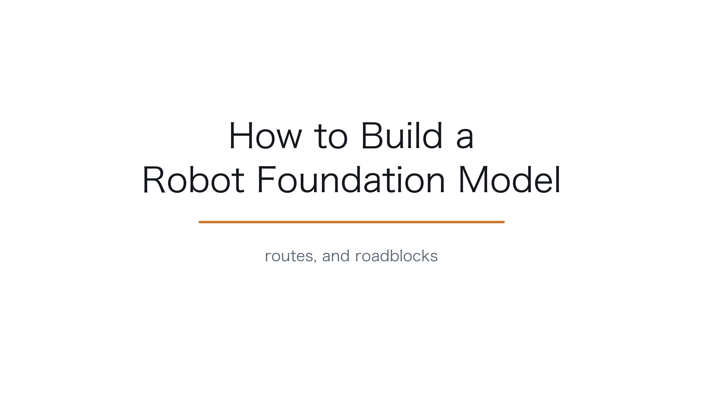

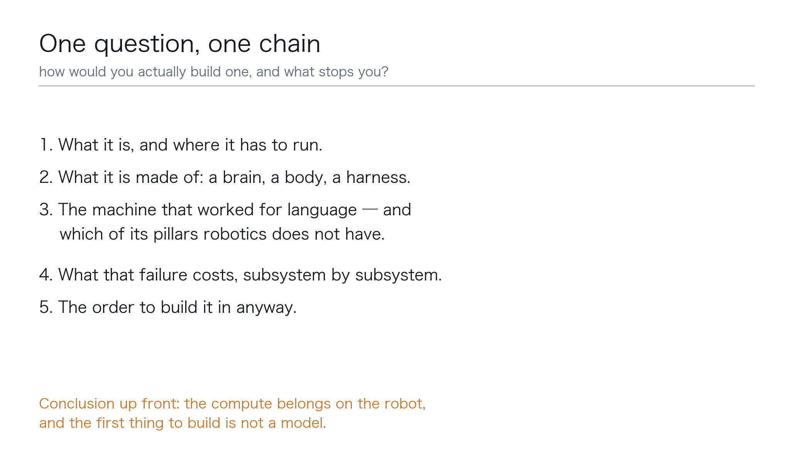

The chain runs in one direction and every step depends on the one before it. The conclusion is stated on the first screen so the rest can be argued with [[arXiv:2604.15483]](https://arxiv.org/abs/2604.15483).

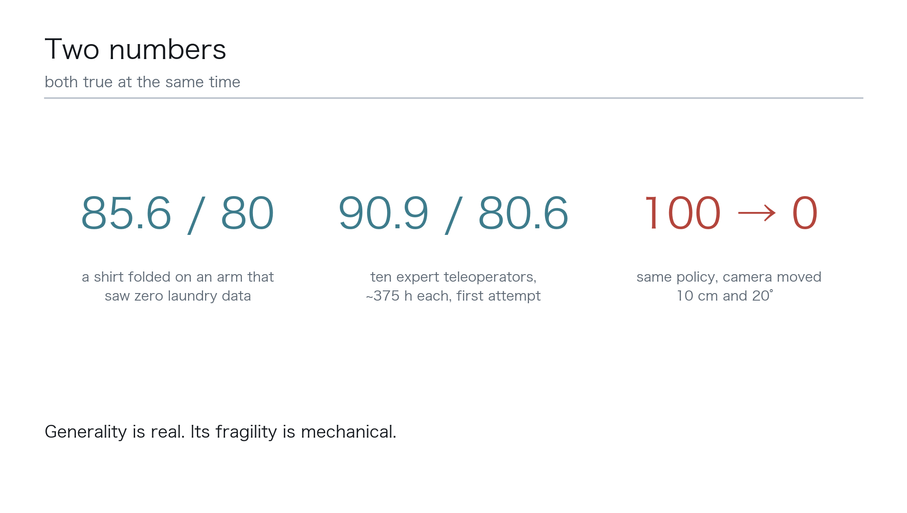

A bimanual UR5e that had never seen a laundry demonstration folded a shirt at 85.6% progress and 80% success; ten expert teleoperators with roughly 375 hours each managed 90.9% and 80.6% on their first attempt [[arXiv:2604.15483 §IX]](https://arxiv.org/abs/2604.15483). The same class of policy collapses from 100% to 0% when a camera moves 10 cm and 20 degrees [[arXiv:2409.03403]](https://arxiv.org/abs/2409.03403).

---

## Part 1 — What it is

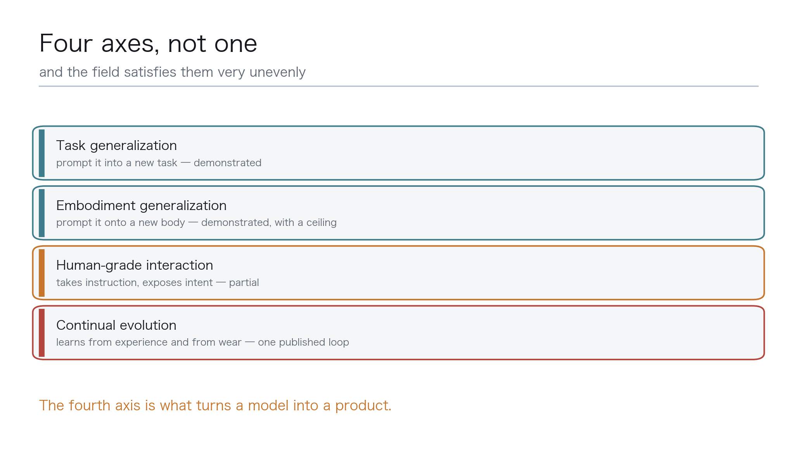

Task generalization is demonstrated across 14 scenarios with 3 to 6 open-ended instructions in unseen rooms [[arXiv:2604.15483 §IX-B]](https://arxiv.org/abs/2604.15483). Embodiment generalization is demonstrated with a ceiling, across 22 embodiments and 60 datasets [[arXiv:2310.08864]](https://arxiv.org/abs/2310.08864). Continual evolution has exactly one published loop [[arXiv:2511.14759]](https://arxiv.org/abs/2511.14759), and nothing at all on mechanical wear [[arXiv:2104.08212]](https://arxiv.org/abs/2104.08212).

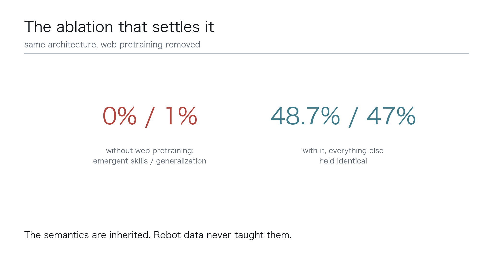

Strip web pretraining from the same architecture and emergent skills go to 0% and generalization to 1%; restore it and they are 48.7% and 47% [[arXiv:2310.08864 Table II]](https://arxiv.org/abs/2310.08864). The semantics are inherited, which is the only reason any of this starts from something the internet already paid for [[arXiv:2307.15818]](https://arxiv.org/abs/2307.15818).

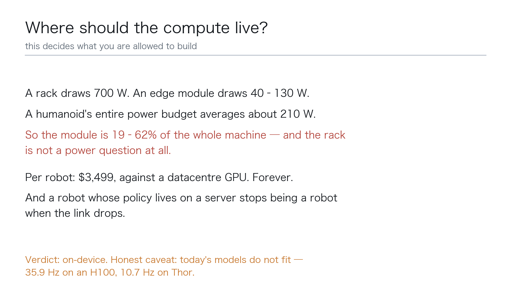

An H100 draws 700 W [[spec: NVIDIA H100 SXM]](https://www.nvidia.com/en-us/data-center/h100/); an edge module draws 40 to 130 W [[spec: NVIDIA Jetson AGX Thor]](https://www.nvidia.com/en-us/autonomous-machines/embedded-systems/); a humanoid's whole system averages about 210 W [[spec: 1X NEO]](https://www.1x.tech/neo). The module is 19% to 62% of the entire power budget [computed: 40 to 130 W against 210 W], and today's models do not fit — 35.9 Hz on an H100 against 10.7 Hz on Thor [[repo: Isaac-GR00T hardware_recommendation.md]](https://github.com/NVIDIA/Isaac-GR00T/blob/main/getting_started/hardware_recommendation.md).

---

## Part 2 — What it is made of

Up to 4 images at 448×448, 6 frames of history, a joint configuration and one sentence go in; 50 future joint targets come out, of which 15 or 25 execute before the model is called again [[arXiv:2604.15483 §IV]](https://arxiv.org/abs/2604.15483). That is the brain's boundary, not the machine's — the model is a setpoint generator that feeds the servo loop rather than replacing it [[arXiv:2604.15483 §VII]](https://arxiv.org/abs/2604.15483).

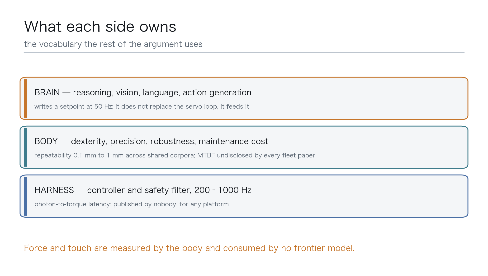

The brain writes setpoints at 50 Hz [[arXiv:2604.15483 §VII]](https://arxiv.org/abs/2604.15483) against an arm that accepts commands at 1 kHz [[spec: Franka Research 3]](https://franka.de/products/franka-research-3). Repeatability spans 0.1 mm to 1 mm across platforms sharing one corpus [computed: 1 mm against 0.1 mm]. Force and touch are measured by the body and consumed by no frontier model [[arXiv:2505.22159]](https://arxiv.org/abs/2505.22159).

Nobody runs a 5B transformer inside a servo loop, so every serious system splits into halves at different rates [[arXiv:2503.14734]](https://arxiv.org/abs/2503.14734). Where labs disagree is the width of the seam — a latent vector [[blog: Figure Helix]](https://www.figure.ai/news/helix), a feature sequence [[arXiv:2503.14734]](https://arxiv.org/abs/2503.14734), or a human-readable subtask string that costs bandwidth and buys debuggability [[arXiv:2604.15483 §VI]](https://arxiv.org/abs/2604.15483).

---

## Part 3 — The machine that worked

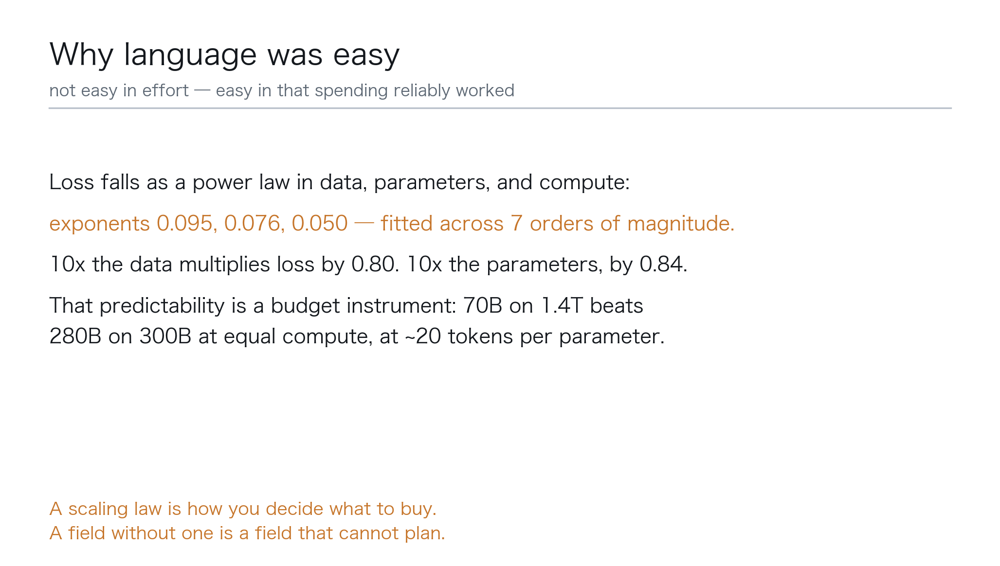

Loss falls as a power law with exponents 0.095, 0.076 and 0.050, fitted across 7 orders of magnitude [[arXiv:2001.08361]](https://arxiv.org/abs/2001.08361). That predictability is a budget instrument: 70B on 1.4T beats 280B on 300B at equal compute, at about 20 tokens per parameter [[arXiv:2203.15556]](https://arxiv.org/abs/2203.15556).

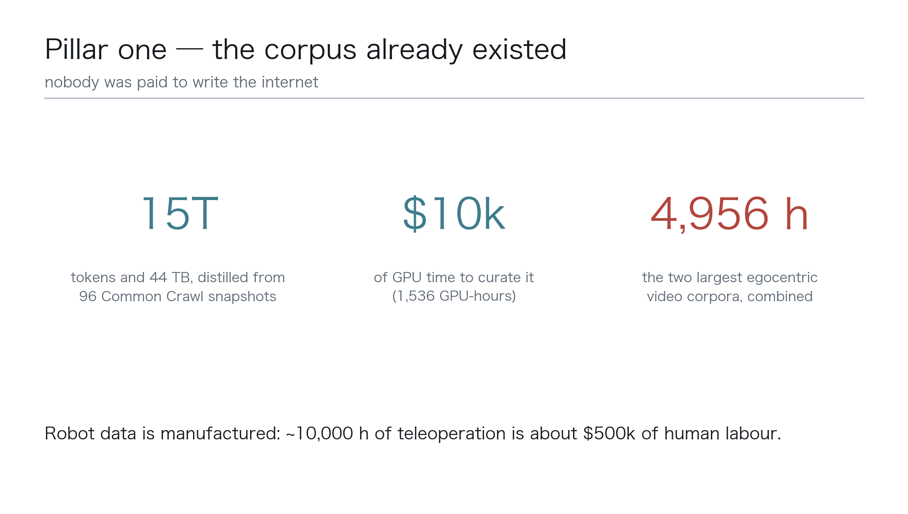

One open pipeline distils 96 Common Crawl snapshots into 15T tokens and 44 TB for 1,536 GPU-hours [[arXiv:2406.17557]](https://arxiv.org/abs/2406.17557), roughly \$10k of compute [computed: 1,536 GPU-hours at commodity rates]. The two largest egocentric video corpora total 4,956 hours [computed: 3,670 h plus 1,286 h], and robot data is manufactured — about 10,000 hours of teleoperation is roughly \$500k of labour [computed: 10,000 h at \$50 per hour].

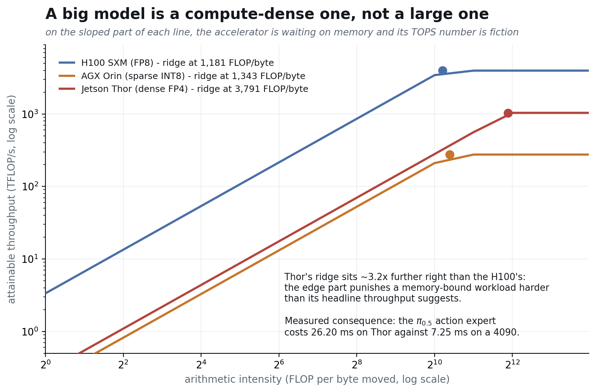

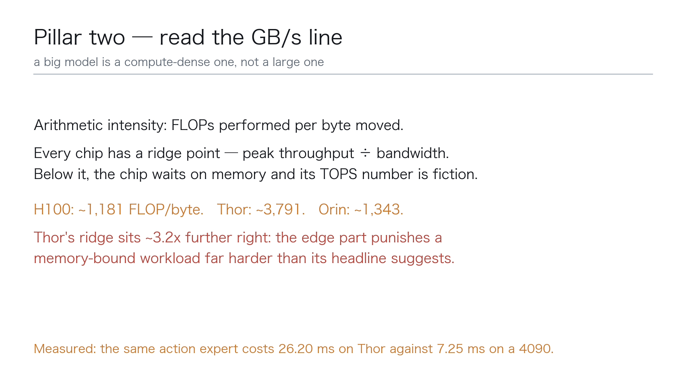

Ridge points, computed from datasheets: about 1,181 FLOP/byte for an H100, about 3,791 for a Thor, about 1,343 for an Orin [computed: 3,958 TFLOPS over 3.35 TB/s]. Thor's sits about 3.2x further right [computed: 3,791 over 1,181], and the measured consequence is an action expert costing 26.20 ms there against 7.25 ms on a consumer GPU [[arXiv:2602.18397]](https://arxiv.org/abs/2602.18397).

Same model, same runtime, three accelerators: throughput tracks the GB/s line rather than the TOPS line [[repo: Isaac-GR00T hardware_recommendation.md]](https://github.com/NVIDIA/Isaac-GR00T/blob/main/getting_started/hardware_recommendation.md).

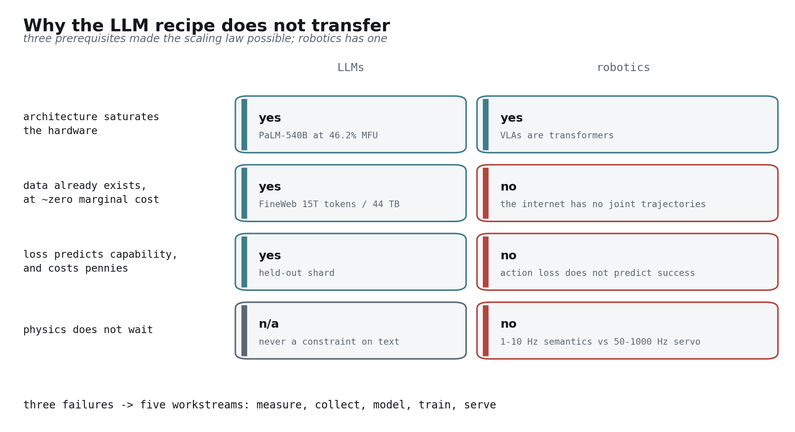

Robotics satisfies the compute pillar. It does not satisfy the data pillar or the infrastructure pillar in the forms that made them powerful, and it carries a fourth constraint text never faced [[arXiv:2604.15483 §VII]](https://arxiv.org/abs/2604.15483).

Action spaces are padded to 18 dimensions and rates span 3 Hz to 50 Hz [[arXiv:2410.24164]](https://arxiv.org/abs/2410.24164). Diffusion at 50 steps buys 10.1 Hz at 95.4% where continuous regression buys 109.7 Hz at 95.3% [[arXiv:2502.19645]](https://arxiv.org/abs/2502.19645). Real-time chunking survives 100–200 ms and fails past 300 ms [[arXiv:2506.07339]](https://arxiv.org/abs/2506.07339). One of the five is a modelling problem.

---

## Part 4 — What it costs

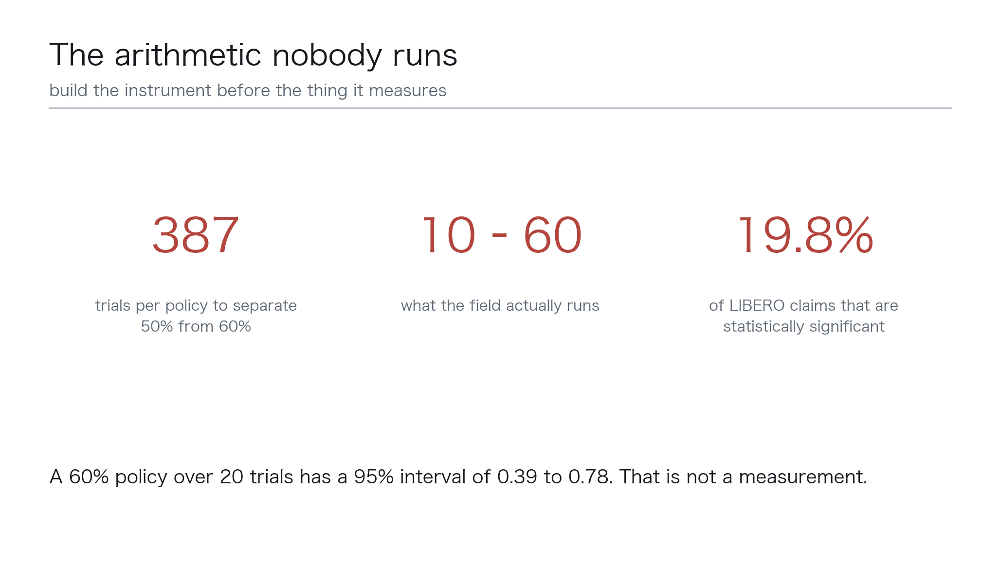

Separating a 50% policy from a 60% policy needs 387 trials [computed: two-proportion test, alpha 0.05, 80% power]; the field runs 10 to 60 [[arXiv:2506.18123]](https://arxiv.org/abs/2506.18123). Only 19.8% of LIBERO claims are statistically significant [[arXiv:2606.04233]](https://arxiv.org/abs/2606.04233), and models scoring 98% and 92% collapse to 0.0% under position perturbation [[arXiv:2510.03827]](https://arxiv.org/abs/2510.03827).

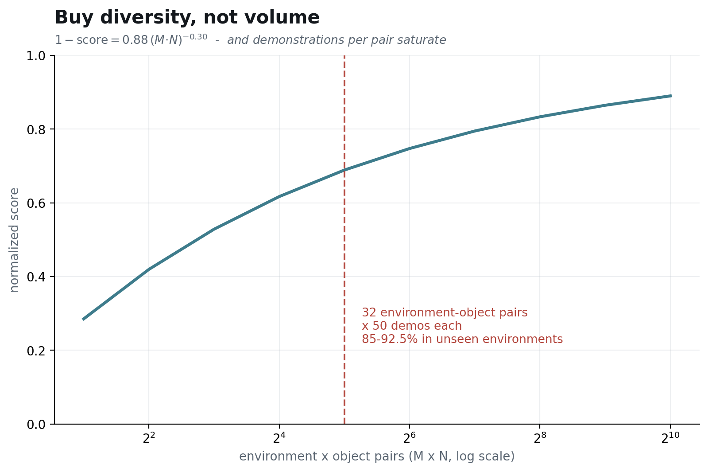

The one replicated law is over diversity: 32 environment-object pairs at 50 demonstrations each reached 85% to 92.5% in unseen environments, collected by 4 people in an afternoon [[arXiv:2410.18647]](https://arxiv.org/abs/2410.18647).

A handheld station costs \$371 and produces 111 demonstrations an hour against teleoperation's 35 [[arXiv:2402.10329]](https://arxiv.org/abs/2402.10329). An hour of human video is worth about 1,400 demonstrations where an hour of robot time is worth 135 [[arXiv:2410.24221]](https://arxiv.org/abs/2410.24221).

Holding the backbone fixed, diffusion's extra compute buys about a tenth of a point for roughly 11x the throughput [computed: 109.7 Hz against 10.1 Hz].

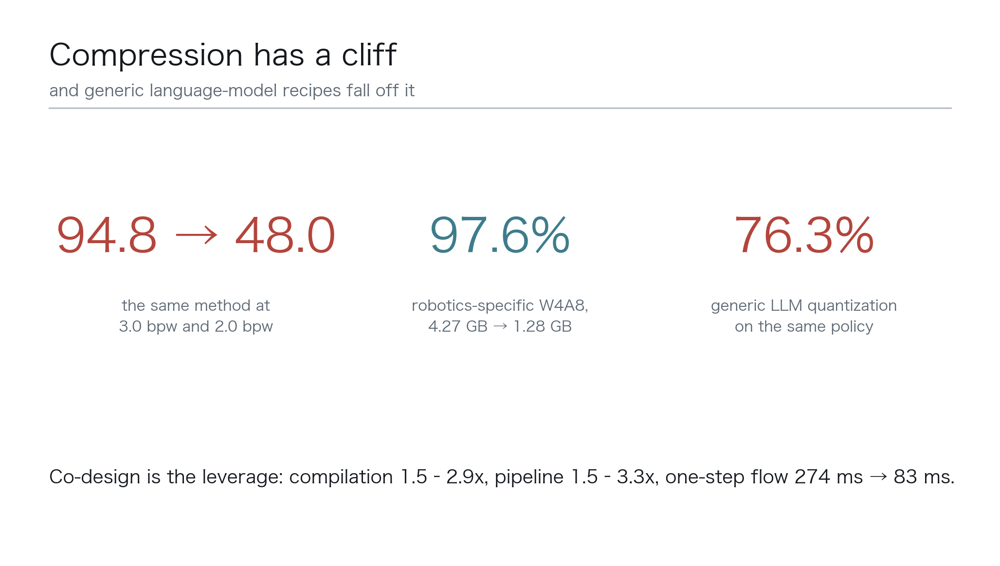

One method holds 94.8% at 3.0 bits per weight and falls to 48.0% at 2.0 [[arXiv:2605.24011]](https://arxiv.org/abs/2605.24011). Robotics-specific W4A8 reaches 97.6% while cutting 4.27 GB to 1.28 GB, where generic quantization lands at 76.3% [[arXiv:2602.20309]](https://arxiv.org/abs/2602.20309).

The model's own time is the measured third — 14 ms of encoders, 32 ms of prefix, 27 ms of flow steps [[arXiv:2410.24164]](https://arxiv.org/abs/2410.24164). Everything before and after it is unmeasured by the entire field [[repo: openpi websocket_policy_server.py]](https://github.com/Physical-Intelligence/openpi/blob/main/src/openpi/serving/websocket_policy_server.py).

---

## Part 5 — The build order

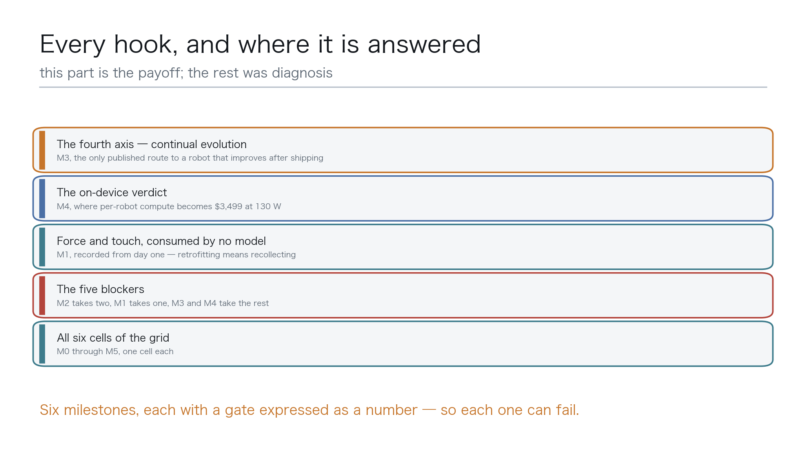

Everything before this was diagnosis. Each earlier hook is picked up by exactly one milestone, and each milestone carries a gate expressed as a number so it can fail [[arXiv:2506.18123]](https://arxiv.org/abs/2506.18123).

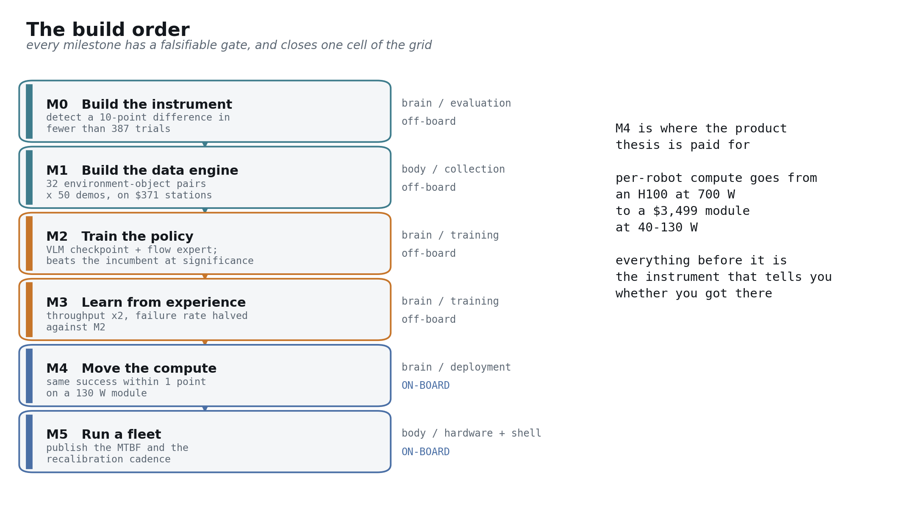

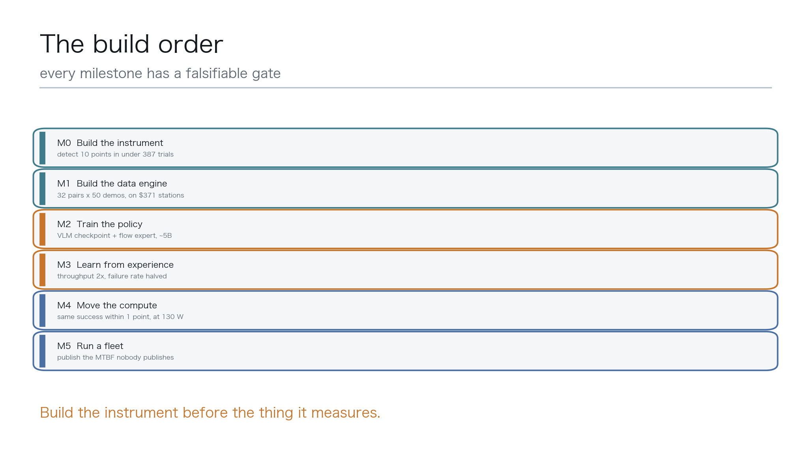

All three language-model stages transfer in form. The third one changes shape, because there is no cheap verifier and the reward has to come from the robot's own experience [[arXiv:2511.14759]](https://arxiv.org/abs/2511.14759).

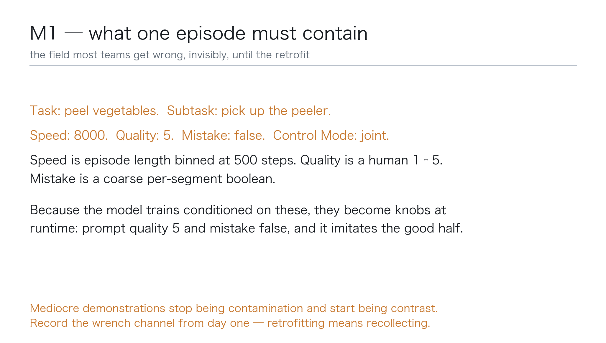

Record every episode as a *conditioned* example: speed binned at 500 steps, quality as a human 1 to 5, mistake as a per-segment boolean, control mode [[arXiv:2604.15483 §V-C]](https://arxiv.org/abs/2604.15483). At runtime those become knobs — prompt quality 5 and mistake false and the policy imitates the good half of your data [[arXiv:2604.15483 §VII]](https://arxiv.org/abs/2604.15483).

Eight sources feed one annotated mixture, and the deployed policy's rollouts become tomorrow's training data [[arXiv:2604.15483 §VI-A]](https://arxiv.org/abs/2604.15483). Failures and mistake-bearing successes are kept on purpose; autonomous data from generalization evaluations is excluded, or the flywheel trains on the test set [[arXiv:2604.15483 §VI-A]](https://arxiv.org/abs/2604.15483).

About 5B on the control path: a 400M vision encoder and a 4B backbone carrying inherited semantics, an 860M flow expert carrying motor skill, and a 14B world model running beside the loop rather than inside it [[arXiv:2604.15483 §IV]](https://arxiv.org/abs/2604.15483).

The part to copy is the firewall: gradients from the action expert do not flow back into the backbone [[arXiv:2604.15483 §III]](https://arxiv.org/abs/2604.15483). FAST tokens exist only at training time and never attend to the flow actions [[arXiv:2604.15483 App. B]](https://arxiv.org/abs/2604.15483).

One step, two losses, two parameter groups. Cross-entropy on FAST tokens trains the backbone; flow matching trains the expert against the velocity that carries noise to actions [[arXiv:2410.24164]](https://arxiv.org/abs/2410.24164). `stop_gradient` is the only coupling, and the relative weight of the two losses is the one number nobody has published [[arXiv:2604.15483 §III]](https://arxiv.org/abs/2604.15483).

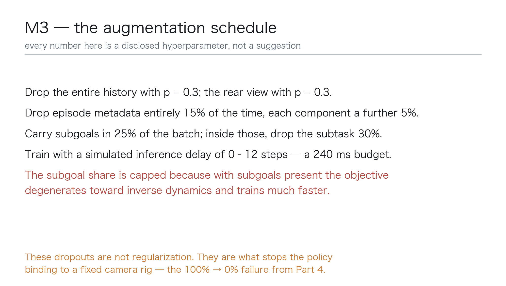

History dropped at p = 0.3, metadata at 15% and 5%, subgoals in 25% of the batch [[arXiv:2604.15483 §V-E]](https://arxiv.org/abs/2604.15483). These are not regularization — they are what stops the policy binding to a fixed camera rig [[arXiv:2409.03403]](https://arxiv.org/abs/2409.03403).

Before compressing anything, fix the schedule: three threads and nothing waits, so a 1.25 s world-model call is invisible instead of fatal [[arXiv:2604.15483 §VII]](https://arxiv.org/abs/2604.15483).

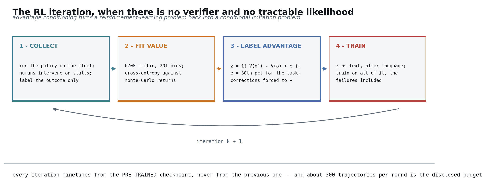

There is no cheap verifier and no tractable likelihood, so PPO and AWR both lose to conditioning [[arXiv:2511.14759]](https://arxiv.org/abs/2511.14759). Fit a critic, binarize its one-step difference against the 30th percentile for that task, write the result into the prompt as text, and train supervised on everything — failures included [[arXiv:2511.14759]](https://arxiv.org/abs/2511.14759).

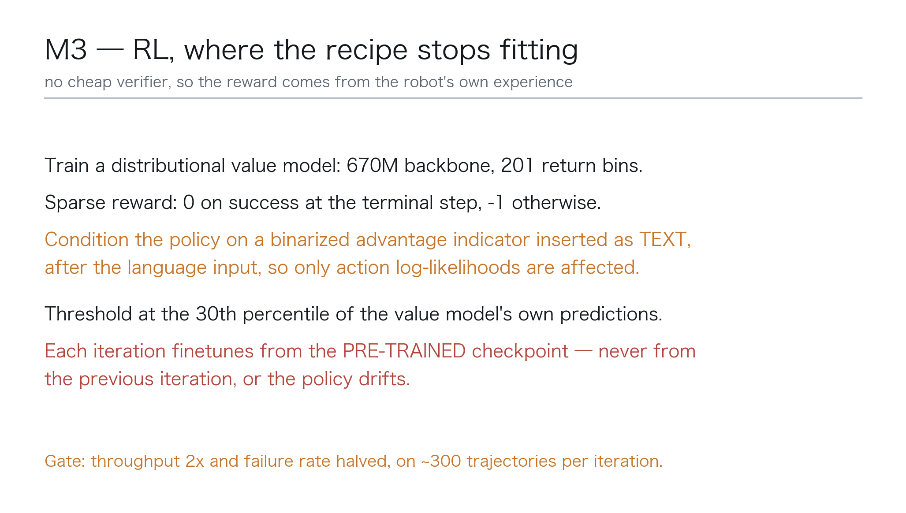

A 670M distributional value model over 201 bins, a sparse reward, and a binarized advantage indicator inserted as text after the language input [[arXiv:2511.14759]](https://arxiv.org/abs/2511.14759). Each iteration finetunes from the pre-trained checkpoint, never the previous one — otherwise the policy drifts [[arXiv:2511.14759]](https://arxiv.org/abs/2511.14759).

M4 is where the product thesis is paid for: per-robot compute drops to \$3,499 at 40 to 130 W, against a datacentre GPU at 700 W [computed: EDGE-19 against EDGE-25].

---

## Part 6 — Three open bets

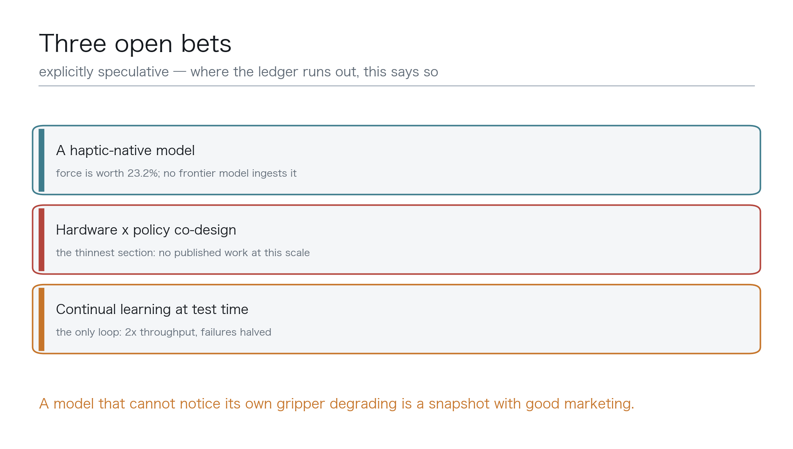

*Speculative, and marked as such.* Force is worth 23.2% on average and no frontier model ingests it [[arXiv:2505.22159]](https://arxiv.org/abs/2505.22159). Hardware-and-policy co-design has no published work at this scale, so it is posed as a question [[arXiv:2604.15483]](https://arxiv.org/abs/2604.15483). The only self-improvement loop reports 2x throughput and halved failures [[arXiv:2511.14759]](https://arxiv.org/abs/2511.14759).

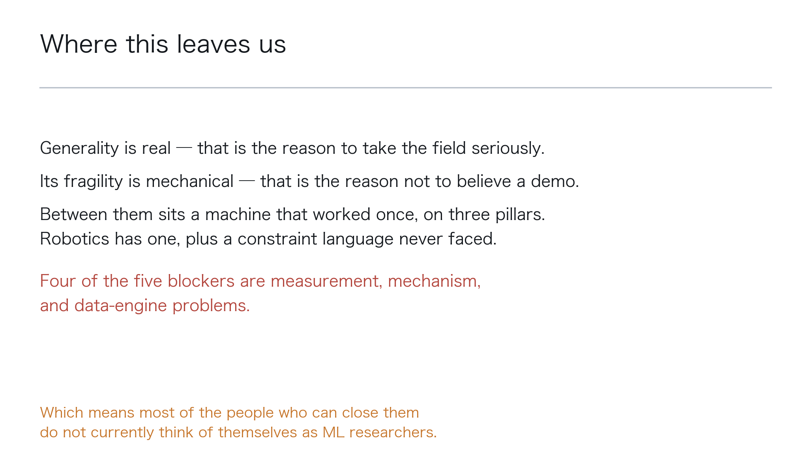

Four of the five blockers are measurement, mechanism, and data-engine problems — which means most of the people who can close them do not currently think of themselves as machine-learning researchers [[arXiv:2506.18123]](https://arxiv.org/abs/2506.18123).

---

The long-form edition carries the full argument, the gap ledger, and the bibliography [[arXiv:2604.15483]](https://arxiv.org/abs/2604.15483).
