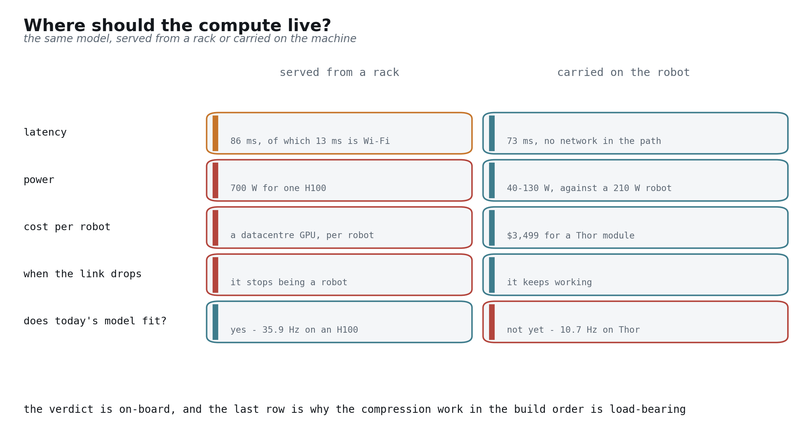
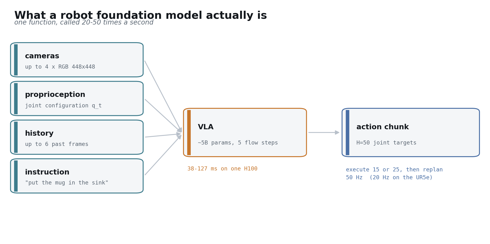
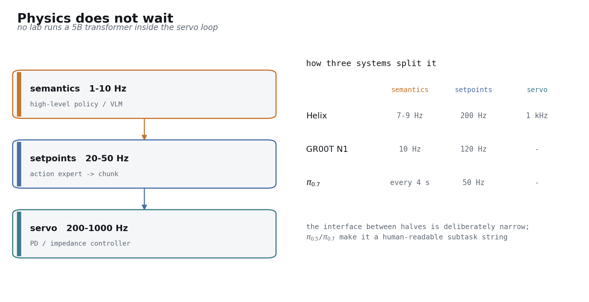
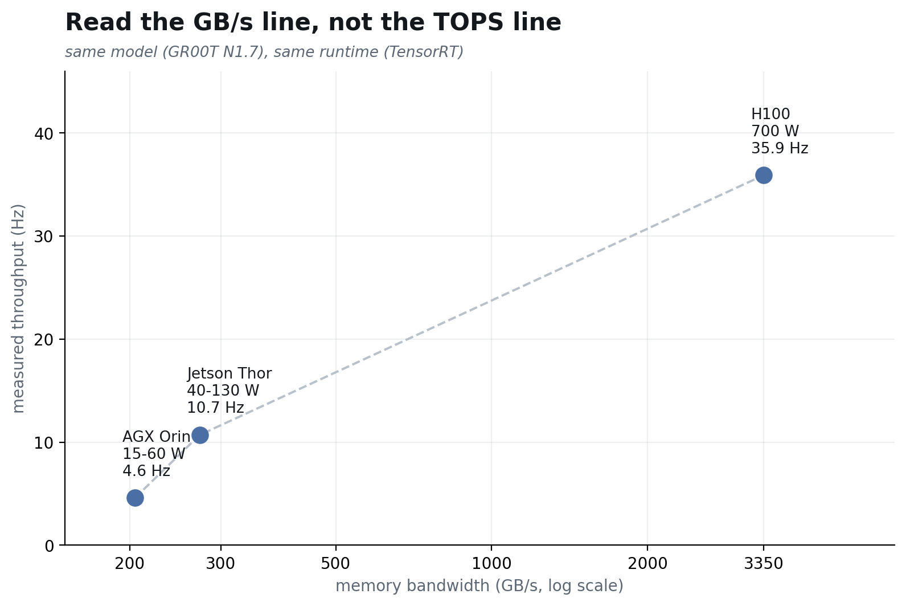
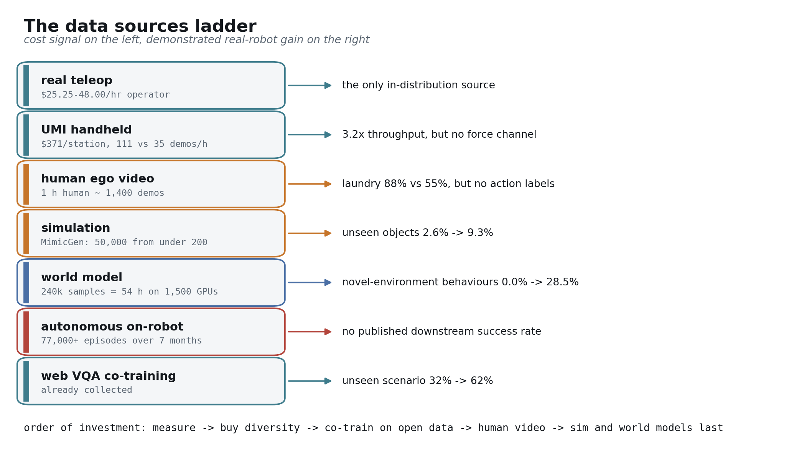
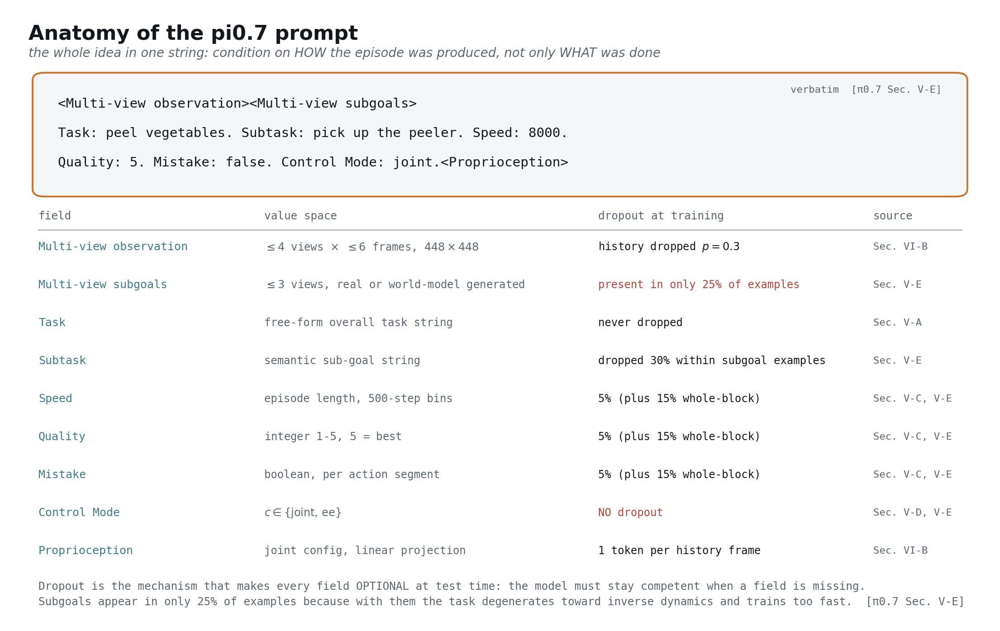

## 这篇文章要回答的问题

> 如果真要造一个机器人基础模型，该怎么造？什么会挡住你？

推导链只有一条。先按「它必须做到什么、必须跑在哪里」把这个对象定义清楚，再把它拆成大脑和身体两个子系统。然后把造出大语言模型的那台机器搬过来，把它的三根支柱说准，逐根拿去对照机器人——机器人只占住了其中一根，另外还多背了一条文本从来没遇到过的约束。五个卡点由此浮出来。每个卡点都要在某个具体子系统里用真金白银的工程量去填。把这些工程量排好序，就是施工顺序。

结论先摆出来，方便你直接反驳：算力应该放在机器人身上；真正难的部分大多属于测量和机构，跟建模关系不大；最先该动手造的东西并不是模型。

## 怎么读这篇文章

语言模型那部分背景——transformer、预训练、规模化定律、计算强度——集中在第 3 部分讲，别处不再展开。已经熟悉的可以直接跳过，前面几部分不依赖它 [[arXiv:2001.08361]](https://arxiv.org/abs/2001.08361)。

全文贯穿三条约定，它们是承重的。

**每条论断都标了类型。** *disclosed* 指某个一手来源明确写了；*inferred* 指我们从已披露事实推出来的，并且会说明推法；*undisclosed* 指实验室外没人知道，那就送进 gap 清单，不含糊带过；*marketing* 指公司博客或新闻稿，既没有论文也没有第三方复现，每次出现都会当场标出来——这个领域里新闻稿和真实结果之间的距离大得异乎寻常 [[blog: NVIDIA GEAR GR00T N1.5]](https://research.nvidia.com/labs/gear/gr00t-n1_5/)。

**每个数字都带着出处**，并且由脚本对着一份 fact ledger 机器校验。正文里出现的数字只要在 ledger 里查不到，或者哪一段没有引用，构建脚本就会直接失败 [[arXiv:2604.15483 §V-E]](https://arxiv.org/abs/2604.15483)。

**证据到头的地方，文章会直说**，而不是顺手写一句听起来合理的话。第 6 部分整体是推测性的，并已明确标注 [[arXiv:2604.15483]](https://arxiv.org/abs/2604.15483)。

---

# 第 0 部分 —— 两个数字

一台从没见过任何叠衣服演示数据的双臂 UR5e，把一件衬衫叠到了 **85.6% 的任务进度、80% 的成功率** [[arXiv:2604.15483 §IX]](https://arxiv.org/abs/2604.15483)。驱动它的模型，训练数据来自别的机器人在做别的事情。

同一个任务交给十位专家级遥操作员，每人约有 375 小时经验，从操作员里按前 2 百分位挑出来。他们第一次上手这条机械臂，拿到的是 **90.9% 的进度、80.6% 的成功率** [[arXiv:2604.15483 §IX]](https://arxiv.org/abs/2604.15483)。一个没有任何任务专用数据的通用模型，成绩落在专家第一次碰这套硬件的水平上，差距不到一个百分点。

这是第一个数字。第二个数字是：那个模型跑在一块 H100 上 [[arXiv:2604.15483 App. D]](https://arxiv.org/abs/2604.15483)；而一个在某个相机位姿下训到 100% 成功率的策略，把相机挪 10 厘米、转 20 度，成功率掉到 **0%** [[arXiv:2409.03403]](https://arxiv.org/abs/2409.03403)。

泛化是真的。它的脆弱是机械层面的。

---

# 第 1 部分 —— 机器人基础模型是什么


## 四条轴，不止一条

**先把这东西的形状说清楚：** 最多 4 路相机图像、当前关节构型、一句英文指令进去；一段 50 个未来关节目标的序列出来，交给你的伺服环去执行 [[arXiv:2604.15483 §IV]](https://arxiv.org/abs/2604.15483)。

**要带进后面几节的性质只有一条：** 想换出新行为，你唯一需要动的就是那句话 [[arXiv:2604.15483 §V]](https://arxiv.org/abs/2604.15483)。完整的接口签名，以及输出为什么是一整段而不是一步，都放在第 2 部分。

这个词被用得太随意，值得先钉死。机器人基础模型是同时满足四项要求的系统，而有意思的地方在于：这四项，领域内满足得很不均匀 [[arXiv:2108.07258]](https://arxiv.org/abs/2108.07258)。

- **任务泛化** —— 用一句话把它 prompt 到新任务上，走的就是刚才那条通道。评测覆盖 14 个场景，每个场景 3 到 6 条开放式指令，环境是没见过的厨房和卧室 [[arXiv:2604.15483 §IX-B]](https://arxiv.org/abs/2604.15483)。
- **本体泛化** —— 用一句话把它 prompt 到新机体上。同一套权重驱动运动学不同的机器人。在 22 种本体、60 个数据集的规模上，跨本体模型平均比逐数据集训练的专用方法高出 **50%** [[arXiv:2310.08864]](https://arxiv.org/abs/2310.08864)。
- **类人交互** —— 接得住开放式指令，并且把自己打算干什么暴露出来。π 系列会输出一串人可读的子任务描述，每 4 秒刷新一次 [[arXiv:2604.15483 §VI]](https://arxiv.org/abs/2604.15483)；显式的中间推理把任务进度从 **0.55 抬到 0.67** [[arXiv:2510.03342]](https://arxiv.org/abs/2510.03342)。
- **持续进化** —— 从自己的经验里变强，跟着机体磨损调整，接得住新派给它的活。这条轴弱得非常明显：靠自主 rollout 驱动自我改进，公开的闭环只有一个 [[arXiv:2511.14759]](https://arxiv.org/abs/2511.14759)；至于适应机械磨损，没有任何一家发表过 [[arXiv:2104.08212]](https://arxiv.org/abs/2104.08212)。

第四条轴才是把模型变成产品的那条，也恰恰是至今没人交付出来的那条。记住它，第 6 部分会绕回来。

## 把基础模型和大策略区分开的那个消融

「用了很多数据训出来的」和「基础模型」是两个不同的论断，有一个实验能干净地把它们分开。把网络预训练从跨本体模型里抽掉，它在 emergent skills 上得 **0%**、在泛化上得 **1%**；把预训练加回去，同样的架构拿到 **48.7%** 和 **47%** [[arXiv:2310.08864 Table II]](https://arxiv.org/abs/2310.08864)。

语义是继承来的，机器人数据教不出来。这篇文章后面所有推导都建立在这个事实上，因为它是机器人模型唯一能站在互联网已经付过的账上起步的理由 [[arXiv:2307.15818]](https://arxiv.org/abs/2307.15818)。

## 哪几条轴真的被证明了

「泛化」这个词在机器人写作里承担了太多没兑现的工作。各条轴上的证据厚薄差很多，值得逐条说清楚。

- **新物体。** 多家实验室都做出来了——在没见过的物体和背景上，大致是上一代的两倍，覆盖 280 个任务、6 千次评测 [[arXiv:2307.15818]](https://arxiv.org/abs/2307.15818)。
- **新场景。** 这是领域内最硬的单点结果。训练数据从 3 个地点，扩到 12、22、53、82，最后到 104 个地点，性能单调上升；104 地点的模型大致追平了直接在测试住宅里训练的对照模型 [[arXiv:2504.16054]](https://arxiv.org/abs/2504.16054)。
- **跨本体。** 证明了，但天花板有据可查：emergent skills 上 **75.8%** 对 **27.3%** [[arXiv:2310.08864]](https://arxiv.org/abs/2310.08864)。
- **长程组合。** 在 10 到 15 分钟量级的任务上证明了，比如多阶段房间整理 [[arXiv:2504.16054]](https://arxiv.org/abs/2504.16054)。
- **新的物理条件** —— 摩擦、负载、惯量、柔顺性、刚度。**这是最弱的一条轴，没有任何实验室发表过在这些变量上的扫描** [[arXiv:2604.15483]](https://arxiv.org/abs/2604.15483)。光照和杂乱度有人测，机械变量没人测。

有两件事应该给上面所有内容降降温，而且你最好从这里听到，别以后自己撞上。独立工作发现，当前最强的一批模型存在词汇—运动学捷径和语义特征坍缩，静态 benchmark 把这种退化盖住了 [[arXiv:2604.18000]](https://arxiv.org/abs/2604.18000)，也记录了视觉直接压过语言指令的情形 [[arXiv:2602.17659]](https://arxiv.org/abs/2602.17659)。而领域内领先的实验室自己也承认：在它那个数据规模上，「实际上很难确切判定哪些任务是真的见过、哪些没见过」，模型「很可能主要是靠把别处情境里的技能重新组合」来实现泛化的 [[arXiv:2604.15483]](https://arxiv.org/abs/2604.15483)。

## 算力应该放在哪里



这是个产品决策，而且通常被往后拖。它不该被往后拖，因为它决定了你被允许造什么东西。两个选项：一个中心服务，机器人隔着网络去查；或者一个直接装在机器上的模型。

**延迟。** 离机推理要在 73 毫秒模型时间之上再加大约 13 毫秒 Wi-Fi，合计 86 毫秒 [[arXiv:2410.24164]](https://arxiv.org/abs/2410.24164)。这个数扛得住——但扛得住的原因是有专门为此设计的算法。实时 chunking 在注入 100 毫秒和 200 毫秒延迟时没有可测的性能损失，超过 300 毫秒就崩 [[arXiv:2506.07339]](https://arxiv.org/abs/2506.07339)。与此同时，当代模型挂四路相机，在单块 H100 上已经要 300 毫秒 [[arXiv:2511.14759]](https://arxiv.org/abs/2511.14759)。网络预算在网络还没接进来之前就花光了。

**功耗。** H100 是 700 W [[spec: NVIDIA H100 SXM]](https://www.nvidia.com/en-us/data-center/h100/)，Jetson Thor 是 40 到 130 W [[spec: NVIDIA Jetson AGX Thor]](https://www.nvidia.com/en-us/autonomous-machines/embedded-systems/)。给个尺度感：一台 842 Wh 电池、续航 4 小时的人形机器人，*整机*平均功率约 210 W [[spec: 1X NEO]](https://www.1x.tech/neo)，这意味着一块边缘计算模组要吃掉**整机功率预算的 19% 到 62%** [computed: 40 to 130 W against 210 W]。把 H100 装到机器人身上不是功耗问题，是物理上做不到。

**单台成本。** 一块边缘模组 \$3,499 [[spec: NVIDIA Jetson AGX Thor]](https://www.nvidia.com/en-us/autonomous-machines/embedded-systems/)，对面是一块数据中心 GPU——*每台机器人一块*，而且一直要付 [[spec: NVIDIA H100 SXM]](https://www.nvidia.com/en-us/data-center/h100/)。

**故障形态。** 策略跑在服务器上的机器人，断网的那一刻就不再是机器人了。这一条属于推理，不是实测结论，此处如实标注——但这是买家会算的账，研究者不会算 [[arXiv:2506.07339]](https://arxiv.org/abs/2506.07339)。

**结论是端侧**，附一个诚实的限定：今天的前沿模型装不进去。同一个模型、同一套运行时，在 H100 上跑 35.9 Hz，在 Jetson Thor 上 10.7 Hz，在 AGX Orin 上 4.6 Hz [[repo: Isaac-GR00T hardware_recommendation.md]](https://github.com/NVIDIA/Isaac-GR00T/blob/main/getting_started/hardware_recommendation.md)。正是这个差距，让第 5 部分里的压缩工作变成承重结构，而不是可选项。

---

# 第 2 部分 —— 两个子系统：大脑与身体


## 大脑，以及它的输入输出契约



把术语剥掉，大脑就是一个函数，每秒被调用二十到五十次。

**输入：** 最多 4 路相机图像，分辨率 448×448；最多 6 帧近期历史；当前关节构型；一句英文指令 [[arXiv:2604.15483 §IV]](https://arxiv.org/abs/2604.15483)。

**输出：** 一个 *action chunk* —— 一段长度 H = 50 的未来关节目标序列，其中只有前 15 或 25 步会被真正执行，然后模型被重新调用 [[arXiv:2604.15483 §VI-B]](https://arxiv.org/abs/2604.15483)。控制回路在多数平台上跑 50 Hz，在 UR5e 上跑 20 Hz [[arXiv:2604.15483 §VII]](https://arxiv.org/abs/2604.15483)。

整个接口就这么多。注意这道边界画在哪儿：它是大脑的边界，不是整台机器的边界。模型是一个 setpoint 生成器——它不接管你的伺服环，它给伺服环喂数 [[arXiv:2604.15483 §VII]](https://arxiv.org/abs/2604.15483)。它一次预测大约一秒的运动，却只承诺其中三分之一，省下来的时间正好用来思考 [[arXiv:2506.07339]](https://arxiv.org/abs/2506.07339)。

chunk 不是实现细节，背后的消融结果相当刺眼：一次只预测一步，在一个精细双臂任务上成功率 **1%**；一次预测 **100** 步，成功率 **44%** [[arXiv:2304.13705]](https://arxiv.org/abs/2304.13705)。机理是误差累积——一点偏差把机器人推到训练分布边缘之外，下一步预测就更差一点，循环发散。一次承诺一整段运动，等于把发散的机会数直接除掉一个量级 [[arXiv:2304.13705]](https://arxiv.org/abs/2304.13705)。

把上面那份输入清单再读一遍，因为**它没有包含的东西**，正是接下来两节的全部论点。大脑必须具备的能力：

- **视觉、语言、本体感知。** 就是上面那三路通道，每个已落地的系统都有 [[arXiv:2604.15483 §IV]](https://arxiv.org/abs/2604.15483)。有代表性的平台暴露的是 14 维状态 [[repo: openpi aloha_policy.py]](https://github.com/Physical-Intelligence/openpi/blob/main/src/openpi/policies/aloha_policy.py)。
- **推理。** 口号意义上的「会思考」不算数，这里指的是一个后续系统真的会消费的显式中间表示。π 系列每 4 秒刷新一次 [[arXiv:2604.15483 §VI]](https://arxiv.org/abs/2604.15483)；在做过消融的地方，它值 **0.55 到 0.67** 的任务进度 [[arXiv:2510.03342]](https://arxiv.org/abs/2510.03342)。
- **力与触觉。** 研究系统里测得到，前沿模型里一个都没接。加一路力信号平均涨 **23.2%**，插拔任务从约 **10%** 抬到约 **80%**，训练集只有 244 条轨迹 [[arXiv:2505.22159]](https://arxiv.org/abs/2505.22159)。触觉把 USB 插接从 **5% 抬到 35%**，充电器插接从 **40% 抬到 90%**，分布外擦拭从 **0% 抬到 80%** [[arXiv:2507.09160]](https://arxiv.org/abs/2507.09160)。
- **音频。** 没有任何前沿机器人基础模型公开过音频输入通路。这里只把它标成一个缺口，不展开 [[arXiv:2604.15483]](https://arxiv.org/abs/2604.15483)。
- **动作生成。** 表示形式的选择，第 3 部分会论证它是中枢性的一条轴 [[arXiv:2501.09747]](https://arxiv.org/abs/2501.09747)。

## 身体

这几条要求读起来像一份硬件规格书，因为它本来就是。

- **灵巧与精细控制。** 研究级机械臂接受 1 kHz 的指令 [[spec: Franka Research 3]](https://franka.de/products/franka-research-3)，而它上面那个策略产出 setpoint 的频率是 50 Hz [[arXiv:2604.15483 §VII]](https://arxiv.org/abs/2604.15483)。接触物理活在模型够不着的频段里，这正是 harness 必须存在的原因。
- **精度。** 重复定位精度的跨度：研究级机械臂优于 0.1 毫米 [[spec: Franka Research 3]](https://franka.de/products/franka-research-3)，领域内大量训练实际用的低成本机械臂是 1 毫米 [[spec: Trossen ViperX 300]](https://www.trossenrobotics.com/viperx-300)——共享同一份数据集的这些平台之间，差了大约 **10x** [computed: 1 mm against 0.1 mm]。
- **鲁棒与安全。** 面向人类环境设计的人形机器人，公开数据是 95% 反驱性、30 kg 自重、头部伤害指标低于 250 [[spec: 1X NEO]](https://www.1x.tech/neo)。标准写得很明确：降速模式上限 250 mm/s，安全等级 PL d 与 SIL 2 [std: ISO 10218:2025]；接触力上限从面部 65 N 到大腿 220 N [std: ISO/TS 15066:2016]。
- **运维成本。** 领域内最大的公开缺口。所有做到规模化部署的研究里，平均无故障时间都没披露 [[arXiv:2104.08212]](https://arxiv.org/abs/2104.08212)；跨台制造差异被点过名，但从来没被量化 [[arXiv:2506.18123]](https://arxiv.org/abs/2506.18123)。

## 中间那层 harness



没人会把一个 5B 参数的 transformer 塞进伺服环，所以每个认真的系统都会切成两半，分别跑在不同频率上：语义层 1 到 10 Hz，setpoint 层 20 到 50 Hz，伺服层 200 到 1000 Hz [[arXiv:2503.14734]](https://arxiv.org/abs/2503.14734)。有一套公开的人形栈，三层分别跑 7 到 9 Hz、200 Hz 和 1 kHz [[blog: Figure Helix]](https://www.figure.ai/news/helix)——marketing 级来源，背后没有论文。另一套全身控制栈，策略跑 2.5 Hz，控制器跑 50 Hz [[repo: Isaac-GR00T hardware_recommendation.md]](https://github.com/NVIDIA/Isaac-GR00T/blob/main/getting_started/hardware_recommendation.md)。

各家真正有分歧的地方是这道缝**开多宽**。有的系统在两半之间只传一个连续隐向量 [[blog: Figure Helix]](https://www.figure.ai/news/helix)；有的对一整串中间特征做 cross-attention [[arXiv:2503.14734]](https://arxiv.org/abs/2503.14734)；π 系列传的是一句人可读的子任务描述外加一张生成图像 [[arXiv:2604.15483 §VI]](https://arxiv.org/abs/2604.15483)。最后这个选择费带宽，换来的是可调试性：机器人做错事的时候，你能读出来它以为自己在干什么。

而整条通路——从光子到力矩——至今没有任何实验室在任何平台上完整发表过 [[repo: openpi websocket_policy_server.py]](https://github.com/Physical-Intelligence/openpi/blob/main/src/openpi/serving/websocket_policy_server.py)。

---

# 第 3 部分 —— 那台跑通了的机器，以及它搬不过来的地方

要理解机器人为什么难，先得准确理解语言建模为什么*容易*——工程量上并不容易，容易的是一个很具体的意义：往里投资源，它就可靠地起作用。

## 方法论

把智能从数据集里压缩进权重，用算力换进展，别用手工设计的特征换进展。这件事之所以是一套战略而不只是一种指望，是因为回报可以预测。loss 随数据、参数、算力呈幂律下降，指数分别是 **0.095**、**0.076**、**0.050**，拟合跨越 **7** 个数量级 [[arXiv:2001.08361]](https://arxiv.org/abs/2001.08361)。数据翻十倍，loss 乘 **0.80**；参数翻十倍，乘 **0.84** [[arXiv:2001.08361]](https://arxiv.org/abs/2001.08361)。

这种可预测性本身就是一件预算工具。它告诉某家实验室：在同等算力下，**70B** 模型配 **1.4T** token，会打赢 **280B** 模型配 **300B** token，最优配比大约是每参数 **20** 个 token [[arXiv:2203.15556]](https://arxiv.org/abs/2203.15556)。规模化定律是你决定买什么的依据——所以一个没有规模化定律的领域，是一个没法做规划的领域。

支撑那台机器跑起来的，是三根支柱。

## 支柱一 —— 数据的组织范式

一切皆 token。同一套表示覆盖翻译、摘要、代码、对话，正是这一点让「一条普适的定律」变得可寻，而不至于退化成每个任务一条曲线 [[arXiv:2001.08361]](https://arxiv.org/abs/2001.08361)。

而且语料本来就在那儿。一条开源流水线把 **96** 个 Common Crawl 快照蒸成 **15T** token、**44 TB** 文本，只花了 **1,536** GPU 小时 [[arXiv:2406.17557]](https://arxiv.org/abs/2406.17557)，折合大约 **\$10k** 的算力 [computed: 1,536 GPU-hours at commodity rates]。没有任何人被雇来生产这些文本，它是互联网存在的副产品。

在这之上，评测几乎不要钱：留出集困惑度，加上机器可以直接判定的任务结果。测试周期以分钟计，随基础设施扩展，不随人头扩展 [[arXiv:2001.08361]](https://arxiv.org/abs/2001.08361)。on-policy 数据也便宜，因为沙箱就是一次 API 调用。

## 支柱二 —— 计算范式


这里是最常被说错的一段。所谓「大模型」，真正的衡量标准是**计算强度**——每从内存搬运一个字节，能做多少次浮点运算；参数量本身说明不了什么。

每块加速器都有一个 *ridge point*：峰值算力除以内存带宽。落在它左边，芯片在等内存，标称算力是假的；落在它右边，芯片才真的在算。下面这组数字由厂商规格书推出。

| 器件 | 峰值 | 带宽 | ridge point |
|---|---|---|---|
| H100 SXM | 3,958 TFLOPS FP8 | 3.35 TB/s | 约 1,181 FLOP/byte |
| Jetson AGX Thor | 1,035 TFLOPS dense FP4 | 273 GB/s | 约 3,791 FLOP/byte |
| AGX Orin | 275 TOPS sparse INT8 | 204.8 GB/s | 约 1,343 OP/byte |

这三行的精度各不相同，所以它不是一次同口径的算力对比，也不该被那样读 [[spec: NVIDIA H100 SXM]](https://www.nvidia.com/en-us/data-center/h100/)。真正可比的是：每块器件对负载提出的比值要求。Thor 的 ridge point 比 H100 的往右挪了大约 **3.2x** [computed: 3,791 over 1,181]，意思是边缘器件对访存受限负载的惩罚，比它 TOPS 数字暗示的要重得多 [[spec: NVIDIA Jetson AGX Thor]](https://www.nvidia.com/en-us/autonomous-machines/embedded-systems/)。

实测后果在公开数据里看得见：同一个 action expert，在 Thor 上要 **26.20 毫秒**，在消费级 GPU 上只要 **7.25 毫秒**，惩罚倍数 **3.6x** [[arXiv:2602.18397]](https://arxiv.org/abs/2602.18397)。看 GB/s 那一行，别看 TOPS 那一行。



transformer 能赢，是因为序列建模足够通用，*而且*这个架构计算密度足够高，能把硬件换成能力 [[arXiv:2001.08361]](https://arxiv.org/abs/2001.08361)。这句话的两半缺一不可。

## 支柱三 —— 基础设施

这个规模上的训练本身就是一件工程作品：某个 540B 参数的训练跑出了 **46.2%** 的 model FLOPs utilization [[arXiv:2204.02311]](https://arxiv.org/abs/2204.02311)，这需要上千块加速器，以及足以扛住它们连着坏几周的容灾能力。推理是它的镜像——低延迟、高并发，再加上 test-time scaling 和一套能让长程多轮调用保持正确的 harness [[arXiv:2001.08361]](https://arxiv.org/abs/2001.08361)。

## 对照表


机器人满足支柱二。支柱一和支柱三，它没有以那种曾经产生威力的形态满足；此外它还多背一条文本从未面对过的约束：物理不等人 [[arXiv:2604.15483 §VII]](https://arxiv.org/abs/2604.15483)。

## 五个卡点


这是整篇论证的枢纽。每个卡点用一句原理加一个决定性数字给出，第 4 部分再算它各要付多少代价。

**其一：没有统一的动作词表。** 文本只有一套字母表，机器人没有。动作空间要补零到 18 或 19 维，才能被拼进同一个训练混合里 [[arXiv:2410.24164]](https://arxiv.org/abs/2410.24164)。标准语料之间控制频率从 3 Hz 跨到 50 Hz [[arXiv:2310.08864]](https://arxiv.org/abs/2310.08864)，于是同样 50 步的 chunk，在一台机器上是 1 秒运动，在另一台上是 2.5 秒 [computed: 50 steps at 50 Hz and 20 Hz]。连 tokenizer 的效率都取决于机体：同一套压缩方案，在 5 Hz、7 自由度下压缩比 **1.75x**，在 50 Hz、14 自由度下是 **13.2x** [[arXiv:2501.09747]](https://arxiv.org/abs/2501.09747)。而机器人领域唯一被复现过的规模化定律，跑的是*多样性*，不是数据量——归一化分数随 pair 数以 **0.88** 乘以 −**0.30** 次幂改善，而每个 pair 的演示数在总量约 **800** 条时就饱和了 [[arXiv:2410.18647]](https://arxiv.org/abs/2410.18647)。

**其二：没有无监督语料。** 最接近网页文本的东西是第一人称人类视频，两个最大的公开语料加起来 **4,956** 小时 [computed: 3,670 h plus 1,286 h]，对面是 15T token 的网页文本 [[arXiv:2110.07058]](https://arxiv.org/abs/2110.07058)。机器人数据是*被制造出来的*：某个预训练混合大约代表 **10,000** 小时、**903M** 个时间步 [[arXiv:2410.24164]](https://arxiv.org/abs/2410.24164)，按全负担 **\$50** 每小时算，约合 **\$500k** 的人力成本 [computed: 10,000 h at \$50 per hour]。另一份数据集动用了 **100** 台机器人、**4,000** 平米场地，产出 **1,001,552** 段 episode、**2,976.4** 小时 [[arXiv:2503.06669]](https://arxiv.org/abs/2503.06669)。还有一份用了 **18** 套采集架、**50** 名采集员、**12** 个月，换来 **76k** 条轨迹 [[arXiv:2403.12945]](https://arxiv.org/abs/2403.12945)。

**其三：计算范式搬得过来，但多花的算力没买到关键指标。** 加载视觉语言 checkpoint 再挂一个 action head，是货真价实的迁移，第 1 部分那个网络预训练消融就是证据。可是把 backbone 固定、只换 action head：50 步去噪的 diffusion 跑 **10.1 Hz**、成功率 **95.4%**；连续回归跑 **109.7 Hz**、成功率 **95.3%** [[arXiv:2502.19645]](https://arxiv.org/abs/2502.19645)——吞吐差了约 **11x**，成绩差了 0.1 个百分点 [computed: 109.7 Hz against 10.1 Hz]。多烧一个数量级的算力却换不到可测收益，这跟规模化定律正好相反。


**其四：训练基础设施不是瓶颈，端侧适配可能才是。** 没有哪个机器人结果是在语言模型那个量级上被算力卡住的。领域内公开的最大一笔算力开销花在*数据生成*上——**240k** 个样本，**1,500** 块 GPU 跑 **54** 小时 [[arXiv:2505.12705]](https://arxiv.org/abs/2505.12705)。真正悬着的问题在另一端：在机器上做适配——已有端侧模型能用 **50 到 100** 条演示微调到新任务 [[arXiv:2503.20020]](https://arxiv.org/abs/2503.20020)。

**其五：推理意味着一台真机器。** 语言 harness 卡住，代价是回答慢了。策略卡住，代价是把一条过期轨迹发给一个已经变了的世界。实时 chunking 之所以存在就是因为这个，它 100–200 毫秒的容忍度和 300 毫秒的上限之所以承重也是因为这个 [[arXiv:2506.07339]](https://arxiv.org/abs/2506.07339)；而光子到力矩的延迟没有任何实验室发表过，这是一次测量失职，谈不上疏忽 [[repo: openpi websocket_policy_server.py]](https://github.com/Physical-Intelligence/openpi/blob/main/src/openpi/serving/websocket_policy_server.py)。

五个卡点里，只有一个是建模问题。其余四个属于测量、机构和数据引擎。

---

# 第 4 部分 —— 这些卡点在每个子系统里各要付多少代价


六个格子。每一格都是第 3 部分某个卡点落到具体工程层面之后的本地形态。

## 大脑 / 评测 —— 来自卡点一

先造量具，再造被量的东西，因为量具现在根本不存在。

先算一笔没人算的账。在常规显著性和检验力下，要把 50% 的策略和 60% 的策略分开，每个策略需要 **387** 次试验；要把 50% 和 55% 分开需要 **1,565** 次；哪怕只是把 80% 和 90% 分开，也要 **199** 次 [computed: two-proportion test, alpha 0.05, 80% power]。而领域内实际跑 **10** 到 **60** 次 [[arXiv:2506.18123]](https://arxiv.org/abs/2506.18123)——有影响力的论文里，一篇是每任务每策略 **10** 次 [[arXiv:2504.16054]](https://arxiv.org/abs/2504.16054)，另一篇总共约 **125** 次真机 rollout [[arXiv:2503.14734]](https://arxiv.org/abs/2503.14734)。一个在 20 次试验里测出 60% 的策略，95% 置信区间是 **0.39 到 0.78** [computed: Wilson score interval]。这不叫测量。

后果已经被量化过。一次大规模审计发现，LIBERO 上只有 **19.8%** 的论断、SimplerEnv 上只有 **19.7%** 的论断在统计上显著 [[arXiv:2606.04233]](https://arxiv.org/abs/2606.04233)。同一份工作还发现，一个 **90M** 参数、完全不读指令的探针，在四个 LIBERO 子集上拿到 **99.0、100、98.8 和 92.4%** [[arXiv:2606.04233]](https://arxiv.org/abs/2606.04233)——模型不读指令也能通过的 benchmark，测的显然不是指令跟随。

更麻烦的是，这些 benchmark 恰好对硬件团队掌控的那些变量极其敏感。改变机器人初始状态，一个模型掉 **87.6** 分，另一个掉 **59.9** 分；改变相机视角，分别掉 **78.4** 和 **37.4** [[arXiv:2510.13626]](https://arxiv.org/abs/2510.13626)。在位置扰动下，标准 LIBERO 上拿 **98%** 和 **92%** 的模型直接坍到 **0.0%** [[arXiv:2510.03827]](https://arxiv.org/abs/2510.03827)。在真机 benchmark 上，同一个任务因操作员不同，成绩可以从 **0% 到 100%** [[arXiv:2510.17950]](https://arxiv.org/abs/2510.17950)。

已有的东西值得用起来。精心构造的套件上，real-to-sim 的 Pearson 相关达到 **0.924** [[arXiv:2405.05941]](https://arxiv.org/abs/2405.05941)；跨 **7** 家机构、**4,284** 段 episode 的分布式评测，约 **100** 次成对比较后收敛 [[arXiv:2506.18123]](https://arxiv.org/abs/2506.18123)；自适应试验分配最多省下 **70%** 的试验次数 [[arXiv:2603.13616]](https://arxiv.org/abs/2603.13616)；一个世界模型评测器以 **100** H100 小时的复现成本，拿到与真机评测 **0.989** 的秩相关 [[arXiv:2607.01060]](https://arxiv.org/abs/2607.01060)。

## 大脑 / 训练 —— 来自卡点二和卡点三



数据不存在，也爬不到，只能被工程化地造出来。好消息是，唯一那条被复现过的定律告诉了你该买什么。


买多样性，别买数据量。被验证过的配方是 **32** 个「环境×物体」组合、每个 **50** 条演示，在没见过的环境里拿到 **85% 到 92.5%**，采集只用了 **4** 个人一个下午 [[arXiv:2410.18647]](https://arxiv.org/abs/2410.18647)。同一份研究覆盖超过 **40,000** 条演示和 **15,000** 次真机 rollout，发现每个 pair 的演示数在总量约 **800** 条时饱和 [[arXiv:2410.18647]](https://arxiv.org/abs/2410.18647)。

混合权重的分量比看上去重：学出来的混合权重比均匀加权高 **38%**，比人工挑的权重高 **32%** [[arXiv:2408.14037]](https://arxiv.org/abs/2408.14037)；一种数据筛选方法用不到 **33%** 的数据就追平了全量表现 [[arXiv:2506.19121]](https://arxiv.org/abs/2506.19121)。异质性则是共用语料要交的税——标准开源混合里，腕部相机覆盖率 **27%**，语言标注覆盖率 **56%** [[arXiv:2405.12213]](https://arxiv.org/abs/2405.12213)，再叠上卡点一里的补零和频率跨度。有一种做法把每种本体都压成 **16** 个固定 token，跨 **52** 个数据集、约 **200k** 条轨迹，换来 **20%** 的提升 [[arXiv:2409.20537]](https://arxiv.org/abs/2409.20537)。

对着 **327** 篇论文做的元分析给出，机器人领域在数据、模型、算力上的指数分别是 **0.276**、**0.246**、**0.141** [[arXiv:2405.14005]](https://arxiv.org/abs/2405.14005)——比语言模型的指数陡，但拟合跨度只有大约三个数量级，而不是七个。

## 大脑 / 部署 —— 来自卡点三和卡点五

压缩有悬崖，而且不缓。某个方法在 3.0 bit/权重时守住 **94.8%**，掉到 2.0 时变成 **48.0%** [[arXiv:2605.24011]](https://arxiv.org/abs/2605.24011)。机器人专用的量化方案不是可选项：一套 W4A8 拿到 **97.6%**，对面 FP16 是 **97.1%**，模型从 **4.27 GB 压到 1.28 GB** [[arXiv:2602.20309]](https://arxiv.org/abs/2602.20309)；而把通用语言模型的训练后量化直接套到同一个策略上，只剩 **76.3%**，掉了 **21** 分 [[arXiv:2602.20309]](https://arxiv.org/abs/2602.20309)。

算法与运行时的协同设计才是杠杆所在。编译带来 **1.5 到 2.9x**，优化过的推理流水线带来 **1.5 到 3.3x** [[repo: Isaac-GR00T hardware_recommendation.md]](https://github.com/NVIDIA/Isaac-GR00T/blob/main/getting_started/hardware_recommendation.md)。一个单步 flow 变体把某个策略从 **274 毫秒压到 83 毫秒**，成功率还从 **97.75%** 升到 **98.75%** [[arXiv:2604.05656]](https://arxiv.org/abs/2604.05656)。chunking 加连续动作把一个系统从 **4.2 Hz 拉到 109.7 Hz**、从 **76.5%** 拉到 **97.1%**，加速 **26x** [[arXiv:2502.19645]](https://arxiv.org/abs/2502.19645)。

对公开数据保持怀疑。同一个模型在同一块边缘器件上的延迟，不同来源之间从 **46 毫秒**跨到 **246 毫秒**，差 **5x** [[arXiv:2602.18397]](https://arxiv.org/abs/2602.18397)。

## 身体 / 硬件设计 —— 来自卡点一和卡点五

标定是一阶精度项，算不上维护琐事。某个公开数据集在发布之后，为其中 **36,000** 段 episode 重新提供了更好的相机标定 [[spec: DROID dataset site]](https://droid-dataset.github.io/)。相机挪 10 厘米、转 20 度，100% 成功率的策略坍到 **0%** [[arXiv:2409.03403]](https://arxiv.org/abs/2409.03403)。安装刚度和重复定位精度给模型划了一条它翻不过去的下限 [[spec: Franka Research 3]](https://franka.de/products/franka-research-3)。

传感是另一半。能被换掉的触觉皮肤，比精度高的触觉皮肤更重要：某个设计的跨个体性能损失是 **13%**，对照基线是 **43%**，归一化跨个体波动 **0.12** 对 **0.54**，更换耗时 **12 秒**对 **236 ± 64** 秒 [[arXiv:2409.08276]](https://arxiv.org/abs/2409.08276)。一个 **460k** 张图像的触觉预训练语料已经存在 [[arXiv:2410.24090]](https://arxiv.org/abs/2410.24090)。这些东西，一样都没有接进前沿模型。

## 身体 / 采集管线 —— 来自卡点二

采集架阶梯是这个领域里成本收益最清楚的一张表。手持工位单价 **\$371**——**\$73** 的夹爪加 **\$298** 的相机——每小时产 **111** 条演示，对面遥操作是 **35** 条，吞吐倍数 **3.2x**，在新环境里拿到 **71.7%**，迁移到研究级机械臂上还有 **90%** [[arXiv:2402.10329]](https://arxiv.org/abs/2402.10329)。低成本遥操作接口不到 **\$300** [[arXiv:2309.13037]](https://arxiv.org/abs/2309.13037)；外骨骼采集架 **\$0.6k**，替掉的是约 **\$60k** 的平台 [[arXiv:2503.03081]](https://arxiv.org/abs/2503.03081)；双臂工位不到 **\$20k** [[arXiv:2304.13705]](https://arxiv.org/abs/2304.13705)，移动版 **\$32k** [[arXiv:2401.02117]](https://arxiv.org/abs/2401.02117)。

剩下的由操作员成本决定。某西方公司公开的时薪是 **\$25.25 到 \$48.00** [[blog: Tesla job posting via Fortune]](https://fortune.com/2024/08/19/tesla-robot-hiring-workers-optimus-training-ai/)，而中国采集中心被报道的价格约为每小时 **\$3** [[blog: Rest of World]](https://restofworld.org/2026/china-robots-training-centers-workers/)——两条都是 marketing 级来源，此处如实标注。

按单位学习量算，人类视频是最便宜的来源：**1** 小时人类视频约等于 **1,400** 条演示，而 **1** 小时机器人时间只等于 **135** 条 [[arXiv:2410.24221]](https://arxiv.org/abs/2410.24221)。而且它真的有用——叠衣服成功率 **88%** 对 **55%**，没见过的布料颜色上 **85%** 对 **25%** [[arXiv:2410.24221]](https://arxiv.org/abs/2410.24221)，相关方法再加 **44** 个百分点 [[arXiv:2509.19626]](https://arxiv.org/abs/2509.19626)。仿真和生成式增广排在它上面：真实加仿真拿到 **24.4%** 和 **9.3%**，纯真实数据只有 **13.6%** 和 **2.6%** [[arXiv:2406.02523]](https://arxiv.org/abs/2406.02523)；某条流水线把不到 **200** 条演示放大成超过 **50,000** 条 [[arXiv:2310.17596]](https://arxiv.org/abs/2310.17596)；某个生成式流水线把新环境中的新行为从 **0.0%** 抬到 **28.5%** [[arXiv:2505.12705]](https://arxiv.org/abs/2505.12705)。

## 身体 / 运行时外壳 —— 来自卡点五


模型自己那段时间，是整个问题里*被测过*的三分之一：图像编码器 **14 毫秒**，prefix pass **32 毫秒**，flow 步 **27 毫秒** [[arXiv:2410.24164]](https://arxiv.org/abs/2410.24164)。曝光、传输、预处理、坐标变换、执行器响应，整个领域都没测 [[repo: openpi websocket_policy_server.py]](https://github.com/Physical-Intelligence/openpi/blob/main/src/openpi/serving/websocket_policy_server.py)。一份公开预算能容忍 **0 到 12** 个时间步的延迟，在 50 Hz 下就是 **240 毫秒**的窗口 [computed: 12 timesteps at 50 Hz]。

安全是架构问题，学不出来。神经策略拿不到 Performance Level 认证，所以过滤器必须放在策略之外：一个基于可达性的安全过滤器跑在 **100 Hz**，在 **66** 条真机轨迹上验证过 [[arXiv:2410.11157]](https://arxiv.org/abs/2410.11157)。相关标准在 **2025** 年做了自 **2011** 年以来的第一次修订 [std: ISO 10218:2025]，而面向动态稳定移动机器人的标准还停在 Working Draft [std: ISO 25785-1]。

---

# 第 5 部分 —— 施工顺序


前面全部是诊断。这一部分是解答，也是最该被挑刺的一部分，因为只有它做出了承诺。

前面每一节都埋了钩子。它们在这里被逐个收回：

| 前面留下的问题 | 在哪里解答 |
|---|---|
| 第四条轴——持续进化——只有一个公开闭环 | M3 |
| 端侧结论，以及今天的模型装不进去 | M4 |
| 力和触觉身体测得到，模型一个都没接 | M1，从第一天就录 |
| 卡点一：没有统一的动作词表 | M2，action token 接口 |
| 卡点二：没有无监督语料 | M1，数据引擎 |
| 卡点三：多花的算力没买到关键指标 | M2，action head 的选择 |
| 卡点四：瓶颈在端侧适配，不在训练规模 | M3 与 M4 |
| 卡点五：推理意味着一台真机器 | M0 的延迟预算，M4 的运行时 |
| 难点网格的全部六格 | M0 到 M5，一格一个 |

六个里程碑，每个都有一个用数字表述的通过条件，因此都可能失败。排序原则只有一条：先造量具，再造被量的东西 [[arXiv:2506.18123]](https://arxiv.org/abs/2506.18123)。

凡是已经在前沿规模上被真正执行过的里程碑，这里讲的都是「实际造出来的东西」，而不是「理想中该怎么做」——π 系列是目前唯一被完整披露的实例，下面的图也全部来自对它的逐行精读 [[arXiv:2604.15483]](https://arxiv.org/abs/2604.15483)。

## 先把「怎么借鉴」说清楚


语言模型那台机器有三个阶段，形式上三个都能搬过来。真正变形的是第三个，原因就是卡点二：没有便宜的 verifier，奖励只能从机器人自己的经验里来 [[arXiv:2511.14759]](https://arxiv.org/abs/2511.14759)。

| 阶段 | 在语言里 | 在机器人里 | 哪里断了 |
|---|---|---|---|
| 预训练 | 网页语料上的 next-token | 从 VLM checkpoint 出发，一个通才覆盖所有机器人和任务 | 语料不存在，只能被制造出来 [[arXiv:2410.24164]](https://arxiv.org/abs/2410.24164) |
| 后训练 | 在精选数据上做指令微调 | 用 subgoal 和 episode 元数据做条件；把输入从固定装机上解绑 | 监督信号是一条演示，不是一个偏好 [[arXiv:2604.15483 §V-E]](https://arxiv.org/abs/2604.15483) |
| RL | 对着 reward model 做偏好优化 | 在机器人自己的 rollout 上做 advantage 条件化 | 没有 verifier；奖励稀疏，rollout 烧的是机器人小时 [[arXiv:2511.14759]](https://arxiv.org/abs/2511.14759) |

## M0 —— 造量具

你没法拿一把自己都不信的尺子去做后训练，而领域自己的审计说，五个对比里有四个不显著 [[arXiv:2606.04233]](https://arxiv.org/abs/2606.04233)。

**要造什么。** 一套能在 **387** 次试验以内分辨出 10 分差距的评测装置 [computed: two-proportion test, alpha 0.05, 80% power]，做法是把三样已经存在的东西拼起来：序贯检验、相关性验证到 Pearson **0.924** 的 real-to-sim 代理 [[arXiv:2405.05941]](https://arxiv.org/abs/2405.05941)，以及最多能省 **70%** 试验次数的自适应分配 [[arXiv:2603.13616]](https://arxiv.org/abs/2603.13616)。如果有合作方，分布式成对比较约 **100** 次之后收敛 [[arXiv:2506.18123]](https://arxiv.org/abs/2506.18123)。

**要发布什么。** 你自己平台的光子到力矩预算，因为没有任何实验室为任何平台发布过 [[repo: openpi websocket_policy_server.py]](https://github.com/Physical-Intelligence/openpi/blob/main/src/openpi/serving/websocket_policy_server.py)。M4 反正也要用到它；现在就测出来，是「工程目标」和「一厢情愿」之间的区别。

**通过条件。** 这把尺子能把两个你已知有差别的策略分开，且试验次数落在上面那个数以内 [computed: two-proportion test, alpha 0.05, 80% power]。*关掉大脑/评测。*

## M1 —— 造数据引擎


### 它是一个飞轮，不是一个数据集

前沿系统的数据来自 **8** 个来源，汇进同一份带标注的混合 [[arXiv:2604.15483 §VI-A]](https://arxiv.org/abs/2604.15483)。其中三个值得点名，因为一个只想「攒一个静态数据集」的团队根本想不到要采它们：**包含失败在内的自主评测 rollout**、在这些 rollout 里发生的**人工介入**，以及 RL 训练过程中收集的数据——实验室把最后这一项称为一种蒸馏过程 [[arXiv:2511.14759]](https://arxiv.org/abs/2511.14759)。已部署策略跑出来的 rollout，就是明天的训练数据。要造的是这个回路，不是那份语料。

有两条纪律，决定这个回路是良性还是退化的。

**故意把差数据留下。** 失败、包含失误的成功、以及旧版本模型的评测数据，都是被刻意保留的 [[arXiv:2604.15483 §VI-A]](https://arxiv.org/abs/2604.15483)。这跟「先过滤一遍」的本能正好相反，而它能成立完全依赖下一节：**是元数据让「留下它们」变得安全**。

**把评测数据从训练里排除。** 任何以泛化为目的的评测任务中收集到的自主数据，都被排除在混合之外 [[arXiv:2604.15483 §VI-A]](https://arxiv.org/abs/2604.15483)。没有这条排除，飞轮就在悄悄地训练测试集，而 M0 产出的每一个数字都会变成虚构。

### 一条 episode 里必须录进什么



每条 episode 都被存成一个**带条件的样本**，而不是一条原始轨迹，条件就是 prompt 里的纯文本 [[arXiv:2604.15483 §V-E]](https://arxiv.org/abs/2604.15483)：

```
<multi-view observation><multi-view subgoals>
Task: peel vegetables. Subtask: pick up the peeler.
Speed: 8000. Quality: 5. Mistake: false. Control Mode: joint.
<proprioception>
```

**Speed** 是 episode 长度（时间步），按 **500** 步一档分箱 [[arXiv:2604.15483 §V-C]](https://arxiv.org/abs/2604.15483)。**Quality** 是人打的 **1 到 5** 的整数 [[arXiv:2604.15483 §V-C]](https://arxiv.org/abs/2604.15483)。**Mistake** 是逐段的粗粒度布尔标注 [[arXiv:2604.15483 §V-C]](https://arxiv.org/abs/2604.15483)。**Control Mode** 区分关节空间和末端执行器指令，而且是唯一一个从不被丢弃的字段 [[arXiv:2604.15483 §V-D]](https://arxiv.org/abs/2604.15483)。

整个想法就浓缩在这一串字符里：把条件加在**这条数据是怎么产生的**上，而不只是加在**做了什么**上。因为模型是带着这些字段训出来的，它们在推理期就变成旋钮——把 **quality 提到 5**、**mistake 设成 false**，策略就去模仿你数据里好的那一半 [[arXiv:2604.15483 §VII]](https://arxiv.org/abs/2604.15483)。平庸的演示从「污染」变成了「对照」，这也正是「把差数据留下」能成为策略而不是疏忽的原因。


**力信号和元数据必须从第一天就录。** 事后补任何一路都等于把语料重采一遍；而在已经加过力通道的地方，它平均涨 **23.2%** [[arXiv:2505.22159]](https://arxiv.org/abs/2505.22159)。

### episode 从哪来

从唯一背后有复现定律的配方起步：**32** 个「环境×物体」组合、每个 **50** 条演示，在没见过的环境里拿到 **85% 到 92.5%**，**4** 个人一下午采完 [[arXiv:2410.18647]](https://arxiv.org/abs/2410.18647)。四个单价 **\$371** 的手持工位是 **\$1,484** 的资本开支 [computed: 4 stations at \$371]。人类视频要立刻叠进来——1 小时约等于 **1,400** 条演示，而 1 个机器人小时只等于 **135** 条 [[arXiv:2410.24221]](https://arxiv.org/abs/2410.24221)。仿真放最后：真实加仿真拿到 **24.4%** 和 **9.3%**，纯真实只有 **13.6%** 和 **2.6%** [[arXiv:2406.02523]](https://arxiv.org/abs/2406.02523)。

**通过条件。** 看多样性，别看数据量：真正要数的是「组合数」，而每个组合的演示数在总量约 **800** 条时饱和 [[arXiv:2410.18647]](https://arxiv.org/abs/2410.18647)。*关掉身体/采集，以及大脑/训练的一半。*

## M2 —— 模型怎么参数化


### 这一摞怎么摆

控制通路上约 **5B** 参数：相机画面进入一个 **400M** 的 SigLIP 级视觉编码器，经过一个做时间与空间压缩的历史编码器，抵达 **4B** 的 Gemma-3 backbone；一个 **860M** 的 flow-matching action expert 读取 backbone 的激活，吐出 chunk [[arXiv:2604.15483 §IV]](https://arxiv.org/abs/2604.15483)。本体感知走线性投影，每个历史状态一个 token [[arXiv:2604.15483 §VI-B]](https://arxiv.org/abs/2604.15483)。另有一个 **14B** 的 world model——**7B** 理解加 **7B** 生成——跑在控制通路**旁边**而不是里面，产出最多 **3** 张 subgoal 图像 [[arXiv:2604.15483 App. C]](https://arxiv.org/abs/2604.15483)。

比这张快照更值得看的是它的演化路径，因为它显示了哪些改动真的回本了：


### 那道防火墙，才是最该抄的部分


一个 FAST token 的交叉熵头训 backbone，flow matching 训 expert，两者用 stop-gradient 耦合：**action expert 的梯度不回流进 backbone** [[arXiv:2604.15483 §III]](https://arxiv.org/abs/2604.15483)。离散头去塑造 backbone 的表示，而连续头拽不动它。这就是 knowledge insulation，也是让一个模型同时吸收网页语义和运动技能、而两者互不抹除的那个机制。

注意力模式执行的是同一种隔离。正好 **50** 个 action token，彼此双向，并 attend backbone 的激活；其余部分 block-causal；而 FAST token 和 flow action 之间从不互相 attend [[arXiv:2604.15483 App. B]](https://arxiv.org/abs/2604.15483)。FAST token 只在训练期存在——到了推理期，离散那一支直接消失 [[arXiv:2604.15483 App. B]](https://arxiv.org/abs/2604.15483)。

这也是对卡点三的回答。action head 正是团队最容易因为「时髦」而伸手去拿 diffusion 的地方；而实测的账是 **10.1 Hz** 配 **95.4%**，对面 **109.7 Hz** 配 **95.3%** [[arXiv:2502.19645]](https://arxiv.org/abs/2502.19645)。算力要花在 backbone 上，别花在去噪步数上。

### 记忆，几乎白送

历史是 **6** 帧观测，采样间隔 **1** 秒 [[arXiv:2603.03596]](https://arxiv.org/abs/2603.03596)。消费它们的那个编码器，相对单图 ViT **没有增加任何**可学习参数，向后传的 token 数也和无记忆 VLA 一样——记忆来自注意力模式，不来自容量 [[arXiv:2603.03596]](https://arxiv.org/abs/2603.03596)。后训练阶段它可以扩到 **18** 帧、**54** 秒 [[arXiv:2603.03596]](https://arxiv.org/abs/2603.03596)。

**通过条件。** 全量微调按 **70 GB** 显存下限做预算 [[repo: openpi README]](https://github.com/Physical-Intelligence/openpi/blob/main/README.md)，并且在 M0 那把尺子上以显著性打赢现有方案。*关掉大脑/训练。*

## M3 —— 预训练、后训练，然后 RL

这一段是硬件团队交给学习团队的那一份，所以它按算法来写，而不是按计划来写：对象是什么、在最大化什么、一步训练逐行做了什么、推理时又发生什么 [[arXiv:2604.15483 §III]](https://arxiv.org/abs/2604.15483)。

### 记号，只定义一次

| 符号 | 是什么 | 具体取值 |
|---|---|---|
| $o_t$ | $t$ 时刻的观测 | 最多 4 路 448×448 图像，加上关节构型 [[arXiv:2604.15483 §IV]](https://arxiv.org/abs/2604.15483) |
| $o_{t-T:t}$ | 观测历史 | 6 帧，步长 1 秒 [[arXiv:2603.03596]](https://arxiv.org/abs/2603.03596) |
| $C_t$ | 上下文 | 子任务字符串、speed、quality、mistake、control mode，以及可选的 subgoal 图像 [[arXiv:2604.15483 §V-C]](https://arxiv.org/abs/2604.15483) |
| $A_t = a_{t:t+H}$ | 动作 chunk | $H = 50$ 个未来关节目标 [[arXiv:2604.15483 §IV]](https://arxiv.org/abs/2604.15483) |
| $\tilde{H}$ | 真正执行的前缀 | 50 步里的 15 或 25 步，然后重新规划 [[arXiv:2604.15483 §VII]](https://arxiv.org/abs/2604.15483) |
| $\theta$ | backbone 参数 | 4B Gemma-3，内含 400M 视觉编码器 [[arXiv:2604.15483 §IV]](https://arxiv.org/abs/2604.15483) |
| $\phi$ | action expert 参数 | 860M flow matching transformer [[arXiv:2604.15483 §IV]](https://arxiv.org/abs/2604.15483) |
| $\omega$ | value model 参数 | 670M，只在 RL 阶段存在 [[arXiv:2511.14759]](https://arxiv.org/abs/2511.14759) |

整条流水线最大化的是同一个量，下面每个阶段只是逼近它的不同方式 [[arXiv:2604.15483 §III]](https://arxiv.org/abs/2604.15483)：

$$\max_{\theta,\,\phi}\ \ \mathbb{E}_{(o,\,C,\,A)\sim\mathcal{D}}\Big[\log \pi_{\theta,\phi}\big(A_t \mid o_{t-T:t},\ C_t\big)\Big]$$

有一条注意事项要一路带到第三阶段，因为它正是 LLM 类比断掉的地方：flow matching 的 expert 优化的是这个对数似然的一个近似下界，而不是它本身，所以后面根本没有一个可微的似然给 policy gradient 用 [[arXiv:2604.15483 §III]](https://arxiv.org/abs/2604.15483)。

### 两个目标，一道防火墙


> **预备知识 —— flow matching。** flow matching 学的是一个速度场，它沿着一条以 flow time 为参数的路径，把一个噪声样本搬运到一个数据样本。训练时在路径上随机取点回归这个速度，采样时把它积分出来。它是 diffusion 在连续动作上的对应物，路径更直，因此积分步数更少。

**离散那一支训练 $\theta$。** FAST 用离散余弦变换压缩这个 chunk，量化，再用 byte-pair 编码成语言模型本来就有的 token，于是动作目标说的是 backbone 的母语 [[arXiv:2501.09747]](https://arxiv.org/abs/2501.09747)：

$$y = \mathrm{BPE}\big(\mathrm{quant}(\mathrm{DCT}(A_t))\big),\qquad \mathcal{L}_{\mathrm{CE}}(\theta) \;=\; -\sum_{k}\log p_{\theta}\big(y_k \mid y_{\lt k},\ h_{\theta}(o_{t-T:t}, C_t)\big)$$

这就是普通的 next-token 交叉熵，跟 backbone 预训练时用的是同一个损失——这也正是它不会忘掉「滤锅是什么」的全部原因 [[arXiv:2604.15483 §III]](https://arxiv.org/abs/2604.15483)。

**连续那一支训练 $\phi$。** 采噪声 $\epsilon \sim \mathcal{N}(0, I)$，采一个偏向路径噪声端的 flow time $\tau$，做插值，然后回归那个把噪声送往动作的速度 [[arXiv:2410.24164]](https://arxiv.org/abs/2410.24164)：

$$A^{\tau} = \tau A_t + (1-\tau)\,\epsilon, \qquad \mathcal{L}_{\mathrm{FM}}(\phi) \;=\; \mathbb{E}_{\tau,\,\epsilon}\Big\|\,v_{\phi}\big(A^{\tau},\ \tau,\ \mathrm{sg}[\,h_{\theta}\,]\big) \;-\; (A_t - \epsilon)\,\Big\|^{2}$$

这里的符号约定取 $\tau = 0$ 是噪声、$\tau = 1$ 是动作 chunk；原文用的是相反的朝向，其余完全一致 [[arXiv:2410.24164]](https://arxiv.org/abs/2410.24164)。

**耦合只有一个算子。** $\mathrm{sg}[\cdot]$ 是 stop-gradient，防火墙全在这里：expert 读得到 backbone 的每一个激活，却改不动其中任何一个 [[arXiv:2604.15483 §III]](https://arxiv.org/abs/2604.15483)。总损失是 $\mathcal{L}_{\mathrm{CE}} + \lambda\,\mathcal{L}_{\mathrm{FM}}$，而 $\lambda$ 是这一节里唯一没人公开过的数——它进 gap 清单，而不是被我写成一句自信的话 [[arXiv:2604.15483 §III]](https://arxiv.org/abs/2604.15483)。

### 一步训练，逐行拆开

```python
for o, C, A in mixture:                      # M1 的飞轮，每个 batch 重新采样
    C = drop_fields(C)                       # 丢弃率见阶段二；让每个字段都变成可选
    h = backbone(o, C)                       # theta: 400M SigLIP + MEM 历史编码 + 4B Gemma-3

    # 离散支路 —— 训练 theta，用 backbone 本来就会说的语言
    y = fast_tokenize(A)                     # DCT -> 量化 -> BPE
    loss_ce = cross_entropy(fast_head(h), y)

    # 连续支路 —— 只训练 phi
    tau = sample_flow_time()                 # 偏向噪声端
    eps = randn_like(A)
    A_tau = tau * A + (1 - tau) * eps
    v = action_expert(A_tau, tau, stop_gradient(h))     # <-- 防火墙，就这一次调用
    loss_fm = mse(v, A - eps)

    (loss_ce + lam * loss_fm).backward()
    opt.step()
```

设计全压在两行上。`stop_gradient(h)` 就是 knowledge insulation，删掉它是你手上代价最高的一次单字符改动——高方差的回归梯度会一路冲进 backbone，把你当初把它接上来所图的那份网络语义抹掉 [[arXiv:2604.15483 §III]](https://arxiv.org/abs/2604.15483)。而 `fast_head(h)` **不带** stop-gradient，才是让 backbone 还在学动作这件事的原因；反过来把它删了，你手上就只剩一个冻住的 VLM 外挂一个策略 [[arXiv:2501.09747]](https://arxiv.org/abs/2501.09747)。

注意力掩码是第三道控制，而且它是正确性要求，不是优化技巧：FAST token **就是**那个量化过的标准答案，能 attend 到它的 expert 会学会抄答案而不是看场景，到了部署环境——那里根本没有这些 token——直接崩掉 [[arXiv:2604.15483 App. B]](https://arxiv.org/abs/2604.15483)。

### 推理，逐行拆开

```python
h  = backbone(o, C_runtime)         # quality=5, mistake=false, speed=第 15 百分位
kv = cache(h)                       # 动作 attend 前缀；前缀从不回头 attend 动作

A = randn(50, action_dim)           # tau = 0：纯噪声
for i in range(5):                  # delta = 1/5，前向 Euler
    A = A + (1 / 5) * action_expert(A, i / 5, kv)

execute(A[:25])                     # 或 A[:15]；然后重新观测，再来一轮
```

前缀只编码一次，5 个去噪步全部复用，这是掩码直接派发的红利：因为前缀不 attend 动作 token，动作被逐步细化的过程里，前缀里没有任何东西会变 [[arXiv:2604.15483 §VII]](https://arxiv.org/abs/2604.15483)。一个掩码决策，同时买到正确性和大约一整趟前向的开销。

到这里元数据字段已经不是标注而是旋钮了，而 guidance 让旋钮更锐利 [[arXiv:2604.15483 §VII]](https://arxiv.org/abs/2604.15483)：

$$v \;=\; v_{\phi}(\,\cdot \mid \varnothing\,) \;+\; w\,\big(v_{\phi}(\,\cdot \mid C\,) - v_{\phi}(\,\cdot \mid \varnothing\,)\big),\qquad w \in \{1.3,\ 1.7,\ 2.2\}$$

朴素做法是两趟前向。实际实现只用一趟：把有条件和无条件两支打包进同一条序列，做成一棵互不 attend 的注意力树 [[arXiv:2604.15483 App. B]](https://arxiv.org/abs/2604.15483)。

### 阶段一 —— 预训练

一个 generalist，覆盖混合数据里的每一种机器人和每一个任务，从视觉-语言 checkpoint 初始化，用上面那两个目标一起训 [[arXiv:2604.15483 §III]](https://arxiv.org/abs/2604.15483)。这一阶段没有任何任务特化，也没有任何本体特化：动作空间被补零到一个公共宽度，好让异构机器人共用一个头——这就是卡点一以实现细节的形态现身 [[arXiv:2410.24164]](https://arxiv.org/abs/2410.24164)。

这一阶段真正要的是那份共享表征，它让 M5 的第二种本体变得便宜；而第 1 部分那个消融就是为它付钱的理由——把网络预训练抽掉，泛化掉到 1% [[arXiv:2310.08864 Table II]](https://arxiv.org/abs/2310.08864)。

### 阶段二 —— 后训练

这一阶段做的事，是教会模型「它自己的上下文并不可靠」 [[arXiv:2604.15483 §V-E]](https://arxiv.org/abs/2604.15483)。形式上，每次前向之前先把上下文破坏掉，

$$\tilde{C} = D_{\rho}(C), \qquad \Pr[\,\text{字段 } j \text{ 存活}\,] = 1 - \rho_j$$

而这些比率是完整公开的，罕见到值得逐条照抄 [[arXiv:2604.15483 §V-E, §VI-B]](https://arxiv.org/abs/2604.15483)：

| 丢什么 | 比率 | 出处 |
|---|---|---|
| 整段观测历史 | $p = 0.3$ | [[arXiv:2604.15483 §VI-B]](https://arxiv.org/abs/2604.15483) |
| 后视相机那一路 | $p = 0.3$ | [[arXiv:2604.15483 §VI-B]](https://arxiv.org/abs/2604.15483) |
| 整包 episode 元数据 | 15% | [[arXiv:2604.15483 §V-E]](https://arxiv.org/abs/2604.15483) |
| 每个元数据字段，再额外 | 5% | [[arXiv:2604.15483 §V-E]](https://arxiv.org/abs/2604.15483) |
| subgoal 样本内部的子任务字符串 | 30% | [[arXiv:2604.15483 §V-E]](https://arxiv.org/abs/2604.15483) |
| 是否带 subgoal 图像 | 只在 25% 的 batch 里带 | [[arXiv:2604.15483 §V-E]](https://arxiv.org/abs/2604.15483) |

真实 subgoal 的采样是 $p = 0.25$ 取段末、$p = 0.75$ 在 4 秒内均匀取 [[arXiv:2604.15483 §VI-C]](https://arxiv.org/abs/2604.15483)。训练同时模拟 0 到 12 个时间步的推理延迟，在 50 Hz 上就是 240 毫秒的预算；这笔账在训练时付掉，推理时一分不花 [computed: 12 timesteps at 50 Hz]。

这里的 dropout 不是通常意义的正则化，而把它读成正则化，正是团队们说服自己不做它的方式。它真正做的是让每个字段在测试时都**可选**——子任务字符串不给、元数据不给、历史不给，你仍然拿得到一个策略 [[arXiv:2604.15483 §V-E]](https://arxiv.org/abs/2604.15483)。它同时也在阻止策略绑死到固定相机装机，也就是第 4 部分量化过的那个从 100% 到 0% 的失效 [[arXiv:2409.03403]](https://arxiv.org/abs/2409.03403)。

有两个比率值得单独解释。subgoal 的占比被压在四分之一，是因为一旦上下文里有 subgoal 图像，目标就退化成接近逆动力学，训得快得多——不设上限，模型就学会去读 subgoal 而不是读场景 [[arXiv:2604.15483 §V-E]](https://arxiv.org/abs/2604.15483)。而 control mode 是唯一一个从不丢弃的字段，因为关节空间指令和末端执行器指令是两条不同的命令，却穿着同一身数字 [[arXiv:2604.15483 §V-D]](https://arxiv.org/abs/2604.15483)。

### 阶段三 —— RL，也就是这套配方开始不合身的地方

两件事同时崩。一是没有便宜的 verifier——「衬衫叠好了吗」没有哪一句断言可以调用；二是 flow matching 策略没有可解析的对数似然，policy gradient 根本没有东西可微 [[arXiv:2511.14759]](https://arxiv.org/abs/2511.14759)。公开的对比说得很直白：PPO 和 AWR 都打不过下面这个方法，而 PPO 尤其在真实机器人数据强加给你的 off-policy 情形里吃力 [[arXiv:2511.14759]](https://arxiv.org/abs/2511.14759)。

**定义 —— 奖励。** 刻意做得很朴素，好让它不需要逐任务的 verifier 就能移植到任何任务上 [[arXiv:2511.14759]](https://arxiv.org/abs/2511.14759)：

$$r_t = \begin{cases} 0 & \text{终止步，成功} \\ -c & \text{终止步，失败} \\ -1 & \text{其余} \end{cases} \qquad\quad G_t = \sum_{k \ge t} r_k$$

数值随后按任务用最大 episode 长度归一到区间 $(-1, 0)$，于是 value function 可以直接读成「这条 episode 还剩多少，取负号」 [[arXiv:2511.14759]](https://arxiv.org/abs/2511.14759)。失败常数 $c$ 只被描述为「很大的负数」，它进 gap 清单 [[arXiv:2511.14759]](https://arxiv.org/abs/2511.14759)。

**定义 —— critic。** 一个分布式 value model，架构与策略相同，backbone 换成更小的 670M，训练方式是在 201 个离散化 Monte-Carlo 回报的分箱上做交叉熵 [[arXiv:2511.14759]](https://arxiv.org/abs/2511.14759)：

$$\mathcal{L}_{V}(\omega) \;=\; -\,\mathbb{E}\Big[\log p_{\omega}\big(\mathrm{bin}(G_t)\ \big|\ o_t,\ \ell\big)\Big]$$

用分布而不用标量，是因为真实机队上的回报分布又宽又多峰，取均值会落在一个从不发生的位置上 [[arXiv:2511.14759]](https://arxiv.org/abs/2511.14759)。

**定义 —— advantage，以及它的二值化。** 估计量就是 critic 的一步差分，而阈值取自 critic 自己的预测，而不是取零 [[arXiv:2511.14759]](https://arxiv.org/abs/2511.14759)：

$$\hat{A}_t \;=\; V_{\omega}(o_{t+1}) - V_{\omega}(o_t), \qquad z_t \;=\; \mathbf{1}\{\hat{A}_t > \varepsilon_{\ell}\}, \qquad \varepsilon_{\ell} = \text{任务 } \ell \text{ 的第 30 百分位}$$

**然后是那个让整件事成立的动作。** 它不去朝高 advantage 更新策略，而是把 $z_t$ 渲染成纯文本——`Advantage: positive`——插在语言输入之后、动作之前，于是只有动作的对数似然被影响 [[arXiv:2511.14759]](https://arxiv.org/abs/2511.14759)。接下来就是在整个数据集上做普通的监督训练，失败样本一并算进去。强化学习被换回成了条件模仿——正是让 M1 那句「把坏数据留下」变得安全的同一个把戏，只是往上抬了一层 [[arXiv:2604.15483 §V-C]](https://arxiv.org/abs/2604.15483)。


这个方法有三个子过程——带可选人工纠正的采集、value function 训练、advantage 条件化的策略训练——下面这个循环就是这三步依次排开 [[arXiv:2511.14759 §IV-C, Alg. 1]](https://arxiv.org/abs/2511.14759)：

```python
def recap(task):                       # 每个任务调用一次；k 索引的是轮次，不是任务
    pi = pi_pretrained                 # 第 0 轮没有别的可以跑
    D  = seed_demonstrations           # 作用域未披露，见下文

    for k in range(K):
        rollouts = run(pi, task, z="positive", human_intervention=True)  # 约 300 条轨迹
        label_terminal_outcome(rollouts)          # 只标成功/失败，不标更细
        D += rollouts                             # 失败刻意留着

        omega = fit_value(D_every_task)           # 多任务：670M，201 个分箱，MC 回报
        eps = percentile([V(o) for o in D if o.task == task], 30)   # eps_ell，逐任务
        for (o, o_next) in D:
            z[o] = "positive" if V(o_next) - V(o) > eps else "negative"
        for seg in human_interventions(D):
            z[seg] = "positive"                   # 专家介入被当作好动作
        z = randomly_omit(z)                      # 让推理时还能用 guidance

        pi = finetune(pi_pretrained, D, condition=z)   # 从基座重新初始化，绝不从 pi

    return pi                          # 一个属于 `task` 的 specialist，仅此而已
```

**把 `k` 读成轮次，不要读成任务。** `task` 是入参，在整次调用里固定不变，所以一个策略永远只在它刚刚被训过的那个任务上 rollout。想改进第二个任务，那是第二次调用，而它重新从 `pi_pretrained` 起步——两个循环之间从不互相递交策略。它们唯一共享的是 critic，而 critic 是跨全部数据拟合的 [[arXiv:2511.14759 §V-C]](https://arxiv.org/abs/2511.14759)。于是 specialist 之间不可能互相污染，而这一点是从「重新初始化」那条规则里自然掉出来的，并不需要另外安排 [[arXiv:2511.14759 §V-D]](https://arxiv.org/abs/2511.14759)。

**`pi` 是哪来的，以及它只保留了哪一份工作。** $k = 0$ 时没有「上一轮」，所以采集器就是预训练 checkpoint 本身——除它之外没有别的可以跑 [[arXiv:2511.14759 §IV-C]](https://arxiv.org/abs/2511.14759)。此后，每一轮的产出成为下一轮在**同一个任务**上的采集器，并且是以正指示符为条件去跑的——这就是你向一个条件策略索要它「好的那一半」行为的方式 [[arXiv:2511.14759 §V-B]](https://arxiv.org/abs/2511.14759)。

现在看最后那一行**没有**做的事：`pi` 从不出现在 `finetune` 的右边。策略是以**「采数据的那个东西」**的身份被带到下一轮的，而绝不是以「被拿来初始化的那个东西」的身份。这就是「绝不从上一轮出发」的全部内容——它讲的是初始化，不是部署。`pi` 的这两种读法在循环里同时存在，而把它们分开，正是阻止轮次之间层层复利的那件事 [[arXiv:2511.14759 §V-D]](https://arxiv.org/abs/2511.14759)。

这里有两个宽度不同的作用域，把它们混在一起是最快的误读方式。而恰恰就在这个分界上，原文不再说得那么明确，所以值得把「它说了什么」和「本文替它读出了什么」分开摆。

**原文说了，而且是逐任务的。** 改进阈值 $\varepsilon_{\ell}$ 是 critic 对**任务** $\ell$ 所预测的那些值的第 30 百分位 [[arXiv:2511.14759 §V-D]](https://arxiv.org/abs/2511.14759)。value 按任务用最大 episode 长度归一 [[arXiv:2511.14759 §V-C]](https://arxiv.org/abs/2511.14759)。specialist 作为一个类别是存在的，并且从预训练模型微调而来，而最终的 generalist 从零训练 [[arXiv:2511.14759 §IV-C]](https://arxiv.org/abs/2511.14759)。采集预算也是按任务报的：叠衣服每轮约 300 条轨迹，装箱则是 600 次自主试验加 360 次介入试验 [[arXiv:2511.14759]](https://arxiv.org/abs/2511.14759)。

**原文说了，但是全局的。** critic 是一个跨任务的 value function，拟合在迄今为止收集到的全部数据上 [[arXiv:2511.14759 §V-C]](https://arxiv.org/abs/2511.14759)。而预训练 checkpoint 背后的那份演示语料，是横跨众多任务、多种机器人的数万小时——那是一份**语料**，不是某个任务的种子集 [[arXiv:2511.14759 §IV-C]](https://arxiv.org/abs/2511.14759)。

**原文没说。** specialist 微调时究竟从那份语料里取哪一片。论文给了循环，也给了逐任务的阈值，但没有给数据作用域——这正是上面第一行写成 `seed_demonstrations` 而不是写成某个像 API 的东西的原因。本文取的是窄的那个读法（只看这一个任务的数据），因为逐任务的预算和逐任务的阈值都指向它；而这个读法被放进 gap 清单，而不是被当成配方端上来 [[arXiv:2511.14759]](https://arxiv.org/abs/2511.14759)。

所以，产出之所以是 specialist，靠的并不是算法内部有什么筛选步骤——那里根本没有。靠的是 `D` 和采集的作用域，在循环开始之前就已经定好了。critic 之所以敢做全局的，是因为它的职责是给状态打分；策略更新之所以是局部的，是因为它的职责是把**这一个**任务干成 [[arXiv:2511.14759 §IV-C]](https://arxiv.org/abs/2511.14759)。

### `finetune` 到底是什么，以及为什么不需要 importance sampling

关于最后那一行，最吃重的一个事实是：它**不是一次强化学习更新**。它就是阶段二那一步监督训练——backbone 上的 FAST 交叉熵、expert 上的 flow matching，由 stop-gradient 耦合——跑在 `D` 上，只是 prompt 里多了一个字符串 [[arXiv:2511.14759 §V-B]](https://arxiv.org/abs/2511.14759)。目标函数是

$$\max_{\theta,\,\phi}\ \ \mathbb{E}_{(o,\,C,\,A,\,z)\sim\mathcal{D}}\Big[\log \pi_{\theta,\phi}\big(A \mid o,\ C,\ z\big)\Big]$$

也就是这一部分开头那个目标，把 $z$ 追加进上下文而已。其余什么都没变：没有比率、没有 clipping、没有信赖域、没有 KL 惩罚、没有 off-policy 修正 [[arXiv:2511.14759 §V-B]](https://arxiv.org/abs/2511.14759)。

**为什么不需要 importance sampling。** 重要性权重存在的意义，是要用另一个策略 $\pi_{\beta}$ 采出来的样本，去估计 $\pi_{\theta}$ 下的期望——错配才是问题，而 $w = \pi_{\theta}/\pi_{\beta}$ 是补丁。RECAP 压根没去构造那个期望。它拟合的是**数据分布本来样子上的一个条件密度**，而 $z$ 恰好携带了那些本来需要被修正掉的信息：对这个条件模型来说，每一条样本都是分布内的，因为标签已经说明了它来自分布的哪一块 [[arXiv:2511.14759 §V-B]](https://arxiv.org/abs/2511.14759)。一次失败并不是「被标错的成功、需要给个小权重」，它是一条被正确标注的 `Advantage: negative` 样本。

**为什么 importance sampling 连用都用不上。** 那个比率需要 $\pi_{\theta}(a \mid s)$ 的解析形式，而 flow matching 策略给不出来——正是本阶段开头那条事实 [[arXiv:2604.15483 §III]](https://arxiv.org/abs/2604.15483)。所以「不需要这个修正」和「根本没法用这个修正」，背后是同一个架构事实。这也解释了公开对比为什么落在那个位置：AWR 恰恰就是这个想法的「重加权版本」，它输给了条件化；而 PPO 在 off-policy 情形里很吃力 [[arXiv:2511.14759]](https://arxiv.org/abs/2511.14759)。

**代价是什么。** 条件密度估计走不出自己数据的支撑集。策略会去模仿 `D` 里带正标签的那批最好的行为，但它不会凭空发明比那更好的行为。想变强，就得去**采**更好的数据——这正是已部署的 specialist 和人工介入存在的意义——而不是在既有数据上使更大的劲 [[arXiv:2511.14759]](https://arxiv.org/abs/2511.14759)。唯一一处把模型往数据之外推的地方在推理端：指示符在训练时被随机丢弃，于是 guidance 可以开到大于 1 [[arXiv:2511.14759]](https://arxiv.org/abs/2511.14759)。

有两条纪律让它收敛而不是漂走。阈值取的是 critic 对该任务自身预测的百分位，所以它跟着一个在动的策略走，而不是钉在一根固定的横杆上 [[arXiv:2511.14759]](https://arxiv.org/abs/2511.14759)。以及**每一轮的策略都从预训练 checkpoint 微调，绝不从上一轮的策略出发**——上面算法里那行看着像笔误、其实不是的语句 [[arXiv:2511.14759]](https://arxiv.org/abs/2511.14759)。第五轮的权重跟第一轮起点相同；跨轮累积的是数据集和它的标签，不是参数。这才是可逆的安排：某一轮采砸了，把它的轨迹从混合里撤掉重训就行，而「微调之上再微调」出来的坏结果撤不回去 [[arXiv:2511.14759]](https://arxiv.org/abs/2511.14759)。

critic 恰好相反，而算法里那两行很容易被读成自相矛盾，直到你看出它们回答的是两个不同的问题。critic 每轮都在「迄今为止的全部数据」上重新拟合，因为 MDP 本身在动——夹爪磨损和标定漂移意味着，用第一轮机队拟出来的 value function，正在给一台已经不存在的机器人打分 [[arXiv:2511.14759]](https://arxiv.org/abs/2511.14759)。至于这次重拟是从上一轮的 critic 热启动、还是从它自己的初始化开始，没有公开 [[arXiv:2511.14759]](https://arxiv.org/abs/2511.14759)。每轮预算约 300 条轨迹 [[arXiv:2511.14759]](https://arxiv.org/abs/2511.14759)。

### 这个闭环产出什么，以及最后上线的到底是哪个模型

上面那段算法自己回答不了的问题：最后一轮活下来的那个 `pi`，**不是**你交付出去的那个模型。这个闭环是**逐任务**跑的，它每一轮产出的是一个 **specialist**——只管一个难任务，从预训练 checkpoint 微调而来，并以 advantage 指示符为条件 [[arXiv:2511.14759]](https://arxiv.org/abs/2511.14759)。

这个 specialist 恰好只有两份工作，这也正是图里那根箭头为什么绕回第一步、而不是从这里退出 [[arXiv:2511.14759]](https://arxiv.org/abs/2511.14759)：

- 它回到机队上，当下一轮的采集器，好让第 $k+1$ 轮的数据比第 $k$ 轮更好 [[arXiv:2511.14759]](https://arxiv.org/abs/2511.14759)；
- 它跑出的 rollout 永久进入数据集，并带着当初给它打的 advantage 标签 [[arXiv:2511.14759]](https://arxiv.org/abs/2511.14759)。

**真正上线的是 generalist，而且它是从零训的。** specialist 从预训练模型微调，而最终的 generalist 是在累积起来的混合数据上**从零**训练，并不是从任何一个 specialist 微调过来的 [[arXiv:2511.14759]](https://arxiv.org/abs/2511.14759)。这个分工可以读得很直白：specialist 是**用来制造「比你的遥操作员更好的数据」的仪器**，而 generalist 才是产品 [[arXiv:2604.15483 §VI-A]](https://arxiv.org/abs/2604.15483)。

真正值得盯住的是它确实成立的那个证据。在多样化叠衣服和装箱这两项上，generalist 的吞吐**超过**了用 RL 训出来的 specialist——在 specialist 自己的那根轴上把它们打赢了，而它自己从没跑过一次 policy gradient [[arXiv:2604.15483 Fig. 6]](https://arxiv.org/abs/2604.15483)。

**所以，多数团队应该走的那个出口。** 你的 generalist 也许根本不必跑这个闭环，而前沿的那一代也确实没跑：一个模型去跑 RL 并产出 rollout，**下一个**模型把这些 rollout 当作普通的带条件训练样本吸收进来——实验室把这称作一种蒸馏 [[arXiv:2604.15483 §VI-A]](https://arxiv.org/abs/2604.15483)。在划算的地方窄窄地跑 RL，然后让 M1 的飞轮把结果搬进 generalist，全程不需要任何 policy gradient 碰过它 [[arXiv:2511.14759]](https://arxiv.org/abs/2511.14759)。

**通过条件。** 相对 M2，吞吐至少 **2x**，失败率至少减半 [[arXiv:2511.14759]](https://arxiv.org/abs/2511.14759)。参考平台：两条 **6** 自由度机械臂、平行夹爪、**3** 个相机，任务时长 **5 到 15** 分钟 [[arXiv:2511.14759]](https://arxiv.org/abs/2511.14759)。

这个里程碑就是第 1 部分的第四条能力轴，也是最可能延期的那一个。它同时也是目前唯一公开的、能让机器人在你发货之后还继续变强的路线 [[arXiv:2511.14759]](https://arxiv.org/abs/2511.14759)。*收回「大脑/部署」的训练那一半。*

## M4 —— 把算力搬上机器


### 第一步：先别让机器人干等

在压缩任何东西之前，先把调度修好。服务运行时跑三条线程，谁也不等谁：高层策略吐 subtask，world model 用 **1.25** 秒生成一张 subgoal，而 VLA 始终拿当前最新的上下文继续执行 [[arXiv:2604.15483 §VII]](https://arxiv.org/abs/2604.15483)。subgoal 每 **4** 秒刷新一次，或者语义意图变化时刷新 [[arXiv:2604.15483 §VII]](https://arxiv.org/abs/2604.15483)。每执行完一个前缀就跑一次推理，去噪 **5** 步，耗时 **38** 到 **127** 毫秒 [[arXiv:2604.15483 App. D]](https://arxiv.org/abs/2604.15483)。

异步才是这里承重的那个想法，而且它不要钱：**1.25** 秒的 world model 调用放在同步回路里是致命的，放在这套调度里则完全看不见 [[arXiv:2604.15483 App. D]](https://arxiv.org/abs/2604.15483)。

### 第二步：再压缩

蒸馏加量化，压进 **130 W** 的功耗上限 [[spec: NVIDIA Jetson AGX Thor]](https://www.nvidia.com/en-us/autonomous-machines/embedded-systems/)，成功率损失不超过 **1** 个百分点 [computed: this plan]。按「谁先回本」排序：先上机器人专用量化，因为 W4A8 能守住 **97.6%** 并把 **4.27 GB 压到 1.28 GB**，而通用语言模型量化只剩 **76.3%** [[arXiv:2602.20309]](https://arxiv.org/abs/2602.20309)。再做步数削减——单步 flow 把某个策略从 **274 毫秒压到 83 毫秒**，成功率还升了 [[arXiv:2604.05656]](https://arxiv.org/abs/2604.05656)。最后是编译，值 **1.5 到 3.3x** [[repo: Isaac-GR00T hardware_recommendation.md]](https://github.com/NVIDIA/Isaac-GR00T/blob/main/getting_started/hardware_recommendation.md)。别忘了那个悬崖：3.0 bit/权重时的 **94.8%**，到 2.0 时变成 **48.0%** [[arXiv:2605.24011]](https://arxiv.org/abs/2605.24011)。

也留意前沿是怎么处理那个压不下去的部件的：world model 被放在 **4** 块 H100 上服务，所有大矩阵乘法量化到 **8** bit，配一个改过的注意力 kernel [[arXiv:2604.15483 App. D]](https://arxiv.org/abs/2604.15483)。对于不在控制回路里的部件，放到机外是一个合理答案。

**通过条件。** 单台机器人的算力成本变成 **\$3,499** 对一块数据中心 GPU，功耗变成 **40 到 130 W** 对 **700 W** [computed: EDGE-19 against EDGE-25]。*关掉大脑/部署，并兑现第 1 部分的产品结论。*

## M5 —— 规模化运维

把平均无故障时间和重标定周期发出来，这是没有实验室披露过的两个数 [[arXiv:2104.08212]](https://arxiv.org/abs/2104.08212)。**通过条件。** 换第二种本体、换第二个场地，不重跑预训练 [[arXiv:2408.11812]](https://arxiv.org/abs/2408.11812)。*关掉身体/硬件与身体/运行时。*

## 对 scaling 该有什么预期

按多样性做规划，别按数据量；按三个数量级的拟合做规划，别按七个 [[arXiv:2405.14005]](https://arxiv.org/abs/2405.14005)。多样性定律会饱和 [[arXiv:2410.18647]](https://arxiv.org/abs/2410.18647)。在你自己的量具复现出来之前，默认公开数字偏乐观——毕竟领域自己的审计说，只有约五分之一的对比是显著的 [[arXiv:2606.04233]](https://arxiv.org/abs/2606.04233)。


---

# 第 6 部分 —— 三个值得押的开放问题

*这一部分是推测性的，并已如此标注。fact ledger 没有覆盖到的地方，文章会直说，不会顺手写一句听起来合理的话。*

## 触觉原生的模型，以及第一人称数据

已经存在的：平均涨 **23.2%** 的力通道 [[arXiv:2505.22159]](https://arxiv.org/abs/2505.22159)，把 USB 插接从 **5% 抬到 35%** 的触觉 [[arXiv:2507.09160]](https://arxiv.org/abs/2507.09160)，把跨个体退化压在 **13%** 的可更换皮肤 [[arXiv:2409.08276]](https://arxiv.org/abs/2409.08276)，**460k** 张图像的触觉预训练语料 [[arXiv:2410.24090]](https://arxiv.org/abs/2410.24090)，以及迁移收益达 **44** 个百分点的第一人称人类数据 [[arXiv:2509.19626]](https://arxiv.org/abs/2509.19626)。

缺的是：没有任何前沿机器人基础模型把力当作一等模态吃进去，也没有任何触觉表示能在基础模型规模上跨传感器个体迁移 [[arXiv:2410.24090]](https://arxiv.org/abs/2410.24090)。这里可押的是：第一个把第 2 部分那张图里那条虚线接上的团队，会拿到别人没有的接触密集型操作能力。

## 机体与策略联合优化

这是全文最薄的一节，理由值得挑明：这项工作背后的 fact ledger 里，关于机体形态与策略联合优化的内容一条都没有，所以下面是一个问题，不是一个论断 [[arXiv:2604.15483]](https://arxiv.org/abs/2604.15483)。

不过动机是有根据的。共享同一份训练语料的那些平台之间，重复定位精度差了大约 **10x** [computed: 1 mm against 0.1 mm]。没有实验室发表过在摩擦、负载或刚度上的扫描 [[arXiv:2604.15483]](https://arxiv.org/abs/2604.15483)。跨台制造差异被点过名，从没被量化 [[arXiv:2506.18123]](https://arxiv.org/abs/2506.18123)。这些都指向同一件事：机体是一个自由变量，而没有人拿真正重要的那个目标——策略成功率——去优化它。把形态放进优化回路，在仿真里和策略一起演化，是显而易见的下一步；诚实的说法是，这个规模上还没有公开工作这么做。

## 持续学习与 test-time training

公开最接近的闭环，是在自主数据和介入数据上训 value model，报告吞吐至少 **2x**、失败率至少减半，并且连续服务了 **13** 小时 [[arXiv:2511.14759]](https://arxiv.org/abs/2511.14759)。公开最接近的端侧适配，是用 **50 到 100** 条演示做微调 [[arXiv:2503.20020]](https://arxiv.org/abs/2503.20020)。人在回路的强化学习在 **12** 个真机任务上做到 **12** 个全部 **100%**，每个任务 **1 到 2.5** 小时，起步只要 **20 到 30** 条种子演示 [[arXiv:2410.21845]](https://arxiv.org/abs/2410.21845)。

没人发表的是：对机械磨损的适应，以及平均无故障时间 [[arXiv:2104.08212]](https://arxiv.org/abs/2104.08212)。这一条把话题接回第 1 部分的第四条轴。一个察觉不到自己夹爪正在退化的模型，谈不上「从经验中进化」——它只是一张快照，加上不错的宣传。

---

## Gap 清单

实验室外没人知道的事，集中列在一处。每一条都是一个贡献机会，留给有条件去测它的人。

| 缺口 | 状态 |
|---|---|
| 预训练数据总量、各来源混合权重、优化器与总算力 | 未披露 [[arXiv:2604.15483]](https://arxiv.org/abs/2604.15483) |
| 任何前沿模型背后到底有多少台机器人 | 未披露 [[arXiv:2604.15483]](https://arxiv.org/abs/2604.15483) |
| 单条演示的成本，所有实验室 | 未披露 [[arXiv:2506.18123]](https://arxiv.org/abs/2506.18123) |
| 平均无故障时间，所有规模化部署的研究 | 未披露 [[arXiv:2104.08212]](https://arxiv.org/abs/2104.08212) |
| 跨台制造差异 | 点过名，未量化 [[arXiv:2506.18123]](https://arxiv.org/abs/2506.18123) |
| 光子到力矩的延迟，任何平台 | 未披露 [[repo: openpi websocket_policy_server.py]](https://github.com/Physical-Intelligence/openpi/blob/main/src/openpi/serving/websocket_policy_server.py) |
| 摩擦、负载、刚度上的泛化扫描 | 无实验室发表 [[arXiv:2604.15483]](https://arxiv.org/abs/2604.15483) |
| 交叉熵损失与 flow matching 损失之间的权重 | 未披露 [[arXiv:2604.15483 §III]](https://arxiv.org/abs/2604.15483) |
| RL specialist 微调时到底看语料的哪一片 | 未披露 [[arXiv:2511.14759]](https://arxiv.org/abs/2511.14759) |
| 商用人形机器人的板载算力厂商、功耗与算力 | 未披露 [[blog: Figure Helix]](https://www.figure.ai/news/helix) |

## 这些推导把我们带到哪里

泛化是真的，第 0 部分那第一个数字就是认真对待这个领域的理由。脆弱是机械层面的，第 0 部分那第二个数字就是不要轻信 demo 的理由。夹在两者之间的，是一台只跑通过一次的机器——为语言跑通的，靠三根支柱；而机器人只占住其中一根，还多背一条语言从未面对的约束。

这不构成停手的理由，它构成按特定顺序动手的理由：先量具，再数据引擎，再策略，再让它自我改进的闭环，最后是把它压进机器里的压缩。五个卡点里有四个属于测量、机构和数据引擎，这意味着大部分工作并不是建模工作——也意味着，能把这些问题关掉的人里，多数人目前并不认为自己是机器学习研究者。

---

## 参考文献

- [[arXiv:2001.08361]](https://arxiv.org/abs/2001.08361) Scaling Laws for Neural Language Models
- [[arXiv:2108.07258]](https://arxiv.org/abs/2108.07258) On the Opportunities and Risks of Foundation Models
- [[arXiv:2203.15556]](https://arxiv.org/abs/2203.15556) Training Compute-Optimal Large Language Models
- [[arXiv:2204.02311]](https://arxiv.org/abs/2204.02311) PaLM: Scaling Language Modeling with Pathways
- [[arXiv:2406.17557]](https://arxiv.org/abs/2406.17557) The FineWeb Datasets
- [[arXiv:2604.15483]](https://arxiv.org/abs/2604.15483) π0.7: a generalist robot policy
- [[arXiv:2504.16054]](https://arxiv.org/abs/2504.16054) π0.5: open-world generalization
- [[arXiv:2410.24164]](https://arxiv.org/abs/2410.24164) π0: a vision-language-action flow model
- [[arXiv:2511.14759]](https://arxiv.org/abs/2511.14759) RECAP: self-improvement from autonomous experience
- [[arXiv:2506.07339]](https://arxiv.org/abs/2506.07339) Real-Time Chunking
- [[arXiv:2310.08864]](https://arxiv.org/abs/2310.08864) Open X-Embodiment
- [[arXiv:2307.15818]](https://arxiv.org/abs/2307.15818) RT-2: vision-language-action models
- [[arXiv:2212.06817]](https://arxiv.org/abs/2212.06817) RT-1: robotics transformer
- [[arXiv:2510.03342]](https://arxiv.org/abs/2510.03342) Gemini Robotics 1.5
- [[arXiv:2503.20020]](https://arxiv.org/abs/2503.20020) Gemini Robotics On-Device
- [[arXiv:2503.14734]](https://arxiv.org/abs/2503.14734) GR00T N1
- [[arXiv:2406.09246]](https://arxiv.org/abs/2406.09246) OpenVLA
- [[arXiv:2502.19645]](https://arxiv.org/abs/2502.19645) OpenVLA-OFT
- [[arXiv:2501.09747]](https://arxiv.org/abs/2501.09747) FAST action tokenization
- [[arXiv:2304.13705]](https://arxiv.org/abs/2304.13705) ALOHA and ACT
- [[arXiv:2401.02117]](https://arxiv.org/abs/2401.02117) Mobile ALOHA
- [[arXiv:2309.13037]](https://arxiv.org/abs/2309.13037) GELLO
- [[arXiv:2503.03081]](https://arxiv.org/abs/2503.03081) AirExo-2
- [[arXiv:2402.10329]](https://arxiv.org/abs/2402.10329) Universal Manipulation Interface
- [[arXiv:2403.12945]](https://arxiv.org/abs/2403.12945) DROID
- [[arXiv:2503.06669]](https://arxiv.org/abs/2503.06669) AgiBot World
- [[arXiv:2410.18647]](https://arxiv.org/abs/2410.18647) Data scaling laws in imitation learning
- [[arXiv:2405.14005]](https://arxiv.org/abs/2405.14005) Scaling laws in robot learning, a meta-analysis
- [[arXiv:2408.14037]](https://arxiv.org/abs/2408.14037) Re-Mix: data mixture optimization
- [[arXiv:2506.19121]](https://arxiv.org/abs/2506.19121) CUPID: data curation
- [[arXiv:2405.12213]](https://arxiv.org/abs/2405.12213) Octo
- [[arXiv:2409.20537]](https://arxiv.org/abs/2409.20537) Heterogeneous Pre-trained Transformers
- [[arXiv:2408.11812]](https://arxiv.org/abs/2408.11812) CrossFormer
- [[arXiv:2410.24221]](https://arxiv.org/abs/2410.24221) EgoMimic
- [[arXiv:2509.19626]](https://arxiv.org/abs/2509.19626) EgoBridge
- [[arXiv:2110.07058]](https://arxiv.org/abs/2110.07058) Ego4D
- [[arXiv:2406.02523]](https://arxiv.org/abs/2406.02523) RoboCasa
- [[arXiv:2310.17596]](https://arxiv.org/abs/2310.17596) MimicGen
- [[arXiv:2505.12705]](https://arxiv.org/abs/2505.12705) DreamGen
- [[arXiv:2606.04233]](https://arxiv.org/abs/2606.04233) Statistical rigour in robot learning benchmarks
- [[arXiv:2510.13626]](https://arxiv.org/abs/2510.13626) Perturbation sensitivity of VLA policies
- [[arXiv:2510.03827]](https://arxiv.org/abs/2510.03827) LIBERO-PRO
- [[arXiv:2510.17950]](https://arxiv.org/abs/2510.17950) RoboChallenge
- [[arXiv:2405.05941]](https://arxiv.org/abs/2405.05941) SimplerEnv
- [[arXiv:2506.18123]](https://arxiv.org/abs/2506.18123) RoboArena
- [[arXiv:2603.13616]](https://arxiv.org/abs/2603.13616) N-SCORE
- [[arXiv:2607.01060]](https://arxiv.org/abs/2607.01060) RoboWorld evaluation
- [[arXiv:2602.20309]](https://arxiv.org/abs/2602.20309) QuantVLA
- [[arXiv:2605.24011]](https://arxiv.org/abs/2605.24011) ActQuant
- [[arXiv:2604.05656]](https://arxiv.org/abs/2604.05656) SnapFlow
- [[arXiv:2602.18397]](https://arxiv.org/abs/2602.18397) VLA inference on edge accelerators
- [[arXiv:2409.03403]](https://arxiv.org/abs/2409.03403) RoVi-Aug
- [[arXiv:2505.22159]](https://arxiv.org/abs/2505.22159) ForceVLA
- [[arXiv:2507.09160]](https://arxiv.org/abs/2507.09160) Tactile-VLA
- [[arXiv:2409.08276]](https://arxiv.org/abs/2409.08276) AnySkin
- [[arXiv:2410.24090]](https://arxiv.org/abs/2410.24090) Sparsh
- [[arXiv:2410.21845]](https://arxiv.org/abs/2410.21845) HIL-SERL
- [[arXiv:2410.11157]](https://arxiv.org/abs/2410.11157) RPCBF safety filters
- [[arXiv:2104.08212]](https://arxiv.org/abs/2104.08212) Deep RL at Scale
- [[arXiv:2604.18000]](https://arxiv.org/abs/2604.18000) Shortcut learning in VLA models
- [[arXiv:2602.17659]](https://arxiv.org/abs/2602.17659) When vision overrides language
