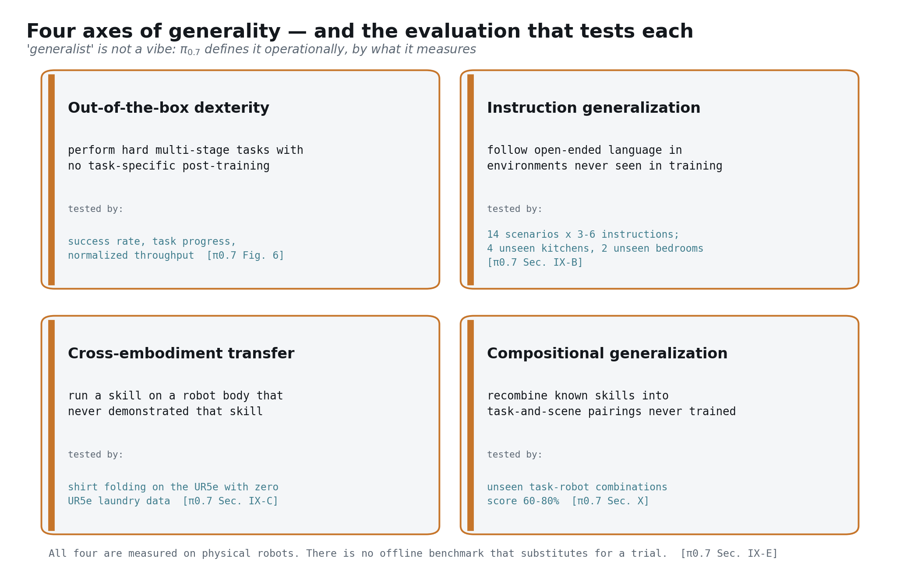
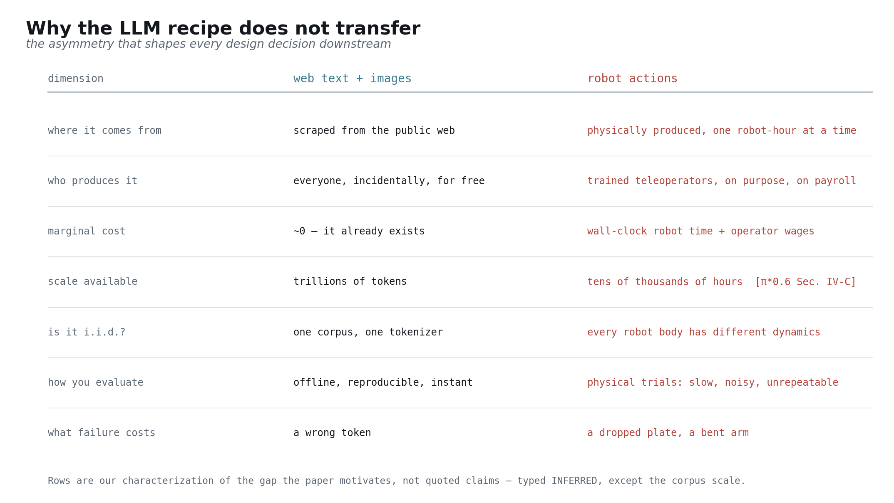
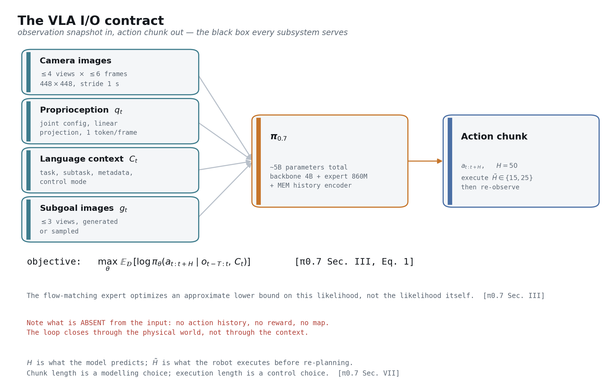
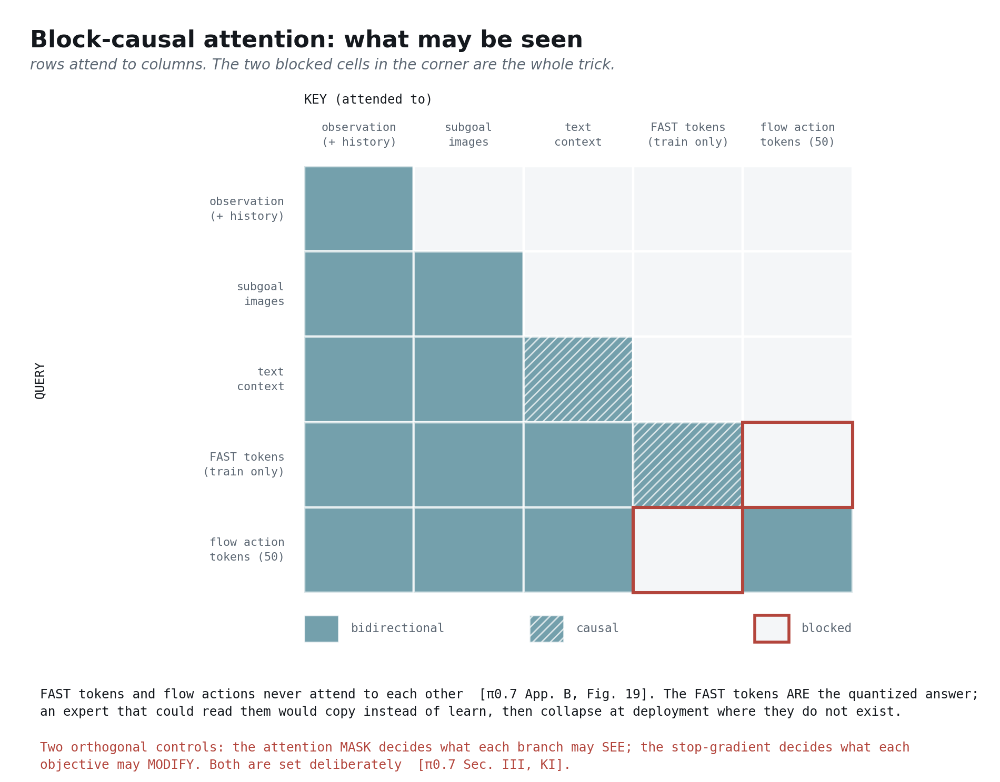
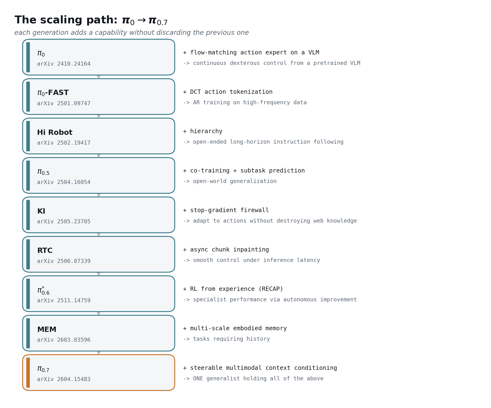
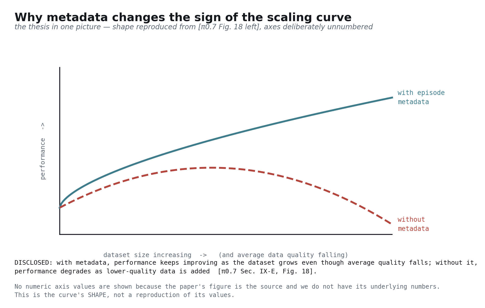
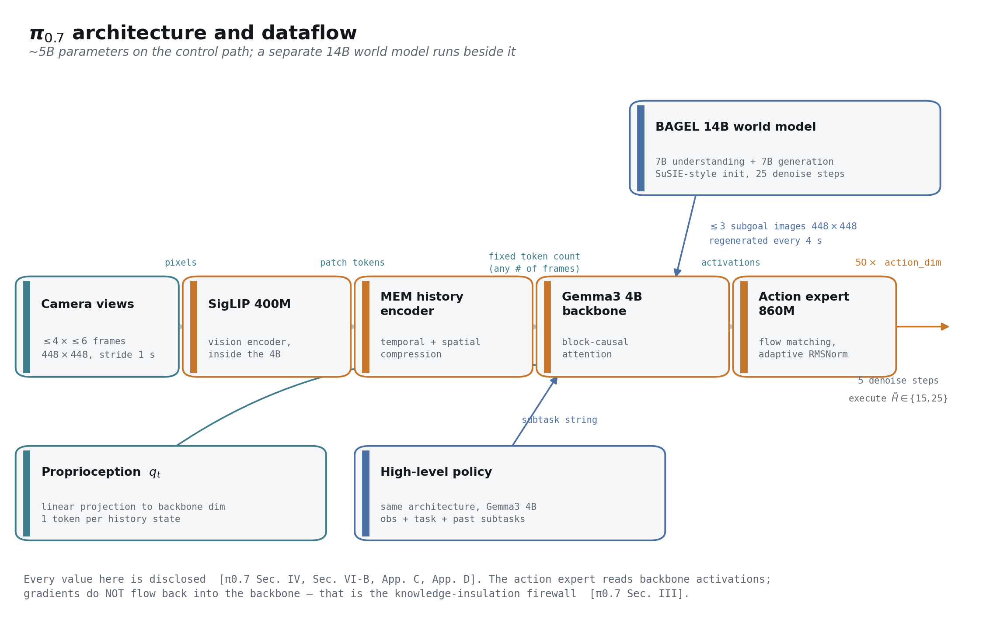
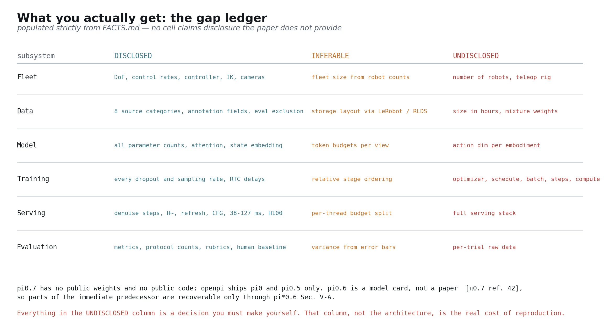

## 本文要论证的一个判断

> 物理 AI 的通用性来自数据的**多样性**；但多样的数据必然是**参差不齐**的，而朴素的训练只会把它们平均成平庸。真正的突破在于：不仅让模型知道**做了什么**，还要让它知道这条数据是**怎么产生的**。丰富的上下文把「数据量」从负担变成了单调收益，也把训练出的模型变成了一个你可以**指挥**的对象。

支撑它的是一条与直觉相反的规模化曲线：加入 episode 元数据后，即便数据集平均质量在下降，性能仍然随着数据量持续上升；而不加元数据时，性能反而随着低质量数据的加入而退化 [π0.7 §IX-E, Fig. 18]。由此还引出一个更漂亮的推论——π0.7 通过元数据条件化，把 π\*0.6 的强化学习轨迹「蒸馏」了进来，**自己一次 RL 都没跑** [π0.7 §VI-A]。

## 怎么读这篇文章

本文假设你熟悉 LLM 的预训练与后训练、扩散与流匹配、大规模 Transformer 工程；同时假设你对机器人**一无所知**。所有机器人领域的前置知识都在正文里讲清楚，并集中放在可跳过的**预备知识**框里。全文的组织依据是 π0.7 论文本身 [π0.7 §I]。

有三条贯穿全文的约定，它们是承重的，不是装饰 [π0.7 §V-E]：

**每一部分都以输入输出契约开场。** 输入 → 输出，凡是论文给了具体形状和单位的地方都写具体值。只要你能说清一个模块「吃什么、吐什么」，就可以在不读它内部实现的前提下对它做推理——也就可以替换它 [π0.7 §IV]。

**每个论断都标注类型。** **已公开**指论文明确写了；**推断**指这是我从公开事实推出来的，并且我会明说；**未公开**指外界无从得知，这类内容一律进入第 10 部分的缺口清单，绝不含糊带过 [π0.7 §VI-A]。

**每个数字都带出处。** 本文的数值由脚本机械校验：只要正文里出现一个不在事实台账中的数字，或者哪一段没有引用，构建就会失败。这是我知道的、能让一篇这么长的文章保持诚实的唯一办法 [π0.7 §V-E]。

最后界定一下范围。本文说的「复现 π0.7」，指的是**理解整条规模化路径、设计哲学，以及数据采集、数据组织、训练与服务的每一个公开细节，足以把这套系统当作一项工程计划重建出来**；它不指移植代码。π0.7 既没有公开权重，也没有公开代码 [π0.7 ref. 42]。

---

# 第 0 部分 —— 目标是什么，以及为什么它很难

**本部分的输入输出：** 输入——你的 LLM 直觉；输出——「通用物理 AI」的精确定义，以及为什么你已经掌握的那套方法论在这里不成立。

## 「通用」在这里究竟指什么

「通用」大概是这个领域被滥用得最厉害的词，所以先从可操作的定义开始：所谓通才，就是在 π0.7 实际测量的四个维度上都拿得出成绩的模型 [π0.7 §I]。



**开箱即用的灵巧性**，指的是不做任何任务专属的后训练，就能完成多阶段的困难操作——同一份权重，不为每个任务微调 [π0.7 §I]。**指令泛化**，指的是在训练中从未见过的环境里执行开放式语言指令；具体协议是 14 个场景，每个场景 3–6 条开放式指令，在 4 个没见过的厨房和 2 个没见过的卧室中进行 [π0.7 §IX-B, Fig. 9]。**跨本体迁移**，指的是把某项技能迁移到一个从未演示过该技能的机器人身体上——比如在双臂 UR5e 上叠衬衫，而几乎所有叠衣数据都采自另一台更轻的机器人 [π0.7 §IX-C]。**组合泛化**，指的是把已知技能重新组合成训练中从未配对过的「任务 × 场景」，这一项的成绩是 60–80%，而分布内则在 90% 以上 [π0.7 §X]。

请注意这四条的共同点：每一条都要靠真机跑起来、靠人盯着看结果来测量。**没有任何离线基准可以替代一次真实试验** [π0.7 §IX-E]。

## 为什么 LLM 那套配方搬不过来

你已经很清楚怎么在文本上造一个通才：爬一个巨大的语料库，用 next-token 预测做预训练，再做指令后训练，离线评测，快速迭代。当输出变成一台物理机器发出的关节指令时，这个闭环几乎每一步都会断掉 [π0.7 §I]。



图中列出的这些不对称，是我对论文所要解决问题的概括，而非原文引述，因此请当作**推断**——只有一项例外。数据规模那一行是公开的：π 系列的预训练语料被描述为「跨越大量任务和多种机器人的数万小时演示数据」[π\*0.6 §IV-C]。放在机器人领域这是个巨量数据集，放在文本语料面前则是个零头。

后果是层层叠加的。因为动作数据必须被**物理地生产出来**，所以**约束是数据而不是算力**。因为每个机器人本体在臂展、质量、惯量、夹爪几何上都不同，语料并不像文本那样独立同分布——论文明确描述 UR5e 显著更长、形态不同、重得多、关节惯量更大，因而需要不同的操作策略和不同的桌面摆位 [π0.7 §VIII, App. F]。又因为评测必须靠真机试验，让 LLM 研究得以飞速迭代的那个循环在这里根本不存在；论文自己就坦承，在这个数据规模下，「实际上很难明确判定哪些任务真正算是『见过』或『没见过』」[π0.7 §IX-E]。

> **预备知识 —— 遥操作。** 由人类操作员驱动机器人完成任务，系统按控制频率同步记录相机画面与关节位置，这段记录就是一条「演示」或一个 episode。今天几乎所有高质量的机器人动作数据都是这么来的——这也是为什么机器人数据是有工资成本的。π0.7 的人类对照实验能让你感受到这里的技能门槛：被招募的 10 名操作员处于经验分布的前 2%，在所有机器人平台上的遥操作时长平均约 375 小时 [π0.7 App. F, Fig. 21]。

## 哪些数据采不到，哪些仿真造不出来

面对昂贵的数据，最自然的反应是上仿真。它的效果远比外行预期的差，而理解「为什么差」几乎能解释 π0.7 的全部设计取向——这套系统完全建立在真实机器人数据、人类视频和网络数据之上，没有任何仿真成分 [π0.7 §VI-A]。

家庭场景里真正重要的任务都是**富接触**且涉及**可形变物体**的：叠衣服、做三明治、削蔬菜、舀咖啡豆、擦洒出来的水。π0.7 的任务清单几乎全是这类——从洗衣篮里取出一件纽扣衬衫叠好、把 T 恤从里往外翻正、涂花生酱并把三明治斜切、用挂绳固定的刀切西葫芦 [π0.7 App. G]。布料、食物和液体都没有可处理的刚体状态；一个能把衬衫动力学模拟到足以支撑抓取点选择的仿真器，本身就是一个研究课题，而不是一件顺手可用的工具。

第二道障碍是家电与环境的长尾。π0.7 的任务里包括打开空气炸锅、用烤箱烤贝果、操作意式咖啡机、以及穿过一扇会自动回弹的壁橱门 [π0.7 App. G]。每一样都是有着具体闩锁行为的具体物件。为它们建立高保真模型不是一个规模问题，而是一个没有边界的建模问题，何况每个家庭里的那一套还都不一样。

于是整个领域被推向真实数据。这一段属于我对「π0.7 为什么把钱花在这些地方」的**推断**，但论文的投入方向强烈暗示了它：机队、遥操作员、标注、数据引擎 [π0.7 §VI-A, §VIII]。

## 核心困境

现在来看驱动整篇论文的那个陷阱 [π0.7 §I]。

通用性要求多样性。要成为通才，你需要很多任务、很多环境、很多机器人本体，以及同一件事的很多种做法。但**大规模采来的多样数据，必然是质量参差的**。有的 episode 快，有的慢；有的干净利落，有的中间摸索了一下又找回来；有的来自资深操作员，有的来自模型自己在评测中失败的回放 [π0.7 §VI-A]。

常规做法是过滤：留下好的，丢掉其余。这是一个谨慎的从业者会做的事，也正是 π0.7 反对的做法。过滤会扔掉你花钱买来的大部分数据，而被扔掉的那些 episode 里，恰恰包含着机器人最需要的信息——事情是怎么出错的，以及出错之后怎么找补回来。但原样全留更糟：在并集上训练，模型学到的是**平均行为**，也就是平庸、犹豫、易错 [π0.7 §I, §IX-E]。

π0.7 选了第三条路：**全都留下，然后告诉模型它正在看的是什么**。给每条 episode 标上它有多快、有多好、中间有没有出错；到了测试时，再向模型索要你想要的那种行为。一条又慢又有失误的 episode 于是不再是污染源，而是一个被正确标注的「慢」和「有失误」的样本，它的存在反而让**条件化**更加锐利 [π0.7 §V-C, §VII]。

如果你觉得这个套路眼熟，那是对的。它就是回报条件化 / 优势条件化的行为克隆，只不过把标量推广成了多模态的上下文 [π\*0.6 §V-B]。第 3 部分会把这层联系讲透。

---

# 第 1 部分 —— 预备：VLA 到底是什么

**本部分的输入输出：** 输入——你的扩散与 Transformer 知识；输出——把「视觉-语言-动作模型」当作一个契约明确的黑盒来理解，外加后文需要的四个机器人概念。

## 契约

视觉-语言-动作模型（VLA）本质上是一个策略：它吃进一份观测和一份上下文，吐出一段未来动作 [π0.7 §III]。



形式化地说，观测是 $o_t = [I_t^1, \ldots, I_t^n, q_t]$——$n$ 路相机图像加上机器人的关节构型；模型输出一个覆盖未来 $H$ 步的动作块 $a_{t:t+H}$，其中只有更短的一段 $\tilde{H} < H$ 会被真正执行，之后模型重新观测、重新规划 [π0.7 §III]。训练目标是

$$\max_{\theta}\; \mathbb{E}_{\mathcal{D}}\left[\, \log \pi_{\theta}\!\left( a_{t:t+H} \mid o_{t-T:t},\, C_t \right) \right]$$

其中 $C_t$ 是上下文，$o_{t-T:t}$ 是一段过去观测的窗口 [π0.7 §III, Eq. 1]。这里要给会去较真似然的读者一个诚实的提醒：流匹配动作专家优化的是这个量的一个近似下界，而不是解析形式的似然本身 [π0.7 §III]。

放到 π0.7 上，这份契约有非常具体的取值。输入是最多 4 路相机——前视、两个腕部、以及可选的后视——每路最多 6 帧历史，采样步长 1 秒，全部缩放到 $448\times448$；再加上最多 3 张子目标图像（省略后视）[π0.7 §VI-B]。输出是恰好 50 个动作 token，也就是一个 50 步的动作块 [π0.7 §VI-B]。而运行时，这 50 步里只执行 15 步或 25 步就重新规划 [π0.7 §VII]。

这份契约里最有教益的，其实是**缺席的东西**。输入里没有动作历史、没有奖励信号、没有地图，除本体感知之外也没有显式的状态估计 [π0.7 §III]。这个策略对自己的输出近乎马尔可夫：**闭环是通过物理世界闭合的，不是通过上下文闭合的**。正是这一个设计选择，让 VLA 的误差累积行为与自回归世界模型截然不同——第 11 部分会回到这个对比。

> **预备知识 —— 控制频率。** 机器人的底层控制器要求以固定频率收到新的目标值。π0.7 的平台跑在 50 Hz，只有 UR5e 是 20 Hz [π0.7 §VIII]。在 50 Hz 下，一个 50 步的动作块正好是一秒钟的运动。这就是为什么延迟在这里是一等约束而非锦上添花：一旦推理耗时超过执行窗口，机器人就会在动作中途卡住。

> **预备知识 —— 动作分块（action chunking）。** 模型不是每次前向只预测一个动作，而是一次联合预测 $H$ 步，机器人执行其中前 $\tilde{H}$ 步。联合预测避免了逐步独立采样带来的抖动和不连贯，同时把推理开销摊薄到很多个控制周期上。$H$ 是建模选择，$\tilde{H}$ 是控制选择，二者在平滑性与反应性之间做权衡 [π0.7 §VII]。

> **预备知识 —— 本体（embodiment）。** 「本体」指一台具体的机器人身体：它的运动学、自由度、夹爪、相机位置。π0.7 覆盖了双臂移动操作机（两条 6 自由度手臂 + 升降轴 + 全向底盘）、静态双臂平台、配 Robotiq 夹爪的双臂 UR5e，以及单臂系统 [π0.7 §VIII, Fig. 4]。它们的动作空间并不相同，这正是「跨本体迁移」成为真问题、而不只是换个标签的原因。

## 动作怎么表示

把连续的机器人动作变成 Transformer 能产出的东西，主流有两条路。π0.7 **两条同时用**——用在不同的参数组上，服务于不同的目标函数 [π0.7 §III]。

**流匹配**把动作块当作一个连续向量，学习一个把噪声输运到数据的速度场，和你在生成模型里熟悉的完全一样 [π0.7 ref. 102]。推理时对这个场做少数几步积分，π0.7 用 5 步 [π0.7 §VII]。这种表示精度高，而精度正是执行机构所要求的。

**离散化 token** 则用基于 DCT 的方案压缩动作块，把它变成语言模型词表里的 token，用普通的 next-token 交叉熵训练 [π0-FAST]。这种表示是有损的，但它让动作目标能够用主干模型的母语说话。

为什么要两条一起上？因为这正是知识隔离要解决的问题 [π0.7 §III]。

## 知识隔离：一道梯度防火墙

先看失败模式，这也是知识隔离被提出来要修的东西 [KI, π0.7 §III]。你拿一个对世界知之甚多的预训练视觉-语言模型，接上一个连续动作头，在机器人数据上训练。这个头产生的高方差回归梯度会回流进主干，把你当初正是为之而来的网络知识给冲垮。最后你得到一个会动、但已经忘了滤锅是什么的模型。

知识隔离用两个控制手段解决它，而从业者常把这两者混为一谈 [π0.7 §III]。

第一个手段是**目标函数**：主干用离散 FAST token 的交叉熵来监督——一个稳定、条件良好、且与它预训练时同类型的分类损失；与此同时连续动作专家用流匹配训练 [π0.7 §III]。

第二个手段是**梯度**：动作专家可以注意到主干的全部激活，但它的梯度**不会**流进主干 [π0.7 §III]。**专家可以读一切，但不能改任何东西。** π0.6 用的正是这个配方——在连续动作和 FAST 离散 token 上端到端训练，同时用一个 stop-gradient 阻止流匹配专家影响模型其余部分 [π\*0.6 §V-A]。

还有第三个手段，而它是大多数解读文章漏掉的：**注意力掩码** [π0.7 App. B, Fig. 19]。



FAST token **只在训练时存在**，并且 FAST token 与流动作**互不注意** [π0.7 App. B, Fig. 19]。这不是什么优化细节，而是正确性要求。FAST token **本身就是量化后的标准答案**。一个能注意到它们的动作专家，会学会从上下文里把答案解码出来，而不是从观测里推断出来；到了部署时那些 token 并不存在，它就会崩掉。

所以，**掩码**管的是每条分支**可以看见什么**；**stop-gradient** 管的是每个目标函数**可以修改什么**。两者都是被刻意设定的，知识隔离之所以成立，靠的是这一对，而不是其中任何一个 [π0.7 §III]。

还有一个值得记住的副产品，第 8 部分会再用到：因为动作 token 注意前缀而前缀不注意动作 token，前缀可以只编码一次，然后在全部 5 个去噪步之间复用缓存 [π0.7 §VII]。一个掩码决策，同时买到了正确性和推理速度。

## 为什么延迟是一等问题

在 LLM 里，延迟是产品问题；在 VLA 里，它是**正确性问题**，因为世界不会等你想完 [π0.7 §VI-B]。

π0.7 的处理方式不是消灭延迟，而是**把策略训练成预期延迟存在**。训练时使用实时分块（RTC），模拟 0–12 个时间步的延迟，对应 50 Hz 机器人上 240 ms 的最大推理延迟 [π0.7 §VI-B]。于是策略被训练成恰好能吸收它将来会遇到的那种延迟。部署实测则舒服地落在预算之内：最小配置下 3 路相机、5 个去噪步时是 38 ms，开启 MEM 视觉编码器并把子目标图像放进上下文后，最坏情况升到 127 ms，全部跑在单张 NVIDIA H100 上 [π0.7 App. D]。

记住这个比值。240 ms 的预算对上 38 ms 的地板，中间那段余量就是系统里其他一切东西的购买力——历史帧、子目标图像、引导；而 127 ms 的最坏情况说明这些可选项实际吃掉了多少余量 [π0.7 §VI-B, App. D]。

## 第 1 部分超参数表

| 参数 | 取值 | 出处 |
|---|---|---|
| 相机路数 | 最多 4（前视、两个腕部、可选后视） | [π0.7 §VI-B] |
| 每路历史帧 | 最多 6 帧，步长 1 秒 | [π0.7 §VI-B] |
| 子目标图像 | 最多 3 张（省略后视） | [π0.7 §VI-B] |
| 图像分辨率 | 448×448 | [π0.7 §VI-B] |
| 动作块长度 $H$ | 50 步 | [π0.7 §VI-B] |
| 执行步长 $\tilde{H}$ | 15 或 25 | [π0.7 §VII] |
| 去噪步数 | 5 | [π0.7 §VII] |
| 控制频率 | 50 Hz；UR5e 为 20 Hz | [π0.7 §VIII] |
| RTC 模拟延迟 | 0–12 步 = 50 Hz 下 240 ms | [π0.7 §VI-B] |
| 推理延迟 | 最小 38 ms，最坏 127 ms，单张 H100 | [π0.7 App. D] |

---

# 第 2 部分 —— 规模化路径：从 π0 到 π0.7

**本部分的输入输出：** 输入——第 1 部分的 VLA 契约；输出——搞清楚每一代各自加进了什么能力、代价是什么，以及 π0.7 为什么必须同时拥有它们全部。

π0.7 不是一个单点的想法。它是一条谱系里的第九项，这条谱系的特点是：**每一代都在不丢弃前一代的前提下增加一项能力**；而 π0.7 自己的贡献，是那套让单个模型能同时握住所有这些能力的条件化方案 [π0.7 §I, §VI-A]。



## 各代都加了什么

**π0** 确立了范式：在预训练视觉-语言模型上挂一个流匹配动作专家，从而把网络级的视觉知识变成连续的灵巧控制 [π0.7 ref. 10]。此后所有工作都在打磨这个架构，而不是替换它。

**π0-FAST** 引入了基于 DCT 的动作 token 化，让高频动作数据上的自回归训练变得可行 [π0.7 ref. 104]。它留给 π0.7 的遗产不在推理路径，而在**训练**路径：知识隔离下用来监督主干的，正是 FAST token [π0.7 §III]。

**Hi Robot** 加入了层级——高层策略产出语义子任务，低层策略负责执行——这是让开放式、长时程指令跟随变得可处理的关键 [π0.7 bibliography]。π0.7 保留了这个结构：高层策略与主模型同架构，把观测、任务描述和过往子任务映射为下一条子任务指令 [π0.7 §V-A, Fig. 2]。

**π0.5** 加入了异构数据协同训练与显式的语义子任务预测，由此实现了对真正没见过的家庭的开放世界泛化 [π0.7 ref. 14]。

**知识隔离（KI）** 贡献了第 1 部分分析过的那道 stop-gradient 防火墙——让你在把 VLM 适配到动作上的同时，不摧毁它已有的知识 [π0.7 ref. 103]。

**实时分块（RTC）** 解决了相邻动作块之间的接缝问题，让机器人可以连续执行，而不必停下来等下一块算完 [π0.7 ref. 107]。π0.7 用的是训练期变体，它与测试期 RTC 不同，不带来任何额外的推理开销 [π0.7 ref. 108, App. D]。

**MEM** 贡献了记忆，而 π0.7 几乎是整套照搬——值得单开一节 [π0.7 ref. 37]。

**π\*0.6** 贡献了「从真实部署经验中做强化学习」，是本文论点最重要的祖先——同样单开一节 [π0.7 ref. 50]。

## π\*0.6 究竟做了什么

把 π\*0.6 简化成「他们用了 RL」，你就会错过 π0.7 真正依赖的那个机制 [π\*0.6 §IV]。

方法叫 **RECAP**——RL with Experience and Corrections via Advantage-conditioned Policies（借助经验与纠正的优势条件化策略强化学习）[π\*0.6 abstract, §IV]。它由三个子过程构成：跑策略采数据并标注 episode 结果，其间可以插入人类的纠正性干预；用迄今为止收集到的全部数据训练一个价值函数；再用从该价值函数导出的最优性指示符，条件化地训练策略 [π\*0.6 §IV-C, Alg. 1]。

价值函数是一个多任务的**分布式**评论家，架构与策略相同但主干更小，为 670M 的 VLM，同样从 Gemma 3 初始化 [π\*0.6 §V-C, Fig. 3]。它把回报离散成 $B = 201$ 个分箱，用蒙特卡洛回报上的交叉熵训练 [π\*0.6 §IV-A]。奖励被刻意设计得极其简陋，好让它适用于任何任务：成功时终止步为 0，失败时为一个大的负常数，其余时刻为 −1；数值再按任务的最大 episode 长度归一化到 $(-1, 0)$ 区间 [π\*0.6 §V-C, Eq. 5]。

接下来是真正关键的一步。RECAP 没有用策略梯度更新——对流匹配策略来说，策略梯度很别扭，因为它给不出可处理的对数似然——而是把策略**条件化**在一个二值化的优势指示符上，并且这个指示符是以**纯文本**形式插入的：「Advantage: positive」或「Advantage: negative」[π\*0.6 §V-B]。指示符的位置在语言输入之后、动作之前，因此只影响动作部分的对数似然 [π\*0.6 §V-B]。阈值 $\varepsilon_{\ell}$ 取该任务下评论家预测值的 30% 分位数；人类纠正则一律强制为 positive，其假设是专家干预总是好动作 [π\*0.6 §V-D, §IV-B]。又因为训练时会随机丢掉该指示符，推理阶段自然就能用无分类器引导 [π\*0.6 §V-B]。

有两个工程细节的价值超出了这篇论文本身。其一，**每一轮迭代都从预训练检查点微调，而不是从上一轮的结果继续**，以避免多轮之间的漂移 [π\*0.6 §V-D]。其二，专家模型从预训练模型微调而来，而最终的通才模型是从头训练的 [π\*0.6 §IV-C]。回报是：RECAP 在最难的一批任务上把吞吐量提高了一倍以上，把失败率大致砍半，足以支撑连续 13 小时做意式咖啡、在一个陌生家庭里连续 2 小时叠新衣物而无需人工介入 [π\*0.6 abstract, §I]。

现在回头看优势条件化**本质上是什么**：它就是把行为克隆策略条件化在一个「这段演示有多好」的文本标签上。π0.7 拿走了这个想法，并把标签从一个二值标量推广成一整束多模态上下文 [π0.7 §V-C]。

π\*0.6 还顺带记录了它的前任。π0.6 没有论文，只有一张模型卡 [π0.7 ref. 42]；但 π\*0.6 披露了它派生自 π0.5、基础 VLM 用 Gemma 3 4B、动作专家扩大到 860M、预训练集加入了更多机器人平台的数据，并以 50 Hz 输出关节角与夹爪指令 [π\*0.6 §V-A]。对外部团队来说，关于 π0.6 需要知道的大部分内容就在这里了。

## MEM 贡献了什么

MEM 是 Multi-Scale Embodied Memory（多尺度具身记忆）。它之所以存在，是因为把策略直接条件化在一长串原始观测上，在计算上根本无望 [MEM §I]。朴素地把帧塞进主干会让推理时间冲破实时红线——在单张 H100、4 路相机的 π0.6 VLA 上，这条红线实测为 300 ms [MEM Fig. 3]。

MEM 按**时间尺度**把记忆拆成两层 [MEM abstract, §III-A]。**长时程**记忆是一段**语言**摘要，由高层策略维护：它根据自己上一次的摘要加上当前观测，预测出更新后的摘要 [MEM §III-B]。这些更新的训练数据来自一个现成的 LLM——它把过往子任务及其成败指示汇总成摘要，并被明确要求「凡是可以删的、可以压缩的就删掉压掉」[MEM §III-B]。**压缩本身就是重点**：如果只是朴素地把所有历史子任务指令拼起来，效果会显著更差，因为推理时策略反复重试同一个失败子任务所产生的序列，在近乎最优的训练演示里根本不会出现 [MEM §IV-A, Fig. 6]。

**短时程**记忆则是一个改造 ViT 注意力模式而来的视频编码器：每帧观测内部做双向空间注意力，另外每隔 4 层加一次跨帧的因果时间注意力 [MEM §III-C, Fig. 4]。这个分解把开销从 $O(n^2 K^2)$ 降到 $O(Kn^2 + nK^2)$ [MEM §III-C]。有两条性质让它几乎可以白嫖：其一，只有当前时刻的表示会向后传递，因此编码器输出的 token 数与一个无记忆的单帧 VLA 完全相同 [MEM §III-C]；其二，相比标准单图 ViT，它**不引入任何新的可学习参数**，记忆能力全部来自注意力模式加一个固定的正弦时间位置编码 [MEM §III-C]。在 $K = 1$ 时，其初始化与源 VLM 完全一致，因为该位置编码在 $t = 0$ 处取值为 $0$ [MEM §III-C]。

MEM 预训练用 6 帧观测——5 帧过去加当前一帧——步长 1 秒，后训练还可以扩展到 18 帧、54 秒 [MEM §III-D]。对照一下 π0.7 的输入契约：每路相机最多 6 帧历史，步长 1 秒 [π0.7 §VI-B]。π0.7 连状态的处理方式也一并继承了：用线性投影把本体感知嵌入进主干维度，取代 π0.6 的文本 token 方案 [MEM §III-D, π0.7 §VI-B]。

## 该提炼出的那条哲学

九代下来的这个模式值得明说，因为它才是对任何想做这类项目的人真正的启示：**能力是累积的，不是被替换掉的**。若干代之前引入的 FAST token 化，如今仍是主干的训练信号 [π0.7 §III]；Hi Robot 的层级结构，如今仍是子任务接口 [π0.7 §V-A]；MEM 的编码器是一个部件，而不是一次替换 [π0.7 §IV]。

而 π0.7 自己的贡献，是那套让单个通才同时握住所有这些能力的条件化方案——其中明确包括**吸收 RL 专家的行为**：π\*0.6 在 RL 训练期间采集的数据被当作额外训练样本使用，论文称之为「一种『蒸馏』过程」[π0.7 §VI-A]。通才继承了专家的能力，而自己并不需要跑 RL。

---

# 第 3 部分 —— π0.7 的核心想法：可指挥的上下文条件化

**本部分的输入输出：** 输入——谱系脉络；输出——定义 π0.7 的那一次重新表述，逐字段拆开，并附上每一个 dropout 比率。

## 条件化在「怎么做」，而不只是「做什么」

标准的指令跟随，是把策略条件化在**做什么**上：一条任务字符串。π0.7 的动作，是把上下文 $C_t$ 从一条干巴巴的指令，扩展成一束同时描述**这条 episode 是怎么产生的**多模态信息 [π0.7 §III, §IV]。

整个想法在一个字符串里就看得明明白白 [π0.7 §V-E]：

```
<Multi-view observation><Multi-view subgoals>
Task: peel vegetables. Subtask: pick up the peeler. Speed: 8000.
Quality: 5. Mistake: false. Control Mode: joint.<Proprioception>
```


## 各字段解析

**子任务指令** $\tilde{\ell}_t$——与总任务 $\ell_t$ 并列的中间层语义子任务，沿袭自 π0.5。推理时它可以来自一个学到的高层策略、来自一个在旁边「教」机器人的人，也可以干脆省略 [π0.7 §V-A]。

**子目标图像** $g_t$——期望达成的近期未来状态的多视角图像。基座视角承载环境与物体层面的结果，腕部视角承载手臂与夹爪层面的结果 [π0.7 §V-B]。这是一种**视觉指令**，而且事实证明，跨本体迁移提升最大的通道正是它。

**Episode 元数据** $m$——三个由人给出的标签。*总体速度*是 episode 的时间步长度，按 500 步分箱，于是一条 1750–2250 步的 episode 会被呈现为「2000 steps」[π0.7 §V-C]。*总体质量*是 1 到 5 的整数，5 为最好 [π0.7 §V-C]。*失误*是按动作片段给出的布尔量，由人粗粒度标注 [π0.7 §V-C]。

**控制模式** $c \in \{\mathrm{joint},\, \mathrm{ee}\}$——动作空间是关节位置还是末端执行器位姿 [π0.7 §V-D]。

元数据就是那条论点的具体形态。「Speed: 8000」描述的不是任务，而是这批动作所来自的那条 **episode**。一条又慢又笨拙的演示于是不再是待过滤的噪声，而是一个被正确标注的「慢且笨拙」的样本；它的存在，反而让模型对「快」和「高质量」的理解更加锐利 [π0.7 §IX-E]。

## dropout 才是让字段「可选」的机制

这么丰富的上下文带来一个部署难题：测试时你未必有子目标图像，未必有子任务字符串，也未必有可靠的元数据。π0.7 的回答是——**训练时按特定比率丢弃每一个字段**，逼着模型在缺了它的情况下依然称职 [π0.7 §V-E]。

完整的调度表，全部出自同一节 [π0.7 §V-E]：

- 子目标图像只加入每个 batch 中 **25%** 的样本 [π0.7 §V-E]
- 在这些带子目标的样本里，子任务指令有 **30%** 的概率被丢弃 [π0.7 §V-E]
- Episode 元数据整体有 **15%** 的概率被丢弃 [π0.7 §V-E]
- 元数据的每个分量——速度、质量、失误——再各自以 **5%** 的概率被单独丢弃 [π0.7 §V-E]
- 控制模式**完全不做 dropout** [π0.7 §V-E]

其中两个比率值得细看，因为论文对其中一个给了明确理由，对另一个则保持了意味深长的沉默 [π0.7 §V-E]。

**25%** 这个子目标比率不是什么正则化的经验值。**有了子目标图像，任务会退化成接近逆动力学**——模型可以直接读出目标状态然后往那儿插值——因而训练得快得多 [π0.7 §V-E]。放任不管的话，模型就会一直吃这条容易的通道，而把难的那条训练不足。把子目标限制在四分之一的样本里，是为了让「从观测到动作」这条通路始终是承重的。这条原则很值得偷走：**当某个输入通道让任务变得太容易时，就要给它限量。**

控制模式**完全不 dropout**，则是一个镜像式的决定 [π0.7 §V-E]。其他每个字段都是建议性的——关于「怎么做」的提示。而控制模式是**关于动作空间本身的硬事实**：关节位置和末端位姿是两套不同的输出语义，一个搞不清自己正在输出哪一种的模型，不叫「可指挥」，叫「坏了」。**可选字段才做 dropout；语义契约不做。**

## 运行时的「指挥」

因为模型已经学到了行为模式上的条件分布，部署就变成了「向它索要你想要的那个模式」[π0.7 §VII]。

运行时的设定毫不客气：速度提示按任务设为该任务 episode 长度的**第 15 百分位**——也就是要求一次比绝大多数训练演示都更快的执行；质量恒定设为 **5**；失误恒定设为 **false** [π0.7 §VII]。**系统在平庸的数据上训练，然后在推理时被要求表现得像其中最好的那一批。**

又因为 dropout 造就了一个「有元数据能用、没元数据也能用」的模型，无分类器引导（CFG）就直接可用了。π0.7 对 episode 元数据施加 CFG，权重 $\beta \in \{1.3,\, 1.7,\, 2.2\}$ [π0.7 §VII]。这个机制你在扩散模型里已经很熟：从无条件预测的方向往外外推，把结果更用力地推向条件所指的模式。只不过这里的「条件」不是一段描述内容的文本提示，而是一份**关于行为质量的描述**。调高 $\beta$，就是调高策略对「快、干净、不出错」这件事的坚决程度。

这就是全部的核心想法 [π0.7 §IV]。剩下各部分讲的，都是把它在真实规模上跑起来所需要的机械装置。

## 第 3 部分超参数表

| 参数 | 取值 | 出处 |
|---|---|---|
| 总体速度 | episode 时间步长度，500 步分箱（1750–2250 → 「2000 steps」） | [π0.7 §V-C] |
| 总体质量 | 1–5 的整数，5 最好 | [π0.7 §V-C] |
| 失误 | 布尔量，按动作片段，人工标注 | [π0.7 §V-C] |
| 控制模式 | joint 或 ee | [π0.7 §V-D] |
| 带子目标图像的样本比例 | 每 batch 25% | [π0.7 §V-E] |
| 其中子任务被丢弃 | 30% | [π0.7 §V-E] |
| 元数据整体丢弃 | 15% | [π0.7 §V-E] |
| 元数据各分量额外丢弃 | 5% | [π0.7 §V-E] |
| 控制模式 dropout | 无 | [π0.7 §V-E] |
| 运行时速度提示 | 任务 episode 长度的第 15 百分位 | [π0.7 §VII] |
| 运行时质量提示 | 恒为 5 | [π0.7 §VII] |
| 运行时失误提示 | 恒为 false | [π0.7 §VII] |
| 元数据 CFG 权重 $\beta$ | 1.3、1.7 或 2.2 | [π0.7 §VII] |

---

# 第 4 部分 —— 子系统：机队与遥操作

**输入输出：** 输入——人类意图，由操作员驱动机器人表达；输出——真实硬件上记录下来的轨迹，即同步的图像与关节位置。

一次复现真正开始的地方就在这里，钱也主要花在这里。这一层不存在，模型就无从训起，论文也专门用一整节来讲它跑在什么硬件上 [π0.7 §VIII]。

## 平台

π0.7 覆盖四类平台 [π0.7 §VIII, Fig. 4]：

- **双臂移动操作机**——两条 6 自由度手臂、1–2 自由度升降轴、全向底盘 [π0.7 Fig. 4]
- **静态双臂「BiPi」**——两条轻量 6 自由度手臂配 1 自由度夹爪 [π0.7 §VIII, Fig. 4]
- **双臂 UR5e**——工业臂配 Robotiq 夹爪 [π0.7 §VIII, Fig. 4]
- **单臂 6 自由度系统** [π0.7 §VIII, Fig. 4]

夹爪全线为平行两指式 [π0.7 §VIII]。各平台统一采用 6 自由度手臂并非巧合：正是它让一套共享的关节空间动作表示，连贯到足以支撑迁移 [π0.7 §VIII, Fig. 4]。

## 控制与传感

控制频率除 UR5e 为 20 Hz 外，其余一律 50 Hz [π0.7 §VIII]。传感为一路前视相机加每条手臂一路腕部相机，移动机器人再加一路后视 [π0.7 §VIII]。这恰好就是输入契约里的「最多 4 路相机」：前视、两个腕部、可选后视 [π0.7 §VI-B]。

执行端则刻意保持简单。模型的动作输出通过一个 **PD 控制器**下发；在末端执行器模式下，由**数值逆运动学**把目标末端位姿转换成目标关节位置 [π0.7 §VIII]。没有学出来的底层控制器，没有力矩级策略，底下也没有垫一层模型预测控制。学习到的策略输出位置目标，剩下的交给经典控制。

这一点值得停一下，因为它和常见预期正好相反：**复杂度全部集中在高层策略，栈的底部是教科书内容** [π0.7 §VIII]。**推断：**这样做让这条不依赖仿真的流水线保持可控，也让同一个策略能在共享同一接口的不同本体之间移植；但论文并没有明确论证这一点。

## 为什么 UR5e 是那块硬骨头

UR5e 是跨本体的压力测试，论文对原因说得很具体：它显著更长、形态不同、重得多、关节惯量大，因而需要不同的操作策略和不同的桌面摆位 [π0.7 §VIII, App. F]。团队根本没有用双臂 UR5e 采集过任何叠衣数据，并且发现它总体上更难遥操作，也不太适合非常精细的抓取 [π0.7 §IX-C]。

最后这个事实重新定义了整个跨本体结果的意义。迁移到 UR5e 不只是一项基准测试——它是**从一个「遥操作起来很痛苦」的平台上拿到数据的办法**。一个能迁移到新本体的模型，就打开了在那个本体上完全不靠人类遥操作、自主采集数据的可能性 [π0.7 App. F]。

而且这次迁移产生的是真正意义上的**涌现行为**，而非模仿。在源机器人上，操作员习惯用倾斜的末端接近布料、先把织物压在桌面上再提起；在 UR5e 上，π0.7 转而采用更契合该臂运动学的**垂直抓取**——这个策略在训练数据里并不存在，却更适合目标本体 [π0.7 Fig. 13]。若再用世界模型生成的子目标图像，效果还会进一步提升，结果图中标为 π0.7 (GC) [π0.7 §IX-C, Fig. 12]。

## 第 4 部分超参数表

| 参数 | 取值 | 出处 |
|---|---|---|
| 控制频率 | 50 Hz；UR5e 为 20 Hz | [π0.7 §VIII] |
| 手臂自由度 | 各平台均为 6 | [π0.7 §VIII, Fig. 4] |
| 移动操作机 | 2 × 6 自由度臂、1–2 自由度升降、全向底盘 | [π0.7 Fig. 4] |
| 静态双臂（BiPi） | 2 × 6 自由度臂、1 自由度夹爪 | [π0.7 §VIII, Fig. 4] |
| 夹爪 | 平行两指；UR5e 用 Robotiq | [π0.7 §VIII, Fig. 4] |
| 相机 | 前视 + 每臂一路腕部；移动平台加后视 | [π0.7 §VIII] |
| 底层控制器 | PD | [π0.7 §VIII] |
| 末端执行器模式 | 数值逆运动学 → 关节目标 | [π0.7 §VIII] |
| 机队规模 | **未公开** | [π0.7 §VIII] |
| 遥操作装置 | **未公开** | [π0.7 §VIII] |

---

# 第 5 部分 —— 子系统：数据引擎

**输入输出：** 输入——机队、人类标注者、公开网络；输出——一份带标注、带混合权重的训练语料，其中每条 episode 都附有「它是怎么产生的」这一描述。


## 八类数据来源

π0.7 在八类数据上训练 [π0.7 §VI-A]：

1. **遥操作演示**，覆盖静态与移动、单臂与双臂平台，场景包括实验室式、类家庭式和真实家庭 [π0.7 §VI-A]
2. **自主数据**，来自大量的策略评测过程 [π0.7 §VI-A]
3. **人类干预**，即策略回放过程中的专家纠正 [π0.7 §VI-A]
4. **π\*0.6 的 RL 轨迹**，作为额外样本使用 [π0.7 §VI-A]
5. **开源机器人数据集** [π0.7 §VI-A]
6. **第一人称人类视频** [π0.7 §VI-A]
7. **非机器人的网络数据**——物体定位、属性预测、VQA、纯文本 [π0.7 §VI-A]
8. **视频-语言任务**，包括对自有机器人视频和网络视频的字幕生成 [π0.7 §VI-A]

注意这份清单的结构：**只有前四类涉及机队**，其余都是杠杆——网络与视频数据维持主干的语义知识，机器人数据教会执行 [π0.7 §VI-A]。

## 刻意的背离：把「坏数据」留下来

常规做法是精选。π0.7 反其道而行，**大量使用次优的机器人数据**——失败的 episode、包含明显失误的成功 episode，以及旧版本模型在评测过程中采集的数据 [π0.7 §VI-A]。

这之所以安全，全靠元数据。一条标着「质量 2、失误 true」的 episode，不是被污染的训练信号，而是一个来自行为空间中某个区域的、被正确标注的样本——模型应该有能力表示这个区域，然后在推理时被引导着避开它 [π0.7 §V-C, §VII]。**过滤与条件化是对同一个问题的两种处理方式**，而 π0.7 的规模化结果就是「条件化占优」的论据 [π0.7 §IX-E, Fig. 18]。

## 那一步「蒸馏」

数据一节里最有分量的一句话是：π\*0.6 在 RL 训练期间采集的数据被当作额外训练样本使用，论文称之为「一种『蒸馏』过程」[π0.7 §VI-A]。

把这条链路捋一遍。π\*0.6 在真实机器人上跑了真实的 RL，用价值函数和优势条件化把专家策略推到了超过人类演示的水平 [π\*0.6 §IV, §I]。这些轨迹——连同它们相对遥操作的改进——变成了 π0.7 的普通条件化训练样本。**通才由此获得了专家级的行为，而自己一次 RL 也没跑**，靠的纯粹是在带质量元数据的 RL 轨迹上做监督训练 [π0.7 §VI-A]。

对做过 LLM 后训练的读者，这一步应该立刻能对上号：这是从一个 RL 调优过的教师向监督学生做蒸馏，只不过多了一个转折——「奖励」并没有被烘焙进权重，而是**以条件变量的形式活到了学生身上** [π\*0.6 §V-B, π0.7 §V-C]。

## 标注

上下文里的那些字段总得有个来源，而它们大多来自人 [π0.7 §V-A, §V-C]。

子任务切分给出语义子任务字符串 [π0.7 §V-A]；质量是 1–5 的评分 [π0.7 §V-C]；失误标签是按动作片段的布尔量，原文描述为「由人类对我们的数据做粗粒度标注而来」[π0.7 §V-C]；速度是唯一机械导出的字段，即按 500 步分箱的 episode 长度 [π0.7 §V-C]。

「粗粒度」这个词在这里是有分量的。这不是一套高精度标注工程，而是在一个极大语料上做的一遍廉价扫描，而整个系统被设计成能容忍这一点。**未公开：**标注规范、标注者一致性、每条 episode 的标注成本，以及分歧如何裁决 [π0.7 §V-C]。

不过标注质量确实有一处硬依赖被记录在案。在世界模型训练中，标签质量——**尤其是时间切分的质量**——对子目标质量有很大影响 [π0.7 App. C]。片段边界决定了「达成的子目标」是什么，边界一糊，世界模型生成的目标就是错的。

## 评测卫生

有一条脚注承载了极大的分量：**在任何以泛化为目标的评测任务中采集到的自主数据，都被排除在训练之外** [π0.7 §VI-A fn. 1]。

没有这条排除，飞轮就会在你不知不觉间拿测试集训练 [π0.7 §VI-A fn. 1]。系统部署一个策略，记录它在评测中的行为，再把这些数据喂回训练——这恰恰就是「一边污染留出任务、一边相信自己测的是泛化」的标准姿势。这类纪律不会出现在任何结果表里，却完全决定了那些结果有没有意义。

## 数据是怎么组织的

**本小节整体为推断。** π0.7 对其内部存储格式只字未提 [π0.7 §VI-A]。但从上下文字段可以反推出 schema，而开源生态恰好提供了一个值得讲的具体实例，也正好对应上下文字段所暗示的那套结构 [π0.7 §V-C]。

开源那一侧按**访问模式**分成两条路，这套结构与上下文字段所要求的 schema 是对得上的 [π0.7 §VI-B]。**LeRobot** 把 episode 存成 Parquet 表加 MP4 视频，配一个 `meta/tasks` 索引，提供 map 式随机访问——这是微调阶段的正确选择，因为那时你是在一个装得下的数据集上做打乱。**RLDS/TFDS** 则以分片流式读取，配大容量 shuffle buffer 和跨数据集的加权交织——这是预训练阶段的正确选择，因为那时的混合语料大到无法建索引。可以推广的原则是：**格式服从访问模式，访问模式服从规模。**

比文件格式更重要的是**记录 schema**，而它由上下文束直接决定：按 episode 的质量、速度、控制模式；按片段的子任务文本与失误标记；按帧的最多 4 路相机图像与本体感知 [π0.7 §V-C, §VI-B]。任何复现都必须把这些字段当作一等列来承载，因为训练正是条件化在它们之上的。

## 规模化的回报

上面这一切的存在，都是为了得到一个结果 [π0.7 §IX-E, Fig. 18]。



有了 episode 元数据，即便平均数据质量在下降，性能仍随数据量持续上升；没有元数据，性能则随着低质量数据的加入而退化 [π0.7 §IX-E, Fig. 18]。**规模化曲线的符号，取决于你有没有告诉模型它在看什么。**

第二个消融进一步锐化了「多样性」在操作层面的含义：**去掉任务多样性最高的那 20% 机器人数据，造成的损害明显大于随机去掉 20%** [π0.7 §IX-E, Fig. 18]。数据的价值并不按小时均匀分布。**不寻常任务构成的长尾承载了不成比例的权重**，这对采集预算的分配是一个明确的论据：优先铺广度，而非堆深度。

## 第 5 部分超参数表

| 参数 | 取值 | 出处 |
|---|---|---|
| 数据来源类别数 | 8 | [π0.7 §VI-A] |
| 质量标注 | 1–5 整数 | [π0.7 §V-C] |
| 失误标注 | 按动作片段的布尔量，粗粒度 | [π0.7 §V-C] |
| 速度导出方式 | episode 长度，500 步分箱 | [π0.7 §V-C] |
| 评测卫生 | 泛化类评测的自主数据被排除 | [π0.7 §VI-A fn. 1] |
| 多样性消融 | 去掉最多样的 20% 比随机去 20% 伤害更大 | [π0.7 §IX-E, Fig. 18] |
| π 系列预训练语料规模 | 数万小时 | [π\*0.6 §IV-C] |
| 数据集小时数 / episode 数 | **未公开** | [π0.7 §VI-A] |
| 各来源混合权重 | **未公开** | [π0.7 §VI-A] |
| 标注规范与一致性 | **未公开** | [π0.7 §V-C] |
| 存储格式 | **推断**，取自开源对应物 | [π0.7 §VI-A] |

---

# 第 6 部分 —— 子系统：模型架构

**输入输出：** 输入——最多 4 路相机 × 最多 6 帧历史（$448\times448$）、最多 3 张子目标图像、本体感知及其历史、文本上下文；输出——50 个动作 token，构成一个动作块 [π0.7 §VI-B]。



## 参数预算

π0.7 的控制通路合计约 **5B** 参数 [π0.7 §IV, Fig. 2]。拆开来看：一个 **4B** 的 VLM 主干，从 **Gemma3 4B** 初始化，其中已经包含一个 **400M** 的 SigLIP 类视觉编码器；再加一个 **MEM 式视频历史编码器**；再加一个 **860M** 的流匹配动作专家 [π0.7 §IV, §VI-B, Fig. 2]。

对习惯了 LLM 尺度的读者，这里有两点值得留意。其一，**这个模型很小**——总共 5B，单张 H100 就能部署 [π0.7 App. D]。约束是延迟，不是能力：更大的主干塞不进控制回路。其二，**860M 的动作专家占了相当大的比重**，大约五分之一。动作生成不是挂在语言模型上的一个薄头，而是一个有自己目标函数、自己梯度隔离的主要子网络 [π0.7 §III]。

控制通路旁边还站着世界模型，从 **BAGEL** 初始化——一个 **14B** 的 mixture-of-transformers，采用 SuSIE 式初始化 [π0.7 §V-B, App. D]。它内部把 ViT token 交给一个 **7B** 的 LLM 主干，把 VAE token 交给一个 **7B** 的生成主干 [π0.7 App. C]。**它的体量接近它所辅助的那个策略的三倍，而且并不在控制回路里运行。**

高层策略与主模型同架构，同样基于 Gemma3 4B，把观测、任务描述和过往子任务指令映射为下一条子任务 [π0.7 §V-A, App. D]。

## 历史编码器

π0.7 的记忆能力来自历史编码器，而它整套继承自 MEM [π0.7 §IV]。

它同时做**时间**与**空间**压缩，而最关键的性质是：**无论输入多少帧历史，它输出的 token 数是固定的**——历史被压缩到与单帧相同的 token 数 [π0.7 §IV, §VI-B]。这正是历史之所以「用得起」的原因：**在主干看来，多加 6 帧记忆的序列长度开销是零。**

具体机制照 MEM 所述，是改造后的 ViT 注意力模式——每帧内部双向空间注意力，每隔 4 层加一次跨帧因果时间注意力，并且只把当前时刻的表示往后传，相比标准单图 ViT 不引入任何新的可学习参数，只多一个固定的正弦时间位置编码 [MEM §III-C]。π0.7 自己的设定是每路相机最多 6 帧、步长 1 秒，整段历史以 $p = 0.3$ 丢弃，后视图像同样以 $p = 0.3$ 丢弃 [π0.7 §VI-B]。

## 状态：一处小改动，理由很清楚

π0.6 把机器人的本体感知状态表示成**离散化的文本 token** [π\*0.6 §V-A]。π0.7 转而沿用 MEM 的做法，用**线性投影**把本体感知嵌入到主干维度，每一帧历史状态各占一个 token，当该帧被丢弃时对应状态 token 一并被掩掉 [π0.7 §VI-B]。

理由是序列长度。一旦引入状态历史，文本 token 表示会迅速产生大量状态 token，而线性投影严格地一个状态一个 token [MEM §III-D]。这是一条通用规则的干净例证：**对单帧适用的表示，放到序列上可能就承受不起。** 一旦加入记忆，每帧的编码开销会被乘上帧数，「无损但冗长」的编码方式就不再划算。

## 动作专家

动作专家是一个 **860M** 的 Transformer，以流匹配训练，用**自适应 RMSNorm** 注入流的时间步 [π0.7 §VI-B]。它承载恰好 **50** 个动作 token，这些 token 彼此双向注意，并注意主干的激活 [π0.7 §VI-B]。

动作 token 之间用双向注意力是正确的选择，也值得点一句 [π0.7 §VI-B]：动作块是**联合生成**的，不是自回归生成的，因此没有理由给块内位置强加因果顺序。**因果性是「世界中的时间」的性质，不是采样过程的性质。**

## 注意力的精确形态

总体模式是**块因果** [π0.7 §VI-B]。观测 token 与子目标图像 token 各自在内部双向注意；目标 token 可以额外注意观测；其后的文本 token 使用因果注意力 [π0.7 §VI-B]。当图像目标不存在时，模式与 π0.5 相同，所有具备记忆能力的图像视角的嵌入之间是全局双向的；当目标存在时，它们构成文本提示之后的一个额外的块因果双向块 [π0.7 App. B, Fig. 19]。

以及第 1 部分那条承重约束：FAST token **只在训练时存在**，且 FAST token 与流动作互不注意 [π0.7 App. B, Fig. 19]。

推理侧还有一处很巧的细节。做无分类器引导时，正例和负例被打包进**同一条序列**，构成一棵「注意力树」，两条分支互不注意 [π0.7 App. B]。CFG 通常意味着两次前向；这里变成了一次前向加一个掩码。世界模型用了同样的技巧，只是掩码更复杂，因为它有 3 个 CFG 组而不是 2 个 [π0.7 App. B]。

## 世界模型

世界模型的职责是生成子目标图像：给定当前观测和目标子任务，产出「近期未来应该长什么样」[π0.7 §V-B]。

它的目标是对真值子目标做条件流匹配 [π0.7 §V-B]：

$$\max_{\psi}\; \mathbb{E}\left[\, \mathcal{L}_{\mathrm{CFM}}\!\left( g^{*}_{t},\; g_{\psi}(o_t,\, \tilde{\ell}_t,\, m) \right) \right]$$

其中真值子目标 $g^{*}_{t} = o_{t_{\mathrm{end}}}$ 取自那些子任务标签质量特别高的片段末尾 [π0.7 §V-B]。每个训练样本由一条子任务指令、3 路相机输入和 3 张目标图像构成，目标时刻取该片段的最后一帧 [π0.7 App. C]。

沿用 BAGEL 的做法，相机输入同时经过 ViT（负责语义理解）和 VAE（负责细粒度图像细节）两条路 [π0.7 App. C]。两条路使用**不同的分辨率**——ViT 输入 $448\times336$，VAE 输入（含目标图像）$512\times384$——原因是二者的 patch 大小不同，分别为 14 和 16 [π0.7 App. C]。这是一个只有落到实现层才会浮现的约束的绝佳例子：**分辨率是 patch 大小的下游产物**，混用两个 tokenizer 就意味着要调和它们的网格。

## 第 6 部分超参数表

| 参数 | 取值 | 出处 |
|---|---|---|
| 控制通路总参数 | 约 5B | [π0.7 §IV, Fig. 2] |
| VLM 主干 | 4B，来自 Gemma3 4B | [π0.7 §IV, Fig. 2] |
| 视觉编码器 | 400M SigLIP 类，含在 4B 之内 | [π0.7 §IV, §VI-B] |
| 动作专家 | 860M，流匹配 | [π0.7 §IV, §VI-B] |
| 时间步注入 | 自适应 RMSNorm | [π0.7 §VI-B] |
| 动作 token | 50 个，双向，注意主干激活 | [π0.7 §VI-B] |
| 历史编码器 | MEM 式，任意帧数输出固定 token 数 | [π0.7 §IV, §VI-B] |
| 状态嵌入 | 线性投影，每帧历史状态 1 个 token | [π0.7 §VI-B] |
| 注意力 | 块因果；FAST ⊥ 流动作 | [π0.7 §VI-B, App. B, Fig. 19] |
| CFG 实现 | 注意力树，单序列两分支 | [π0.7 App. B] |
| 世界模型 | BAGEL 14B，SuSIE 式初始化 | [π0.7 §V-B, App. D] |
| 世界模型子主干 | 7B 理解 + 7B 生成 | [π0.7 App. C] |
| 世界模型分辨率 | ViT 448×336；VAE 512×384（patch 14 / 16） | [π0.7 App. C] |
| 高层策略 | 同架构，Gemma3 4B | [π0.7 §V-A, App. D] |
| 各本体的动作维度 | **未公开** | [π0.7 §VI-B] |

---

# 第 7 部分 —— 子系统：训练流水线

**输入输出：** 输入——带标注的语料，加上初始化权重（Gemma3 4B、SigLIP 400M、BAGEL 14B）；输出——训练好的 π0.7、世界模型和高层策略 [π0.7 §V, §VI]。

## 两个耦合的目标函数

训练在两组参数上优化两个目标函数，由一个 stop-gradient 耦合起来 [π0.7 §III]。

主干用 FAST token 交叉熵监督，动作专家用流匹配监督；专家注意主干激活，但梯度不回流到主干 [π0.7 §III]。本部分其余内容，讲的都是「上下文里放什么」以及「多久把它抽掉一次」。

## 全部 dropout 与采样比率

这是一次复现无法靠猜的部分，所以在此完整列出 [π0.7 §V-E, §VI-B, §VI-C]。

**上下文 dropout** [π0.7 §V-E]：

- 子目标图像：出现在每 batch **25%** 的样本中 [π0.7 §V-E]
- 子任务指令：在带子目标的样本中以 **30%** 概率丢弃 [π0.7 §V-E]
- Episode 元数据：整体以 **15%** 概率丢弃 [π0.7 §V-E]
- 元数据各分量：再各自以 **5%** 概率额外丢弃 [π0.7 §V-E]
- 控制模式：**不做 dropout** [π0.7 §V-E]

**观测 dropout** [π0.7 §VI-B]：

- 整段历史：以 $p = 0.3$ 丢弃 [π0.7 §VI-B]
- 后视相机：以 $p = 0.3$ 丢弃 [π0.7 §VI-B]

**子目标采样** [π0.7 §VI-C]：

- 真实子目标：$p = 0.25$ 取自片段末尾（与世界模型的预测目标对齐）；$p = 0.75$ 在未来 **0–4 秒**内均匀采样 [π0.7 §VI-C]
- 生成子目标：从世界模型采样大量子目标，用于构造额外训练样本，以缓解真实图像与生成图像之间的训练/测试不匹配 [π0.7 §VI-C]

最后这一条值得强调 [π0.7 §VI-C]。**部署时子目标来自世界模型，而不是某一帧真实的未来**；所以如果只用真实帧训练，就会恰好在这个特性起作用的地方制造分布偏移。用「将来负责供给它的那个模型」来生成训练用的子目标，就把这个环闭上了。这与 RTC 是同一种纪律：**在你将来部署的条件下训练。**

## 为什么子目标只出现在四分之一的样本里

这里重复一次，因为它是论文中最有教益的一个超参数：有了子目标图像，任务会退化成接近逆动力学，训练也因此快得多 [π0.7 §V-E]。

如果永远提供子目标，模型就会学成一个逆动力学模型——读目标图、往那儿插值——而永远不会发展出「仅凭观测与语言推断意图」这项更难的能力。**25% 的上限是对这条捷径的刻意设障** [π0.7 §V-E]。

## 为延迟而训练

训练期实时分块模拟 **0–12 个时间步**的延迟，对应 50 Hz 机器人上 **240 ms** 的最大推理延迟 [π0.7 §VI-B]。与测试期 RTC 不同，训练期变体不带来任何额外的推理开销 [π0.7 App. D, ref. 108]。

## 世界模型的训练

世界模型从 BAGEL 初始化，基本沿用同一套训练配方 [π0.7 App. C]。

它的语料是机器人数据的一个子集，加上带高质量切分语言标签的第一人称人类视频，再混入若干开源图像编辑数据集和开源视频数据集，目的是保住模型的语义知识 [π0.7 App. C]。这种混合与策略侧的网络协同训练是同一种直觉：**生成模型必须保持通用视觉能力，不能坍缩到机器人分布上。**

已记录在案的敏感性是：标签质量，尤其是时间切分质量，对子目标质量影响很大 [π0.7 App. C]。因为子目标的监督目标被定义为片段末尾，所以**片段边界本身就是监督信号**。

还有一个值得点名的回报：由于世界模型部分地在非机器人数据上训练，来自网络的语义与物理概念可以**间接**流入 π0.7——通过生成的子目标图像 [π0.7 §V-B]。**子目标通道是网络知识抵达策略的第二条路径，它绕开了主干。**

## 训练部分没有告诉你的

以上全部是公开的。以下则不是，任何复现都必须自行决定 [π0.7 §VI]：

- 总 token / 步数预算，以及训练算力 [π0.7 §VI]
- 优化器、学习率调度、warmup、权重衰减 [π0.7 §VI]
- Batch size 与序列打包策略 [π0.7 §VI]
- 训练硬件与实际耗时 [π0.7 §VI]
- 数据集的小时数或 episode 数，以及各来源的混合权重 [π0.7 §VI-A]
- 世界模型语料的规模与构成（只有定性描述）[π0.7 App. C]
- 高层策略的训练数据与超参数 [π0.7 §V-A]

这是一份不短的清单，也正是本部分诚实的结论：**上下文配方被完整公开了；优化配方没有** [π0.7 §VI]。

## 第 7 部分超参数表

| 参数 | 取值 | 出处 |
|---|---|---|
| 主干目标函数 | FAST token 交叉熵 | [π0.7 §III] |
| 动作专家目标函数 | 流匹配 | [π0.7 §III] |
| 耦合方式 | stop-gradient；专家只读不改 | [π0.7 §III] |
| 带子目标图像的样本 | 25% | [π0.7 §V-E] |
| 其中子任务被丢弃 | 30% | [π0.7 §V-E] |
| 元数据整体丢弃 | 15% | [π0.7 §V-E] |
| 元数据各分量额外丢弃 | 5% | [π0.7 §V-E] |
| 控制模式 dropout | 无 | [π0.7 §V-E] |
| 历史丢弃 | $p = 0.3$ | [π0.7 §VI-B] |
| 后视丢弃 | $p = 0.3$ | [π0.7 §VI-B] |
| 真实子目标采样 | $p = 0.25$ 片段末尾；$p = 0.75$ 未来 0–4 秒均匀 | [π0.7 §VI-C] |
| 生成子目标 | 从世界模型大量采样 | [π0.7 §VI-C] |
| RTC 模拟延迟 | 0–12 步 = 50 Hz 下 240 ms | [π0.7 §VI-B] |
| 世界模型目标 | 对片段末帧的条件流匹配 | [π0.7 §V-B] |
| 优化器、调度、batch size | **未公开** | [π0.7 §VI] |
| 步数、算力、耗时 | **未公开** | [π0.7 §VI] |

---

# 第 8 部分 —— 子系统：服务运行时

**输入输出：** 输入——最多 4 路相机的实时观测流加本体感知；输出——以 20 或 50 Hz 连续下发、不中断的关节指令 [π0.7 §VII, §VIII]。


## 逐行走一遍 Algorithm 1

部署循环由四个动作构成 [π0.7 §VII, Alg. 1]：

1. **采样子目标**，来自世界模型：$g^{*} \sim p_{\psi}(\cdot \mid o_t,\, \tilde{\ell},\, m)$ [π0.7 §VII, Alg. 1]
2. **组装上下文** $C = \{\ell,\, \tilde{\ell},\, g^{*},\, m,\, c\}$——总任务、子任务、子目标图像、元数据、控制模式 [π0.7 §VII, Alg. 1]
3. **采样动作块** $a_{t:t+H} \sim \pi_{\theta}(\cdot \mid o_{t-T:t},\, C)$，用 5 个去噪步 [π0.7 §VII, Alg. 1]
4. **重规划**：执行 $\tilde{H}$ 步后重新推理；当子任务 $\tilde{\ell}$ 改变或 $\Delta$ 计时器到点时，重新采样子目标 [π0.7 §VII, Alg. 1]

运行时常量：**5** 个去噪步；在 50 步的块中执行 **15 或 25** 步；子目标在语义意图改变或每 $\Delta = 4$ 秒（以先到者为准）刷新一次；对 episode 元数据施加的 CFG 权重 $\beta \in \{1.3,\, 1.7,\, 2.2\}$ [π0.7 §VII]。4 秒这个间隔是为了与 SuSIE 对齐 [π0.7 App. C]。

## 异步才是承重的那个设计

子目标生成与子任务生成跑在**独立线程**里，而 VLA 推理永远使用各自最新可得的结果 [π0.7 §VII, Alg. 1]。

理由是算术。生成一张子目标图像要 **1.25 秒**——一个 14B 模型在近 **10,000** token 的序列上做 25 步去噪，而且这还是在用了 4 路张量并行（4×H100）、把所有大矩阵乘法量化到 **8 bit**、并为主干注意力换上改版 SageAttention 之后的成绩 [π0.7 App. D]。与此同时，机器人在 50 Hz 下每 20 毫秒就要一个新动作。**同步设计意味着每取一次新子目标，机器人就要僵在原地一秒多。**

于是 π0.7 采用论文所称的「朴素异步策略」：在世界模型计算下一个子目标的同时，继续按当前子目标行动 [π0.7 App. D]。**陈旧被当作连续性的代价接受下来**——当子目标描述的是意图而非精确设定点时，一个 4 秒前的子目标完全够用 [π0.7 §V-B]。

> **预备知识 —— 异步为什么重要。** 另一种选择是让机器人在两个动作块之间明显停顿：伸手、僵住、伸手、僵住。除了看起来像坏了之外，**在动作中途停下会改变物理状态**——一个在重力作用下完成到一半的抓取，并不是一个你可以从中恢复的稳定状态。连续执行是功能需求，不是打磨。

## 端到端的延迟预算

这几个数字把第 7 部分的训练假设闭合了 [π0.7 App. D]：

- **38 ms**——最小配置，3 路相机、5 个去噪步、训练期 RTC [π0.7 App. D]
- **127 ms**——最坏情况，开启 MEM 视觉编码器并把子目标图像放入上下文 [π0.7 App. D]
- **240 ms**——策略被训练成能够容忍的预算，来自 RTC 在 50 Hz 下模拟的 0–12 步延迟 [π0.7 §VI-B]

π0.7 与高层策略都基于 Gemma3 4B，共用单张 NVIDIA H100；世界模型另占 4 张 [π0.7 App. D]。

把这三个数字放在一起看，工程纪律就很清楚了 [π0.7 §VI-B, App. D]：**现实中的最坏情况大约只占已训练容忍度的一半**。记忆、子目标这些可选特性之所以用得起，正是因为地板先被压下去了。

## 第 8 部分超参数表

| 参数 | 取值 | 出处 |
|---|---|---|
| 去噪步数 | 5 | [π0.7 §VII] |
| 执行步长 $\tilde{H}$ | 50 步中的 15 或 25 | [π0.7 §VII] |
| 子目标刷新 $\Delta$ | 4 秒，或意图改变时 | [π0.7 §VII, App. C] |
| CFG 权重 $\beta$ | 元数据上取 1.3、1.7 或 2.2 | [π0.7 §VII] |
| 速度提示 | 任务 episode 长度第 15 百分位 | [π0.7 §VII] |
| 质量提示 | 恒为 5 | [π0.7 §VII] |
| 失误提示 | 恒为 false | [π0.7 §VII] |
| VLA 推理硬件 | 单张 NVIDIA H100 | [π0.7 App. D] |
| VLA 延迟 | 最小 38 ms / 最坏 127 ms | [π0.7 App. D] |
| 世界模型硬件 | 4×H100，4 路张量并行 | [π0.7 App. D] |
| 世界模型量化 | 大矩阵乘法全部 8 bit | [π0.7 App. D] |
| 世界模型注意力 | 改版 SageAttention | [π0.7 App. D] |
| 子目标生成开销 | 25 个去噪步，1.25 秒 | [π0.7 App. D] |
| 世界模型序列长度 | 接近 10,000 token | [π0.7 App. D] |
| 完整服务栈 | **未公开** | [π0.7 App. D] |

---

# 第 9 部分 —— 子系统：评测装置

**输入输出：** 输入——一个训练好的策略；输出——你真的敢信的能力结论。

对 LLM 研究者来说，这是整套系统里最陌生的部分，因为**这里没有留出集可打分**——下面每一个数字都是拿真机小时换来的 [π0.7 §IX-E]。

## 三个指标

π0.7 报告成功率、以百分比表示的**任务进度**，以及以「次/小时」表示的**归一化吞吐量** [π0.7 Fig. 6]。

吞吐量是会让你意外的那一个，它更像生产指标而非研究指标。一个可靠但慢的策略，价值低于一个成功率略低但快得多的策略，因为部署侧真正关心的量是**单位机器人时间完成的任务数**。特别值得注意的是，在多样化叠衣和装箱两项任务上，π0.7 的吞吐量**超过了**经过 RL 训练的专家模型 [π0.7 Fig. 6]——通才在专家自己的赛道上胜出，这是第 5 部分那个「蒸馏」论断最有力的证据。

任务进度需要评分细则，而附录 G 为每个任务给出了一份 [π0.7 App. G]。这些是人工设计的部分给分量表：Take Out Trash 满分 12，Peel Fruits and Vegetables 满分 9，Make Peanut Butter Sandwich 满分 9，Turn a T-Shirt Inside Out 满分 7，Shirt Folding 满分 6 [π0.7 App. G]。其中 Shirt Folding 每完成一次符合对齐容差的折叠得 1 分，再加一个 0–3 的折叠质量分，满分 6 分记为成功 [π0.7 App. G]。

由此有两点推论。第一，「任务进度」不是学出来的、也不是自动算出来的度量——**是人对着视频按清单打分**。第二，细则是**逐任务定制**的，所以跨任务比较进度分数只有在归一化之后才有意义 [π0.7 App. G]。

## 评测协议

**指令跟随**在 14 个场景上测试，每个场景 3–6 条开放式指令，环境为 4 个没见过的厨房和 2 个没见过的卧室 [π0.7 §IX-B, Fig. 9]。

**跨本体迁移**通过「在一台机器人上训练、在另一台上评测」来测试，以双臂 UR5e 为硬目标 [π0.7 §IX-C]。附录里的一项对比发现，关节空间与末端执行器控制在各项任务上并未显示出 EE 的明显优势，因此主线跨本体实验为清晰起见统一采用关节空间 [π0.7 App. E, Fig. 20]。

**消融实验**承载着核心论点。去掉元数据的 π0.7 与去掉评测数据的 π0.7 都会变差，其中在吞吐量上最为明显 [π0.7 Fig. 7]。而图 18 的规模化与多样性结果，才是那个中心论断的许可证 [π0.7 §IX-E, Fig. 18]。

## 人类基线

论文里最有意思的一项评测，是与人的对比 [π0.7 App. F]。

10 名处于经验前 2 百分位、在各平台平均约 375 小时遥操作经验的操作员，被要求在双臂 UR5e 上叠衬衫 [π0.7 App. F, Fig. 21]。关键在于，**他们此前都没有在 UR5e 上做过叠衬衫**——这与学到的策略所处的「零样本」设定完全对应 [π0.7 App. F]。每人 3 次试验，共 30 次，第一次尝试前不给任何练习或热身，初始构型、时限与评判标准均与策略评测一致 [π0.7 App. F]。

结果：人类操作员平均任务进度 **90.9%**、成功率 **80.6%**；π0.7 为任务进度 **85.6%**、成功率 **80%** [π0.7 §IX-C, App. F, Fig. 22]。

在下结论之前请仔细读一遍。这**不是**「机器人追平人类」，而是一个更具体也更窄的判断：在一项灵巧任务上，在一个策略和操作员都没用它做过该任务的机器人本体上，一个通才策略的得分与冷启动尝试的专家遥操作员相当 [π0.7 App. F]。基线是**零样本的人**，不是**练熟了的人**。它真正有说服力的地方在于比较的方向——**这个策略正在与生产它自己训练数据的那套机制同台竞技。**

## 为什么物理评测这么难

每一次试验都要消耗真实的机器人时间，所以样本量小、方差大。场景无法被精确复位，所以各次试验并非来自固定分布的独立抽样。还有作者自己陈述的那条局限：在这个数据规模下，实际上很难明确判定哪些任务真正算「没见过」[π0.7 §IX-E]。

最后这一条值得尊重而不是怀疑。当语料是横跨大量任务与环境的数万小时时 [π\*0.6 §IV-C]，「没见过」就变成了一个关于整个训练分布的断言，而没有人能完整地核验它。第 5 部分那条评测排除脚注，才是让这个断言勉强可处理的前提 [π0.7 §VI-A fn. 1]。

## 第 9 部分数值表

| 项目 | 取值 | 出处 |
|---|---|---|
| 指标 | 成功率；任务进度 %；归一化吞吐量 | [π0.7 Fig. 6] |
| 指令跟随协议 | 14 个场景，每个 3–6 条指令 | [π0.7 §IX-B, Fig. 9] |
| 未见环境 | 4 个厨房、2 个卧室 | [π0.7 §IX-B] |
| 人类实验 | 10 名操作员，经验前 2 百分位，约 375 小时 | [π0.7 App. F, Fig. 21] |
| 人类实验流程 | 每人 3 次，共 30 次，无热身 | [π0.7 App. F] |
| 人类 vs π0.7（UR5e 叠衬衫） | 90.9% / 80.6% vs 85.6% / 80% | [π0.7 §IX-C, Fig. 22] |
| 评分细则满分（示例） | Take Out Trash 12、Peel 9、Sandwich 9、Shirt Folding 6 | [π0.7 App. G] |
| 叠衬衫质量分 | 0–3，满分 6 记为成功 | [π0.7 App. G] |
| 动作空间结论 | EE 无明显优势，统一用关节空间 | [π0.7 App. E, Fig. 20] |
| 多样性消融 | 最多样 20% 的影响大于随机 20% | [π0.7 §IX-E, Fig. 18] |
| 泛化落差 | 分布内 >90%；未见组合 60–80% | [π0.7 §X] |
| 单次试验原始数据 | **未公开** | [π0.7 §IX] |

---

# 第 10 部分 —— 复现蓝图

**输入输出：** 输入——以上全部；输出——一个构建顺序、一份你必须自己拿主意的清单，以及对这件事真实成本的估计。


## 构建顺序

依赖关系是刚性的，而且方向与大多数 ML 团队想开工的地方正好相反 [π0.7 §VI, §VIII]。

**第 1 阶段，机队与遥操作。** 机器人、相机、PD 控制、逆运动学，以及操作员用来驱动它们的装置 [π0.7 §VIII]。这一层不存在，下游什么都没有。

**第 2 阶段，数据引擎与标注。** 跨环境采集，加上产出子任务切分、质量分、失误标记与速度分箱的标注流水线 [π0.7 §V-A, §V-C, §VI-A]。

**第 3 阶段，基础模型初始化。** Gemma3 4B、SigLIP 400M、BAGEL 14B [π0.7 §IV, §V-B]。这一阶段就是下载权重，是整张清单里最便宜的一步。

**第 4 阶段，训练。** KI 耦合的两个目标函数、完整的上下文 dropout 调度、RTC 延迟模拟 [π0.7 §III, §V-E, §VI-B]。

**第 5 阶段，服务。** 异步线程、去噪、分块执行、GPU 供给 [π0.7 §VII, App. D]。

**第 6 阶段，评测。** 四个维度、三个指标、逐任务评分细则，以及跑试验的操作员 [π0.7 §IX, App. G]。

然后飞轮闭合：第 6 阶段的回放与干预数据回流到第 2 阶段成为训练数据——但要扣掉所有来自泛化类评测任务的部分 [π0.7 §VI-A, §VI-A fn. 1]。

## 组件选型

逐模块列出 π0.7 用了什么、外部团队能拿到什么。这是系统搭建中的组件**选型**，不是代码移植 [π0.7 §IV, §V-B]：

| 模块 | π0.7 的选择 | 可获得性 |
|---|---|---|
| VLM 主干 | Gemma3 4B | 开放权重 [π0.7 ref. 106] |
| 视觉编码器 | SigLIP 类 400M，来自 Gemma3 | 开放权重 [π0.7 §IV] |
| 历史编码器 | MEM 式视频编码器 | 方法已发表，无权重 [π0.7 ref. 37] |
| 动作专家 | 860M 流匹配 Transformer | 需从头训练 [π0.7 §VI-B] |
| 动作 tokenizer | FAST | 已发表且开源 [π0.7 ref. 104] |
| 世界模型 | BAGEL 14B | 开放权重 [π0.7 ref. 105] |
| 子目标初始化 | SuSIE 式 | 已发表 [π0.7 ref. 93] |
| 延迟处理 | 训练期 RTC | 已发表 [π0.7 ref. 108] |
| 注意力算子 | 改版 SageAttention | 已发表 [π0.7 ref. 112] |

这张表最扎眼的地方，是**可获得的部分有多多**。每一个初始化起点都是公开检查点或已发表方法。**你拿不到的是数据和组织** [π0.7 §VI-A, App. A]。

## 组织层面的现实



论文自己的贡献者名单分为 7 类：数据采集与运营；标注与补充数据；策略训练与研究；策略基础设施；机器人硬件；机器人基础设施；写作与插图 [π0.7 App. A]。按名字数，数据采集与运营下有 24 人，机器人硬件下有 22 人，机器人基础设施下有 10 人 [π0.7 App. A]。

看清这个分布。**最大的一组是「数据采集与运营」，第二大是「机器人硬件」。** 一个按 ML 项目的方式做预算的复现计划——GPU 和研究员——在量级上就估错了。**组织本身是这套系统的一个部件** [π0.7 App. A]。

## 缺口清单

以下是复现时必须在没有指引的情况下自行决定的全部内容 [π0.7 §VI, §VI-A, §V-A, §V-C, App. C]：

| 缺口 | 状态 | 出处 |
|---|---|---|
| 数据集的小时数 / episode 数 / 轨迹数 | 未公开 | [π0.7 §VI-A] |
| 各来源混合权重 | 未公开 | [π0.7 §VI-A] |
| 优化器、学习率调度、batch size | 未公开 | [π0.7 §VI] |
| 总步数、算力、耗时 | 未公开 | [π0.7 §VI] |
| 标注规范与标注者一致性 | 未公开 | [π0.7 §V-C] |
| 世界模型语料的规模与构成 | 未公开 | [π0.7 App. C] |
| 高层策略的训练数据与超参数 | 未公开 | [π0.7 §V-A] |
| 机队中机器人的数量 | 未公开 | [π0.7 §VIII] |
| 遥操作接口与硬件 | 未公开 | [π0.7 §VIII] |
| 各本体的动作维度 | 未公开 | [π0.7 §VI-B] |
| 单次试验的原始评测数据 | 未公开 | [π0.7 §IX] |
| 完整服务栈 | 未公开 | [π0.7 App. D] |
| 数据存储格式 | 推断，参照 LeRobot / RLDS | [π0.7 §VI-A] |
| π0.6 的架构细节 | 部分可恢复 | [π\*0.6 §V-A] |

其中两条值得展开 [π0.7 ref. 42]。

**π0.6 是模型卡，不是论文** [π0.7 ref. 42]。因此它的直接前任没有可引用的规格说明——除了 π\*0.6 顺带记录的那些：派生自 π0.5、Gemma 3 4B 基座、860M 动作专家、KI 训练、50 Hz 输出关节角与夹爪指令 [π\*0.6 §V-A]。**读后继论文来还原前任**，是一个值得养成的习惯。

**π0.7 没有公开权重，也没有公开代码。** openpi 仓库只放出了 π0 和 π0.5 [openpi repository]。你能造的只是一次从论文出发的重新实现，而不是一个 fork。

## 这件事真实的成本

把上面各部分暗示但没明说的话讲白：**公开细节最密集的地方，恰恰是复现最便宜的地方**——架构和超参数，一次下载加一个配置文件 [π0.7 §IV, §VI-B]；**而最稀疏的地方，恰恰是复现最昂贵的地方**——语料、标注运营和机队 [π0.7 §VI-A, §VIII]。

这不是对论文的批评，它在数字上已经异常慷慨。这是这个领域的结构性状况：**护城河是数据引擎，而数据引擎不是一种可发表的产物** [π0.7 §VI-A]。

---

# 第 11 部分 —— 原则与开放问题

**输入输出：** 输入——完整的系统；输出——可迁移的思想，以及诚实的边界。

## 五条值得偷走的原则

**用来源信息做条件，而不是过滤数据。** 面对质量参差的数据，默认反应是丢掉差的那一半。π0.7 把它们留下并加以标注，规模化曲线因此改变了符号 [π0.7 §IX-E, Fig. 18]。凡是你手上有大量、异质、好坏不均的数据的场景，这条都适用。

**让质量成为变量，而不是门槛。** 一旦质量从准入标准变成输入字段，低质量数据就从有害变成有信息量，而质量本身也变成了推理时可以**索要**的东西 [π0.7 §V-C, §VII]。

**让上下文在运行时挑选行为模式。** 速度、质量、无失误都在部署时设定——第 15 百分位的速度、质量 5、失误 false——还能用 CFG 把 $\beta$ 一路推到 2.2 来加大力度 [π0.7 §VII]。一个训练好的模型，多种行为模式，无需重训即可切换。

**把专家蒸馏进通才。** 与其维护一队任务专用策略，不如在划算的地方跑 RL，再把产生的轨迹作为条件化样本折回通才的训练集 [π0.7 §VI-A, π\*0.6 §IV]。此后通才在叠衣和装箱的吞吐量上反超了那些专家 [π0.7 Fig. 6]。

**增加能力而不丢弃能力。** 九代之后，FAST token 化、Hi Robot 的层级、KI 的防火墙、RTC 的延迟处理、MEM 的记忆，全都还在最终系统里 [π0.7 §III, §V-A, §VI-B]。

还有一条其实是「掩码 vs stop-gradient」那个区分的推论：**把「一个部件可以看见什么」与「它可以修改什么」分开** [π0.7 §III, App. B]。两种不同的机制，两种不同的失效模式；把它们混为一谈，正是知识隔离被实现错的方式。

## 开放问题

论文对自己的位置很坦白。分布内成功率超过 **90%**，而未见任务或未见的「任务–机器人」组合停在 **60–80%** [π0.7 §X]。这道落差就是前沿。

论文提出的方向，是把可指挥性本身用于在测试任务上做高效学习——通过详细的语言指导，或者通过自主 RL [π0.7 §X]。请注意这个圈闭合得多漂亮：**那套为吸收异质训练数据而造的条件化机制，反过来成了向一台已部署机器人教新东西的接口。**

底下还压着三个更难的问题。它们是我的判断而非论文的，请当作**推断**，尽管每一条都建立在已公开的事实上 [π0.7 §IX-E, §V-C, App. D]：

**评测能力跟不上模型能力。** 每个结论都要用机器人小时来换，样本量始终很小，而作者自己都无法完全判定什么算真正没见过 [π0.7 §IX-E]。随着模型变强，区分 85% 和 90% 所需的试验次数，会超过任何人愿意跑的规模。

**元数据质量是一处隐藏依赖。** 整个论点建立在一批按论文自己描述属于「粗粒度」的标签之上 [π0.7 §V-C]。外界无从知道这套方法在条件化开始退化之前还有多少余量，因为一致性数据是未公开的 [π0.7 §V-C]。

**世界模型很贵，而且不在关键路径上。** 它要占 4 张 H100、每个子目标 1.25 秒，去辅助一个自己在单卡上 38 ms 就跑完的策略 [π0.7 App. D]。它在跨本体迁移上确实挣回了这笔开销 [π0.7 §IX-C, Fig. 12]，但这个比例本身就在呼唤一个便宜得多的子目标生成器，或者一种更紧的集成方式。

## 这一切留给你什么

如果只从 π0.7 带走一件东西，带走那次**重新表述**，而不是那个架构。架构不过是对已发表组件的一次高水平组装 [π0.7 §IV]。而那次重新表述——**把「这条 episode 是怎么产生的」写进上下文窗口，从而把你最差的数据从负担变成信号**——才是让规模化曲线改变符号的东西 [π0.7 §IX-E, Fig. 18]。

---

## 参考文献

**π 系列及其依赖**，全部对照 π0.7 自己的参考文献列表核验 [π0.7 bibliography]：

| 工作 | 标题 | arXiv |
|---|---|---|
| π0 | π0: A Vision-Language-Action Flow Model for General Robot Control | 2410.24164 [π0.7 ref. 10] |
| π0-FAST | FAST: Efficient Action Tokenization for Vision-Language-Action Models | 2501.09747 [π0.7 ref. 104] |
| Hi Robot | Hi Robot: Open-Ended Instruction Following with Hierarchical VLA Models | 2502.19417 [π0.7 bibliography] |
| π0.5 | π0.5: A VLA with Open-World Generalization | 2504.16054 [π0.7 ref. 14] |
| KI | Knowledge Insulating Vision-Language-Action Models: Train Fast, Run Fast, Generalize Better | 2505.23705 [π0.7 ref. 103] |
| RTC | Real-Time Execution of Action Chunking Flow Policies | 2506.07339 [π0.7 ref. 107] |
| π\*0.6 | π\*0.6: a VLA That Learns From Experience | 2511.14759 [π0.7 ref. 50] |
| MEM | MEM: Multi-Scale Embodied Memory for Vision Language Action Models | 2603.03596 [π0.7 ref. 37] |
| π0.7 | π0.7: a Steerable Generalist Robotic Foundation Model with Emergent Capabilities | 2604.15483 [π0.7 title page] |

**外部组件** [π0.7 bibliography]：

| 工作 | 作用 | arXiv |
|---|---|---|
| Gemma 3 | VLM 主干初始化 | 技术报告 [π0.7 ref. 106] |
| BAGEL | 世界模型初始化 | 2505.14683 [π0.7 ref. 105] |
| SuSIE | 子目标生成方法 | 2310.10639 [π0.7 ref. 93] |
| 训练期 RTC | π0.7 采用的延迟处理 | 2512.05964 [π0.7 ref. 108] |
| SageAttention | 世界模型服务的 8 bit 注意力 | 2410.02367 [π0.7 ref. 112] |
| Flow matching | 动作专家的目标函数 | 2210.02747 [π0.7 ref. 102] |
| 无分类器引导 | 推理时的元数据引导 | 2207.12598 [π0.7 ref. 109] |

**π0.6** 没有 arXiv 条目——它是一张模型卡 [π0.7 ref. 42]。其架构可从 π\*0.6 §V-A 部分还原。

*本文所有数值均由脚本对照事实台账机械校验；正文中出现的每一个数字都可追溯到被引用的来源，而论文未公开的内容一律在第 10 部分点名* [π0.7 §VI]。
