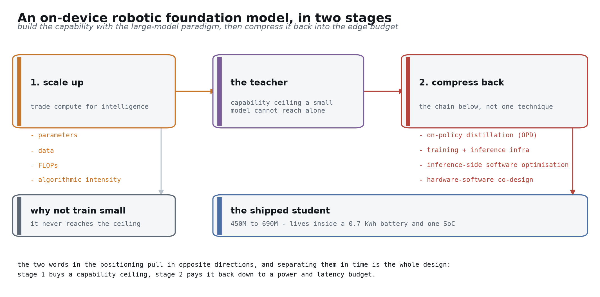
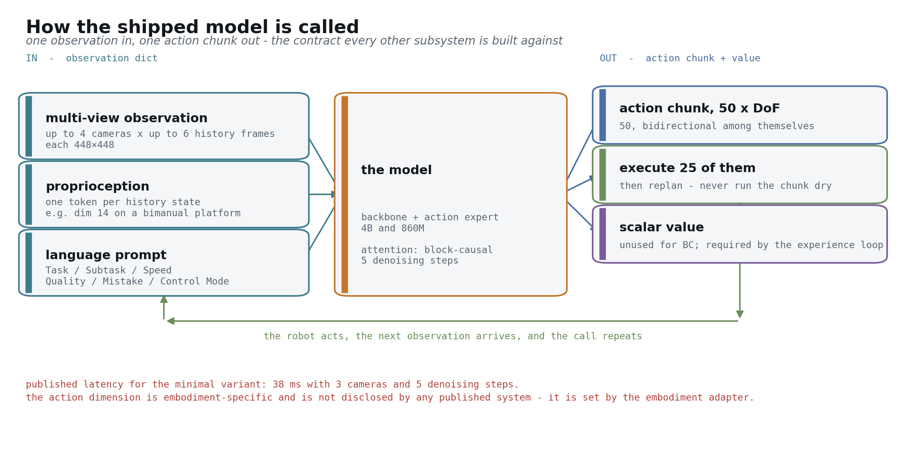
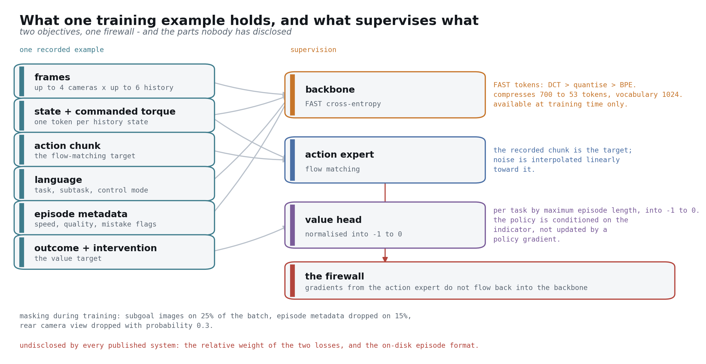
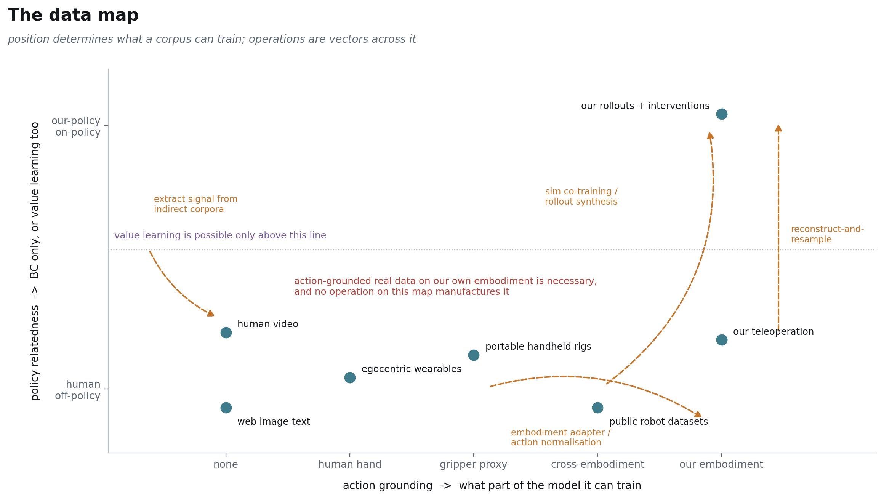
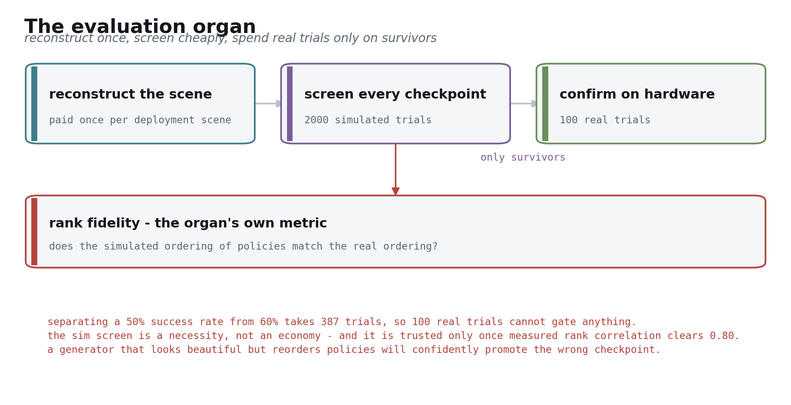
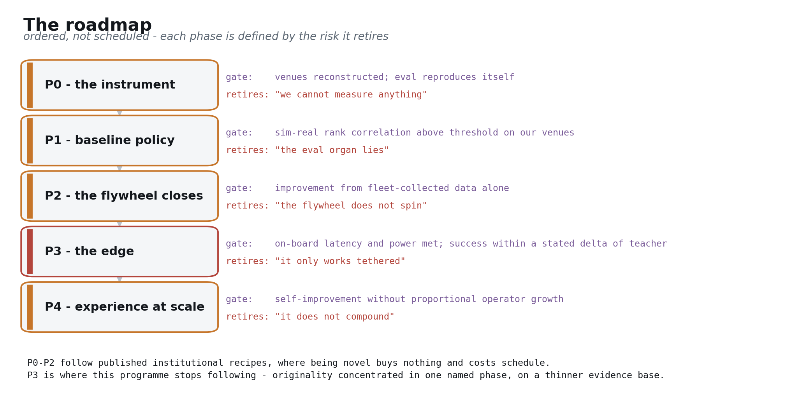
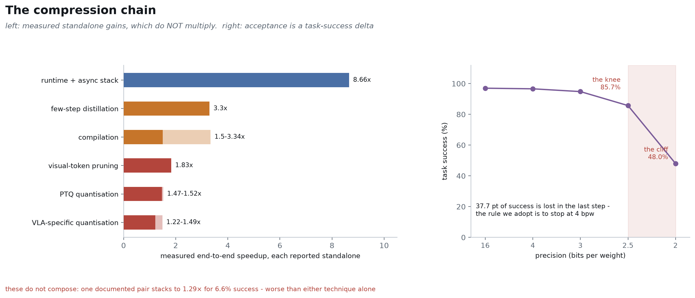
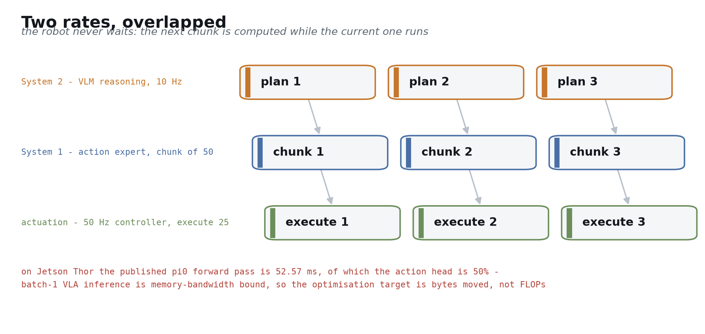
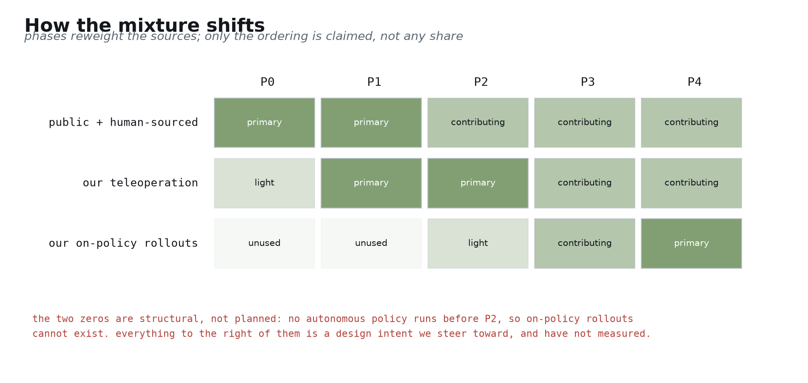

九张主线，四张备用。每张一图三行：逻辑从图上就能读出来，文字只负责点名增量 [computed: 本 deck 的设计约束]。

---

## 1 —— 定位：端侧 robotic foundation model

- 最难的一半你们做完了：本体量产、进了真实场景、带着 VR 遥操作在跑；剩下的是模型与数据系统 [[blog: carnewschina 2026-04-13]](https://carnewschina.com/2026/04/13/chery-begins-online-sales-of-humanoid-robot-with-a-0-7-kwh-battery-at-41400-usd/)
- **目标是端侧的 foundation model**。要有 foundation model 的能力，就得走大模型范式——参数、数据、FLOPs、算法强度一起 scale up，用计算换智能 [[arXiv:2606.05737]](https://arxiv.org/abs/2606.05737)
- **做大之后再压回端侧**：以 OPD 为主的蒸馏技术栈 + infra 优化 + 推理软件优化 + 软硬件协同设计，最终活在 0.7 kWh 的预算里 [[arXiv:2604.00626]](https://arxiv.org/abs/2604.00626)

---

## 2 —— 系统长什么样

- 两个工厂：Model Factory 把数据变成能上车的策略，Data Flywheel 把机器人的运行变成可训练的数据 [[arXiv:2511.19647]](https://arxiv.org/abs/2511.19647)
- 它们之间只有两条通路——Policy API Contract 与 Episode Contract；中间那个器官 evaluation 两头卡 [[arXiv:2604.15483 §3]](https://arxiv.org/abs/2604.15483)
- 流水线的右半段就是"压回端侧"那一段：compress 与 serve [[arXiv:2602.18397]](https://arxiv.org/abs/2602.18397)

---

## 3 —— 模型怎么被调用，怎么被训练

- 输入：最多 4 路相机 × 最多 6 帧历史、每帧 448×448；proprioception 每个历史状态一个 token；语言 prompt 六个字段 [[arXiv:2604.15483 §VI-B]](https://arxiv.org/abs/2604.15483)
- 输出：50 个 action token（执行 25 个就重规划）加一个标量 value；最小变体 3 路相机、5 步去噪下 38 ms [[arXiv:2604.15483 App. D]](https://arxiv.org/abs/2604.15483)
- 每个本体的 action 维度是所有公开系统都没给的一个量，由 embodiment adapter 决定 [[arXiv:2604.15483 §VI-B]](https://arxiv.org/abs/2604.15483)

---

## 4 —— 一条训练样本，三路监督

- backbone 由 FAST token 交叉熵监督（DCT → 量化 → BPE，700 压到 53，词表 1024，只在训练时存在）[[arXiv:2501.09747]](https://arxiv.org/abs/2501.09747)
- action expert 由 flow matching 监督，噪声直线插值到记录下的 chunk；value head 由结局与接管监督 [[arXiv:2410.24164]](https://arxiv.org/abs/2410.24164)
- 中间那道防火墙是关键：action expert 的梯度不回流进 backbone，否则动作训练会磨掉 VLM 的语义能力 [[arXiv:2604.15483 §III]](https://arxiv.org/abs/2604.15483)

---

## 5 —— 数据地图：我们怎么想数据这件事

- 两个轴决定一份语料的用途：action grounding 决定它能训模型的哪一部分，policy relatedness 决定它能不能支撑 value 学习 [[arXiv:2602.18397]](https://arxiv.org/abs/2602.18397)
- operations 是图上的向量，每一条都有明确成本、明确失真，并自带验证义务 [[arXiv:2511.19647]](https://arxiv.org/abs/2511.19647)
- 你们车队产生的、带 action grounding 的真实数据是必需品，这张图上没有任何操作能把它造出来——这也是它最难被替代的原因 [[arXiv:2604.15483 §3]](https://arxiv.org/abs/2604.15483)

---

## 6 —— 数据飞轮

- 单机 128 GB/h、一天约 3 TB/day，乘以车队规模就是回传量级——分流必须做在机器人本体上 [computed: 128 GB/h × 24 h]
- 只打分不删除；label 是挂在不可变 episode 上的可变层；dataset version 就是一份 manifest [[arXiv:2511.19647]](https://arxiv.org/abs/2511.19647)
- 那份随机配额不能砍：砍掉它，留下来的全是失败，模型学到一个永远出错的世界 [[arXiv:2511.19647]](https://arxiv.org/abs/2511.19647)

---

## 7 —— 评估：整条路线的瓶颈

- 区分 50% 与 60% 的成功率要约 387 次试验，而公开工作每个 checkpoint 只有 100 次真机试验 [computed: two-proportion test]
- 所以先重建场景，再用 2000 次仿真筛选，真机只花在幸存者身上 [[blog: World Labs real-to-sim-to-real]](https://www.worldlabs.ai/blog/real-to-sim-to-real)
- 仿真自己的可信度要持续测。我们不预设相关性阈值——那个数应该由 P0 实测的评估方差定出来，现在写死就是编的 [computed: 阈值由 P0 实测方差确定]

---

## 8 —— 强化学习：经验循环怎么真的转起来

- 真机上不能 reset、不能自由探索、环境不给奖励，所以 PPO 那一类在车队上不可行；奖励必须被构造出来 [[arXiv:2408.03539]](https://arxiv.org/abs/2408.03539)
- 四种信号：影子模式分歧最便宜、结局最明确、接管只能做**段级**标记（机器人的失败是连续过程，不像车上是离散事件），力矩与触觉把段收缩到帧 [[arXiv:2604.15483 §3]](https://arxiv.org/abs/2604.15483)
- 算法是 advantage 条件化的监督训练，不是策略梯度——车队混合了遥操作、自主与干预，行为策略密度未知，重要性采样根本拿不到 [[arXiv:2604.03037]](https://arxiv.org/abs/2604.03037)

---

## 9 —— 路线图

- 五个阶段按顺序排、不按日期排，每个阶段由它消掉的风险定义，由一个客观放行条件结束 [[arXiv:2511.19647]](https://arxiv.org/abs/2511.19647)
- 评估建在模型之前，端侧排在飞轮闭合之后——两个次序我们都写明了理由和翻案条件 [[arXiv:2605.24011]](https://arxiv.org/abs/2605.24011)
- P0 到 P2 用的是主流大模型 post-training 与 RL 技术栈，已被公开复现；P3 是重心——把大模型压回端侧，是我们必须自己做成、也决定产品能否成立的一段 [[repo: FlashRT]](https://github.com/flashrt-project/FlashRT)

---

# 备用（问答时调取）

## B1 —— 压缩链路：怎么压回端侧

- 蒸馏这一步用 on-policy distillation：教师在学生自己走到的状态上给反馈，和 experience loop 押的是同一个原理 [[arXiv:2604.00626]](https://arxiv.org/abs/2604.00626)
- 排序由实测决定：编译零精度代价拿 1.5 到 3.34×，少步蒸馏拿 3.3× 且精度不降 [[arXiv:2602.18397]](https://arxiv.org/abs/2602.18397)
- 量化买到的是显存不是速度——通用工具链只量化语言 backbone，而瓶颈在 action head [[arXiv:2605.24011]](https://arxiv.org/abs/2605.24011)
- 2.5 bpw 是拐点，2 bpw 崩到 48.0%，起步规则是停在 4 bpw；但那 0.4 pt 只是量化单步的代价，链路总预算由 P3 实测后分配 [[arXiv:2605.24011]](https://arxiv.org/abs/2605.24011)

## B2 —— Serving

- batch-1 的 VLA 推理是 memory-bandwidth bound，优化目标是搬运的字节数，不是 FLOPs [[arXiv:2602.18397]](https://arxiv.org/abs/2602.18397)
- 同一个前向在 Jetson Thor 上 action head 占 50%，在 RTX 4090 上只占 23%——边缘侧最大的那一项正是通用量化不碰的那一项 [[arXiv:2602.18397]](https://arxiv.org/abs/2602.18397)
- 已公开最好的端侧成绩来自手写 kernel：44.0 ms、23 Hz，越过了解析屋顶线 [[repo: FlashRT]](https://github.com/flashrt-project/FlashRT)

## B3 —— 配比如何随阶段迁移

- 阶段之间变的是权重，不是建设顺序。这张图只给次序，不给份额——我们没跑过这条路，任何具体百分比都会是编的 [[arXiv:2511.19647]](https://arxiv.org/abs/2511.19647)
- on-policy rollout 在 P2 之前必然为零（没有自主运行的策略），之后是唯一一个成本随算力和车队扩张、不随人员编制扩张的来源 [computed: P2 之前没有自主运行的策略]
- 它到底能占多大，取决于那条没人公开过的转化曲线和车队规模，是 P2 的直接产出 [computed: 检索未发现已披露转化曲线]

## B4 —— 我们还不知道什么

- 教师规模、机上功耗、我们自己的压缩悬崖位置，都由 P1 与 P3 实测确定 [computed: 全文未解决项的汇总]
- 接管到可测提升的转化率没有公开曲线，它决定 P2 需要多大车队 [computed: 检索未发现已披露转化曲线]
- Open bet：world action model 已报告 2 倍泛化优势，但 14B 参数、7 Hz 的形态进不了端侧预算；触发条件是压缩后能进预算的版本出现 [[arXiv:2602.15922]](https://arxiv.org/abs/2602.15922)
