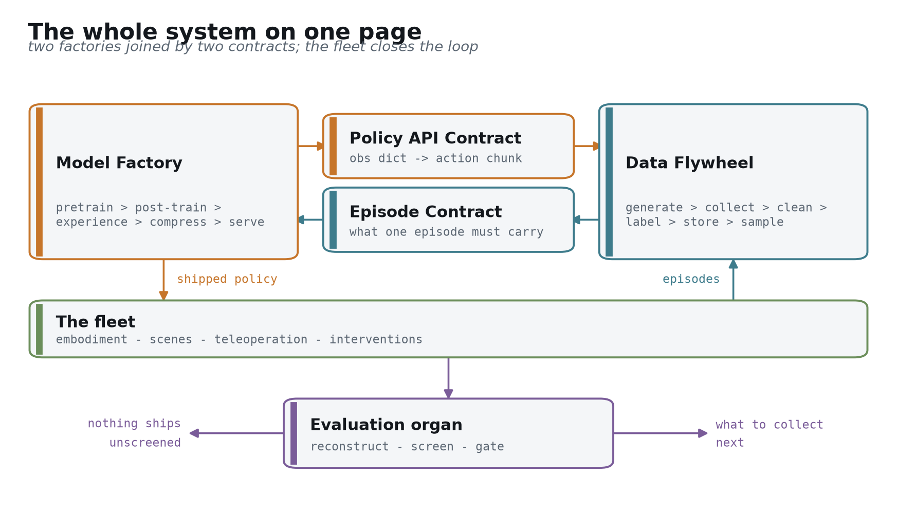
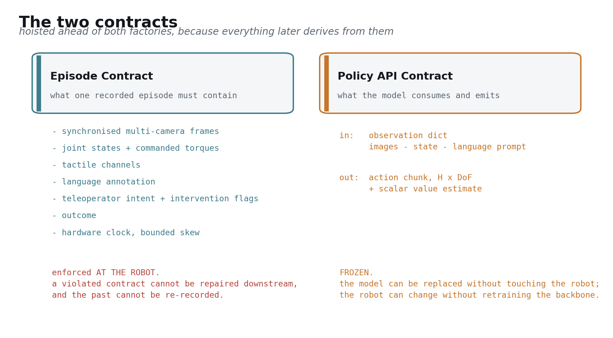
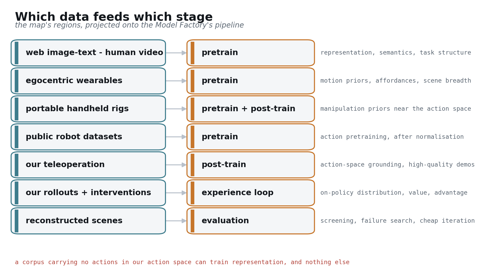

## 我们要一起建的东西

最难的那一半，你们已经做完了：本体量产、铺进真实场景、带着 VR 遥操作在跑 [[blog: carnewschina 2026-04-13]](https://carnewschina.com/2026/04/13/chery-begins-online-sales-of-humanoid-robot-with-a-0-7-kwh-battery-at-41400-usd/)。

剩下的一半是 robot foundation model 和喂养它的数据系统。下面讲的就是这一半——具体建什么，按什么顺序建，每一步靠什么证据判断它成了 [[arXiv:2511.19647]](https://arxiv.org/abs/2511.19647)。

两条原则贯穿始终。能抄的地方一律抄已经被复现过的配方，只在绕不过去的那一段做原创。凡是给出的数字都能追到一行出处；追不到的，我们直接说"这个还不知道" [computed: 本文的取数规则]。

---

# 第 0 部分 —— 一页纸的全景

先看这张图。后面六个部分都是它的放大

系统由两个工厂组成。**Model Factory** 把数据变成能在机器人上跑的策略：pretrain → post-train → experience loop → compress → serve。**Data Flywheel** 把机器人的运行变成可训练的数据：generate → collect → clean → label → store → sample [[arXiv:2511.19647]](https://arxiv.org/abs/2511.19647)。

两个工厂之间只有两条通路。一条交付符合 **Policy API Contract** 的模型，一条交付符合 **Episode Contract** 的 episode。除此之外互不知道对方内部——这正是它们能被两支队伍分头推进的原因 [[arXiv:2604.15483 §3]](https://arxiv.org/abs/2604.15483)。

车队让循环闭合。机器人拿策略去干活，干活产生 episode，episode 训出更好的策略。真正在增值的是这个循环，而不是循环里任何一次交付 [[arXiv:2511.19647]](https://arxiv.org/abs/2511.19647)。

这套循环你们并不陌生。车队采集、云端自动标注、大规模训练、仿真验证、OTA 推送加 A/B——智能驾驶那条数据闭环已经把它跑通过一遍 [[arXiv:2511.19647]](https://arxiv.org/abs/2511.19647)。所以下面的内容里，凡是和你们已有做法一致的地方我们会一笔带过，真正要讲的是三处搬不动的地方：数据从"规模化采集"变成"组合泛化"（3.1 节）、仿真从"几何够真"变成"接触够真"（第 4 部分）、以及失败信号从离散事件变成连续过程（第 5 部分）。

中间那个器官是 **evaluation**。它两头卡：没筛过的模型不许上车；它对失败的分析又决定下一轮采什么。我们把它画在两个工厂中间，因为它两边都属于 [[blog: World Labs real-to-sim-to-real]](https://www.worldlabs.ai/blog/real-to-sim-to-real)。

有两个数字从第一天起就压在所有设计上：电池 0.7 kWh，续航 2 h [[blog: carnewschina 2026-04-13]](https://carnewschina.com/2026/04/13/chery-begins-online-sales-of-humanoid-robot-with-a-0-7-kwh-battery-at-41400-usd/)。推理多耗一瓦，机器人就少干一会儿活。还有第三个：单机每小时吐出 128 GB/h 原始传感数据，没有任何回传链路吃得下 [computed: 35.665 MB/s × 3600]。这几条约束后面会反复出现。

---

# 第 1 部分 —— 两份 contract

我们把这两份接口放在两个工厂前面讲，因为后面每一个决策都从它们推出来 [[arXiv:2604.15483 §3]](https://arxiv.org/abs/2604.15483)。你们只看这一部分和上面那张图，已经拿到完整蓝图。

## Episode Contract

一条能拿来训练的 episode 必须包含：硬件同步的多路相机帧、关节状态与**指令力矩**、触觉通道、语言标注、遥操作者意图与接管标记、任务结局，以及一个偏移有上界的硬件时钟 [[arXiv:2604.15483 §3]](https://arxiv.org/abs/2604.15483)。

请注意一个约定：**这份 contract 在机器人本体上强制执行，不在入库端**。入库端只能拒收，而被拒收的那条 episode 已经永远丢了 [[blog: Trossen robotic data pipeline]](https://www.trossenrobotics.com/post/robotic-data-pipeline-sensor-streams-to-training-datasets)。

指令力矩要单独拎出来说，因为它最常被漏掉。只记关节状态，你能训出复现轨迹的策略，训不出理解接触的策略——而接触是操作任务里最难的部分 [[arXiv:2604.15483 §3]](https://arxiv.org/abs/2604.15483)。接管标记也一样：操作员按下接管的那一刻，本身就是一个免费的负样本标签，第 2 部分的 experience loop 会一直用它 [[arXiv:2511.19647]](https://arxiv.org/abs/2511.19647)。

值得说一句的是，你们这台机器上已有的 3D LiDAR、深度相机、超声和视触觉灵巧手，已经覆盖了这份 contract 的大部分 [[blog: carnewschina 2026-04-13]](https://carnewschina.com/2026/04/13/chery-begins-online-sales-of-humanoid-robot-with-a-0-7-kwh-battery-at-41400-usd/)。要补的主要在记录侧，不在感知侧。

## Policy API Contract

输入是一个 observation dict：若干路图像、机器人状态、一段语言 prompt。输出是一个 action chunk，形状 H × DoF，外加一个标量 value [[arXiv:2506.07339]](https://arxiv.org/abs/2506.07339)。

参考取值 H 取 50，执行 horizon 取 25，在 50 Hz 控制器上对应 1.0 s 的动作块 [[arXiv:2506.07339]](https://arxiv.org/abs/2506.07339)。这组数字来自已公开的实测系统，我们直接沿用，不重新发明。

另一个约定：**这份 contract 冻结**。冻下来之后，模型可以整代替换而不动机器人，机器人也可以换代而不必重训 backbone——后者靠一层 embodiment adapter 完成 [[arXiv:2602.18397]](https://arxiv.org/abs/2602.18397)。

多出来的那个 value 输出，现在看没用——行为克隆阶段确实用不上。但它是 experience loop 的前提。现在把它写进冻结接口，等于两年后接经验学习时，机器人侧一行代码都不用改 [[arXiv:2511.19647]](https://arxiv.org/abs/2511.19647)。

---

# 第 2 部分 —— Model Factory

沿流水线走一遍。每个环节只说三件事：负责什么、接口是什么、信息增量在哪

## 2.1 数据配比

输入各路语料，输出一份 mixture manifest。要记住的只有一句：**配比是训练阶段的函数，不是一个数据集** [[arXiv:2511.19647]](https://arxiv.org/abs/2511.19647)。

同一批语料在 pretrain、post-train 和 experience loop 里的权重完全不同，而且随车队规模持续漂移 [[arXiv:2511.19647]](https://arxiv.org/abs/2511.19647)。把它固化成"我们的数据集"，等于把一个时变对象写死成常量。

manifest 的形状是"来源 × 阶段"的权重表，不是文件列表 [[arXiv:2511.19647]](https://arxiv.org/abs/2511.19647)：

| 来源 | pretrain | post-train | experience loop |
|---|---|---|---|
| 图文与人类视频 | 主力 | 不用 | 不用 |
| 第一人称可穿戴 | 主力 | 少量 | 不用 |
| 手持采集装置 | 参与 | 参与 | 不用 |
| 公开跨本体机器人数据 | 主力（需归一化） | 少量 | 不用 |
| 自有遥操作 | 少量 | 主力 | 作为锚点 |
| 自有 on-policy rollout | 不用 | 不用 | 主力 |
| 重建场景 | 不用 | 参与 | 评估与失败搜索 |

这张表为什么长成这样，第 3 部分的数据地图会解释；五个阶段上的具体数值，第 6 部分给 [computed: 见 f04 与 f13]。

## 2.2 架构与冻结的 API

输入 observation dict，输出 action chunk 加 value [[arXiv:2506.07339]](https://arxiv.org/abs/2506.07339)。内部两档：慢档管语义与推理，快档管动作生成。

参考形态取 GR00T N1.7 这一类：一个开源 VLM backbone，加一个独立设计的 DiT action head，公开规模 538M 参数、16 层 [[arXiv:2607.15275]](https://arxiv.org/abs/2607.15275)。我们选的起点就是这个——**沿用开源 VLM，action stack 自己做**。为什么这么选，下一节说。

这里再加一件成本极低的事：**implicit world modeling 作为辅助目标**。让 policy 生成动作的同时去对齐未来观测的 latent 表示，只需给标准 VLA 加几个 token [[arXiv:2505.15659]](https://arxiv.org/abs/2505.15659)。它在多任务仿真基准上最高带来 26% 提升，但对我们更要紧的是另一个性质：**它让没有动作标签的第一人称人类视频也能参与 co-training** [[arXiv:2505.15659]](https://arxiv.org/abs/2505.15659)。第 3 部分的数据地图会直接用这条通路。

## 2.3 Pretrain：先做大，这是刻意的

这一节的逻辑对一个主打端侧的产品是反直觉的，所以请让我说清楚：**我们不训练最终要出货的那个小模型** [[arXiv:2606.05737]](https://arxiv.org/abs/2606.05737)。

能力先在规模上出现，再通过蒸馏保留下来。同样的小架构从零训练，到不了同一个位置 [[arXiv:2606.05737]](https://arxiv.org/abs/2606.05737)。端侧真正出货的模型落在 450M 到 690M 这个区间 [computed: SmolVLA 下界，RoboTTT 上界]，但它们的能力来自更大的教师，而不是在这个尺寸上直接堆数据。

我们给"端侧"配一个可度量的目标，否则它永远只是个形容词：**intelligence density**，每参数每瓦的任务成功率 [computed: 三项已披露量的组合]。它把 2.6 节和 2.7 节的工作，和那块 700 Wh 电池串成同一条约束链 [computed: 0.7 kWh × 1000]。

有一件事要坦白：**目前没有任何公开工作给出过 robot foundation model 的教师/学生规模配对** [computed: 检索未发现已披露配对]。这个数字得我们自己在 P1 定出来，它挂在第 7 部分。

起点上还有两条路我们否掉了，理由和什么条件下会翻案，一并说明 [[arXiv:2607.15275]](https://arxiv.org/abs/2607.15275)。

**直接 fork 一个开源 VLA 做特化**，是到首个演示最快的路，代价是继承别人的 Episode Contract——而这份 contract 决定硬件规格 [[arXiv:2604.15483 §3]](https://arxiv.org/abs/2604.15483)。继承过来，等于让别人的传感器假设反过来约束你们的板级迭代。它作为 P0 的对照实现仍然值得做，但不做主线。

**连 VLM 一起从零预训练**，IP 叙事最完整，但把早期资金投在一个已经被反复解决的问题上 [[blog: HuggingFace SmolVLA]](https://huggingface.co/blog/smolvla)。翻案条件很具体：当开源 VLM 的许可条款或语义能力成为端侧成功率的瓶颈时重新评估。在那之前，同样的钱花在 action stack 和压缩链路上回报更高。

## 2.4 Post-train

输入精选高质量子集，输出可用的任务策略。三件事：任务条件化、knowledge insulation（防止动作训练腐蚀 VLM 的语义能力）、sim 与 real 的 co-training [[arXiv:2505.15659]](https://arxiv.org/abs/2505.15659)。

这节短，因为它几乎全继承自 2.1 节和 2.2 节。要记的数字只有每任务的数据地板：一个预训练充分的模型，50 到 100 条演示就能微调到可用 [[blog: DeepMind on-device]](https://deepmind.google/blog/gemini-robotics-on-device-brings-ai-to-local-robotic-devices/)。采集侧文献独立给出的是每任务 50 到 200 条 [[blog: dexset teleoperation guide]](https://dexset.ai/blogs/teleoperation-data-collection-robot-learning-complete-2026/)。两条独立证据落在同一区间，这个地板可以信。

## 2.5 Experience loop

输入车队跑出来的 episode，输出一个更好的策略 [[arXiv:2511.19647]](https://arxiv.org/abs/2511.19647)。它在流水线上的位置就是这里，但它的机制单独占一部分——因为"车队数据怎么变成更好的策略"这件事，是整条路线上最容易讲得含糊的一段。

完整讨论在第 5 部分：奖励从哪来、为什么算法是 advantage 条件化的监督训练而不是策略梯度、探索放在哪、以及接触密集任务里的归因怎么做

## 2.6 压缩链路

输入大教师，输出出货的学生。这节的内容就是顺序，而顺序由实测排定，不由惯例排定 [[arXiv:2602.18397]](https://arxiv.org/abs/2602.18397)。

按实测端到端收益排：编译给出 1.5 到 3.34×，精度代价恰好为 0 [[arXiv:2602.18397]](https://arxiv.org/abs/2602.18397)；少步蒸馏把 10 步降到 1 步给出 3.3×，精度不降反升 [[arXiv:2606.05737]](https://arxiv.org/abs/2606.05737)；运行时加异步栈在 Jetson Orin 上给出 8.66× [[arXiv:2607.12659]](https://arxiv.org/abs/2607.12659)；视觉 token 剪枝给出 1.83×，天花板 2.0× [[arXiv:2607.09520]](https://arxiv.org/abs/2607.09520)；单纯 PTQ 量化给出 1.47 到 1.52× [[arXiv:2605.24011]](https://arxiv.org/abs/2605.24011)。

两条结论直接进工程计划。**第一周就该做编译**，零精度风险，收益确定 [[arXiv:2602.18397]](https://arxiv.org/abs/2602.18397)。**量化买到的是显存，不是速度**——通用工具链只量化语言 backbone，而边缘侧的瓶颈在 action head [[arXiv:2605.24011]](https://arxiv.org/abs/2605.24011)。

验收标准是任务成功率的差值，不是任何代理指标。压缩悬崖的位置已经公开：4 bpw 几乎免费（96.6%），3 bpw 到 94.8%，2.5 bpw 是拐点（85.7%），2 bpw 直接崩到 48.0% [[arXiv:2605.24011]](https://arxiv.org/abs/2605.24011)。最后一步就丢掉 37.7 pt [computed: 85.7 − 48.0]，所以我们的规则是**停在 4 bpw**。

有一条和基准文献相反的真实硅片证据值得单独记：某自研 SoC 上出货的是 W8A16，并明确指出 W8A8 会掉成功率 [[arXiv:2606.07383]](https://arxiv.org/abs/2606.07383)。仿真基准和定制硅片在这里给出不同答案，我们选择相信硅片。

也在这里先说明：这一节和 2.7 节的证据基础比前面几节薄，更贴近厂商自述 [[repo: FlashRT]](https://github.com/flashrt-project/FlashRT)。这不是缺陷，第 6 部分会讲为什么它恰恰是我们该投原创的那一段。

## 2.7 Serving system

输入压缩后的学生加一颗 SoC，输出一份机器人能活在里面的延迟与功耗预算 [[arXiv:2602.18397]](https://arxiv.org/abs/2602.18397)。

真正的硬指标是两档结构：策略跑 5 到 30 Hz，下面接 50 Hz 到 1 kHz 的低层控制器，中间用 action chunk 桥接 [[arXiv:2604.24447]](https://arxiv.org/abs/2604.24447)。NVIDIA 给出的原则是，约 10 Hz 的推理速率足以支撑 30 FPS 的执行 [[spec: NVIDIA Jetson]](https://www.nvidia.com/en-us/autonomous-machines/embedded-systems/)。

延迟容忍度是一个结构条件，不是毫秒阈值。只要推理延迟不超过 H 减执行 horizon，就永远有动作可用 [[arXiv:2506.07339]](https://arxiv.org/abs/2506.07339)；π0.7 给出的对应披露值是 50 Hz 机器人上 240 ms [[arXiv:2604.15483]](https://arxiv.org/abs/2604.15483)。所以异步执行的意义是让机器人永远不必等，而不是让单次前向更快。

硬件感知的结论只有一句：**batch-1 的 VLA 推理是 memory-bandwidth bound，优化目标是搬运的字节数，不是 FLOPs** [[arXiv:2602.18397]](https://arxiv.org/abs/2602.18397)。一张表就够了——同一个 π0 前向，在 Jetson Thor 上视觉 6.06 ms、VLM 20.30 ms、action head 26.20 ms，端到端 52.57 ms；action head 占 50%，而在 RTX 4090 上同一部分只占 23% [[arXiv:2602.18397]](https://arxiv.org/abs/2602.18397)。边缘侧最大的那一项，恰恰是通用量化工具不碰的那一项。

已公开最好的端侧成绩来自手写 kernel：π0.5 在 Jetson AGX Thor 上做到 44.0 ms、23 Hz，三路视图用 NVFP4 做到 39.78 ms [[repo: FlashRT]](https://github.com/flashrt-project/FlashRT)。这个数字越过了解析屋顶线给出的 19.0 Hz [[arXiv:2602.18397]](https://arxiv.org/abs/2602.18397)，说明解析模型本身偏保守。两支团队各自放弃编译器改写 kernel，都赢了——这是我们判断这一段值得投原创的最强证据。

最后把功耗接回电池。目前唯一可引用的端侧整机功耗是某方案在 AGX Orin 上的 40 W [[arXiv:2604.24447]](https://arxiv.org/abs/2604.24447)，硅片不同，只能作量级参考。**我们自己的功耗目标是未披露量**，由 P3 实测确定 [computed: 无同类已披露数据]。

## 2.8 Test-time adaptation 与 context scaling

最后一节讲一件容易判断错的事。直觉上，test-time 计算和端侧预算天然冲突：多花的推理算力，机器人拿电池付 [[arXiv:2604.24447]](https://arxiv.org/abs/2604.24447)。

实测和直觉相反。把 visuomotor context 扩到 8K 个时间步——比现有策略高三个数量级——**推理延迟不增加** [[arXiv:2607.15275]](https://arxiv.org/abs/2607.15275)。代价落在参数上：每层 DiT 加约 10M 参数的 TTT 层，16 层合计把 action head 从 538M 抬到 690M，增幅 28% [computed: (690−538)/538]。

对端侧来说，这恰好是我们想要的那种交换：参数是一次性的显存成本，延迟是每一步都要付的成本。收益也不小——比单步 context 基线提升 87%，8K context 比 1K 预训练再高 62%，还能完整走完一个 5 min、10 阶段的装配任务，而所有基线都走不完 [[arXiv:2607.15275]](https://arxiv.org/abs/2607.15275)。

所以我们把 context scaling 放进 P4，而不是无限期推迟 [[arXiv:2607.15275]](https://arxiv.org/abs/2607.15275)。

---

# 第 3 部分 —— Data Flywheel

## 3.1 数据地图：两个轴，以及作为向量的操作

先说为什么我们不按"来源"列清单。按来源列出遥操作、人类视频、仿真、公开数据集，看着整齐，但它把三件互不相关的事混进一根轴：数据从哪来、我们对它做了什么、它是谁在什么时候产生的 [[arXiv:2511.19647]](https://arxiv.org/abs/2511.19647)。真正决定一份语料用途的是下面两个属性。

**第一个轴是 action grounding**：这份数据里有没有我们这台机器人动作空间中的动作。从"没有"、"人手"、"夹爪代理"、"跨本体机器人"，到"我们自己的本体" [[arXiv:2602.18397]](https://arxiv.org/abs/2602.18397)。它决定这份语料**能训模型的哪一部分**。

**第二个轴是 policy relatedness**：数据是人产生的 off-policy，还是当前策略自己跑出来的 on-policy [[arXiv:2511.19647]](https://arxiv.org/abs/2511.19647)。它决定这份语料**能不能支撑 value 学习**，还是只能做行为克隆。

真实性（真实、重建、仿真、生成）不作为第三个轴，它是打在每个点上的标记——影响可信度，不影响资格 [[blog: World Labs real-to-sim-to-real]](https://www.worldlabs.ai/blog/real-to-sim-to-real)。

| 区域 | 语料举例 | 能训什么 | 训不了什么 |
|---|---|---|---|
| 无 grounding，off-policy | 图文语料、人类视频 | 表征、语义、任务结构 | 动作空间里的任何东西 |
| 人手 grounding | 第一人称可穿戴 | 动作先验、affordance | 接触力、我们的运动学 |
| 夹爪代理 grounding | 手持采集装置 | 加 adapter 后的动作预训练 | 我们的全自由度、全身 |
| 跨本体机器人 | 公开机器人数据集 | 归一化后的动作预训练 | 我们本体的特有部分 |
| 我们的本体，off-policy | 我们的遥操作 | post-train、行为克隆 | value 函数、advantage |
| 我们的本体，on-policy | 我们的 rollout 与接管 | value 学习、experience loop | 当前能力包络之外的新行为 |

**操作是这张图上的向量。** 每一个操作都把数据从便宜的区域搬向昂贵的区域，都有明确成本，也都有明确失真 [[arXiv:2511.19647]](https://arxiv.org/abs/2511.19647)：

- **从间接语料里提取信号**：把巨量但与机器人无关的语料，过滤标注出可用的语义、affordance 与任务结构。失真在于它造不出从未观测到的通道——没有力矩，没有接触，没有我们动作空间里的动作 [[arXiv:2505.15659]](https://arxiv.org/abs/2505.15659)。2.2 节那个辅助目标，就是让这条向量落地的机制。
- **重建后重采样**：把一次性的真实观测变成可以无限采样的生成器。它的价值不是画面好看，而是 **rank fidelity**——它给策略排的序，和真实世界排的序是否一致 [[blog: World Labs real-to-sim-to-real]](https://www.worldlabs.ai/blog/real-to-sim-to-real)。这条向量自带验证义务，第 4 部分专门讲。
- **sim co-training 与 world-model rollout 合成**：不花机器人时间，把质量往 on-policy 一侧搬。失真是动力学 gap [[arXiv:2602.15922]](https://arxiv.org/abs/2602.15922)。
- **embodiment adapter 与动作归一化**：把质量沿 grounding 轴往上搬，是这张图上最便宜的一条向量，也是跨本体公开数据之所以有价值的全部原因 [[arXiv:2602.18397]](https://arxiv.org/abs/2602.18397)。

整个数据系统要做的事，一句话：**把概率质量搬到当前训练阶段需要的那个区域，并让单位有效信号的成本最低** [[arXiv:2511.19647]](https://arxiv.org/abs/2511.19647)。

这里要修正一个从自动驾驶带过来的直觉。在车上，数据的难点是长尾——罕见场景出现频率低，所以要靠车队规模去撞。在机器人上，难点换了性质：**不是长尾，是组合泛化**。任务空间由动作、物体、环境、目标四个维度的组合张成 [computed: 四个维度的组合]，二十个杯子都能抓，换一个透明带水珠的玻璃杯就掉——因为它同时改变了视觉、摩擦和形变三项。已有的真机基准就是按这个结构搭的：把桌面操作拆成原子技能，用 30 个原子任务训练，再用 24 个留出的组合任务测泛化 [[arXiv:2606.16826]](https://arxiv.org/abs/2606.16826)。

这条区别直接决定采集策略。长尾问题靠"多跑"解决；组合泛化靠"跑得杂"解决——同样的机器人小时数，覆盖更多的物体×环境×目标组合，比在同一个组合上多刷一百遍值钱得多 [[arXiv:2510.13149]](https://arxiv.org/abs/2510.13149)。

有一条边界必须写死：**我们自己本体上、带动作 grounding 的真实数据是必需品，这张图上没有任何操作能把它制造出来** [[arXiv:2604.15483 §3]](https://arxiv.org/abs/2604.15483)。每条向量最终都要拿它当锚点，第 4 部分的 rank fidelity 验证离了它根本做不了。这也是你们那支在跑的车队，为什么是整件事里最难被替代的一块。

把上面的区域投影到 Model Factory 的流水线上，就是这张图，大概是整份材料里最实用的一张：图文与人类视频喂 pretrain 的表征；可穿戴喂动作先验与场景广度；手持装置喂接近动作空间的操作先验；公开机器人数据归一化后喂动作预训练；我们的遥操作喂 post-train 的动作 grounding；rollout 与接管喂 experience loop 的 on-policy 分布与 value；重建场景喂 evaluation [[arXiv:2511.19647]](https://arxiv.org/abs/2511.19647)。

## 3.2 采集

输入是运行中的机器人，输出是入库边界上一批符合 contract 的 episode [[arXiv:2604.15483 §3]](https://arxiv.org/abs/2604.15483)。这里最容易给错答案，因为直觉解法在算术上就不成立。

单台机器人未过滤的传感数据率是 35.665 MB/s，在线压缩后 0.213 MB/s，压掉 99.4% [[blog: Trossen robotic data pipeline]](https://www.trossenrobotics.com/post/robotic-data-pipeline-sensor-streams-to-training-datasets)。换成小时是 128 GB/h [computed: 35.665 MB/s × 3600]，单机一天约 3 TB/day [computed: 128 GB/h × 24 h]。乘以车队规模就是回传侧要面对的量级——具体多少取决于你们的实际在役台数和每天运行时长，这两个数我们不替你们假设 [computed: 车队规模与班次由部署方决定]。没有任何回传链路吃得下这个量。

所以分流必须做在机器人本体上，四层：所有传感数据先进一个很短的环形缓冲；只有被触发标记的片段才落盘；落盘的片段在机上编码；充电时择机上传 [[blog: Trossen robotic data pipeline]](https://www.trossenrobotics.com/post/robotic-data-pipeline-sensor-streams-to-training-datasets)。触发条件四类——接管、失败、novelty 分数超阈，以及一份随机配额。

还有第五类值得单独说，因为它是从你们那套数据闭环里直接搬得动的：**影子模式**。策略在后台照常推理，但不驱动电机；它的输出和当时真正执行的动作（遥操作者的，或者上一版策略的）一比对，分歧本身就是采集触发条件 [[arXiv:2511.19647]](https://arxiv.org/abs/2511.19647)。它的好处是这条信号连续、自动、不占用操作员任何额外动作——在第 5 部分里，它还会作为奖励信号出现。

那份随机配额不是可选项。**没有它，留下来的数据全部由失败构成，模型学到的是一个永远出错的世界** [[arXiv:2511.19647]](https://arxiv.org/abs/2511.19647)。这是分流设计里唯一反直觉的地方，也是工程实现中最容易被砍掉的地方。

Episode Contract 在这一层强制执行，理由前面讲过：入库端只能拒收，不能修复 [[arXiv:2604.15483 §3]](https://arxiv.org/abs/2604.15483)。

还有数据权利。车队工作在零售与展厅场景，会录到与业务无关的路人。人脸与音频的机上处理、留存期限、场景方同意，这些是有排期影响的工程需求，不是法务附录。可参照的做法，是把人物过滤、视角刻画、质量控制与隐私审查都当作一等设计目标写进采集管线 [computed: 大规模人类视频语料的公开策展做法]。

## 3.3 清洗与 QA

输入原始 episode，输出带 trust score 的 episode。校验项包括时钟偏移、丢帧、关节越界、动作与状态不自洽，外加一份具名的失败分类法和近重复检测 [[blog: Trossen robotic data pipeline]](https://www.trossenrobotics.com/post/robotic-data-pipeline-sensor-streams-to-training-datasets)。

规则只有一条：**只打分，不删除**。删除是用不完整信息做出的不可逆决策——今天判为噪声的片段，可能正是明年某个失败模式的唯一样本 [[arXiv:2511.19647]](https://arxiv.org/abs/2511.19647)。存储很便宜，重录不可能。

一个可以拿来校准量级的公开比值：某大规模真实家庭人形数据集是 500 h、23000 条 episode、10 TB 原始数据 [[blog: Humanoids Daily HIW-500]](https://www.humanoidsdaily.com/news/bitrobot-and-hugging-face-drop-hiw-500-a-massive-10tb-real-home-humanoid-dataset)，每记录小时约 20 GB [computed: 10 TB ÷ 500 h]。

## 3.4 标注

输入打过分的 episode，输出一层标签：VLM 自动标注加人工抽检、子任务分段、成功与 reward 标签 [[arXiv:2511.19647]](https://arxiv.org/abs/2511.19647)。

信息增量在结构上：**标签是挂在不可变 episode 上的一层可变数据**。换一套任务分类法重新标注，成本只有计算，不作废任何一条原始数据 [[arXiv:2511.19647]](https://arxiv.org/abs/2511.19647)。把标签写回 episode 本身，等于让每一次标注体系升级都变成一次数据迁移工程。

## 3.5 存储与版本

输入 episode 加标签，输出一份 **manifest**——一个 episode id 列表，加标签版本，加配比权重 [[arXiv:2511.19647]](https://arxiv.org/abs/2511.19647)。episode 存储按内容寻址且不可变。

每个模型版本都钉住一份 manifest。这既是结果可复现的技术前提，也是让累积数据成为一份可审计资产而不是一堆文件的关键：工程意义上，那份资产就是这套 manifest 加不可变存储 [[arXiv:2511.19647]](https://arxiv.org/abs/2511.19647)。

## 3.6 采样与加载

输入 manifest，输出能把 GPU 喂饱的 batch。2.1 节的配比权重在这一层落地为一个采样器 [[arXiv:2511.19647]](https://arxiv.org/abs/2511.19647)。

这里有一个几乎总被跳过的工程事实：**饿死大规模机器人学习训练的是 video decode，不是算力** [[blog: Trossen robotic data pipeline]](https://www.trossenrobotics.com/post/robotic-data-pipeline-sensor-streams-to-training-datasets)。所以加载器设计与 latent 预缓存属于正文，不是脚注。按每记录小时 20 GB 的量级 [computed: 10 TB ÷ 500 h]，解码吞吐会先于显存和算力成为瓶颈。

## 3.7 闭环

输入一个候选模型，输出一个在役策略以及它产生的 telemetry。链路是：evaluation 放行 → 模型注册表 → 灰度再分批 OTA → 影子模式对比 → telemetry 回流到 3.1 节 [[arXiv:2511.19647]](https://arxiv.org/abs/2511.19647)。

**rollback 是一等操作**，和发布同等重要。一支不能在分钟级撤回策略的车队，不敢做灰度；不敢灰度，就只能靠离线指标决定上线——而下一部分会说明离线指标为什么撑不起这个决定 [[blog: World Labs real-to-sim-to-real]](https://www.worldlabs.ai/blog/real-to-sim-to-real)。

telemetry 回流那条边决定下一轮采什么。这条边断了，飞轮就退化成一条单向流水线：数据仍在增加，但增加的是模型已经会做的那部分 [[arXiv:2511.19647]](https://arxiv.org/abs/2511.19647)。

---

# 第 4 部分 —— Evaluation，两个工厂之间的器官

先说一件会决定其他所有事情的事：**真机试验的统计功效撑不起一个 gate** [computed: two-proportion test]。

把 50% 的成功率和 60% 区分开，按双比例检验需要约 387 次试验 [computed: two-proportion test]。而公开工作里每个 checkpoint 配的真机试验是 100 次 [[blog: World Labs real-to-sim-to-real]](https://www.worldlabs.ai/blog/real-to-sim-to-real)。也就是说，只看真机结果，你连"这版比上版好 10 个点"都判定不了，更别说 3 个点。

于是 sim 筛选从一种省钱手段变成必需品。三段结构：每个部署场景重建一次；每个 checkpoint 在重建场景里跑 2000 次仿真试验；只有通过筛选的才消耗那 100 次真机试验 [[blog: World Labs real-to-sim-to-real]](https://www.worldlabs.ai/blog/real-to-sim-to-real)。仿真与真机的试验数比是 20 倍 [computed: 2000 ÷ 100]。

同一来源还报了三件更强的事：完全不用真实数据训练的策略迁移到了 5 个平台；策略连续自主运行 1 h 无人接管；仿真**保持了策略之间的排序**，训练进度曲线一致，空间上的成功与失败模式也对得上 [[blog: World Labs real-to-sim-to-real]](https://www.worldlabs.ai/blog/real-to-sim-to-real)。

必须标清楚：以上来自企业博客，没有论文，也没有独立复现 [[blog: World Labs real-to-sim-to-real]](https://www.worldlabs.ai/blog/real-to-sim-to-real)。所以我们**不假设**排序保持成立，而是在 P1 用你们自己的场景把它测出来。

这就引出这个器官自己的度量：**rank fidelity**——仿真给的策略排序，和真机排序的相关性。它必须被持续测量，不能被假定 [[blog: World Labs real-to-sim-to-real]](https://www.worldlabs.ai/blog/real-to-sim-to-real)。

这里我们刻意不给一个相关性阈值。**在 P0 把评估台自身的方差测出来之前，任何阈值都是编的**；阈值本来就该由那个方差决定，而不是反过来 [computed: 阈值由 P0 实测方差确定]。P1 的放行条件因此写成一条可操作的判据：**仿真筛选不能淘汰掉任何一个真机会排进第一梯队的 checkpoint**。这条判据不需要预设数字，也更接近我们真正在乎的事。

理由很直接：一个画面精美但会打乱排序的生成器，比没有生成器更糟——它会用很高的置信度把错误的 checkpoint 推上线 [[blog: World Labs real-to-sim-to-real]](https://www.worldlabs.ai/blog/real-to-sim-to-real)。这个器官在被信任之前，得先证明自己值得信任。

如果 P1 测出来这条判据不成立，路线不会中止，而是换一条更贵的通道：sim 退化为失败搜索工具，排序仍由真机决定，代价是每个 checkpoint 的评估周期按 387 次试验的量级重估 [computed: two-proportion test]。我们现在就把这条备用通道摆出来，因为它决定 P2 的节奏——提前规划，好过在 P1 结束时才发现。

还有一条来自真机基准的警告要一并接受：仿真里的**绝对成功率**越来越不能作为真机可部署性的证据——高容量策略会很快把仿真基准吃透，而真实世界的接触、感知与执行难度并没有跟着上去 [[arXiv:2606.16826]](https://arxiv.org/abs/2606.16826)。这和我们上面的主张并不冲突，但边界要划清楚：**我们依赖的是仿真的排序能力，不是它的绝对分数**。所以放行条件写的是 rank correlation，不是"仿真成功率达到多少"。这两者被混为一谈，是这套方法最容易出错的地方。

另一件事也要说明：仿真里最难做真的不是画面，是**接触**。抓取、拧、插、折这类任务的价值几乎全部发生在接触发生的那一瞬间，而摩擦、形变、接触点迁移上的微小偏差就足以让真机结果和仿真结果分道扬镳 [[arXiv:2606.16826]](https://arxiv.org/abs/2606.16826)。所以场景重建的验收标准应该盯住接触真实性，而不是渲染质量——这一点在第 5 部分的归因问题上还会再出现一次。

---

# 第 5 部分 —— 强化学习：经验循环怎么真的转起来

前面反复提到"车队数据让策略变好"。这一部分把这句话拆开，因为它是整条路线上最容易讲得含糊的一段

## 5.1 为什么不能直接把 RL 教科书搬上车队

真机上有三个硬约束，每一个都会让标准做法失效 [[arXiv:2408.03539]](https://arxiv.org/abs/2408.03539)。

**不能 reset。** 教科书里的 RL 假设可以把环境重置到初始状态，重开一局。客户现场没有这个操作——杯子倒了就是倒了，抽屉开了就是开了。重置本身要靠人，而人的时间正是我们想省的那一项 [[arXiv:2408.03539]](https://arxiv.org/abs/2408.03539)。

**不能自由探索。** 探索意味着故意执行没有把握的动作。在真实场景里，这等于故意制造安全风险和硬件磨损，而且发生在客户面前 [ref. contact-rich RL review, 2026]。

**环境不给奖励。** 没有任何一个真实场景会返回一个标量分数。稀疏的结局奖励信号弱、延迟高；手写稠密奖励则费人力，而且换个任务就得重来 [[arXiv:2606.22027]](https://arxiv.org/abs/2606.22027)。

三条合起来的结论：**on-policy 的策略梯度方法（PPO 那一类）在车队上不可行** [computed: 由本节三条约束推出]。我们要的不是把 RL 搬上去，是把 RL 想解决的问题用车队能提供的东西重新表达一遍。

## 5.2 奖励从哪来：四种信号，按成本与歧义排序

既然环境不给奖励，奖励就得被构造出来。我们用四种信号，它们的成本和歧义各不相同 [computed: outcome, shadow-mode disagreement, takeover, force attribution]。

**任务结局。** 成功还是失败，明确，但稀疏。在一个十几步的长程任务里，一个末端的失败标签几乎无法告诉你是哪一步错了 [[arXiv:2604.03037]](https://arxiv.org/abs/2604.03037)。

**影子模式分歧。** 策略在后台推理但不驱动电机，把它的输出和当时真正执行的动作作差 [[arXiv:2511.19647]](https://arxiv.org/abs/2511.19647)。这条信号连续、自动、不占用操作员任何额外动作，是四种里最便宜的。代价是它衡量的是"和当前行为不一致"，而不是"错"——当参考行为本身不是最优时，分歧会给出错误方向。

**人工接管。** 这里必须纠正一个从自动驾驶直接搬过来会出错的直觉。在车上，接管是一个离散、明确、带时间戳的事件，可以直接当作帧级标签用。**在机器人上不是**：一次抓取失败是一个连续过程，摩擦不足、姿态规划错误、力度控制不当、视觉误检都会表现成同一个结果，而接管发生在人注意到之后，未必接近真正出错的那一帧 [computed: 机器人上的失败归因是连续过程，与离散的接管事件不同]。所以接管在这里只能当**段级**标记——"这一段有问题"——不能当帧级奖励。

**力觉归因。** 上一条留下的问题由这一条解决：用 Episode Contract 里的指令力矩与触觉通道，在被标记的那一段里把失败定位到帧 [[arXiv:2604.15483 §3]](https://arxiv.org/abs/2604.15483)。接触力的突变、力与位移的不一致，比视觉更早也更明确地指出出错点。这是我们在第 1 部分坚持把指令力矩写进 contract 的第二个理由——第一个是训练接触策略，第二个就是这里。

四条合起来的结构是：影子模式和结局提供廉价的、覆盖全量的粗信号；接管提供段级定位；力觉把段级收缩到帧级 [computed: 四种信号按成本与歧义的组合方式]。

## 5.3 算法：为什么是 advantage 条件化的监督训练

车队产生的数据是异构的 off-policy 混合体：一部分来自遥操作，一部分来自当前策略自主运行，一部分来自被接管后的人工纠正，还有一部分来自仿真。**这个混合体的行为策略密度是未知的** [computed: 车队混合遥操作、自主与干预]。

这一点直接排除了一整类方法。重要性采样需要知道数据是以多大概率被产生的，才能对 off-policy 数据做无偏修正 [[arXiv:2408.03539]](https://arxiv.org/abs/2408.03539)。在这里拿不到这个密度，所以带 importance ratio 的策略梯度不能用。

留下的做法是把问题改写成监督学习，分三步

先用离线数据学一个价值函数 V(s)。再用实际回报减去 V(s) 得到 advantage——它衡量"这一步比该状态下的平均表现好多少"，而不是"这一步有多好"。这个相对量比绝对进度好估计得多，也更稳 [[arXiv:2604.03037]](https://arxiv.org/abs/2604.03037)。最后把 advantage 作为**条件输入**去训练策略，做的是条件密度估计；部署时把条件固定在高 advantage 上，模型就倾向于生成好的那一类动作。

整个过程里没有策略梯度，也没有重要性采样。它是一次监督训练，只不过训练目标被 advantage 重新加权过了 [[arXiv:2604.03037]](https://arxiv.org/abs/2604.03037)。

扩散和流匹配策略上还有一层额外的麻烦：一次动作生成要走多个去噪步，advantage 是对整个动作给的，怎么分配到每一步并不显然。已有的工程化做法是把去噪过程本身建模成一个两层 MDP，让环境层的 advantage 在去噪步之间共享 [ref. RL-100, Science Robotics 2026]。

## 5.4 探索放在仿真里，验证放在真机上

5.1 节的三个约束里，前两个（不能 reset、不能自由探索）在重建出来的仿真场景里全部消失 [[blog: World Labs real-to-sim-to-real]](https://www.worldlabs.ai/blog/real-to-sim-to-real)。所以分工很清楚：

**仿真负责探索。** 可重置、可反事实、可大规模并行，适合做策略迭代和主动的失败搜索——去找策略会在什么条件下坏掉，而不是等它在客户现场坏给你看 [[blog: World Labs real-to-sim-to-real]](https://www.worldlabs.ai/blog/real-to-sim-to-real)。

**真机负责采集与验证。** 提供 on-policy 的真实分布，以及最终的放行判断 [[arXiv:2511.19647]](https://arxiv.org/abs/2511.19647)。真机上不做探索。

连接两者的是第 4 部分那个 rank fidelity [[blog: World Labs real-to-sim-to-real]](https://www.worldlabs.ai/blog/real-to-sim-to-real)。它成立，这套分工就成立；它不成立，探索的收益就无法安全地转移到真机上——这也是为什么评估器官必须建在最前面。

## 5.5 这个循环会在什么地方停下来

最后说清楚它的边界，因为这是最容易被过度承诺的地方

**分布坍缩。** 经验循环只在策略已经尝试过的范围内提升质量。rollout 只会覆盖策略已经会做的事，advantage 只能在这些事之间排序 [[arXiv:2511.19647]](https://arxiv.org/abs/2511.19647)。所以它把包络内的东西做得更好，扩不出新包络。

**所以新颖性必须持续注入。** 新行为、新场景、新物体，仍然来自第 3 部分数据地图上那两行人类来源的语料 [[arXiv:2511.19647]](https://arxiv.org/abs/2511.19647)。这不是冷启动阶段的临时安排，是长期结构——这也是为什么到 P4，公开与人类来源语料仍然是"参与"而不是"不用"。

**真正的目标不是把一个任务刷到很高。** 是让原子技能可以被组合。一个在 30 个原子任务上都很好、但在留出的组合任务上掉下来的策略，在真实场景里没有价值 [[arXiv:2606.16826]](https://arxiv.org/abs/2606.16826)。经验循环要优化的是后者。

---

# 第 6 部分 —— 路线图

五个阶段**按顺序排，不按日期排**。每个阶段用它消掉的风险定义，用一个客观放行条件结束 [[arXiv:2511.19647]](https://arxiv.org/abs/2511.19647)。我们承诺的是次序和证据，不是一个需要反复辩护的日历。

有两个次序选择可以被质疑，所以我们主动摆出来

**评估建在模型之前。** P0 交付一台仪器，没有任何能力演示——在一场 pitch 里这是很不舒服的开局。它仍然是对的：后面每一个放行条件都用评估的单位表述，而一个无法测量自己是否在转的飞轮，和一个根本没转的飞轮，从外面看完全一样 [[blog: World Labs real-to-sim-to-real]](https://www.worldlabs.ai/blog/real-to-sim-to-real)。把它放第一位，等于把这条路上最硬的约束变成第一个被消掉的风险，而不是最后一个被发现的意外。

**端侧排在飞轮闭合之后。** 对一个还在每周变化的模型做压缩，意味着整条压缩链路反复重做，精度差值反复重测 [[arXiv:2605.24011]](https://arxiv.org/abs/2605.24011)。所以 P1 与 P2 期间我们明确用离机或本地机房算力，这个过渡形态写在明处，不藏。反方向的论据是商业上的——机上自主是最有说服力的演示——所以这里给的是权衡，不是结论：如果演示价值压过工程返工成本，P3 可以提前，代价是压缩链路多做一到两轮。

还有一件事想先说在前面：**P0 到 P2 抄的是已经公开且被复现过的配方**，在这些地方做原创买不到任何东西，只会付出排期 [[arXiv:2604.15483 §3]](https://arxiv.org/abs/2604.15483)。**P3 是我们停止抄作业的地方**——它的证据基础更薄、更贴近厂商自述，也正因如此，它是这条路上原创工作真正不可避免的一段 [[repo: FlashRT]](https://github.com/flashrt-project/FlashRT)。换句话说，风险集中在一个被点名的阶段，它上游的每一段都已经由别人的钱验证过了。

最后回答前面留下的问题：既然数据地图不是建设顺序，阶段之间到底变什么？变的是权重 [[arXiv:2511.19647]](https://arxiv.org/abs/2511.19647)。

这里必须说清楚这张图是什么、不是什么。**它给的是次序，不是份额。** 我们没有跑过这条路线，任何具体百分比都会是编的，所以图上只有"不用 / 少量 / 参与 / 主力"四档——和 2.1 节那张来源×阶段表用的是同一套词。真正被主张的只有三件事：公开与人类来源语料的权重单调下降但永不归零；自有遥操作在 P2 见顶；on-policy rollout 在 P2 之前必然为零 [computed: P2 之前没有自主运行的策略]。

三行里最重要的是第三行。前两个格子写的是"不用"，而这不是计划，是结构：P2 之前没有策略在自主运行，on-policy 数据在物理上就不存在 [computed: P2 之前没有自主运行的策略]。它一旦出现，就是整条路上唯一一个成本随算力和车队规模扩张、而不随人员编制扩张的数据来源 [[arXiv:2511.19647]](https://arxiv.org/abs/2511.19647)。P4 的放行条件写成"不依赖操作员线性增长的自我提升"，指的就是它。

至于它到 P4 会占多大比例，我们不知道——那取决于第 7 部分里那条没人公开过的转化曲线，以及车队规模。这是 P2 的直接产出，不是可以在这份材料里假装算得出来的东西 [computed: 检索未发现已披露转化曲线]。

同时别忘了 5.5 节那条边界：on-policy 数据只在既有包络内提升质量，扩不出新包络 [[arXiv:2511.19647]](https://arxiv.org/abs/2511.19647)。所以前两行到 P4 仍然是"参与"而不是"不用"——角色从主力变成新颖性注入，但永远不会归零。

---

# 第 7 部分 —— 我们还不知道什么

把未知点名，并给每一项配上关掉它的那个实验——这比处处自信更值得相信。以下八项都从我们的 fact ledger 直接来 [computed: 本模块 FACTS.md 的 GAP 组]。

- **教师规模。** 没有任何公开工作给出过 robot foundation model 的教师/学生规模配对 [computed: 检索未发现已披露配对]。由 P1 的蒸馏消融确定。
- **机上功耗。** 唯一可引用的同类数字来自不同硅片上的 40 W [[arXiv:2604.24447]](https://arxiv.org/abs/2604.24447)。由 P3 实测确定。
- **零售与展厅场景下的 rank fidelity。** 已公开结果覆盖的是桌面操作 [[blog: World Labs real-to-sim-to-real]](https://www.worldlabs.ai/blog/real-to-sim-to-real)。由 P1 在你们的场景上测出。
- **我们自己的压缩悬崖位置。** 已公开的悬崖属于另一个模型在另一个基准上 [[arXiv:2605.24011]](https://arxiv.org/abs/2605.24011)。由 P3 的逐档扫描确定。
- **接管到可测提升的转化率。** 没有公开曲线 [computed: 检索未发现已披露转化曲线]。由 P2 用版本间对比测出，它同时决定 P2 需要多大车队。
- **这个规模的车队能否产生足够的 on-policy 数据。** 车队规模与提升幅度之间的关系没有公开数据 [computed: 检索未发现已披露关系]。P2 的直接产出。
- **策略跨场景类型的迁移能力。** 车队尺度上没有被测量过 [computed: 检索未发现已披露测量]。P4 的主要问题。
- **photon-to-torque 全链路延迟。** 每一份已发表的延迟拆解都缺这一段 [[arXiv:2602.18397]](https://arxiv.org/abs/2602.18397)。P3 的仪器工作。

## Open bet：world action models

我们整体押在 VLA 路线上。这是一个选择，应该被当作一个可以被推翻的赌注来讲 [[arXiv:2602.15922]](https://arxiv.org/abs/2602.15922)。

另一条路线是 world action model：在预训练的视频扩散模型上，通过预测未来世界状态与动作来学习物理动力学。已报告的真机结果是，对新任务与新环境的泛化能力超过同期 VLA 的 2 倍 [[arXiv:2602.15922]](https://arxiv.org/abs/2602.15922)。这个数字很难忽视。

暂不押注的理由是端侧，不是能力：该模型规模 14B，闭环控制率 7 Hz [[arXiv:2602.15922]](https://arxiv.org/abs/2602.15922)。这比一台 0.7 kWh 的人形机器人能在机上服务的量级高一个数量级 [[blog: carnewschina 2026-04-13]](https://carnewschina.com/2026/04/13/chery-begins-online-sales-of-humanoid-robot-with-a-0-7-kwh-battery-at-41400-usd/)，速率也低于两档架构对快档的要求 [[arXiv:2604.24447]](https://arxiv.org/abs/2604.24447)。

所以触发条件写得很具体：**当出现一个压缩后能进入机上延迟与功耗预算的 world action model 时，重新评估资源分配** [[arXiv:2602.15922]](https://arxiv.org/abs/2602.15922)。这是一个可证伪的条件，而且它挂在别人的路线图上——一个 open bet 本来就该长这样。

---

## Bibliography

- *RoboTTT: Context Scaling for Robot Policies* — arXiv:2607.15275. https://arxiv.org/abs/2607.15275
- *FLARE: Robot Learning with Implicit World Modeling* — arXiv:2505.15659. https://arxiv.org/abs/2505.15659
- *World Action Models are Zero-shot Policies (DreamZero)* — arXiv:2602.15922. https://arxiv.org/abs/2602.15922
- *Real-Time Chunking (RTC)* — arXiv:2506.07339. https://arxiv.org/abs/2506.07339
- *π0.7 technical report* — arXiv:2604.15483. https://arxiv.org/abs/2604.15483
- *VLA-Perf* — arXiv:2602.18397. https://arxiv.org/abs/2602.18397
- *ActQuant* — arXiv:2605.24011. https://arxiv.org/abs/2605.24011
- *RhinoVLA* — arXiv:2606.07383. https://arxiv.org/abs/2606.07383
- *Jetson-PI* — arXiv:2607.12659. https://arxiv.org/abs/2607.12659
- *Let It Be Simple* — arXiv:2606.05737. https://arxiv.org/abs/2606.05737
- *Characterizing VLA Models across XPUs* — arXiv:2604.24447. https://arxiv.org/abs/2604.24447
- *Energy characterization of VLA inference* — arXiv:2607.09520. https://arxiv.org/abs/2607.09520
- *Robot-Powered Data Flywheels* — arXiv:2511.19647. https://arxiv.org/abs/2511.19647
- *ATOM-Bench: Atomic Skills and Compositional Generalization* — arXiv:2606.16826. https://arxiv.org/abs/2606.16826
- *RoboHiMan: Hierarchical Evaluation for Compositional Generalization* — arXiv:2510.13149. https://arxiv.org/abs/2510.13149
- *ARM: Advantage Reward Modeling for Long-Horizon Manipulation* — arXiv:2604.03037. https://arxiv.org/abs/2604.03037
- *RARM: Confidence-Gated Progress Reward Modeling* — arXiv:2606.22027. https://arxiv.org/abs/2606.22027
- *Deep RL for Robotics: A Survey of Real-World Successes* — arXiv:2408.03539. https://arxiv.org/abs/2408.03539
- *RL-100: Performant robotic manipulation with real-world RL* — Science Robotics, 2026. https://www.science.org/doi/10.1126/scirobotics.aed6267
- *Cost-effective and safe contact-rich robotic manipulation with RL: a review* — 2026. https://journals.sagepub.com/doi/10.1177/09596518251350353
- *Real-to-Sim-to-Real*, World Labs — https://www.worldlabs.ai/blog/real-to-sim-to-real
- *The Robotic Data Pipeline*, Trossen Robotics — https://www.trossenrobotics.com/post/robotic-data-pipeline-sensor-streams-to-training-datasets
- *Humanoids-in-the-Wild 500*, Humanoids Daily — https://www.humanoidsdaily.com/news/bitrobot-and-hugging-face-drop-hiw-500-a-massive-10tb-real-home-humanoid-dataset
- *Teleoperation Data Collection: 2026 Guide* — https://dexset.ai/blogs/teleoperation-data-collection-robot-learning-complete-2026/
- *Humanoid Robot Data Collection Costs*, DataX Power — https://www.dataxpower.com/blog/humanoid-robot-data-collection-cost
- *Gemini Robotics On-Device*, Google DeepMind — https://deepmind.google/blog/gemini-robotics-on-device-brings-ai-to-local-robotic-devices/
- *SmolVLA*, Hugging Face — https://huggingface.co/blog/smolvla
- *Chery begins online sales of humanoid robot*, CarNewsChina — https://carnewschina.com/2026/04/13/chery-begins-online-sales-of-humanoid-robot-with-a-0-7-kwh-battery-at-41400-usd/
- *FlashRT* — https://github.com/flashrt-project/FlashRT
- *Isaac-GR00T* — https://github.com/NVIDIA/Isaac-GR00T
