> 这是[长文版](../how-to-build-a-robot-foundation-model/)的浓缩编排——一屏一页，每页下面配一两句解说。**[打开全屏演示 →](/vla/slides/rfm/)**（方向键，或直接滚动）。

---

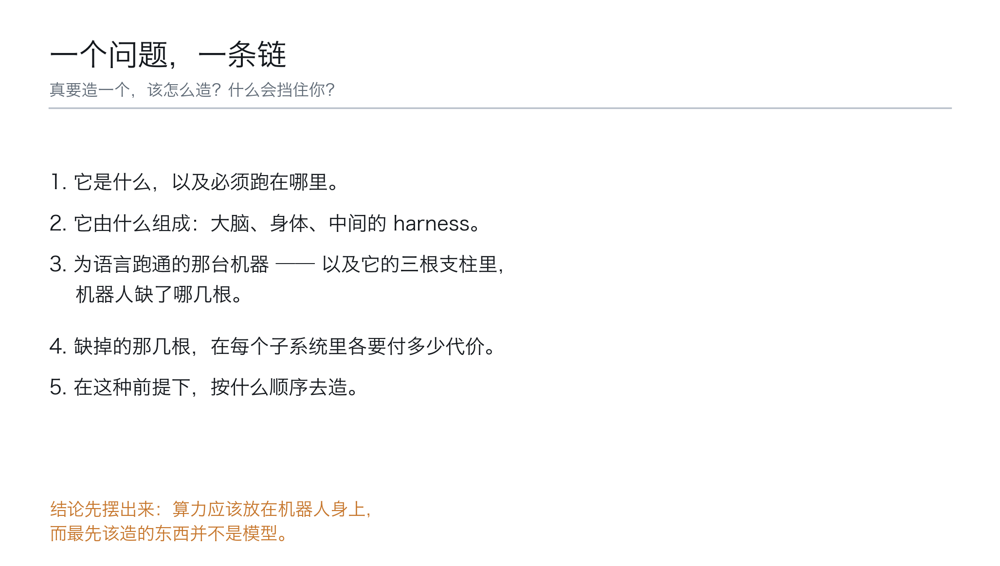

这条链只有一个方向，每一步都依赖前一步。结论摆在第一屏，方便后面被逐条反驳 [[arXiv:2604.15483]](https://arxiv.org/abs/2604.15483)。

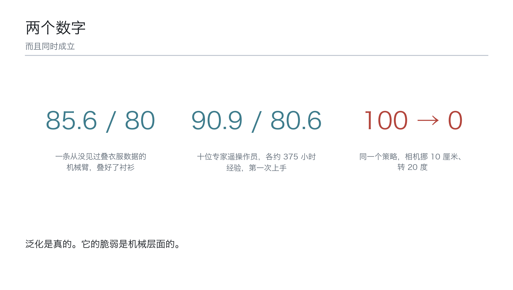

一台从没见过叠衣服数据的双臂 UR5e，把衬衫叠到了 85.6% 进度、80% 成功率；十位各约 375 小时经验的专家遥操作员，第一次上手拿到 90.9% 和 80.6% [[arXiv:2604.15483 §IX]](https://arxiv.org/abs/2604.15483)。而同一类策略，相机挪 10 厘米、转 20 度，就从 100% 掉到 0% [[arXiv:2409.03403]](https://arxiv.org/abs/2409.03403)。

---

## 第 1 部分 —— 它是什么

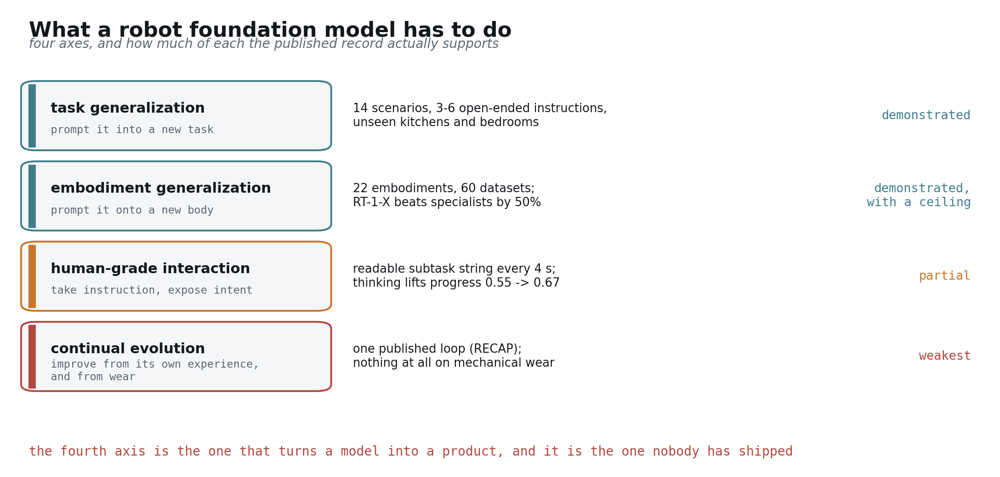

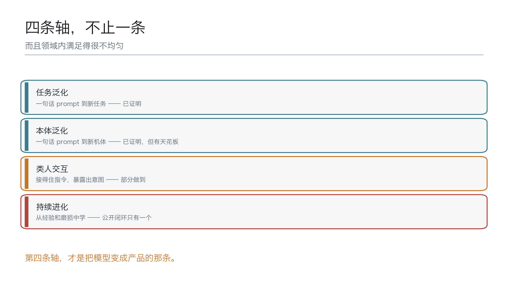

任务泛化在 14 个场景、每场景 3 到 6 条开放式指令、环境全是没见过的房间上被证明 [[arXiv:2604.15483 §IX-B]](https://arxiv.org/abs/2604.15483)。本体泛化在 22 种本体、60 个数据集上被证明，但有天花板 [[arXiv:2310.08864]](https://arxiv.org/abs/2310.08864)。持续进化只有一个公开闭环 [[arXiv:2511.14759]](https://arxiv.org/abs/2511.14759)，关于机械磨损则一条都没有 [[arXiv:2104.08212]](https://arxiv.org/abs/2104.08212)。

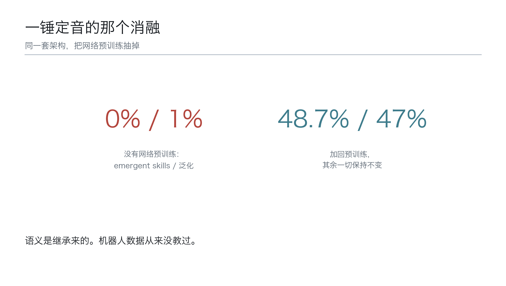

把网络预训练从同一套架构里抽掉，emergent skills 掉到 0%、泛化掉到 1%；加回去分别是 48.7% 和 47% [[arXiv:2310.08864 Table II]](https://arxiv.org/abs/2310.08864)。语义是继承来的，这也是这一切唯一能站在互联网已付账单上起步的理由 [[arXiv:2307.15818]](https://arxiv.org/abs/2307.15818)。

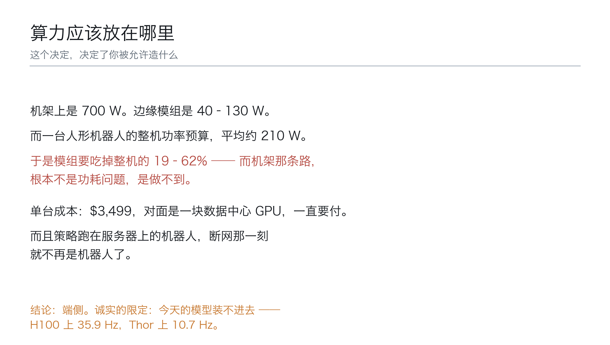

H100 是 700 W [[spec: NVIDIA H100 SXM]](https://www.nvidia.com/en-us/data-center/h100/)，边缘模组是 40 到 130 W [[spec: NVIDIA Jetson AGX Thor]](https://www.nvidia.com/en-us/autonomous-machines/embedded-systems/)，而一台人形机器人整机平均约 210 W [[spec: 1X NEO]](https://www.1x.tech/neo)。模组要吃掉整机功率预算的 19% 到 62% [computed: 40 to 130 W against 210 W]；而今天的模型还装不进去——H100 上 35.9 Hz，Thor 上 10.7 Hz [[repo: Isaac-GR00T hardware_recommendation.md]](https://github.com/NVIDIA/Isaac-GR00T/blob/main/getting_started/hardware_recommendation.md)。

---

## 第 2 部分 —— 它由什么组成

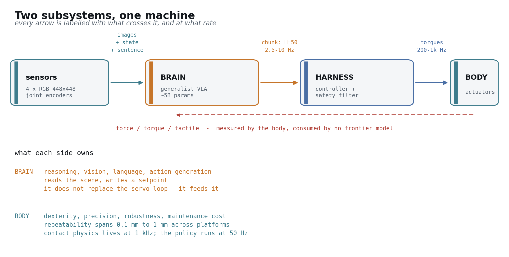

输入是最多 4 路 448×448 图像、6 帧历史、一个关节构型和一句话；输出是 50 个未来关节目标，其中 15 或 25 步会被执行，然后模型被重新调用 [[arXiv:2604.15483 §IV]](https://arxiv.org/abs/2604.15483)。这是大脑的边界，不是整台机器的边界——模型是 setpoint 生成器，它给伺服环喂数，不接管伺服环 [[arXiv:2604.15483 §VII]](https://arxiv.org/abs/2604.15483)。

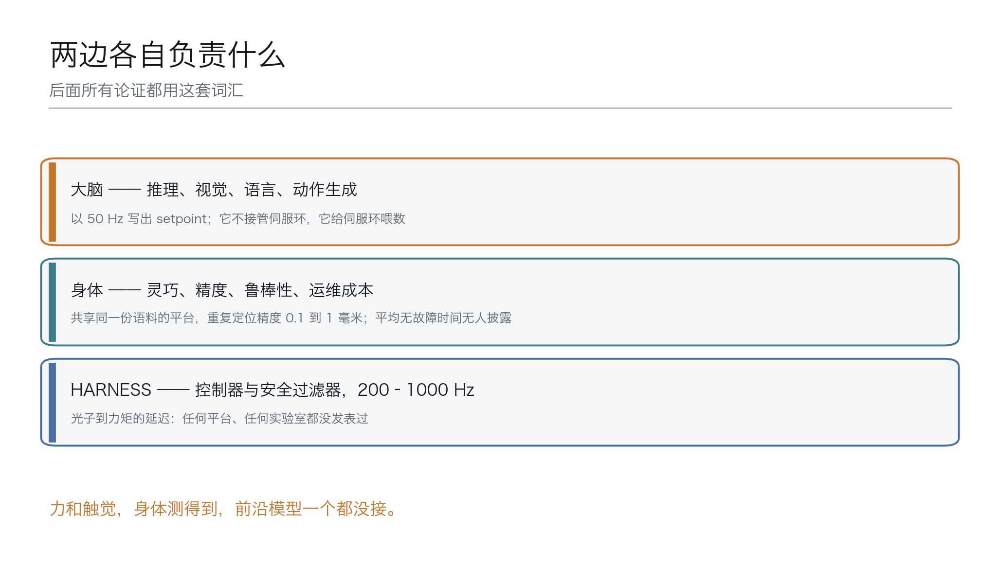

大脑以 50 Hz 写 setpoint [[arXiv:2604.15483 §VII]](https://arxiv.org/abs/2604.15483)，而它下面那条机械臂接受 1 kHz 的指令 [[spec: Franka Research 3]](https://franka.de/products/franka-research-3)。共享同一份语料的平台之间，重复定位精度从 0.1 毫米跨到 1 毫米 [computed: 1 mm against 0.1 mm]。力和触觉身体测得到，前沿模型一个都没接 [[arXiv:2505.22159]](https://arxiv.org/abs/2505.22159)。

没人会把 5B 的 transformer 塞进伺服环，所以每个认真的系统都切成两半、跑在不同频率上 [[arXiv:2503.14734]](https://arxiv.org/abs/2503.14734)。各家真正的分歧是这道缝开多宽——一个隐向量 [[blog: Figure Helix]](https://www.figure.ai/news/helix)、一串中间特征 [[arXiv:2503.14734]](https://arxiv.org/abs/2503.14734)，或者一句费带宽但换来可调试性的人可读子任务描述 [[arXiv:2604.15483 §VI]](https://arxiv.org/abs/2604.15483)。

---

## 第 3 部分 —— 那台跑通了的机器

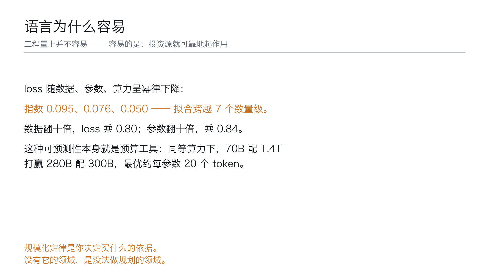

loss 以幂律下降，指数是 0.095、0.076 和 0.050，拟合跨越 7 个数量级 [[arXiv:2001.08361]](https://arxiv.org/abs/2001.08361)。这种可预测性就是一件预算工具：同等算力下，70B 配 1.4T 打赢 280B 配 300B，最优约每参数 20 个 token [[arXiv:2203.15556]](https://arxiv.org/abs/2203.15556)。

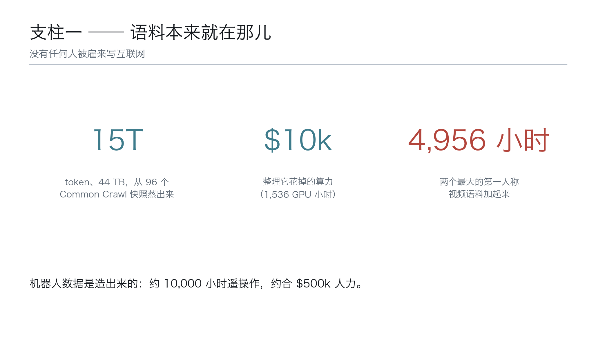

一条开源流水线把 96 个 Common Crawl 快照蒸成 15T token、44 TB，只花 1,536 GPU 小时 [[arXiv:2406.17557]](https://arxiv.org/abs/2406.17557)，折合约 \$10k 算力 [computed: 1,536 GPU-hours at commodity rates]。两个最大的第一人称视频语料加起来 4,956 小时 [computed: 3,670 h plus 1,286 h]；而机器人数据是造出来的——约 10,000 小时遥操作，约合 \$500k 人力 [computed: 10,000 h at \$50 per hour]。

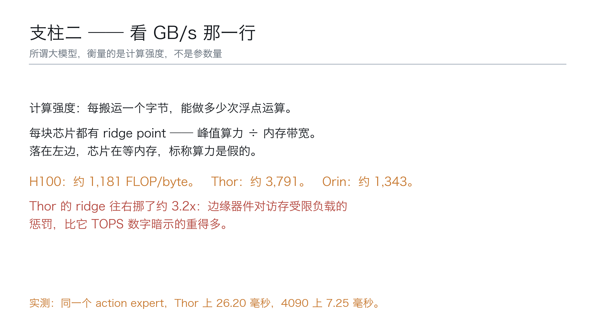

由规格书推出的 ridge point：H100 约 1,181 FLOP/byte，Thor 约 3,791，Orin 约 1,343 [computed: 3,958 TFLOPS over 3.35 TB/s]。Thor 的往右挪了约 3.2x [computed: 3,791 over 1,181]，实测后果是同一个 action expert 在那里要 26.20 毫秒，在消费级 GPU 上只要 7.25 毫秒 [[arXiv:2602.18397]](https://arxiv.org/abs/2602.18397)。

同一个模型、同一套运行时、三块加速器：吞吐跟着 GB/s 那一行走，不跟着 TOPS 那一行走 [[repo: Isaac-GR00T hardware_recommendation.md]](https://github.com/NVIDIA/Isaac-GR00T/blob/main/getting_started/hardware_recommendation.md)。

机器人满足计算这根支柱。数据支柱和基础设施支柱，它没有以那种曾经产生威力的形态满足；此外还多背一条文本从未面对的约束 [[arXiv:2604.15483 §VII]](https://arxiv.org/abs/2604.15483)。

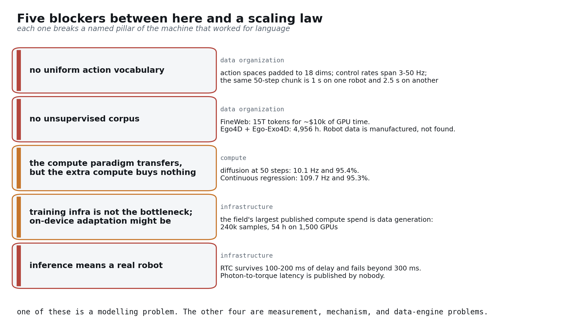

动作空间要补零到 18 维，频率从 3 Hz 跨到 50 Hz [[arXiv:2410.24164]](https://arxiv.org/abs/2410.24164)。50 步 diffusion 换来 10.1 Hz 和 95.4%，连续回归换来 109.7 Hz 和 95.3% [[arXiv:2502.19645]](https://arxiv.org/abs/2502.19645)。实时 chunking 扛得住 100–200 毫秒，过了 300 毫秒就崩 [[arXiv:2506.07339]](https://arxiv.org/abs/2506.07339)。五个里，只有一个是建模问题。

---

## 第 4 部分 —— 各要付多少代价

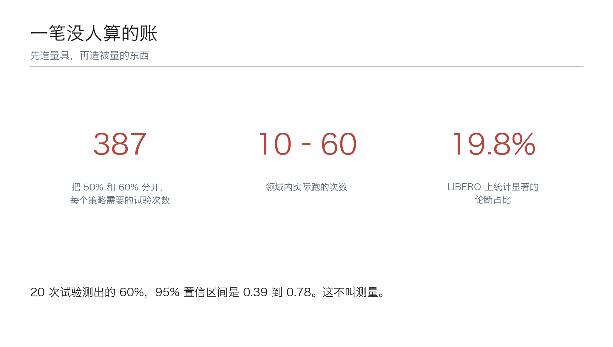

把 50% 和 60% 的策略分开需要 387 次试验 [computed: two-proportion test, alpha 0.05, 80% power]，而领域内实际跑 10 到 60 次 [[arXiv:2506.18123]](https://arxiv.org/abs/2506.18123)。LIBERO 上只有 19.8% 的论断统计显著 [[arXiv:2606.04233]](https://arxiv.org/abs/2606.04233)；位置一扰动，拿 98% 和 92% 的模型直接坍到 0.0% [[arXiv:2510.03827]](https://arxiv.org/abs/2510.03827)。

唯一被复现过的定律跑的是多样性：32 个「环境×物体」组合、每个 50 条演示，在没见过的环境里拿到 85% 到 92.5%，4 个人一下午采完 [[arXiv:2410.18647]](https://arxiv.org/abs/2410.18647)。

手持工位单价 \$371，每小时产 111 条演示，对面遥操作是 35 条 [[arXiv:2402.10329]](https://arxiv.org/abs/2402.10329)。1 小时人类视频约等于 1,400 条演示，而 1 小时机器人时间只等于 135 条 [[arXiv:2410.24221]](https://arxiv.org/abs/2410.24221)。

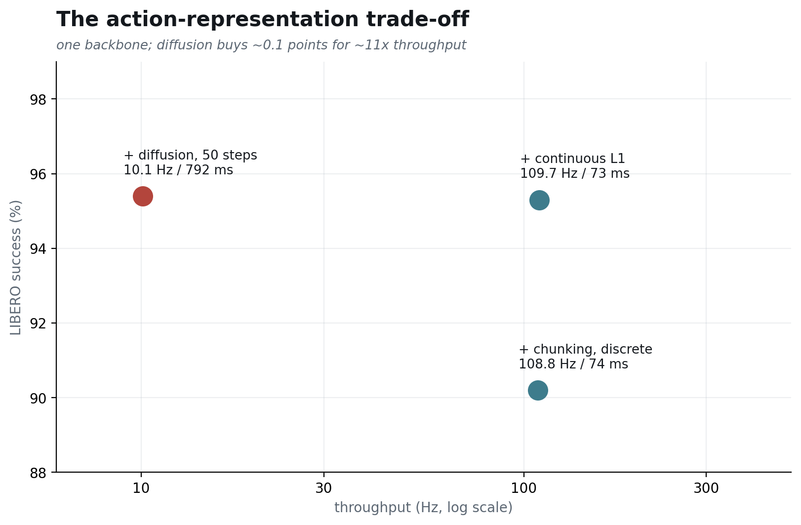

backbone 固定住，diffusion 多花的算力换来约 0.1 个百分点，代价是约 11x 的吞吐 [computed: 109.7 Hz against 10.1 Hz]。

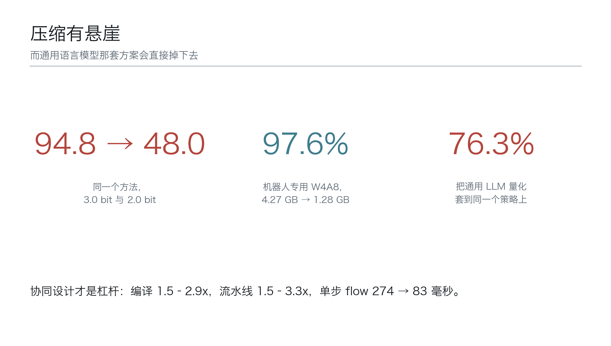

某个方法在 3.0 bit/权重时守住 94.8%，掉到 2.0 时变成 48.0% [[arXiv:2605.24011]](https://arxiv.org/abs/2605.24011)。机器人专用 W4A8 拿到 97.6%，把 4.27 GB 压到 1.28 GB；通用量化只剩 76.3% [[arXiv:2602.20309]](https://arxiv.org/abs/2602.20309)。

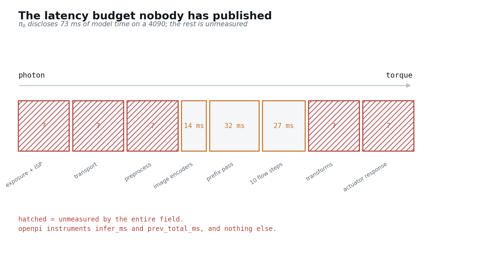

模型自己那段是被测过的三分之一——编码器 14 毫秒、prefix 32 毫秒、flow 步 27 毫秒 [[arXiv:2410.24164]](https://arxiv.org/abs/2410.24164)。它前后的所有环节，整个领域都没测 [[repo: openpi websocket_policy_server.py]](https://github.com/Physical-Intelligence/openpi/blob/main/src/openpi/serving/websocket_policy_server.py)。

---

## 第 5 部分 —— 施工顺序

在这之前全部是诊断。前面每一个钩子都由恰好一个里程碑收回，而每个里程碑都带一个用数字表述的通过条件，所以每个都可能失败 [[arXiv:2506.18123]](https://arxiv.org/abs/2506.18123)。

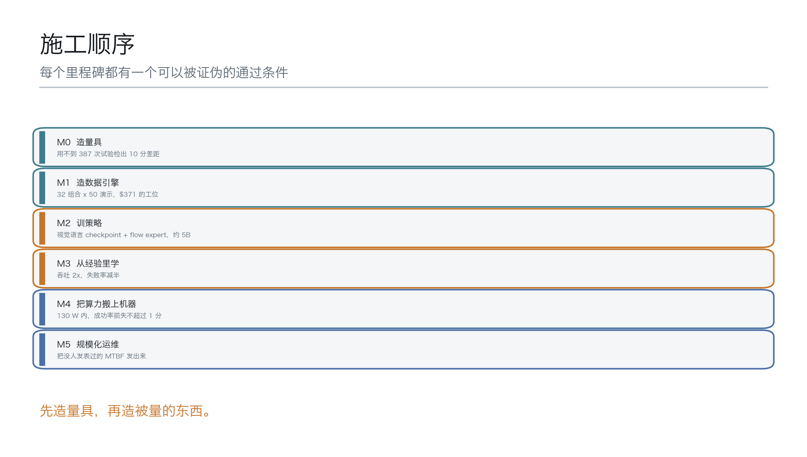

语言模型那三个阶段，形式上都能搬过来。真正变形的是第三个：没有便宜的 verifier，奖励只能从机器人自己的经验里来 [[arXiv:2511.14759]](https://arxiv.org/abs/2511.14759)。

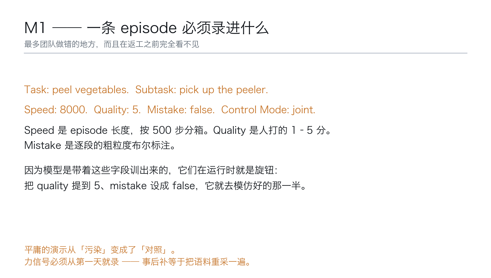

把每条 episode 都当作**带条件的样本**来录：speed 按 500 步分箱、quality 是人打的 1 到 5 分、mistake 是逐段布尔、control mode [[arXiv:2604.15483 §V-C]](https://arxiv.org/abs/2604.15483)。到了运行时这些就是旋钮——把 quality 提到 5、mistake 设成 false，策略就去模仿你数据里好的那一半 [[arXiv:2604.15483 §VII]](https://arxiv.org/abs/2604.15483)。

八个来源汇成一份带标注的混合，而已部署策略跑出的 rollout 就是明天的训练数据 [[arXiv:2604.15483 §VI-A]](https://arxiv.org/abs/2604.15483)。失败和带失误的成功被刻意留下；以泛化为目的的评测中产生的自主数据则被排除，否则飞轮就在训练测试集 [[arXiv:2604.15483 §VI-A]](https://arxiv.org/abs/2604.15483)。

控制通路上约 5B：400M 视觉编码器加 4B backbone 装继承来的语义，860M flow expert 装运动技能，另有一个 14B world model 跑在回路旁边而不是里面 [[arXiv:2604.15483 §IV]](https://arxiv.org/abs/2604.15483)。

最该抄的是那道防火墙：action expert 的梯度不回流进 backbone [[arXiv:2604.15483 §III]](https://arxiv.org/abs/2604.15483)。FAST token 只在训练期存在，且从不与 flow action 互相 attend [[arXiv:2604.15483 App. B]](https://arxiv.org/abs/2604.15483)。

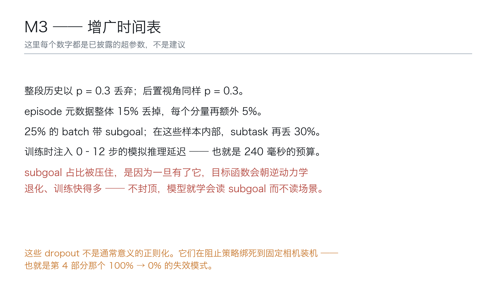

历史以 p = 0.3 丢弃，元数据 15% 与 5%，25% 的 batch 带 subgoal [[arXiv:2604.15483 §V-E]](https://arxiv.org/abs/2604.15483)。这些不是通常意义的正则化——它们在阻止策略绑死到固定相机装机 [[arXiv:2409.03403]](https://arxiv.org/abs/2409.03403)。

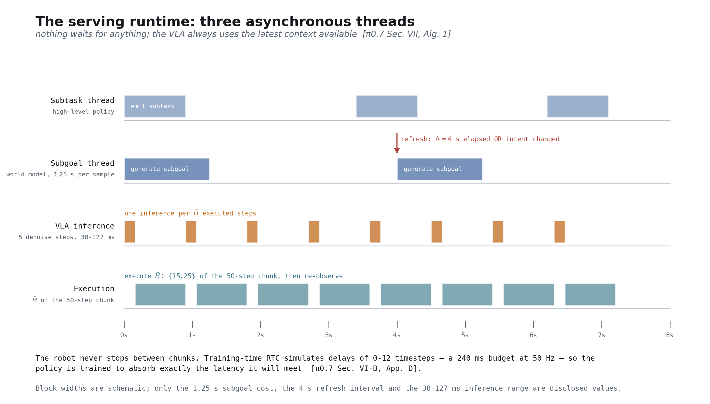

压缩之前先把调度修好：三条线程谁也不等谁，所以 1.25 秒的 world model 调用从「致命」变成「看不见」 [[arXiv:2604.15483 §VII]](https://arxiv.org/abs/2604.15483)。

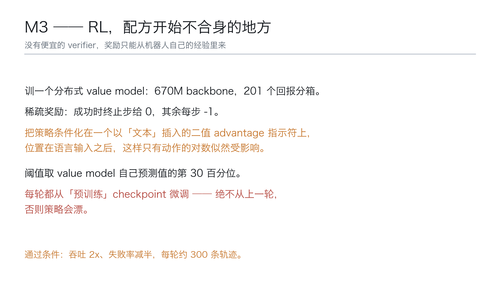

一个 670M 的分布式 value model，201 个分箱，稀疏奖励，以及一个以文本形式插在语言输入之后的二值 advantage 指示符 [[arXiv:2511.14759]](https://arxiv.org/abs/2511.14759)。每轮都从预训练 checkpoint 微调，绝不从上一轮，否则策略会漂 [[arXiv:2511.14759]](https://arxiv.org/abs/2511.14759)。

M4 是产品结论被兑现的地方：单台算力成本降到 \$3,499、功耗 40 到 130 W，对面是一块 700 W 的数据中心 GPU [computed: EDGE-19 against EDGE-25]。

---

## 第 6 部分 —— 三个值得押的开放问题

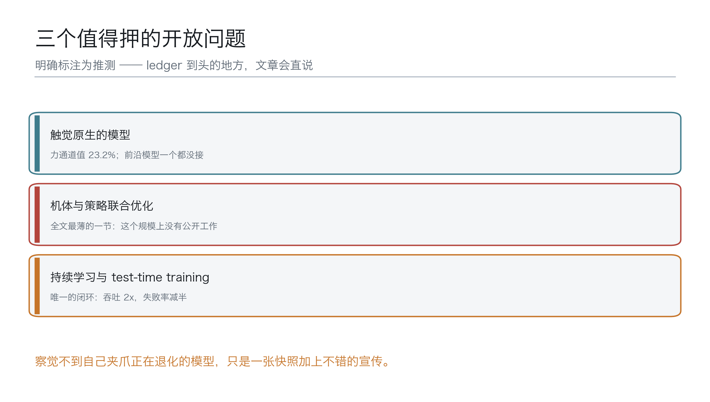

*推测性内容，已如此标注。* 力通道平均涨 23.2%，而前沿模型一个都没接 [[arXiv:2505.22159]](https://arxiv.org/abs/2505.22159)。机体与策略联合优化在这个规模上没有公开工作，所以只作为问题提出 [[arXiv:2604.15483]](https://arxiv.org/abs/2604.15483)。唯一的自我改进闭环报告吞吐 2x、失败率减半 [[arXiv:2511.14759]](https://arxiv.org/abs/2511.14759)。

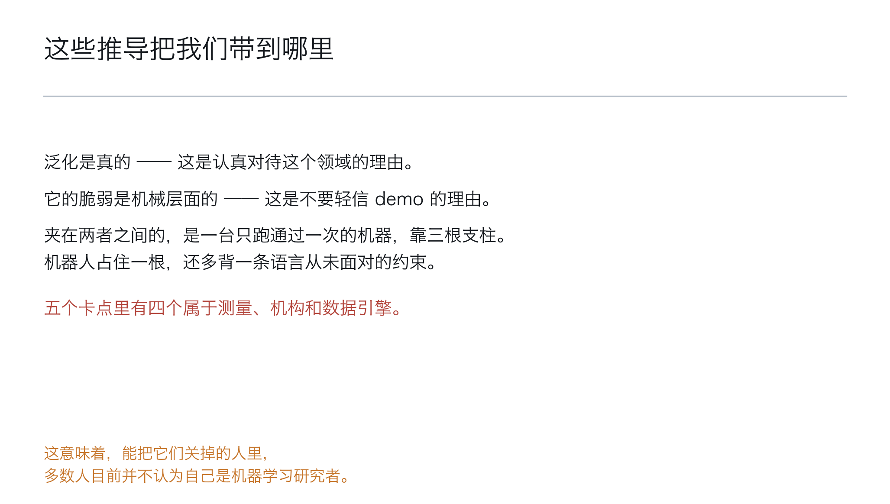

五个卡点里有四个属于测量、机构和数据引擎——这意味着，能把它们关掉的人里，多数人目前并不认为自己是机器学习研究者 [[arXiv:2506.18123]](https://arxiv.org/abs/2506.18123)。

---

长文版承载完整论证、gap 清单和参考文献 [[arXiv:2604.15483]](https://arxiv.org/abs/2604.15483)。
